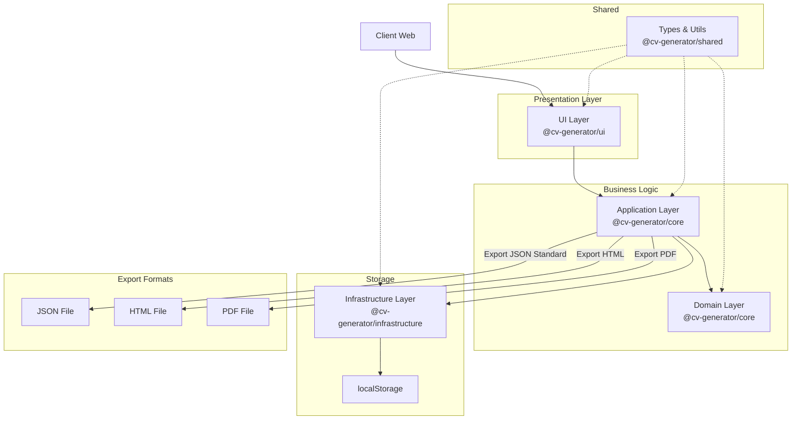
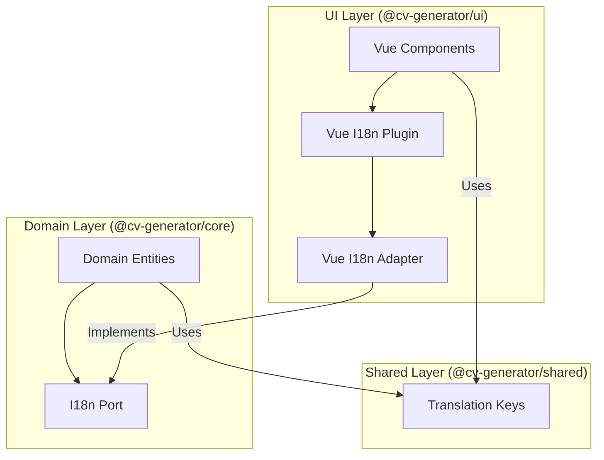

# Architecture pour CV Generator

**Statut**: Draft  
**Version**: 1.7.0  
**Date**: 2025-03-12  
**Auteur(s)**: Giak  
**Approbateurs**: Giak

## Historique des modifications

| Date       | Version | Auteur | Description des modifications                                                                      |
| ---------- | ------- | ------ | -------------------------------------------------------------------------------------------------- |
| 2025-03-01 | 1.0.0   | Giak   | Version initiale du document                                                                       |
| 2025-03-05 | 1.1.0   | Giak   | Ajout des détails d'implémentation du stockage localStorage                                        |
| 2025-03-10 | 1.2.0   | Giak   | Précision des stratégies d'export et de validation                                                 |
| 2025-03-10 | 1.4.0   | Giak   | Enrichissement des patterns architecturaux et workflow de test                                     |
| 2025-03-10 | 1.5.0   | Giak   | Alignement avec le PRD et renforcement de la conformité JSON Resume standard                       |
| 2025-03-11 | 1.6.0   | Giak   | Mise à jour avec la structure monorepo PNPM et alignement avec l'architecture de packages actuelle |
| 2025-03-12 | 1.7.0   | Giak   | Ajout de l'architecture d'internationalisation avec Vue I18n et pattern Adapter                    |

## Résumé Technique

### Vision technique générale

CV Generator est conçu selon les principes de Clean Architecture et Domain-Driven Design (DDD) pour créer une application web légère et efficace qui permet d'éditer et d'exporter des CV au format JSON Resume standard (https://jsonresume.org/schema/). L'application est structurée comme un monorepo PNPM avec des packages distincts pour chaque couche architecturale, offrant une séparation claire des responsabilités. Elle fonctionne entièrement côté client avec persistance dans localStorage, sans nécessiter de backend dans sa version initiale. Elle permet d'exporter les CV dans plusieurs formats (JSON conforme au standard, HTML, PDF), offre des conseils pour optimiser les CV pour les systèmes ATS (Applicant Tracking Systems), et propose une interface utilisateur internationalisée disponible en plusieurs langues.

### Principes directeurs

- **Séparation des préoccupations**: Séparation des couches selon Clean Architecture (simplifiée)
- **Entités riches**: Logique métier encapsulée dans des entités de domaine
- **SOLID**: Application des principes SOLID dans la conception
- **Immutabilité**: Favoriser les structures de données immuables pour une meilleure gestion d'état
- **Simplicité**: Privilégier les solutions simples et directes
- **Validation à plusieurs niveaux**: Validation dans les composants UI et dans le domaine
- **Indépendance des packages**: Chaque package possède une responsabilité claire et des frontières bien définies
- **Interopérabilité**: Adhérence stricte au standard JSON Resume pour garantir la compatibilité avec d'autres outils
- **Modularité**: Organisation des packages avec des responsabilités claires et minimisation des dépendances
- **Internationalisation native**: Architecture conçue pour supporter le multilinguisme tout en respectant Clean Architecture

### Contraintes principales

- **Performance**: Application légère avec temps de réponse < 500ms
- **Compatibilité navigateurs**: Support des navigateurs modernes (Chrome, Firefox, Safari, Edge)
- **Accessibilité**: Conformité WCAG 2.1 niveau AA
- **Fonctionnement hors ligne**: Fonctionnement intégralement offline avec localStorage
- **Formats d'export**: Support de l'export en JSON conforme au standard, HTML et PDF
- **Taille de bundle**: Bundle JS initial < 200KB (gzippé)
- **Qualité du code**: Couverture de tests > 80% pour les entités du domaine, > 70% pour l'UI
- **Limitation de stockage**: Respect de la limite de 5MB du localStorage
- **Maintenance**: Structure monorepo facilitant la maintenance et l'évolution du code
- **Multilinguisme**: Support initial du français et de l'anglais, extensible à d'autres langues

## Stack Technologique

| Catégorie               | Technologie     | Version | Justification                                                                                       |
| ----------------------- | --------------- | ------- | --------------------------------------------------------------------------------------------------- |
| **Frontend**            | Vue.js          | 3.4+    | Framework progressif avec Composition API permettant une encapsulation efficace des fonctionnalités |
|                         | TypeScript      | 5.7+    | Sécurité de type, meilleure IDE intégration, et réduction des bugs en production                    |
|                         | Vite            | 6.2+    | Bundler rapide avec HMR, optimisé pour le développement moderne                                     |
|                         | Pinia           | 2.3+    | Gestion d'état type-safe intégrée à Vue.js avec support pour les DevTools                           |
|                         | Tailwind CSS    | 3.4+    | CSS utilitaire permettant un développement rapide et cohérent sans CSS spécifique                   |
|                         | Vue Router      | 4.2+    | Navigation officielle pour Vue.js                                                                   |
|                         | Vue I18n        | 11.0+   | Internationalisation intégrée à Vue.js avec support avancé de localisation                          |
|                         | Heroicons Vue   | 2.2+    | Collection d'icônes de haute qualité pour Vue                                                       |
| **Validation**          | Zod             | 3.22+   | Validation de schéma avec inférence de types TypeScript et support complet du standard JSON Resume  |
| **Persistance**         | localStorage    | -       | Stockage côté client pour persistance simple et fonctionnement hors ligne                           |
| **Utilitaires**         | Lodash-es       | 4.17+   | Bibliothèque d'utilitaires JavaScript optimisée pour ES modules                                     |
| **Export**              | JSON            | -       | Export natif au format JSON Resume standard avec validation de conformité                           |
|                         | HTML            | -       | Génération HTML via templates Vue.js                                                                |
|                         | jsPDF           | 2.5+    | Génération de PDF côté client sans backend                                                          |
| **Test**                | Vitest          | 3.0+    | Framework de test rapide et compatible avec l'écosystème Vue.js                                     |
|                         | Testing Library | Latest  | Bibliothèque de test encourageant les bonnes pratiques                                              |
| **CI/CD**               | GitHub Actions  | -       | Automatisation des tests, build et déploiement                                                      |
| **Déploiement**         | Docker          | -       | Conteneurisation pour déploiement cohérent                                                          |
| **Gestion de packages** | PNPM            | 10.5+   | Gestionnaire de packages performant avec support natif des workspaces monorepo                      |

## Architecture Globale

Notre architecture suit une version simplifiée du modèle Clean Architecture, adaptée à une application frontend sans backend, et organisée selon les principes DDD. L'application est structurée en monorepo PNPM avec des packages délimitant les contextes (bounded contexts) et les couches.



### Architecture d'internationalisation

L'internationalisation suit une architecture basée sur le pattern Adapter pour respecter les principes de Clean Architecture :



### Organisation des packages

L'application est structurée en monorepo PNPM avec les packages suivants:

```
cv-generator/
├── packages/
│   ├── core/              # Couches domaine et application
│   │   ├── src/
│   │   │   ├── cv/        # Contexte borné CV
│   │   │   │   ├── domain/
│   │   │   │   │   ├── entities/
│   │   │   │   │   └── value-objects/
│   │   │   │   ├── application/
│   │   │   │   │   └── use-cases/
│   │   │   │   └── ports/
│   │   │   └── ...
│   │   │   └── shared/
│   │   │       └── i18n/
│   │   │           └── domain-i18n.port.ts  # Port d'internationalisation
│   ├── infrastructure/    # Adaptateurs pour les services externes
│   │   ├── src/
│   │   │   ├── repositories/
│   │   │   └── export/
│   ├── shared/            # Types et utilitaires partagés
│   │   ├── src/
│   │   │   ├── types/
│   │   │   ├── schemas/
│   │   │   ├── validators/
│   │   │   └── i18n/
│   │   │       ├── keys/  # Clés de traduction centralisées
│   │   │       └── constants/
│   │   │           └── supported-locales.ts
│   └── ui/                # Interface utilisateur Vue.js
│       ├── src/
│       │   ├── components/
│       │   ├── modules/
│       │   ├── pages/
│       │   ├── i18n/
│       │   │   ├── vue-i18n-adapter.ts  # Adaptateur Vue I18n
│       │   │   ├── index.ts
│       │   │   └── setup.ts
│       │   ├── locales/  # Fichiers de traduction par langue
│       │   │   ├── fr/
│       │   │   │   ├── validation.json
│       │   │   │   ├── ui.json
│       │   │   │   └── index.json
│       │   │   └── en/
│       │   │       ├── validation.json
│       │   │       ├── ui.json
│       │   │       └── index.json
│       │   └── App/
├── pnpm-workspace.yaml    # Configuration du workspace
└── package.json           # Scripts et dépendances racine
```

### Flux de données principaux

1. **Création et édition de CV**:

   - L'utilisateur interagit avec l'interface UI (@cv-generator/ui)
   - Les composables Vue.js appellent les use cases appropriés (@cv-generator/core)
   - Les entités du domaine valident et encapsulent la logique métier JSON Resume standard
   - Les données sont persistées dans localStorage via un repository (@cv-generator/infrastructure)
   - La validation se fait à plusieurs niveaux (UI, domaine, infrastructure)
   - Les types et schémas partagés assurent la cohérence des données (@cv-generator/shared)

2. **Exportation de CV**:

   - L'utilisateur demande une exportation (JSON standard, HTML ou PDF)
   - L'application prépare et formate les données selon le format demandé
   - Pour JSON: le fichier est généré directement à partir de l'entité Resume avec validation de conformité
   - Pour HTML: un template Vue.js est utilisé pour générer la représentation HTML
   - Pour PDF: le HTML généré est converti en PDF via jsPDF
   - Le fichier est proposé en téléchargement à l'utilisateur via les services d'export (@cv-generator/infrastructure)
   - Pour JSON: une validation de conformité au standard est effectuée avant l'export

3. **Optimisation ATS**:

   - L'application analyse le contenu du CV
   - Des conseils d'optimisation sont proposés en temps réel
   - Un score de lisibilité ATS est calculé
   - Des suggestions de mots-clés sont générées en fonction du contenu
   - L'affichage des conseils est géré par des composants UI dédiés (@cv-generator/ui)

4. **Internationalisation**:
   - Les textes UI utilisent le plugin Vue I18n via `$t('key')`
   - Les messages d'erreur du domaine utilisent des clés définies dans @cv-generator/shared
   - Un adaptateur transmet les traductions du UI au domaine via le port d'internationalisation
   - Les préférences linguistiques de l'utilisateur sont stockées dans localStorage
   - Le chargement des fichiers de traduction est optimisé par lazy loading

### Patterns architecturaux

- **Clean Architecture**: Version simplifiée, adaptée aux besoins frontend
- **Domain-Driven Design**: Organisation du code autour du domaine métier avec entités riches
- **Repository Pattern**: Abstraction pour l'accès au localStorage
- **Factory Pattern**: Création d'objets complexes via méthodes statiques
- **Observer Pattern**: Réactivité UI via le système réactif de Vue.js et Pinia
- **Strategy Pattern**: Différentes stratégies d'export selon le format choisi
- **Value Objects Pattern**: Encapsulation de la validation et du comportement dans des objets de valeur
- **Result Pattern**: Gestion fonctionnelle des erreurs et des résultats d'opérations
- **Module Pattern**: Organisation du code en modules avec responsabilités claires dans le monorepo
- **Adapter Pattern**: Isolation du domaine des implémentations concrètes, notamment pour l'internationalisation

## Composants Principaux

### 1. Package: Core (@cv-generator/core)

**Objectif**: Implémenter les couches domaine et application selon les principes DDD avec support complet du standard JSON Resume.

**Responsabilités**:

- Définir les entités du domaine basées sur le format JSON Resume standard
- Implémenter les Value Objects pour encapsuler les règles métier
- Implémenter les cas d'utilisation (use cases)
- Définir les interfaces de repository pour le localStorage
- Fournir la logique de validation métier
- Gérer les règles d'optimisation ATS
- Garantir la conformité au standard JSON Resume
- Définir le port d'internationalisation pour les messages du domaine

**Structure**:

```
core/
├── cv/                  # CV Domain
│   ├── domain/          # Entities, Value Objects
│   │   ├── entities/
│   │   │   └── Resume.ts
│   │   └── value-objects/
│   │       ├── Email.ts
│   │       └── Phone.ts
│   ├── application/     # Use Cases
│   │   └── use-cases/
│   │       └── ManageResume.ts
│   └── ports/           # Repository Interfaces
│       └── repositories/
│           └── ResumeRepository.ts
├── export/              # Export Domain
│   ├── domain/
│   ├── application/
│   │   └── use-cases/
│   │       ├── ExportJSONUseCase.ts
│   │       ├── ExportHTMLUseCase.ts
│   │       └── ExportPDFUseCase.ts
│   └── ports/
└── shared/              # Shared Types & Utils
    └── i18n/            # I18n Port
        └── domain-i18n.port.ts
```

**Implémentation DDD**:

- Les entités du domaine (Resume) encapsulent la logique métier et les règles de validation
- Les Value Objects (Email, Phone) encapsulent les règles de validation pour les types primitifs
- Les use cases orchestrent les opérations entre les entités et les repositories
- Le pattern Result est utilisé pour gérer les erreurs de façon fonctionnelle
- Validation complète selon le schéma JSON Resume standard
- Les messages d'erreur utilisent des clés i18n plutôt que des textes codés en dur

**Interfaces**:

- Interface de repository pour localStorage
- Interface pour validation
- Interface pour les services d'export
- Port d'internationalisation pour les messages du domaine

**Dépendances**:

- @cv-generator/shared (types, validation et clés i18n)
- Aucune dépendance externe au domaine métier

### 2. Package: UI (@cv-generator/ui)

**Objectif**: Fournir la couche de présentation avec les composants Vue.js pour une édition intuitive du CV au format JSON Resume standard.

**Responsabilités**:

- Créer des composants Vue.js pour l'édition de CV
- Implémenter les stores Pinia pour la gestion d'état
- Gérer les interactions utilisateur et la validation de formulaire
- Présenter le CV et permettre son exportation
- Afficher les conseils d'optimisation ATS
- Présenter un feedback sur la conformité au standard JSON Resume
- Configurer et gérer l'internationalisation avec Vue I18n
- Implémenter l'adaptateur Vue I18n pour le port du domaine

**Structure**:

```
ui/
├── components/       # Composants Vue.js
│   ├── shared/       # Composants partagés
│   └── resume/       # Composants spécifiques au CV
├── modules/          # Modules fonctionnels
│   └── cv/           # Module CV
│       ├── presentation/
│       │   ├── components/
│       │   │   └── BasicsForm.vue
│       │   ├── composables/
│       │   │   ├── useResumeUseCase.ts
│       │   │   └── useBasicsFormValidation.ts
│       │   └── stores/
│       │       └── resumeStore.ts
│       └── stores/
├── pages/            # Pages Vue Router
│   ├── EditorPage.vue
│   └── PreviewPage.vue
├── i18n/             # Configuration i18n
│   ├── vue-i18n-adapter.ts
│   ├── setup.ts
│   └── index.ts
├── locales/          # Fichiers de traduction
│   ├── fr/
│   │   ├── validation.json
│   │   ├── ui.json
│   │   └── index.json
│   └── en/
│       ├── validation.json
│       ├── ui.json
│       └── index.json
├── App/              # Composant racine
│   └── App.vue
├── e2e/              # Tests E2E
│   └── resume.spec.ts
└── assets/           # Ressources statiques
```

**Principes UI**:

- Composants modulaires et réutilisables
- Séparation des préoccupations via composables
- Tests E2E pour valider les parcours utilisateur
- Design responsive conforme aux normes WCAG 2.1 AA
- Interface intuitive et minimaliste
- Validation en temps réel avec feedback
- Interface utilisateur multilingue avec sélecteur de langue

**Interfaces**:

- Composants publics
- Composables pour la logique réutilisable
- API de store pour la gestion d'état
- Adaptateur Vue I18n pour le port d'internationalisation

**Dépendances**:

- @cv-generator/core
- @cv-generator/infrastructure
- @cv-generator/shared
- Vue.js, Pinia, Vue Router
- Vue I18n
- Tailwind CSS
- Zod (validation)
- Heroicons Vue
- Lodash-es

### 3. Package: Infrastructure (@cv-generator/infrastructure)

**Objectif**: Implémenter les adaptateurs pour localStorage et l'exportation conforme au standard JSON Resume.

**Responsabilités**:

- Implémenter le repository pour localStorage
- Fournir les fonctionnalités d'exportation (JSON standard, HTML, PDF)
- Gérer la persistance des données
- Implémenter la validation au niveau infrastructure
- Assurer la conformité des exports au standard JSON Resume
- Gérer les limites du localStorage (compression si nécessaire)

**Structure**:

```
infrastructure/
├── repositories/     # Implémentations des repositories
│   ├── LocalStorageRepository.ts
│   ├── LocalStorageResumeRepository.ts
│   └── types.ts
└── export/           # Services d'exportation
    ├── JsonExportService.ts
    ├── HtmlExportService.ts
    └── PdfExportService.ts
```

**Implémentation**:

- `LocalStorageRepository`: Implémentation générique pour localStorage
- `LocalStorageResumeRepository`: Implémentation spécifique pour les CV avec validation
- Services d'export: Stratégies spécifiques pour chaque format d'export
- Validation de conformité au standard JSON Resume avant export

**Interfaces**:

- Implémentation concrète du repository
- Services d'exportation dans différents formats
- API de validation d'export

**Dépendances**:

- @cv-generator/core (interfaces seulement)
- @cv-generator/shared (types et validation)
- jsPDF (pour l'export PDF)

### 4. Package: Shared (@cv-generator/shared)

**Objectif**: Fournir des utilitaires et types partagés conformes au standard JSON Resume.

**Responsabilités**:

- Définir les types correspondant au schéma JSON Resume standard
- Fournir des fonctions utilitaires
- Contenir les schémas de validation Zod
- Définir les types communs
- Garantir la conformité des types au standard JSON Resume
- Centraliser les clés de traduction pour l'internationalisation
- Définir les constantes et codes d'erreur

**Structure**:

```
shared/
├── types/            # TypeScript types/interfaces
│   └── resume.interface.ts  # Types JSON Resume
├── schemas/          # Schémas Zod pour validation JSON Resume
│   └── resumeSchema.ts
├── validators/       # Validateurs personnalisés
├── utils/            # Fonctions utilitaires
└── i18n/             # Internationalisation
    ├── keys/         # Clés de traduction centralisées
    │   ├── validation-keys.ts
    │   ├── ui-keys.ts
    │   └── index.ts
    └── constants/
        └── supported-locales.ts
```

**Implémentation**:

- Types TypeScript correspondant au format JSON Resume standard
- Schémas Zod pour la validation avec inférence de types
- Utilitaires partagés entre les packages
- Helpers pour la validation de conformité au standard
- Clés de traduction organisées hiérarchiquement pour faciliter la maintenance
- Constantes pour les locales supportées

**Interfaces**:

- Types et utilitaires exportés
- Schémas de validation publics
- Clés de traduction publiques

**Dépendances**:

- Zod

## Intégrations Externes

### 1. Standard JSON Resume

**Type d'intégration**: Conformité à un standard ouvert

**Description**: L'application adhère strictement au standard JSON Resume (https://jsonresume.org/schema/) pour assurer l'interopérabilité avec l'écosystème d'outils existants.

**Flux de données**:

- Import de fichiers JSON Resume existants
- Validation de conformité au schéma standard
- Export de données conformes au standard

**Considérations spécifiques**:

- Suivi des évolutions du standard
- Validation complète à l'import et à l'export
- Support de toutes les propriétés définies dans le standard
- Tests d'interopérabilité avec d'autres outils de l'écosystème

### 2. Systèmes de fichiers locaux

**Type d'intégration**: Import/Export de fichiers

**Description**: L'application permet l'import et l'export de fichiers vers le système de fichiers local de l'utilisateur.

**Flux de données**:

- Lecture de fichiers JSON importés par l'utilisateur
- Écriture de fichiers JSON, HTML et PDF lors de l'export

**Considérations spécifiques**:

- Gestion des erreurs de lecture/écriture
- Validation des fichiers importés
- Formats MIME appropriés pour les fichiers exportés
- Nommage cohérent des fichiers générés

## Considérations Techniques

### Sécurité

1. **Protection des données**:

   - Données stockées uniquement dans localStorage (côté client)
   - Pas de transmission de données sensibles
   - Information claire à l'utilisateur sur la nature locale du stockage
   - Validation des données d'entrée à tous les niveaux (UI, domaine, infrastructure)
   - Protection contre les injections lors de l'import de fichiers

2. **Considérations RGPD**:
   - Stockage local uniquement, sans collecte de données
   - Transparence sur l'utilisation des données

### Performance

1. **Optimisation frontend**:

   - Code splitting pour réduire la taille du bundle initial
   - Lazy loading des composants non essentiels
   - Optimisation des assets (images, styles)
   - Utilisation de composables pour éviter les calculs redondants
   - Bundle JS initial < 200KB (gzippé)

2. **Métriques clés**:
   - Temps de réponse < 500ms pour toutes les interactions
   - Temps de génération d'export < 2 secondes pour les formats complexes (PDF)
   - Score Lighthouse > 90 pour performance et accessibilité
   - Temps de chargement initial < 2 secondes

### Scalabilité

1. **Croissance des données**:

   - Stratégie de compression pour optimiser l'utilisation du localStorage
   - Export JSON pour sauvegarde externe et contournement des limites de localStorage
   - Conception extensible pour ajout futur de backend

2. **Évolutivité fonctionnelle**:
   - Architecture modulaire permettant l'ajout de nouvelles fonctionnalités
   - Support pour de nouveaux formats d'export
   - Extension possible pour d'autres types de documents
   - Structure monorepo facilitant l'ajout de nouvelles fonctionnalités

### Résilience

1. **Persistance des données**:

   - Sauvegarde automatique dans localStorage
   - Option d'exportation JSON pour sauvegarde externe
   - Récupération des données en cas de fermeture accidentelle
   - Gestion des erreurs avec messages explicites
   - Stratégie de rollback en cas d'échec de sauvegarde

2. **Gestion des erreurs**:
   - Utilisation du pattern Result pour la gestion fonctionnelle des erreurs
   - Hiérarchie d'erreurs typées (StorageError, ValidationError, etc.)
   - Journalisation des erreurs pour diagnostic
   - Messages d'erreur contextuels et compréhensibles pour l'utilisateur

### Monitoring

1. **Monitoring côté client**:
   - Collecte anonyme de métriques de performance
   - Suivi des erreurs rencontrées par les utilisateurs
   - Dashboard de suivi des KPIs
   - Tests d'utilisabilité trimestriels

### Internationalisation

1. **Architecture i18n**:

   - Pattern Adapter pour isoler le domaine de l'implémentation Vue I18n
   - Port d'internationalisation agnostique dans le domaine
   - Centralisation des clés de traduction dans @cv-generator/shared
   - Adaptateur Vue I18n dans @cv-generator/ui
   - Support initial du français et de l'anglais

2. **Structure des traductions**:

   - Organisation hiérarchique des clés par domaine fonctionnel
   - Fichiers de traduction séparés par langue et par domaine fonctionnel
   - Support de l'interpolation de variables dans les messages
   - Support de la pluralisation via Vue I18n

3. **Performance**:

   - Chargement paresseux (lazy loading) des fichiers de traduction
   - Adaptateur léger pour minimiser l'impact sur les performances
   - Détection automatique de la langue du navigateur

4. **Expérience utilisateur**:
   - Sélecteur de langue accessible dans l'interface
   - Persistence de la préférence linguistique utilisateur
   - Cohérence des messages entre les couches
   - Support de la traduction des messages d'erreur provenant du domaine

## Stratégie de Tests

### Approche multi-niveaux

1. **Tests unitaires**:

   - Tests des entités du domaine et Value Objects
   - Tests des use cases
   - Tests des repositories
   - Tests des composables Vue.js
   - Validation de conformité au standard JSON Resume

2. **Tests de composants**:

   - Tests des composants Vue.js isolés avec Testing Library
   - Tests d'intégration des formulaires
   - Validation de l'expérience utilisateur

3. **Tests E2E**:
   - Tests des parcours utilisateur complets avec Playwright
   - Tests de création et édition de CV
   - Tests d'export dans différents formats
   - Tests d'interopérabilité avec des outils externes

### Configuration des tests

Chaque package possède sa propre configuration Vitest:

- `packages/core/vitest.config.ts`: Tests unitaires pour la logique métier
- `packages/infrastructure/vitest.config.ts`: Tests des repositories et services
- `packages/shared/vitest.config.ts`: Tests des utilitaires et validateurs
- `packages/ui/vitest.config.ts`: Tests des composants et composables

Dans le workspace global:

- `vitest.workspace.ts`: Configuration globale pour tous les packages

### Couverture de code

Objectifs de couverture:

- Domaine (core): > 90%
- Infrastructure: > 80%
- UI: > 70%
- Global: > 80%

## Validation et Qualité du Code

### Stratégie de validation multi-niveaux

1. **Validation UI**:

   - Validation des formulaires en temps réel avec feedback immédiat
   - Utilisation de composables spécifiques (useBasicsFormValidation.ts)
   - Messages d'erreur contextuels
   - Transformation automatique des données pour l'affichage

2. **Validation Domaine**:

   - Validation métier dans les entités du domaine
   - Vérification des règles business (ex: dates cohérentes)
   - Value Objects pour encapsuler les règles de validation
   - Validation structurelle avec Zod

3. **Validation Infrastructure**:

   - Vérification de l'intégrité des données stockées
   - Validation du format JSON lors de l'import
   - Contrôle des erreurs de stockage
   - Validation de conformité au standard JSON Resume à l'export

4. **Tests automatisés**:
   - Tests unitaires pour la logique métier (> 90% de couverture)
   - Tests de composants pour l'interface utilisateur
   - Tests d'intégration pour les workflows complets
   - Tests E2E pour valider les parcours utilisateur
   - Tests d'interopérabilité avec des outils externes

## CI/CD et Déploiement

### Pipeline CI/CD

1. **Validation**:

   - Vérification des types TypeScript
   - Linting avec Biome
   - Tests unitaires et de composants
   - Analyse de couverture de code
   - Validation de conformité au standard JSON Resume

2. **Build**:

   - Build des packages individuels
   - Build de l'application complète
   - Optimisation des assets
   - Vérification de la taille du bundle

3. **Déploiement**:
   - Déploiement sur environnement de staging
   - Tests E2E sur l'environnement de staging
   - Tests d'interopérabilité sur l'environnement de staging
   - Déploiement en production

### Conteneurisation

1. **Docker**:
   - Image Docker légère basée sur Nginx
   - Configuration optimisée pour les SPAs
   - Support du routing côté client
   - Configuration multi-étapes pour minimiser la taille de l'image

## Plan d'implémentation

### Phases de développement

1. **Phase 1: MVP (1-2 semaines)**

   - Mise en place de la structure monorepo PNPM avec les packages essentiels
   - Implémentation du schéma JSON Resume standard
   - Formulaires basiques d'édition
   - Stockage localStorage
   - Export JSON conforme au standard
   - Validation complète du schéma

2. **Phase 2: Améliorations UX et formats d'export (2-3 semaines)**

   - Amélioration de l'interface utilisateur
   - Validation complète des formulaires
   - Prévisualisation du CV
   - Export HTML et PDF
   - Conseils ATS de base
   - Import de fichiers JSON Resume existants

3. **Phase 3: Internationalisation (1-2 semaines)**

   - Mise en place de Vue I18n et configuration du plugin
   - Architecture d'internationalisation avec pattern Adapter
   - Extraction des textes codés en dur vers des fichiers de traduction
   - Centralisation des clés dans @cv-generator/shared
   - Création du port d'internationalisation dans le domaine
   - Implémentation de l'adaptateur Vue I18n dans l'UI
   - Support initial du français et de l'anglais
   - Composant de sélection de langue

4. **Phase 4: Perfectionnement (2 semaines)**
   - Améliorations basées sur les retours utilisateurs
   - Optimisation des performances
   - Améliorations des conseils ATS
   - Tests utilisateurs et ajustements finaux
   - Compatibilité renforcée avec les autres outils de l'écosystème
   - Support de langues additionnelles (optionnel)

### État actuel d'implémentation

1. **Fonctionnalités implémentées**:

   - ✅ Architecture Clean et DDD avec structure monorepo PNPM
   - ✅ Structure de données basée sur JSON Resume standard
   - ✅ Validation avec Zod et Value Objects
   - ✅ Persistance localStorage
   - ✅ Formulaires pour informations de base et expérience professionnelle
   - ✅ Tests unitaires pour le domaine core (couverture: 83%)
   - ✅ Export au format JSON conforme au standard

2. **Fonctionnalités en cours**:

   - 🔄 Formulaires d'éducation (60% complété)
   - 🔄 Export HTML et PDF
   - 🔄 Amélioration UX des formulaires
   - 🔄 Tests E2E
   - 🔄 Support complet de toutes les sections du standard JSON Resume
   - 🔄 Amélioration des interactions entre packages
   - 🔄 Mise en place de l'architecture d'internationalisation

3. **Fonctionnalités planifiées**:
   - ⏳ Prévisualisation du CV
   - ⏳ Conseils d'optimisation ATS
   - ⏳ Templates multiples pour l'export
   - ⏳ Améliorations de performance
   - ⏳ Tests d'interopérabilité avec l'écosystème JSON Resume
   - ⏳ Support initial du français et de l'anglais
   - ⏳ Implémentation du sélecteur de langue

### Priorités d'implémentation

1. **Priorité Haute**:

   - Structure monorepo PNPM avec packages bien définis (✓ Implémenté)
   - Core conforme au JSON Resume standard (✓ Implémenté)
   - Validation des données selon le schéma officiel (✓ Implémenté)
   - Stockage dans localStorage (✓ Implémenté)
   - Export au format JSON conforme au standard (✓ Implémenté)
   - Interopérabilité avec d'autres outils JSON Resume (En cours)
   - Architecture d'internationalisation avec pattern Adapter (En cours)

2. **Priorité Moyenne**:

   - Amélioration UX des formulaires (En cours)
   - Prévisualisation du CV (À implémenter)
   - Export HTML et PDF (En cours)
   - Conseils ATS de base (À implémenter)
   - Tests unitaires essentiels (En cours)
   - Import de fichiers JSON Resume existants (À implémenter)
   - Support initial du français et de l'anglais (À implémenter)

3. **Priorité Basse**:
   - Animations et transitions UI
   - Personnalisation avancée des templates
   - Statistiques d'utilisation anonymisées
   - PWA pour fonctionnement hors ligne amélioré
   - Support de langues additionnelles (après français et anglais)

## Annexes

### Décisions d'Architecture (ADRs)

1. **ADR-001: Utilisation de localStorage**

   - **Contexte**: Besoin de simplicité et d'un fonctionnement offline
   - **Décision**: Utilisation exclusive de localStorage sans backend
   - **Statut**: Accepté
   - **Conséquences**: Simplicité d'implémentation, limite sur la quantité de données stockables (5MB)

2. **ADR-002: Structure monorepo PNPM**

   - **Contexte**: Organisation du code pour faciliter la maintenance
   - **Décision**: Structure en packages distincts suivant Clean Architecture et DDD
   - **Statut**: Accepté
   - **Conséquences**: Séparation claire des responsabilités, facilité de test, découplage

3. **ADR-003: Stratégie d'export multi-format**

   - **Contexte**: Besoin d'exporter les CV dans différents formats
   - **Décision**: Utilisation de stratégies d'export spécifiques à chaque format
   - **Statut**: Accepté
   - **Conséquences**: Flexibilité pour ajouter de nouveaux formats, séparation des préoccupations

4. **ADR-004: Validation multi-niveaux**

   - **Contexte**: Besoin de garantir l'intégrité des données à tous les niveaux
   - **Décision**: Validation répartie entre UI, domaine et infrastructure
   - **Statut**: Accepté
   - **Conséquences**: Meilleure expérience utilisateur, robustesse, détection précoce des erreurs

5. **ADR-005: Conformité au standard JSON Resume**

   - **Contexte**: Besoin d'interopérabilité avec d'autres outils
   - **Décision**: Adhérence stricte au standard JSON Resume avec validation de conformité
   - **Statut**: Accepté
   - **Conséquences**: Interopérabilité garantie, complexité accrue de validation, meilleure portabilité des données

6. **ADR-006: Utilisation de Zod pour la validation**

   - **Contexte**: Besoin d'un système de validation robuste avec inférence de types
   - **Décision**: Utilisation de Zod pour la validation à tous les niveaux
   - **Statut**: Accepté
   - **Conséquences**: Validation type-safe, meilleure intégration avec TypeScript, code plus maintenable

7. **ADR-007: Pattern Adapter pour l'internationalisation**
   - **Contexte**: Besoin d'internationaliser l'application tout en respectant les principes de Clean Architecture
   - **Décision**: Utilisation du pattern Adapter avec un port d'internationalisation dans le domaine et un adaptateur Vue I18n dans l'UI
   - **Statut**: Accepté
   - **Conséquences**: Le domaine reste indépendant des frameworks externes, possibilité d'ajouter facilement de nouvelles langues, maintien de la cohérence des messages à travers les couches

### Structure de l'internationalisation

L'architecture d'internationalisation suit le pattern Adapter pour respecter les principes de Clean Architecture :

1. **Port d'internationalisation** (@cv-generator/core/src/shared/i18n/domain-i18n.port.ts):

```typescript
// Interface du port I18n dans le domaine
export interface DomainI18nPortInterface {
  // Traduit une clé avec paramètres optionnels
  translate(key: string, params?: Record<string, any>): string;

  // Vérifie l'existence d'une clé
  exists(key: string): boolean;
}
```

2. **Adaptateur Vue I18n** (@cv-generator/ui/src/i18n/vue-i18n-adapter.ts):

```typescript
// Adaptateur Vue I18n qui implémente le port du domaine
import { DomainI18nPortInterface } from "@cv-generator/core";
import { useI18n } from "vue-i18n";

export class VueI18nAdapter implements DomainI18nPortInterface {
  private i18n;

  constructor() {
    this.i18n = useI18n();
  }

  translate(key: string, params?: Record<string, any>): string {
    return this.i18n.t(key, params || {});
  }

  exists(key: string): boolean {
    return this.i18n.te(key);
  }
}
```

3. **Centralisation des clés** (@cv-generator/shared/src/i18n/keys/):

```typescript
// Exemple de structure des clés de traduction
export const I18N_KEYS = {
  VALIDATION: {
    RESUME: {
      BASICS: {
        EMAIL: {
          REQUIRED: "validation.resume.basics.email.required",
          INVALID: "validation.resume.basics.email.invalid",
          PERSONAL: "validation.resume.basics.email.personal",
        },
      },
    },
  },
  UI: {
    NAVIGATION: {
      PROGRESS: "ui.navigation.progress",
      REQUIRED_SECTIONS: "ui.navigation.requiredSections",
    },
  },
};
```

4. **Utilisation dans les entités du domaine**:

```typescript
// Avant
return createFailure([
  {
    code: ERROR_CODES.RESUME.BASICS.INVALID_EMAIL,
    message: "Format email invalide", // Message en dur
    field: "email",
    severity: "error",
    layer: ValidationLayerType.DOMAIN,
  },
]);

// Après
return createFailure([
  {
    code: ERROR_CODES.RESUME.BASICS.INVALID_EMAIL,
    message: this.i18n.translate(
      I18N_KEYS.VALIDATION.RESUME.BASICS.EMAIL.INVALID
    ),
    i18nKey: I18N_KEYS.VALIDATION.RESUME.BASICS.EMAIL.INVALID,
    field: "email",
    severity: "error",
    layer: ValidationLayerType.DOMAIN,
  },
]);
```

5. **Extension de l'interface d'erreur de validation**:

```typescript
// Extended ValidationErrorInterface
export interface I18nValidationErrorInterface extends ValidationErrorInterface {
  /* Clé de traduction au lieu d'un message direct */
  i18nKey?: string;

  /* Paramètres pour l'interpolation */
  i18nParams?: Record<string, any>;
}
```

### Structure du schéma JSON Resume

L'application est basée sur le schéma JSON Resume standard (https://jsonresume.org/schema/), qui comprend les sections suivantes:

```json
{
  "basics": {
    "name": "...",
    "label": "...",
    "image": "...",
    "email": "...",
    "phone": "...",
    "url": "...",
    "summary": "...",
    "location": { ... },
    "profiles": [ ... ]
  },
  "work": [ ... ],
  "volunteer": [ ... ],
  "education": [ ... ],
  "awards": [ ... ],
  "certificates": [ ... ],
  "publications": [ ... ],
  "skills": [ ... ],
  "languages": [ ... ],
  "interests": [ ... ],
  "references": [ ... ],
  "projects": [ ... ]
}
```

### Détails d'implémentation de l'export multi-format

1. **Export JSON**:

   - Conversion directe de l'entité Resume en JSON via JSON.stringify
   - Validation de conformité au standard JSON Resume avant export
   - Téléchargement via création d'un Blob et URL.createObjectURL
   - MIME-type: application/json

2. **Export HTML**:

   - Utilisation de templates Vue.js pour générer le HTML
   - Application de styles CSS (Tailwind) pour le rendu visuel
   - Téléchargement via création d'un Blob HTML
   - MIME-type: text/html

3. **Export PDF**:
   - Génération du HTML via les mêmes templates que l'export HTML
   - Conversion du HTML en PDF avec jsPDF
   - Options de personnalisation (marges, orientation, etc.)
   - MIME-type: application/pdf

### Stratégie d'interopérabilité

1. **Import/Export JSON Resume**:

   - Validation stricte selon le schéma officiel
   - Support complet de toutes les propriétés définies
   - Gestion des versions du standard

2. **Tests d'interopérabilité**:

   - Tests avec des outils populaires de l'écosystème
   - Validation des imports/exports croisés
   - Suivi des évolutions du standard

3. **Adaptabilité**:
   - Structure extensible pour s'adapter aux évolutions du standard
   - Stratégie de migration des données existantes si nécessaire

### Évolution future

1. **Stockage cloud** (Post-MVP):

   - Ajout d'un backend pour stockage dans le cloud
   - Authentification utilisateur
   - Synchronisation multi-dispositifs

2. **Amélioration ATS** (Post-MVP):

   - Algorithmes avancés d'analyse de CV
   - Comparaison avec les offres d'emploi
   - Suggestions de mots-clés par secteur

3. **Templates personnalisables** (Post-MVP):
   - Système de templates pour export HTML/PDF
   - Éditeur visuel de templates
   - Partage de templates entre utilisateurs

### Références techniques

- [Vue.js Documentation](https://vuejs.org/guide/introduction.html)
- [Clean Architecture par Robert C. Martin](https://blog.cleancoder.com/uncle-bob/2012/08/13/the-clean-architecture.html)
- [Domain-Driven Design par Eric Evans](https://www.domainlanguage.com/ddd/)
- [JSON Resume Schema](https://jsonresume.org/schema/)
- [JSON Resume Getting Started](https://jsonresume.org/getting-started/)
- [Zod Documentation](https://zod.dev/)
- [jsPDF Documentation](https://rawgit.com/MrRio/jsPDF/master/docs/index.html)
- [Meilleures pratiques ATS](https://www.jobscan.co/blog/ats-friendly-resume/)
- [Web Storage API (localStorage)](https://developer.mozilla.org/en-US/docs/Web/API/Web_Storage_API)
- [PNPM Workspaces Documentation](https://pnpm.io/workspaces)

### Glossaire

- **Clean Architecture**: Approche architecturale séparant les préoccupations en couches distinctes
- **DDD (Domain-Driven Design)**: Méthode de conception centrée sur le domaine métier
- **Value Object**: Objet immuable sans identité propre, défini par ses attributs
- **Entity**: Objet avec une identité qui persiste dans le temps
- **Repository**: Abstraction pour l'accès et la persistance des données
- **Use Case**: Encapsule la logique d'application pour un cas d'utilisation spécifique
- **JSON Resume**: Format standard pour stocker des CV au format JSON
- **ATS (Applicant Tracking System)**: Système utilisé par les recruteurs pour filtrer automatiquement les CV
- **Optimisation ATS**: Techniques pour améliorer la visibilité
