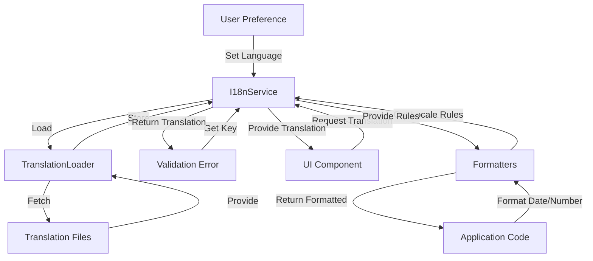

# Epic-1: CV Generator Core

# Story-6: Multilingual Validation Error Messages

## Story Description

**As a** global user  
**I want** to see validation error messages in my preferred language  
**so that** I can understand issues with my CV data regardless of my native language

## Status

Draft

## Context

Our CV Generator application has a comprehensive validation strategy implemented in Story-3, but all error messages are currently in a single language (English). As we aim to serve a global audience, we need to enhance our validation system to support multilingual error messages.

This story focuses on implementing internationalization (i18n) for validation error messages across all application layers, ensuring that users receive feedback in their preferred language. This enhancement will make the application more accessible and user-friendly for non-English speakers.

## Estimation

Story Points: 3 (1 SP = 1 day of Human Development = 10 minutes of AI development)

## Tasks

1. - [ ] i18n Architecture Setup

   1. - [ ] Write tests for i18n service
   2. - [ ] Implement i18n service with locale detection
   3. - [ ] Create translation loading mechanism
   4. - [ ] Set up language switching capability

2. - [ ] Validation Message Translation

   1. - [ ] Extract all validation messages to translation keys
   2. - [ ] Write tests for translated validation messages
   3. - [ ] Update Domain layer validation with i18n support
   4. - [ ] Update Application layer validation with i18n support
   5. - [ ] Update Infrastructure layer validation with i18n support

3. - [ ] UI Integration

   1. - [ ] Write tests for i18n components
   2. - [ ] Create language selector component
   3. - [ ] Update error display components to use translations
   4. - [ ] Implement RTL (Right-to-Left) support for applicable languages

4. - [ ] Translation Management
   1. - [ ] Create initial translation files (English, French, Spanish)
   2. - [ ] Establish translation workflow for adding new languages
   3. - [ ] Implement language fallback mechanism
   4. - [ ] Add translation completeness reporting

## Constraints

- Must support at least 3 languages initially (English, French, Spanish)
- Must maintain Clean Architecture principles with proper separation of concerns
- Translations must be loaded lazily to minimize initial bundle size
- Must support RTL languages like Arabic and Hebrew
- Translation keys must be structured and maintainable
- Must follow i18n best practices for date, number, and currency formatting

## Data Models / Schema

```typescript
// i18n interfaces
interface Locale {
  code: string;
  name: string;
  nativeName: string;
  direction: "ltr" | "rtl";
  dateFormat: string;
  decimalSeparator: string;
  thousandsSeparator: string;
}

interface TranslationSet {
  locale: string;
  messages: Record<string, string>;
  pluralRules?: Record<string, string>;
}

// Validation message structure
interface ValidationMessages {
  required: string;
  minLength: string;
  maxLength: string;
  pattern: string;
  email: string;
  url: string;
  numeric: string;
  integer: string;
  positive: string;
  negative: string;
  min: string;
  max: string;
  between: string;
  dateFormat: string;
  dateBefore: string;
  dateAfter: string;
  dateBetween: string;
  conditional: string;
  custom: string;
}
```

## Structure

```
src/
├── shared/
│   └── i18n/
│       ├── I18nService.ts
│       ├── TranslationLoader.ts
│       └── formats/
│           ├── DateFormatter.ts
│           └── NumberFormatter.ts
├── domain/
│   └── value-objects/
│       └── LocalizedError.ts
├── locales/
│   ├── en/
│   │   ├── common.json
│   │   ├── validation.json
│   │   └── cv.json
│   ├── fr/
│   │   ├── common.json
│   │   ├── validation.json
│   │   └── cv.json
│   └── es/
│       ├── common.json
│       ├── validation.json
│       └── cv.json
└── presentation/
    ├── components/
    │   └── ui/
    │       ├── LanguageSelector.vue
    │       └── TranslatedError.vue
    └── stores/
        └── i18n.ts
```

## Diagrams

### i18n Architecture



## Implementation Patterns

### 1. i18n Service

```typescript
// shared/i18n/I18nService.ts
export class I18nService {
  private translations: Map<string, Record<string, string>> = new Map();
  private currentLocale: string = "en";
  private fallbackLocale: string = "en";
  private availableLocales: Locale[] = [
    {
      code: "en",
      name: "English",
      nativeName: "English",
      direction: "ltr",
      dateFormat: "MM/DD/YYYY",
      decimalSeparator: ".",
      thousandsSeparator: ",",
    },
    {
      code: "fr",
      name: "French",
      nativeName: "Français",
      direction: "ltr",
      dateFormat: "DD/MM/YYYY",
      decimalSeparator: ",",
      thousandsSeparator: " ",
    },
    {
      code: "es",
      name: "Spanish",
      nativeName: "Español",
      direction: "ltr",
      dateFormat: "DD/MM/YYYY",
      decimalSeparator: ",",
      thousandsSeparator: ".",
    },
  ];

  constructor(options?: I18nOptions) {
    if (options?.locale) {
      this.currentLocale = options.locale;
    } else {
      this.detectLocale();
    }

    if (options?.fallbackLocale) {
      this.fallbackLocale = options.fallbackLocale;
    }
  }

  public async loadTranslations(locale: string): Promise<void> {
    if (this.translations.has(locale)) {
      return;
    }

    try {
      const loader = new TranslationLoader();
      const translations = await loader.load(locale);
      this.translations.set(locale, translations);
    } catch (error) {
      console.error(`Failed to load translations for ${locale}`, error);

      // If fallback is not loaded yet, load it
      if (
        locale !== this.fallbackLocale &&
        !this.translations.has(this.fallbackLocale)
      ) {
        await this.loadTranslations(this.fallbackLocale);
      }
    }
  }

  public async setLocale(locale: string): Promise<void> {
    if (!this.isLocaleAvailable(locale)) {
      console.warn(
        `Locale ${locale} is not available, using fallback ${this.fallbackLocale}`
      );
      locale = this.fallbackLocale;
    }

    await this.loadTranslations(locale);
    this.currentLocale = locale;

    // Set HTML attributes for RTL support
    const localeData = this.getLocaleData(locale);
    document.documentElement.setAttribute("lang", locale);
    document.documentElement.setAttribute("dir", localeData.direction);

    // Notify subscribers
    this.notifyLocaleChange(locale);
  }

  public translate(
    key: string,
    params?: Record<string, string | number>
  ): string {
    const messages = this.translations.get(this.currentLocale) || {};
    let translation = messages[key];

    // Fallback to default locale if not found
    if (!translation && this.currentLocale !== this.fallbackLocale) {
      const fallbackMessages = this.translations.get(this.fallbackLocale) || {};
      translation = fallbackMessages[key];
    }

    // Use key as fallback if still not found
    if (!translation) {
      console.warn(`Translation key not found: ${key}`);
      translation = key;
    }

    // Replace parameters
    if (params) {
      Object.entries(params).forEach(([param, value]) => {
        translation = translation.replace(
          new RegExp(`{${param}}`, "g"),
          String(value)
        );
      });
    }

    return translation;
  }

  public getLocaleData(locale: string = this.currentLocale): Locale {
    return (
      this.availableLocales.find((l) => l.code === locale) ||
      this.availableLocales.find((l) => l.code === this.fallbackLocale) ||
      this.availableLocales[0]
    );
  }

  public getAvailableLocales(): Locale[] {
    return [...this.availableLocales];
  }

  public getCurrentLocale(): string {
    return this.currentLocale;
  }

  public formatDate(date: Date, format?: string): string {
    const formatter = new DateFormatter(this.getLocaleData());
    return formatter.format(date, format);
  }

  public formatNumber(num: number, options?: NumberFormatOptions): string {
    const formatter = new NumberFormatter(this.getLocaleData());
    return formatter.format(num, options);
  }

  private detectLocale(): void {
    // Browser detection
    if (typeof navigator !== "undefined") {
      // Try to get from navigator
      const browserLocale =
        navigator.language ||
        (navigator as any).userLanguage ||
        (navigator as any).browserLanguage ||
        this.fallbackLocale;

      // Take just the language code without region
      const languageCode = browserLocale.split("-")[0];

      if (this.isLocaleAvailable(languageCode)) {
        this.currentLocale = languageCode;
        return;
      }
    }

    // Default to fallback
    this.currentLocale = this.fallbackLocale;
  }

  private isLocaleAvailable(locale: string): boolean {
    return this.availableLocales.some((l) => l.code === locale);
  }

  private notifyLocaleChange(locale: string): void {
    // Implement event emission
  }
}
```

### 2. Translation Files

```json
// locales/en/validation.json
{
  "validation": {
    "required": "{field} is required",
    "minLength": "{field} must be at least {min} characters",
    "maxLength": "{field} cannot exceed {max} characters",
    "email": "Please enter a valid email address",
    "url": "Please enter a valid URL",
    "dateFormat": "Please enter a valid date in the format {format}",
    "dateBefore": "{field} must be before {date}",
    "dateAfter": "{field} must be after {date}",

    "storage": {
      "failed": "Unable to save your data. Please try again",
      "validation": "Some of your data could not be saved",
      "field": {
        "basics.name.required": "Name is required",
        "basics.email.format": "Please enter a valid email address",
        "work.date.invalid": "Work experience dates are invalid",
        "education.date.invalid": "Education dates are invalid"
      }
    }
  }
}

// locales/fr/validation.json
{
  "validation": {
    "required": "{field} est requis",
    "minLength": "{field} doit contenir au moins {min} caractères",
    "maxLength": "{field} ne peut pas dépasser {max} caractères",
    "email": "Veuillez entrer une adresse email valide",
    "url": "Veuillez entrer une URL valide",
    "dateFormat": "Veuillez entrer une date valide au format {format}",
    "dateBefore": "{field} doit être avant {date}",
    "dateAfter": "{field} doit être après {date}",

    "storage": {
      "failed": "Impossible d'enregistrer vos données. Veuillez réessayer",
      "validation": "Certaines de vos données n'ont pas pu être enregistrées",
      "field": {
        "basics.name.required": "Le nom est requis",
        "basics.email.format": "Veuillez entrer une adresse email valide",
        "work.date.invalid": "Les dates d'expérience professionnelle sont invalides",
        "education.date.invalid": "Les dates de formation sont invalides"
      }
    }
  }
}
```

### 3. Localized Error Component

```vue
<!-- presentation/components/ui/TranslatedError.vue -->
<template>
  <div v-if="errorMessage" class="error-message" :class="errorClass">
    <span>{{ errorMessage }}</span>
  </div>
</template>

<script>
export default {
  props: {
    error: {
      type: [String, Object],
      required: true,
    },
    field: {
      type: String,
      default: "",
    },
    params: {
      type: Object,
      default: () => ({}),
    },
  },
  computed: {
    errorMessage() {
      if (!this.error) return "";

      if (typeof this.error === "string") {
        // Direct key or message
        return this.$i18n.translate(
          this.isTranslationKey(this.error)
            ? this.error
            : `validation.${this.error}`,
          { field: this.fieldLabel, ...this.params }
        );
      }

      // Error object with key and params
      if (this.error.key) {
        return this.$i18n.translate(this.error.key, {
          field: this.fieldLabel,
          ...this.params,
          ...this.error.params,
        });
      }

      // Infrastructure error with code
      if (this.error.code) {
        return this.$i18n.translate(
          `validation.storage.${this.error.code.toLowerCase()}`,
          { field: this.fieldLabel, ...this.params }
        );
      }

      // Fallback to message property or toString
      return this.error.message || this.error.toString();
    },
    fieldLabel() {
      // Convert field name to label
      if (!this.field) return "";

      // Try to get from translations
      const labelKey = `fields.${this.field}`;
      const translated = this.$i18n.translate(labelKey);

      // If no translation found (returns the key), use prettified field name
      if (translated === labelKey) {
        return this.prettifyFieldName(this.field);
      }

      return translated;
    },
    errorClass() {
      return {
        "error-field": !!this.field,
        "error-global": !this.field,
      };
    },
  },
  methods: {
    isTranslationKey(str) {
      return str.includes(".");
    },
    prettifyFieldName(field) {
      // Convert camelCase or dot notation to readable text
      return field
        .split(/\.|\s|(?=[A-Z])/)
        .map((word) => word.charAt(0).toUpperCase() + word.slice(1))
        .join(" ");
    },
  },
};
</script>
```

## Completion Criteria

- [ ] i18n architecture implemented with support for multiple languages
- [ ] All validation messages across layers translated to supported languages
- [ ] Language selection UI implemented and functional
- [ ] RTL support working correctly for applicable languages
- [ ] Translation files structured for maintainability and easy addition of new languages
- [ ] Date/number formatting respects locale conventions
- [ ] All tests pass with good coverage of i18n functionality
