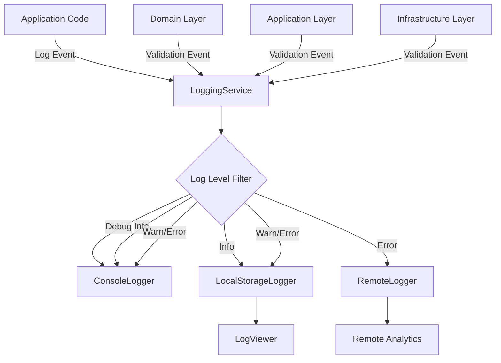

# Epic-1: CV Generator Core

# Story-5: Advanced Logging System for Validation

## Story Description

**As a** developer  
**I want** to implement an advanced logging system focusing on validation events  
**so that** I can efficiently debug and troubleshoot validation issues across application layers

## Status

Draft

## Context

With the robust validation strategy implemented in Story-3, we need a comprehensive logging system to track validation events and errors across all application layers. Currently, log messages are basic console outputs without proper structure, severity levels, or persistence.

An advanced logging system would help developers understand the flow of data through the validation layers, identify issues faster, and provide better support to users experiencing validation problems. This story aims to create a structured logging framework specifically designed to capture validation-related events with appropriate context.

## Estimation

Story Points: 2 (1 SP = 1 day of Human Development = 10 minutes of AI development)

## Tasks

1. - [ ] Logging Architecture

   1. - [ ] Write tests for logger implementation
   2. - [ ] Implement Logger interface and concrete implementations
   3. - [ ] Create LoggingService with dependency injection

2. - [ ] Validation Event Logging

   1. - [ ] Write tests for validation event logging
   2. - [ ] Define validation log event schema
   3. - [ ] Integrate loggers in Domain layer validation
   4. - [ ] Integrate loggers in Application layer validation
   5. - [ ] Integrate loggers in Infrastructure layer validation

3. - [ ] Log Management

   1. - [ ] Implement log filtering and search capabilities
   2. - [ ] Add log persistence options (localStorage, remote service)
   3. - [ ] Create log rotation and cleanup strategies

4. - [ ] Development Tools
   1. - [ ] Create developer console for log visualization
   2. - [ ] Implement log export functionality
   3. - [ ] Add log analysis tools for validation patterns

## Constraints

- Must support multiple log targets (console, file, remote service)
- Must maintain Clean Architecture principles with proper separation of concerns
- Logging must not impact application performance significantly
- Must support different log levels (debug, info, warn, error)
- Developer tools must be disabled in production builds
- Must provide structured data for machine readability

## Data Models / Schema

```typescript
// Logging interfaces
interface LogLevel {
  DEBUG: "debug";
  INFO: "info";
  WARN: "warn";
  ERROR: "error";
}

interface LogEntry {
  timestamp: number;
  level: keyof LogLevel;
  message: string;
  context: Record<string, unknown>;
  tags: string[];
}

interface ValidationLogContext {
  layer: "domain" | "application" | "infrastructure" | "presentation";
  operation: "create" | "update" | "delete" | "validate" | "save" | "load";
  entity: string;
  validationRules?: string[];
  data?: unknown;
  errors?: string[];
  duration?: number;
}

// Logger interface
interface Logger {
  debug(
    message: string,
    context?: Record<string, unknown>,
    tags?: string[]
  ): void;
  info(
    message: string,
    context?: Record<string, unknown>,
    tags?: string[]
  ): void;
  warn(
    message: string,
    context?: Record<string, unknown>,
    tags?: string[]
  ): void;
  error(
    message: string,
    context?: Record<string, unknown>,
    tags?: string[]
  ): void;
}
```

## Structure

```
src/
├── shared/
│   └── logging/
│       ├── Logger.ts
│       ├── LoggingService.ts
│       ├── adapters/
│       │   ├── ConsoleLogger.ts
│       │   ├── LocalStorageLogger.ts
│       │   └── RemoteLogger.ts
│       └── utils/
│           ├── LogFormatter.ts
│           └── LogAnalyzer.ts
├── domain/
│   └── services/
│       └── DomainLogger.ts
├── application/
│   └── services/
│       └── ApplicationLogger.ts
├── infrastructure/
│   └── services/
│       └── InfrastructureLogger.ts
└── presentation/
    ├── components/
    │   └── dev/
    │       └── LogViewer.vue
    └── services/
        └── PresentationLogger.ts
```

## Diagrams

### Logging Architecture



## Implementation Patterns

### 1. Logging Service

```typescript
// shared/logging/LoggingService.ts
export class LoggingService {
  private loggers: Logger[] = [];
  private minLevel: keyof LogLevel = "info";

  constructor(options?: LoggingOptions) {
    if (options?.loggers) {
      this.loggers = options.loggers;
    } else {
      // Default to console logger
      this.loggers = [new ConsoleLogger()];
    }

    if (options?.minLevel) {
      this.minLevel = options.minLevel;
    }
  }

  public addLogger(logger: Logger): void {
    this.loggers.push(logger);
  }

  public setMinLevel(level: keyof LogLevel): void {
    this.minLevel = level;
  }

  public debug(
    message: string,
    context?: Record<string, unknown>,
    tags?: string[]
  ): void {
    if (this.shouldLog("debug")) {
      this.log("debug", message, context, tags);
    }
  }

  public info(
    message: string,
    context?: Record<string, unknown>,
    tags?: string[]
  ): void {
    if (this.shouldLog("info")) {
      this.log("info", message, context, tags);
    }
  }

  public warn(
    message: string,
    context?: Record<string, unknown>,
    tags?: string[]
  ): void {
    if (this.shouldLog("warn")) {
      this.log("warn", message, context, tags);
    }
  }

  public error(
    message: string,
    context?: Record<string, unknown>,
    tags?: string[]
  ): void {
    if (this.shouldLog("error")) {
      this.log("error", message, context, tags);
    }
  }

  public logValidation(
    result: "success" | "failure",
    layer: ValidationLogContext["layer"],
    operation: ValidationLogContext["operation"],
    entity: string,
    details: Partial<ValidationLogContext>
  ): void {
    const level = result === "success" ? "info" : "error";
    const message = `Validation ${result}: ${operation} ${entity}`;

    const context: ValidationLogContext = {
      layer,
      operation,
      entity,
      ...details,
    };

    this.log(level, message, context, ["validation"]);
  }

  private log(
    level: keyof LogLevel,
    message: string,
    context?: Record<string, unknown>,
    tags?: string[]
  ): void {
    const entry: LogEntry = {
      timestamp: Date.now(),
      level,
      message,
      context: context || {},
      tags: tags || [],
    };

    for (const logger of this.loggers) {
      logger[level](message, context, tags);
    }
  }

  private shouldLog(level: keyof LogLevel): boolean {
    const levels: Array<keyof LogLevel> = ["debug", "info", "warn", "error"];
    const minLevelIndex = levels.indexOf(this.minLevel);
    const currentLevelIndex = levels.indexOf(level);

    return currentLevelIndex >= minLevelIndex;
  }
}
```

### 2. Console Logger Implementation

```typescript
// shared/logging/adapters/ConsoleLogger.ts
export class ConsoleLogger implements Logger {
  private readonly formatter: LogFormatter;

  constructor(formatter?: LogFormatter) {
    this.formatter = formatter || new LogFormatter();
  }

  public debug(
    message: string,
    context?: Record<string, unknown>,
    tags?: string[]
  ): void {
    console.debug(this.formatter.format("debug", message, context, tags));
  }

  public info(
    message: string,
    context?: Record<string, unknown>,
    tags?: string[]
  ): void {
    console.info(this.formatter.format("info", message, context, tags));
  }

  public warn(
    message: string,
    context?: Record<string, unknown>,
    tags?: string[]
  ): void {
    console.warn(this.formatter.format("warn", message, context, tags));
  }

  public error(
    message: string,
    context?: Record<string, unknown>,
    tags?: string[]
  ): void {
    console.error(this.formatter.format("error", message, context, tags));
  }
}
```

### 3. Log Viewer Component

```vue
<!-- presentation/components/dev/LogViewer.vue -->
<template>
  <div class="log-viewer">
    <div class="log-controls">
      <select v-model="filterLevel">
        <option value="all">All Levels</option>
        <option value="debug">Debug & Above</option>
        <option value="info">Info & Above</option>
        <option value="warn">Warnings & Errors</option>
        <option value="error">Errors Only</option>
      </select>

      <input type="text" v-model="searchTerm" placeholder="Search logs..." />

      <div class="log-tags">
        <label v-for="tag in availableTags" :key="tag">
          <input type="checkbox" v-model="selectedTags" :value="tag" />
          {{ tag }}
        </label>
      </div>

      <button @click="exportLogs">Export Logs</button>
      <button @click="clearLogs">Clear Logs</button>
    </div>

    <div class="log-entries">
      <div
        v-for="entry in filteredLogs"
        :key="entry.timestamp"
        class="log-entry"
        :class="'log-level-' + entry.level"
      >
        <div class="log-time">{{ formatTime(entry.timestamp) }}</div>
        <div class="log-level">{{ entry.level.toUpperCase() }}</div>
        <div class="log-message">{{ entry.message }}</div>
        <div class="log-tags">
          <span v-for="tag in entry.tags" :key="tag" class="log-tag">{{
            tag
          }}</span>
        </div>
        <div v-if="showDetails" class="log-context">
          <pre>{{ JSON.stringify(entry.context, null, 2) }}</pre>
        </div>
      </div>
    </div>
  </div>
</template>

<script>
export default {
  data() {
    return {
      logs: [],
      filterLevel: "all",
      searchTerm: "",
      selectedTags: [],
      showDetails: false,
    };
  },
  computed: {
    availableTags() {
      const tags = new Set();
      this.logs.forEach((log) => {
        log.tags.forEach((tag) => tags.add(tag));
      });
      return Array.from(tags);
    },
    filteredLogs() {
      return this.logs.filter((log) => {
        // Filter by level
        if (this.filterLevel !== "all") {
          const levels = ["debug", "info", "warn", "error"];
          const minLevelIndex = levels.indexOf(this.filterLevel);
          const logLevelIndex = levels.indexOf(log.level);

          if (logLevelIndex < minLevelIndex) {
            return false;
          }
        }

        // Filter by search term
        if (this.searchTerm) {
          const searchLower = this.searchTerm.toLowerCase();
          const messageMatches = log.message
            .toLowerCase()
            .includes(searchLower);
          const contextMatches = JSON.stringify(log.context)
            .toLowerCase()
            .includes(searchLower);

          if (!messageMatches && !contextMatches) {
            return false;
          }
        }

        // Filter by tags
        if (this.selectedTags.length > 0) {
          const hasSelectedTag = log.tags.some((tag) =>
            this.selectedTags.includes(tag)
          );
          if (!hasSelectedTag) {
            return false;
          }
        }

        return true;
      });
    },
  },
  methods: {
    formatTime(timestamp) {
      return new Date(timestamp).toLocaleTimeString();
    },
    exportLogs() {
      const blob = new Blob([JSON.stringify(this.logs, null, 2)], {
        type: "application/json",
      });

      const url = URL.createObjectURL(blob);
      const a = document.createElement("a");
      a.href = url;
      a.download = `logs-${new Date().toISOString()}.json`;
      document.body.appendChild(a);
      a.click();
      document.body.removeChild(a);
      URL.revokeObjectURL(url);
    },
    clearLogs() {
      this.logs = [];

      // Also clear from storage if using localStorage
      const localStorageLogger = this.$loggingService.getLogger("localStorage");
      if (localStorageLogger) {
        localStorageLogger.clear();
      }
    },
  },
  created() {
    // Load logs from storage
    const localStorageLogger = this.$loggingService.getLogger("localStorage");
    if (localStorageLogger) {
      this.logs = localStorageLogger.getLogs();
    }

    // Subscribe to new logs
    this.$loggingService.subscribe((log) => {
      this.logs.push(log);
    });
  },
};
</script>
```

## Completion Criteria

- [ ] Logging architecture implemented with support for multiple targets
- [ ] Validation events properly logged across all application layers
- [ ] Log filtering and search capabilities functional
- [ ] Log persistence mechanism working correctly
- [ ] Developer tools accessible in development mode only
- [ ] Log analysis providing useful insights for debugging
- [ ] All tests pass with good coverage of logging functionality
