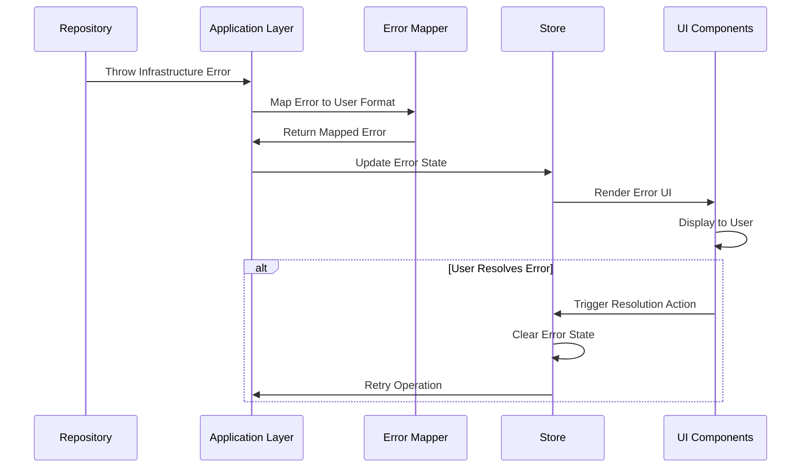

# Epic-1: CV Generator Core

# Story-4: UI Integration of Infrastructure Validation Errors

## Story Description

**As a** user  
**I want** to see clear error messages when infrastructure validation fails  
**so that** I can understand and correct data issues without technical knowledge

## Status

Draft

## Context

We have implemented a robust validation strategy across all application layers in Story-3, including infrastructure validation in the LocalStorageResumeRepository. However, when infrastructure validation errors occur (like storage constraints or schema validation issues), these errors are not properly displayed to users in the UI.

To provide a seamless user experience, we need to ensure that infrastructure validation errors are captured, transformed into user-friendly messages, and displayed appropriately in the UI. This will require coordination between the infrastructure layer, application layer, and presentation layer.

## Estimation

Story Points: 2 (1 SP = 1 day of Human Development = 10 minutes of AI development)

## Tasks

1. - [ ] Error Propagation Architecture

   1. - [ ] Write tests for error propagation from infrastructure to application
   2. - [ ] Implement error mapping service for infrastructure errors
   3. - [ ] Enhance application layer to handle and transform infrastructure errors

2. - [ ] Store Integration

   1. - [ ] Write tests for store error handling
   2. - [ ] Update store actions to capture and process infrastructure errors
   3. - [ ] Implement error state management in store

3. - [ ] UI Components

   1. - [ ] Write tests for error display components
   2. - [ ] Create/update error notification component
   3. - [ ] Implement error display in forms
   4. - [ ] Add error highlighting for affected fields

4. - [ ] User Experience
   1. - [ ] Write tests for error recovery flows
   2. - [ ] Add guided recovery actions for common errors
   3. - [ ] Implement error dismissal and resolution tracking

## Constraints

- Must maintain Clean Architecture principles with proper separation of concerns
- Error messages must be user-friendly and actionable
- UI error components must follow Tailwind standards defined in 2001-tailwind-vue3.mdc
- Error state management must be consistent with the application's state management approach
- The solution must handle both synchronous and asynchronous validation errors

## Data Models / Schema

```typescript
// Error mapping interfaces
interface ErrorMapping {
  code: string;
  userMessage: string;
  severity: "info" | "warning" | "error";
  field?: string;
  action?: ErrorAction;
}

interface ErrorAction {
  label: string;
  handler: string; // Name of the action in the store
  params?: Record<string, unknown>;
}

// Store error state
interface ErrorState {
  errors: ErrorInfo[];
  hasErrors: boolean;
  lastError: ErrorInfo | null;
}

interface ErrorInfo {
  id: string;
  message: string;
  timestamp: number;
  severity: "info" | "warning" | "error";
  source: "infrastructure" | "application" | "domain" | "ui";
  field?: string;
  action?: ErrorAction;
  dismissed: boolean;
}
```

## Structure

```
src/
├── presentation/
│   ├── components/
│   │   └── ui/
│   │       ├── ErrorNotification.vue
│   │       ├── ErrorSummary.vue
│   │       └── FieldError.vue
│   └── stores/
│       └── error.ts
├── application/
│   └── services/
│       └── ErrorMappingService.ts
└── infrastructure/
    └── errors/
        └── InfrastructureErrorMapper.ts
```

## Diagrams

### Error Flow



## Implementation Patterns

### 1. Infrastructure Error to User Message Mapping

```typescript
// infrastructure/errors/InfrastructureErrorMapper.ts
export class InfrastructureErrorMapper {
  private errorMap: Record<string, ErrorMapping> = {
    StorageValidationError: {
      code: "STORAGE_VALIDATION",
      userMessage:
        "Some of your data could not be saved due to validation issues",
      severity: "error",
    },
    StorageError: {
      code: "STORAGE_OPERATION",
      userMessage: "Unable to save your changes. Please try again later",
      severity: "error",
      action: {
        label: "Try Again",
        handler: "resume/retryLastOperation",
      },
    },
    // More specific error mappings
    "STORAGE_VALIDATION:basics.name": {
      code: "FIELD_REQUIRED",
      userMessage: "Name is required",
      severity: "error",
      field: "basics.name",
    },
  };

  public map(error: Error): ErrorInfo {
    // Logic to map infrastructure errors to user-friendly messages
    // Including extracting field names from validation errors
    const errorType = error.constructor.name;
    const mapping = this.errorMap[errorType] || this.errorMap["GenericError"];

    return {
      id: generateUniqueId(),
      message: mapping.userMessage,
      severity: mapping.severity,
      source: "infrastructure",
      field: mapping.field,
      action: mapping.action,
      timestamp: Date.now(),
      dismissed: false,
    };
  }
}
```

### 2. Store Error Handling

```typescript
// presentation/stores/error.ts
export const useErrorStore = defineStore("error", {
  state: (): ErrorState => ({
    errors: [],
    hasErrors: false,
    lastError: null,
  }),

  actions: {
    addError(error: Error) {
      // Use mapper to convert to user-friendly format
      const errorMapper = new InfrastructureErrorMapper();
      const errorInfo = errorMapper.map(error);

      // Add to error list
      this.errors.push({
        ...errorInfo,
        id: generateId(),
        timestamp: Date.now(),
        dismissed: false,
      });

      this.hasErrors = true;
      this.lastError = this.errors[this.errors.length - 1];
    },

    dismissError(id: string) {
      const error = this.errors.find((e) => e.id === id);
      if (error) {
        error.dismissed = true;
      }
      this.hasErrors = this.errors.some((e) => !e.dismissed);
    },

    clearErrors() {
      this.errors = [];
      this.hasErrors = false;
      this.lastError = null;
    },
  },
});
```

### 3. UI Error Components

```vue
<!-- presentation/components/ui/ErrorNotification.vue -->
<template>
  <div
    v-if="error && !error.dismissed"
    class="p-4 rounded-md"
    :class="severityClass"
  >
    <div class="flex">
      <div class="flex-shrink-0">
        <Icon :name="iconName" class="h-5 w-5" />
      </div>
      <div class="ml-3">
        <h3 class="text-sm font-medium">{{ error.message }}</h3>
        <div v-if="error.action" class="mt-2">
          <button @click="handleAction" class="text-sm font-medium underline">
            {{ error.action.label }}
          </button>
        </div>
      </div>
      <div class="ml-auto">
        <button @click="dismiss" class="inline-flex">
          <span class="sr-only">Dismiss</span>
          <XIcon class="h-5 w-5" />
        </button>
      </div>
    </div>
  </div>
</template>

<script>
export default {
  props: {
    error: {
      type: Object,
      required: true,
    },
  },
  computed: {
    severityClass() {
      const classes = {
        info: "bg-blue-50 text-blue-700",
        warning: "bg-yellow-50 text-yellow-700",
        error: "bg-red-50 text-red-700",
      };
      return classes[this.error.severity] || classes.info;
    },
    iconName() {
      const icons = {
        info: "information-circle",
        warning: "exclamation",
        error: "x-circle",
      };
      return icons[this.error.severity] || icons.info;
    },
  },
  methods: {
    handleAction() {
      if (this.error.action) {
        // Call the handler in the store
        this.$store.dispatch(
          this.error.action.handler,
          this.error.action.params || {}
        );
      }
    },
    dismiss() {
      this.$store.dispatch("error/dismissError", this.error.id);
    },
  },
};
</script>
```

## Completion Criteria

- [ ] Infrastructure validation errors are properly captured and mapped to user-friendly messages
- [ ] Error state is managed consistently in the application store
- [ ] UI components display errors in an accessible and user-friendly way
- [ ] User can understand the error and take appropriate action to resolve it
- [ ] Error recovery flows guide the user through fixing validation issues
- [ ] All tests pass with good coverage of error handling scenarios
