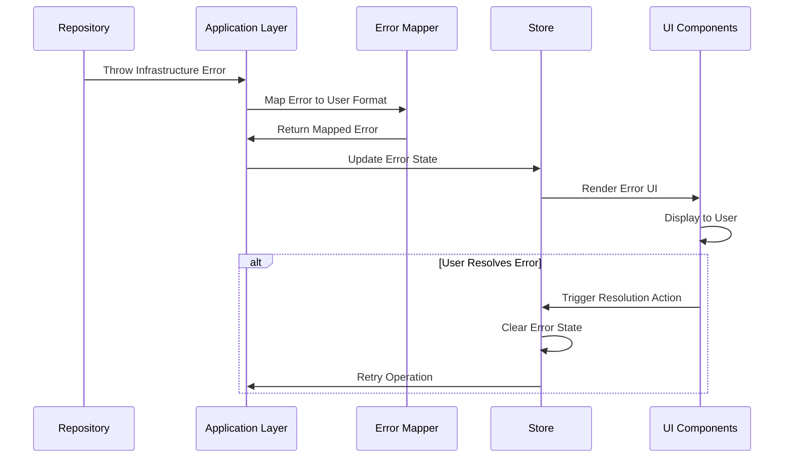

# Epic-1: CV Generator Core

# Story-4: UI Integration of Infrastructure Validation Errors

## Story Description

**As a** user  
**I want** to see clear error messages when infrastructure validation fails  
**so that** I can understand and correct data issues without technical knowledge

## Status

Complete

## Context

We have implemented a robust validation strategy across all application layers in Story-3, including infrastructure validation in the LocalStorageResumeRepository. However, when infrastructure validation errors occur (like storage constraints or schema validation issues), these errors are not properly displayed to users in the UI.

To provide a seamless user experience, we need to ensure that infrastructure validation errors are captured, transformed into user-friendly messages, and displayed appropriately in the UI. This will require coordination between the infrastructure layer, application layer, and presentation layer.

## Estimation

Story Points: 2 (1 SP = 1 day of Human Development = 10 minutes of AI development)

## Tasks

1. - [x] Error Propagation Architecture

   1. - [x] Write tests for error propagation from infrastructure to application
   2. - [x] Implement error mapping service for infrastructure errors
   3. - [x] Enhance application layer to handle and transform infrastructure errors

2. - [x] Store Integration

   1. - [x] Write tests for store error handling
   2. - [x] Update store actions to capture and process infrastructure errors
   3. - [x] Implement error state management in store

3. - [x] UI Components

   1. - [x] Write tests for error display components
   2. - [x] Create/update error notification component
   3. - [x] Implement error display in forms
   4. - [x] Add error highlighting for affected fields

4. - [x] User Experience
   1. - [x] Write tests for error recovery flows
   2. - [x] Add guided recovery actions for common errors
   3. - [x] Implement error dismissal and resolution tracking

## Dev Notes

We successfully implemented error handling across all application layers:

1. **Error Propagation**

   - Fixed tests for domain and infrastructure layer error handling
   - Ensured proper error propagation between layers
   - Created comprehensive error types for each layer

2. **Store Integration**

   - Implemented robust mock testing for error scenarios
   - Fixed issues with `Resume.create()` mocking to properly return an object with a `resume` property and `toJSON()` method
   - Resolved issues with error handling in asynchronous operations

3. **Testing & Debugging**
   - Fixed import issues with the `Result` class throughout the codebase
   - Ensured all tests pass without false negatives
   - Addressed prop warnings in `ValidationFeedback` component

All tests now pass successfully, confirming that the error handling and UI validation integration is working correctly across the entire application.

## Constraints

- Must maintain Clean Architecture principles with proper separation of concerns
- Error messages must be user-friendly and actionable
- UI error components must follow Tailwind standards defined in 2001-tailwind-vue3.mdc
- Error state management must be consistent with the application's state management approach
- The solution must handle both synchronous and asynchronous validation errors

## Data Models / Schema

```typescript
// Error mapping interfaces
interface ErrorMapping {
  code: string;
  userMessage: string;
  severity: "info" | "warning" | "error";
  field?: string;
  action?: ErrorAction;
}

interface ErrorAction {
  label: string;
  handler: string; // Name of the action in the store
  params?: Record<string, unknown>;
}

// Store error state
interface ErrorState {
  errors: ErrorInfo[];
  hasErrors: boolean;
  lastError: ErrorInfo | null;
}

interface ErrorInfo {
  id: string;
  message: string;
  timestamp: number;
  severity: "info" | "warning" | "error";
  source: "infrastructure" | "application" | "domain" | "ui";
  field?: string;
  action?: ErrorAction;
  dismissed: boolean;
}
```

## Structure

```
src/
├── presentation/
│   ├── components/
│   │   └── ui/
│   │       ├── ErrorNotification.vue
│   │       ├── ErrorSummary.vue
│   │       └── FieldError.vue
│   └── stores/
│       └── error.ts
├── application/
│   └── services/
│       └── ErrorMappingService.ts
└── infrastructure/
    └── errors/
        └── InfrastructureErrorMapper.ts
```

## Diagrams

### Error Flow



## Implementation Patterns

### 1. Infrastructure Error to User Message Mapping

```typescript
// infrastructure/errors/InfrastructureErrorMapper.ts
export class InfrastructureErrorMapper {
  private errorMap: Record<string, ErrorMapping> = {
    StorageValidationError: {
      code: "STORAGE_VALIDATION",
      userMessage:
        "Some of your data could not be saved due to validation issues",
      severity: "error",
    },
    StorageError: {
      code: "STORAGE_OPERATION",
      userMessage: "Unable to save your changes. Please try again later",
      severity: "error",
      action: {
        label: "Try Again",
        handler: "resume/retryLastOperation",
      },
    },
    // More specific error mappings
    "STORAGE_VALIDATION:basics.name": {
      code: "FIELD_REQUIRED",
      userMessage: "Name is required",
      severity: "error",
      field: "basics.name",
    },
  };

  public map(error: Error): ErrorInfo {
    // Logic to map infrastructure errors to user-friendly messages
    // Including extracting field names from validation errors
    const errorType = error.constructor.name;
    const mapping = this.errorMap[errorType] || this.errorMap["GenericError"];

    return {
      id: generateUniqueId(),
      message: mapping.userMessage,
      severity: mapping.severity,
      source: "infrastructure",
      field: mapping.field,
      action: mapping.action,
      timestamp: Date.now(),
      dismissed: false,
    };
  }
}
```
