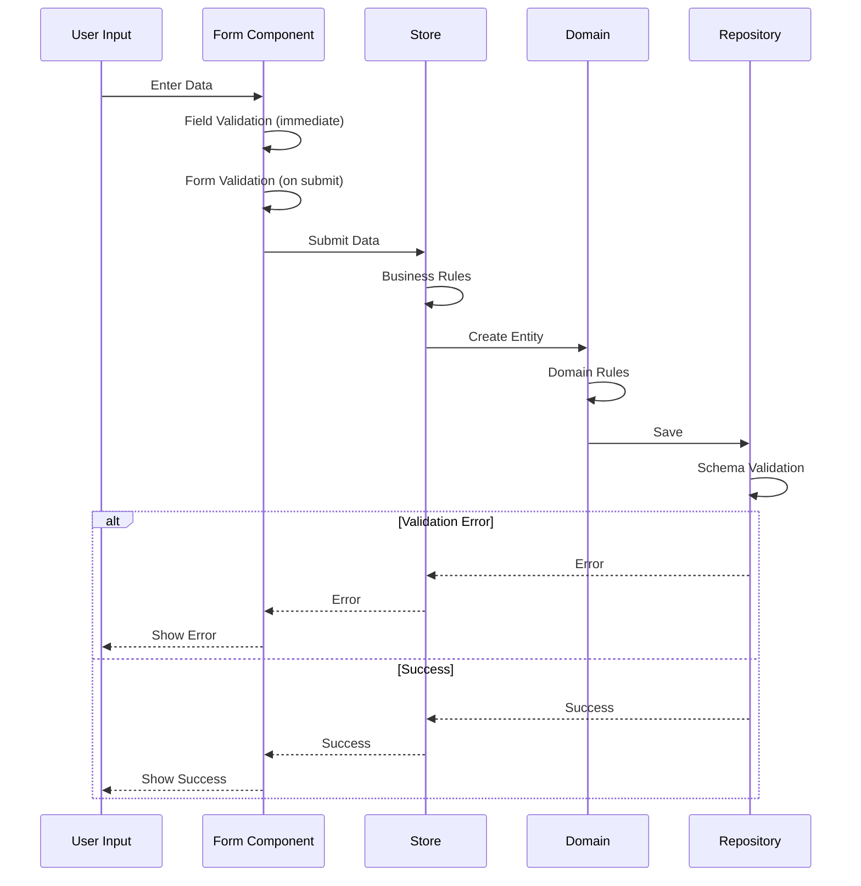

# Epic-1: CV Generator Core

# Story-3: Implement Validation Strategy

## Story Description

**As a** developer
**I want** to implement a robust validation strategy across all layers
**so that** we can ensure data integrity and provide a great user experience

## Status

Completed

## Context

The CV Generator needs a comprehensive validation strategy that works across all layers of the application. This includes:

- Form-level validation for immediate user feedback
- Business rule validation in the application layer
- Domain invariant validation
- Storage validation

Previous stories have established the basic form structure and data flow. This story focuses on implementing the validation strategy.

The validation strategy should align with the Clean Architecture principles defined in our project standards and follow SOLID principles. It will leverage Zod for schema validation as specified in our technical stack.

## Estimation

Story Points: 3 (1 SP = 1 day of Human Development = 3 heures of AI/human development)

## Tasks

1. - [x] UI Layer Validation

   1. - [x] Write tests for field validation
   2. - [x] Implement useFieldValidation composable
   3. - [x] Write tests for form validation
   4. - [x] Implement useFormValidation composable
   5. - [x] Add validation feedback UI components

2. - [x] Application Layer Validation

   1. - [x] Write tests for business rules
   2. - [x] Implement validation in store actions
   3. - [x] Add cross-field validation logic

3. - [x] Domain Layer Validation

   1. - [x] Write tests for value objects
   2. - [x] Implement Email value object
   3. - [x] Implement Phone value object
   4. - [x] Add entity-level validation

4. - [x] Infrastructure Layer Validation
   1. - [x] Write tests for storage validation
   2. - [x] Implement schema validation
   3. - [x] Add storage constraint checks

## Constraints

- Must follow TDD practices as defined in 003-tdd-workflow.mdc
- Validation implementation must respect Clean Architecture layers
- User feedback must be immediate and contextual for optimal UX
- CSS styling must follow Tailwind standards defined in 2001-tailwind-vue3.mdc
- Must validate against the JSON Resume schema

## Data Models / Schema

```typescript
import { z } from "zod";

const basicSchema = z.object({
  name: z.string().min(2, "Name must be at least 2 characters"),
  email: z.string().email("Invalid email format"),
  phone: z
    .string()
    .regex(/^[0-9\s+]+$/, "Invalid phone format")
    .optional(),
  url: z.string().url("Invalid URL format").optional().nullable(),
  summary: z.string().optional(),
  location: z
    .object({
      address: z.string().optional(),
      city: z.string().optional(),
      region: z.string().optional(),
      country: z.string().optional(),
    })
    .optional(),
  profiles: z
    .array(
      z.object({
        network: z.string(),
        url: z.string().url("Invalid profile URL"),
        username: z.string(),
      })
    )
    .optional()
    .default([]),
});

export const resumeSchema = z.object({
  basics: basicSchema,
  // Autres sections à définir...
});

export type ResumeType = z.infer<typeof resumeSchema>;
```

## Structure

```
src/
├── presentation/
│   ├── components/
│   │   └── form/
│   │       ├── useFormValidation.ts
│   │       └── useFieldValidation.ts
│   └── stores/
│       └── resume.ts
├── domain/
│   ├── entities/
│   │   └── Resume.ts
│   └── value-objects/
│       ├── Email.ts
│       └── Phone.ts
└── infrastructure/
    └── repositories/
        └── LocalStorageResumeRepository.ts
```

## Diagrams

### Validation Flow



## Implementation Patterns

### 1. Domain Layer (Value Objects & Entities)

```typescript
// domain/value-objects/Email.ts
export class Email extends ValueObject<string> {
  private static schema = z.string().email("Invalid email format");

  private constructor(value: string) {
    super(value);
  }

  public static create(email: string): Result<Email> {
    const result = this.schema.safeParse(email);
    return result.success
      ? Result.ok(new Email(result.data))
      : Result.fail(new ValidationError(result.error));
  }

  public validate(): Result<void> {
    return Email.schema.safeParse(this.value).success
      ? Result.ok()
      : Result.fail(new ValidationError("Invalid email"));
  }
}

// domain/entities/Resume.ts
export class Resume extends AggregateRoot {
  private constructor(
    private readonly basics: Basics,
    private readonly work: Work[] // ... autres propriétés
  ) {
    super();
  }

  public static create(data: ResumeDTO): Result<Resume> {
    // 1. Validation du schéma avec Zod
    const schemaResult = resumeSchema.safeParse(data);
    if (!schemaResult.success) {
      return Result.fail(new ValidationError(schemaResult.error));
    }

    // 2. Création des Value Objects
    const emailResult = Email.create(data.basics.email);
    if (emailResult.isFailure) {
      return Result.fail(emailResult.error);
    }

    // 3. Validation des règles métier
    const businessRules = this.validateBusinessRules(data);
    if (businessRules.isFailure) {
      return Result.fail(businessRules.error);
    }

    return Result.ok(new Resume(/* ... */));
  }

  private static validateBusinessRules(data: ResumeDTO): Result<void> {
    // Règles métier spécifiques au CV
    return Result.combine([
      this.validateWorkExperience(data.work),
      this.validateEducation(data.education),
      // ...
    ]);
  }
}
```

### 2. Application Layer (Use Cases)

```typescript
// application/use-cases/CreateResume.ts
export class CreateResumeUseCase implements UseCase<ResumeDTO, Result<Resume>> {
  constructor(
    private readonly resumeRepository: ResumeRepository,
    private readonly validator: ResumeValidator
  ) {}

  async execute(data: ResumeDTO): Promise<Result<Resume>> {
    // 1. Validation applicative
    const validationResult = await this.validator.validate(data);
    if (validationResult.isFailure) {
      return Result.fail(validationResult.error);
    }

    // 2. Création de l'entité Resume
    const resumeResult = Resume.create(data);
    if (resumeResult.isFailure) {
      return Result.fail(resumeResult.error);
    }

    // 3. Sauvegarde via le repository (avec validation infrastructure)
    const saveResult = await this.resumeRepository.save(resumeResult.value);
    if (saveResult.isFailure) {
      return Result.fail(saveResult.error);
    }

    return Result.ok(resumeResult.value);
  }
}
```

### 3. Infrastructure Layer (Repositories)

```typescript
// infrastructure/repositories/LocalStorageResumeRepository.ts
export class LocalStorageResumeRepository implements ResumeRepository {
  private readonly storageKey = "cv-resume";
  private readonly resumeSchema = z.object({
    basics: z.object({
      name: z.string().min(1, "Name is required"),
      email: z.string().email("Invalid email format"),
      // ... other fields
    }),
    // ... other sections
  });

  constructor(private readonly localStorage: Storage) {}

  async save(resume: Resume): Promise<Result<void>> {
    try {
      console.log("=== [LocalStorage] save ===");
      console.log(`[LocalStorage] Received resume instance:`, resume);

      // Get JSON data from domain entity
      const jsonData = resume.toJSON();
      console.log(`[LocalStorage] Converted to JSON:`, jsonData);

      // Validate against storage schema
      this.validateSchema(jsonData);
      console.log("[LocalStorage] Data validation passed");

      // Store in localStorage
      this.localStorage.setItem(this.storageKey, JSON.stringify(jsonData));
      console.log("[LocalStorage] Saved successfully");

      return Result.ok();
    } catch (error) {
      console.error("[LocalStorage] Error saving:", error);
      return Result.fail(new StorageError("Storage operation failed"));
    }
  }

  async load(): Promise<Result<Resume>> {
    try {
      console.log("=== [LocalStorage] load ===");

      // Get data from localStorage
      const rawData = this.localStorage.getItem(this.storageKey);
      console.log(`[LocalStorage] Raw data:`, rawData);

      // If no data exists, return empty resume
      if (!rawData) {
        console.log("[LocalStorage] No data found, creating empty resume");
        return Result.ok(Resume.createEmpty());
      }

      // Parse and validate JSON data
      const data = JSON.parse(rawData);
      console.log(`[LocalStorage] Parsed data:`, data);

      // Validate against storage schema
      this.validateSchema(data);
      console.log("[LocalStorage] Storage validation passed");

      // Create domain entity
      const resumeResult = Resume.create(data);
      console.log(`[LocalStorage] Resume instance created:`, {
        isValid: resumeResult.isSuccess,
        resume: resumeResult.value,
      });

      return resumeResult;
    } catch (error) {
      console.error("[LocalStorage] Error loading:", error);
      return Result.fail(new StorageError("Failed to load resume data"));
    }
  }

  private validateSchema(data: unknown): void {
    const result = this.resumeSchema.safeParse(data);
    if (!result.success) {
      const errors = result.error.errors.map(
        (err) => `${err.path.join(".")}: ${err.message}`
      );
      throw new StorageValidationError("Storage validation failed", errors);
    }
  }
}
```

## Completion Criteria

- ✅ UI validations provide immediate feedback to users on form input
- ✅ Application layer validates business rules before creating entities
- ✅ Domain entities enforce invariants during creation and modification
- ✅ Infrastructure layer validates data before storage and after retrieval
- ✅ All tests pass with good coverage across all validation layers
- ✅ Documentation updated to reflect the validation strategy
