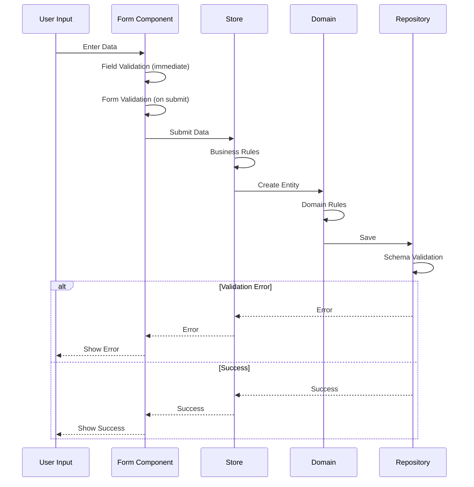

# Epic-1: CV Generator Core

# Story-3: Implement Validation Strategy

## Story

**As a** developer
**I want** to implement a robust validation strategy across all layers
**so that** we can ensure data integrity and provide a great user experience

## Status

In Progress

## Context

The CV Generator needs a comprehensive validation strategy that works across all layers of the application. This includes:

- Form-level validation for immediate user feedback
- Business rule validation in the application layer
- Domain invariant validation
- Storage validation

Previous stories have established the basic form structure and data flow. This story focuses on implementing the validation strategy.

## Estimation

Story Points: 3

## Tasks

1. - [x] UI Layer Validation

   1. - [x] Write tests for field validation
   2. - [x] Implement useFieldValidation composable
   3. - [x] Write tests for form validation
   4. - [x] Implement useFormValidation composable
   5. - [x] Add validation feedback UI components

2. - [ ] Application Layer Validation

   1. - [ ] Write tests for business rules
   2. - [ ] Implement validation in store actions
   3. - [ ] Add cross-field validation logic

3. - [ ] Domain Layer Validation

   1. - [ ] Write tests for value objects
   2. - [ ] Implement Email value object
   3. - [ ] Implement Phone value object
   4. - [ ] Add entity-level validation

4. - [ ] Infrastructure Layer Validation
   1. - [ ] Write tests for storage validation
   2. - [ ] Implement schema validation
   3. - [ ] Add storage constraint checks

## Implementation Details

### Data Models

```typescript
import { z } from "zod";

const basicSchema = z.object({
  name: z.string().min(2, "Name must be at least 2 characters"),
  email: z.string().email("Invalid email format"),
  phone: z
    .string()
    .regex(/^[0-9\s+]+$/, "Invalid phone format")
    .optional(),
  url: z.string().url("Invalid URL format").optional().nullable(),
  summary: z.string().optional(),
  location: z
    .object({
      address: z.string().optional(),
      city: z.string().optional(),
      region: z.string().optional(),
      country: z.string().optional(),
    })
    .optional(),
  profiles: z
    .array(
      z.object({
        network: z.string(),
        url: z.string().url("Invalid profile URL"),
        username: z.string(),
      })
    )
    .optional()
    .default([]),
});

export const resumeSchema = z.object({
  basics: basicSchema,
  // Autres sections à définir...
});

export type ResumeType = z.infer<typeof resumeSchema>;
```

### Structure

```
src/
├── presentation/
│   ├── components/
│   │   └── form/
│   │       ├── useFormValidation.ts
│   │       └── useFieldValidation.ts
│   └── stores/
│       └── resume.ts
├── domain/
│   ├── entities/
│   │   └── Resume.ts
│   └── value-objects/
│       ├── Email.ts
│       └── Phone.ts
└── infrastructure/
    └── repositories/
        └── LocalStorageResumeRepository.ts
```

### Validation Flow



### Implementation Patterns

1. **Domain Layer (Value Objects & Entities)**

```typescript
// domain/value-objects/Email.ts
export class Email extends ValueObject<string> {
  private static schema = z.string().email("Invalid email format");

  private constructor(value: string) {
    super(value);
  }

  public static create(email: string): Result<Email> {
    const result = this.schema.safeParse(email);
    return result.success
      ? Result.ok(new Email(result.data))
      : Result.fail(new ValidationError(result.error));
  }

  public validate(): Result<void> {
    return Email.schema.safeParse(this.value).success
      ? Result.ok()
      : Result.fail(new ValidationError("Invalid email"));
  }
}

// domain/entities/Resume.ts
export class Resume extends AggregateRoot {
  private constructor(
    private readonly basics: Basics,
    private readonly work: Work[] // ... autres propriétés
  ) {
    super();
  }

  public static create(data: ResumeDTO): Result<Resume> {
    // 1. Validation du schéma avec Zod
    const schemaResult = resumeSchema.safeParse(data);
    if (!schemaResult.success) {
      return Result.fail(new ValidationError(schemaResult.error));
    }

    // 2. Création des Value Objects
    const emailResult = Email.create(data.basics.email);
    if (emailResult.isFailure) {
      return Result.fail(emailResult.error);
    }

    // 3. Validation des règles métier
    const businessRules = this.validateBusinessRules(data);
    if (businessRules.isFailure) {
      return Result.fail(businessRules.error);
    }

    return Result.ok(new Resume(/* ... */));
  }

  private static validateBusinessRules(data: ResumeDTO): Result<void> {
    // Règles métier spécifiques au CV
    return Result.combine([
      this.validateWorkExperience(data.work),
      this.validateEducation(data.education),
      // ...
    ]);
  }
}
```

2. **Application Layer (Use Cases)**

```typescript
// application/use-cases/CreateResume.ts
export class CreateResumeUseCase implements UseCase<ResumeDTO, Result<Resume>> {
  constructor(
    private readonly resumeRepository: ResumeRepository,
    private readonly validator: ResumeValidator
  ) {}

  async execute(data: ResumeDTO): Promise<Result<Resume>> {
    // 1. Validation applicative
    const validationResult = await this.validator.validate(data);
    if (validationResult.isFailure) {
      return Result.fail(validationResult.error);
    }

    // 2. Création de l'entité
    const resumeResult = Resume.create(data);
    if (resumeResult.isFailure) {
      return Result.fail(resumeResult.error);
    }

    // 3. Sauvegarde
    const resume = resumeResult.getValue();
    await this.resumeRepository.save(resume);

    return Result.ok(resume);
  }
}

// application/validators/ResumeValidator.ts
export class ResumeValidator {
  private readonly schema: z.ZodSchema;

  constructor(schema: z.ZodSchema) {
    this.schema = schema;
  }

  async validate(data: unknown): Promise<Result<void>> {
    const result = await this.schema.safeParseAsync(data);
    return result.success
      ? Result.ok()
      : Result.fail(new ValidationError(result.error));
  }
}
```

3. **Presentation Layer (Vue Components & Composables)**

```typescript
// presentation/composables/useFieldValidation.ts
export function useFieldValidation<T extends z.ZodType>(
  schema: T,
  options: ValidationOptions = {}
) {
  const error = ref<string>("");
  const isValid = ref(false);
  const isDirty = ref(false);

  const validate = debounce((value: unknown) => {
    isDirty.value = true;
    const result = schema.safeParse(value);

    if (!result.success) {
      error.value = formatZodError(result.error, options);
      isValid.value = false;
      return false;
    }

    error.value = "";
    isValid.value = true;
    return true;
  }, options.debounce ?? 300);

  return { error, isValid, isDirty, validate };
}

// presentation/components/ResumeForm.vue
export default defineComponent({
  setup() {
    const { resumeStore } = useStores();
    const { validate: validateBasics } = useFieldValidation(basicSchema);
    const { validateForm } = useFormValidation(resumeSchema);

    const handleSubmit = async (data: unknown) => {
      const validationResult = await validateForm(data);
      if (!validationResult.success) {
        return;
      }

      await resumeStore.createResume(validationResult.data);
    };

    return { handleSubmit };
  },
});
```

4. **Infrastructure Layer (Repositories & Adapters)**

```typescript
// infrastructure/repositories/LocalStorageResumeRepository.ts
export class LocalStorageResumeRepository implements ResumeRepository {
  private readonly storageKey = "resume";
  private readonly schema: z.ZodSchema;

  constructor(schema: z.ZodSchema) {
    this.schema = schema;
  }

  async save(resume: Resume): Promise<Result<void>> {
    try {
      // 1. Validation avant persistance
      const data = resume.toJSON();
      const validation = await this.schema.safeParseAsync(data);
      if (!validation.success) {
        return Result.fail(new StorageValidationError(validation.error));
      }

      // 2. Persistance
      localStorage.setItem(this.storageKey, JSON.stringify(validation.data));

      return Result.ok();
    } catch (error) {
      return Result.fail(new StorageError(error));
    }
  }
}
```

## Dev Notes

### Validation Strategy

1. **Domain-Driven Validation**

   - Value Objects encapsulent leur propre validation
   - Entités agrégées valident leurs invariants
   - Utilisation de Result pour la gestion des erreurs
   - Séparation claire des responsabilités (SOLID)

2. **Clean Architecture Layers**

   - Présentation : validation UI immédiate
   - Application : orchestration et règles métier
   - Domaine : invariants et logique métier
   - Infrastructure : validation de persistance

3. **SOLID Principles**

   - Single Responsibility : chaque validateur a une seule responsabilité
   - Open/Closed : extension facile des schémas Zod
   - Liskov Substitution : interfaces cohérentes pour les validateurs
   - Interface Segregation : interfaces spécifiques par type de validation
   - Dependency Inversion : injection des schémas et validateurs

4. **Performance & UX**
   - Cache des résultats de validation
   - Debounce sur les validations UI
   - Validation progressive (fail-fast)
   - Messages d'erreur contextuels

## Chat Command Log

- User: Désactivation temporaire des validations pour le développement
- Agent: Modification des value objects pour désactiver les validations
- User: Demande de création d'une story pour la stratégie de validation
- Agent: Création de la story avec une approche complète de la validation
- User: Demande de vérification du format et des redondances
