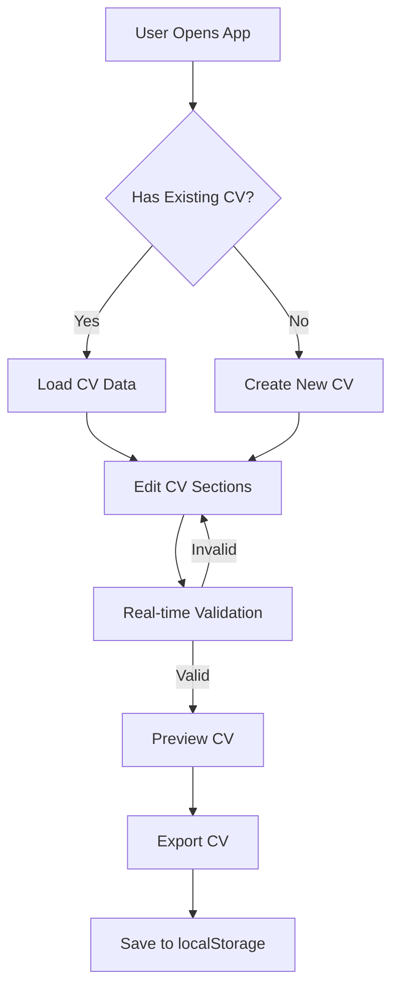

# Product Requirements Document (PRD) - CV Generator

## Document History

| Date       | Version | Author | Description of Changes                                  |
| ---------- | ------- | ------ | ------------------------------------------------------- |
| 2023-07-15 | 1.0.0   | Giak   | Initial version of PRD based on existing implementation |

## Introduction

### Description of Project

CV Generator is a modern web application that helps users create, edit, and export CVs using the JSON Resume standard format. The application offers an intuitive interface for data entry, real-time validation, multilingual support, and allows exporting CVs in multiple formats (JSON, HTML, PDF). It operates entirely client-side with localStorage persistence, requires no backend, and is structured as a PNPM monorepo with well-defined packages.

### Context and Business Motivation

The JSON Resume format offers a structured, standardized solution for storing CV data, but lacks user-friendly tools for non-technical users. CV Generator fills this gap by providing:

- A simple user interface for editing JSON Resume format
- Data validation according to the standard schema
- Export in multiple usable formats (standard-compliant JSON, HTML, PDF)
- Tips for optimizing CVs for ATS (Applicant Tracking Systems)
- Complete offline operation via localStorage
- A maintainable architecture based on Clean Architecture principles
- Multilingual support to reach an international audience

#### Positioning and Differentiation

CV Generator positions itself as a lightweight, user-friendly alternative to online CV editors that require an account or constant internet connection. Unlike SaaS solutions like Canva, Resume.io, or LinkedIn, our application:

- Requires no registration or subscription
- Works 100% offline
- Offers free export in standard formats
- Ensures complete user control of data
- Guarantees interoperability with the JSON Resume ecosystem
- Provides an interface available in multiple languages

### Target Audience and Stakeholders

**Target Audience**:

- Developers wanting to maintain their CV in standard JSON Resume format
- Job seekers comfortable with digital tools
- Professionals wanting a CV in structured, portable format
- JSON Resume ecosystem users looking for a visual editor
- International users requiring an interface in their language

#### Detailed Personas

1. **Alex, Front-end Developer (28 years old)**

   - Wants to maintain CV in structured, versioned format
   - Prefers working with open formats like JSON
   - Needs to export as PDF for job applications
   - Primary value: technical control and data portability

2. **Sophie, Job Seeker (35 years old)**

   - Regularly applies to jobs through online platforms
   - Needs advice to get her CV through ATS filters
   - Wants a simple but comprehensive interface
   - Primary value: ATS optimization and ease of use

3. **Marc, Multi-profile Freelancer (42 years old)**

   - Maintains multiple CV versions for different types of assignments
   - Needs to easily modify and adapt his CV
   - Prefers working offline on his documents
   - Primary value: flexibility and customization

4. **Lucie, International Consultant (31 years old)**
   - Works on international projects requiring CVs in different languages
   - Appreciates interfaces available in her native language
   - Needs to adapt her CV according to cultural standards
   - Primary value: international adaptation and linguistic flexibility

### Problem Statement

Creating and maintaining professional CVs across multiple formats and languages presents several challenges:

1. **Inconsistency**: Traditional word processors make it difficult to maintain consistent formatting across multiple CV versions.
2. **Format Lock-in**: Many CV builders lock users into proprietary formats, limiting portability and future use.
3. **Validation Gaps**: Users often lack guidance on CV best practices and ATS optimization.
4. **Language Barriers**: Creating CVs for international job markets requires adapting both language and format.
5. **Data Control**: Online CV builders often store user data with unclear privacy implications.

## Objectives

### Primary Objectives

1. Create a user-friendly interface for editing CVs in JSON Resume format
2. Provide real-time validation against the JSON Resume schema
3. Enable export in multiple formats (JSON, HTML, PDF)
4. Support internationalization with multiple UI languages
5. Implement a clean, maintainable architecture for long-term sustainability
6. Ensure complete offline operation with localStorage

### Success Criteria

1. Complete implementation of all JSON Resume schema sections
2. Support for at least 2 languages (English and French)
3. User-friendly validation with clear error messages
4. Successful export to all target formats
5. Complete test coverage for critical functionality
6. Positive user feedback on usability and features

### Key Performance Indicators (KPIs)

1. **Usability**: >90% completion rate for CV creation
2. **Performance**: <2s load time, <1s for form interactions
3. **Quality**: <1% error rate in validation
4. **Adoption**: >50% return rate for users
5. **Satisfaction**: >4.5/5 in user feedback

### Measurement Methods

1. In-app analytics for form completion and usage patterns
2. Performance metrics collected via browser APIs
3. Error logging for validation issues
4. User survey for satisfaction metrics
5. A/B testing for feature improvements

## User Journeys

### Primary User Journey: Creating a New CV

1. User opens the application
2. User starts a new CV
3. User completes personal information section
4. User adds work experience entries
5. User adds education entries
6. User adds skills and other relevant sections
7. User previews the CV
8. User exports the CV in desired format
9. System saves CV data to localStorage

### Secondary User Journey: Editing an Existing CV

1. User opens the application
2. System loads existing CV data from localStorage
3. User navigates to the section requiring changes
4. User makes updates to the relevant fields
5. System validates the changes in real-time
6. User previews the updated CV
7. User exports the updated CV
8. System saves the updated CV data to localStorage

### User Flow Diagrams



## Requirements and Features

### Requirement Classification (MoSCoW)

#### Must Have (Essential)

- Complete JSON Resume schema support
- Form for personal information (basics)
- Forms for work experience with chronological sorting
- Forms for education with chronological sorting
- Real-time validation against JSON Resume schema
- Local storage persistence
- English and French UI language support
- JSON export format
- Responsive UI for desktop and mobile

#### Should Have (Important)

- PDF export with basic formatting
- HTML export for web sharing
- Skills section with level indicators
- Project section with links and descriptions
- Form validation with helpful error messages
- ATS optimization suggestions
- Drag-and-drop reordering for list items

#### Could Have (Desired)

- Multiple CV templates for export
- Additional language support (beyond EN/FR)
- Import from existing JSON Resume file
- Dark/light theme toggle
- Advanced PDF formatting options
- Integration with LinkedIn for data import
- Offline PWA capabilities

#### Won't Have (Excluded from this version)

- User accounts or server-side storage
- Collaboration features
- Premium templates requiring payment
- Integration with job search platforms
- AI-based CV improvement suggestions
- Automated translation of CV content

### Functional Requirements

1. **CV Data Management**

   - Create new CV with empty JSON Resume structure
   - Edit all JSON Resume schema sections
   - Validate data against JSON Resume schema
   - Persist data to localStorage
   - Support multiple CV profiles
   - Import/export CV data in JSON format

2. **User Interface**

   - Provide forms for all JSON Resume sections
   - Support real-time preview of CV
   - Enable switching between UI languages
   - Support responsive layout for various devices
   - Implement intuitive navigation between sections
   - Provide visual indicators for form completion status

3. **Validation**

   - Validate field values against schema requirements
   - Display validation errors with helpful messages
   - Support multi-level validation (domain, application, presentation)
   - Implement warning support for non-blocking validation issues
   - Provide field-specific validation rules
   - Support multilingual validation messages

4. **Export**

   - Export CV in JSON format
   - Export CV in HTML format
   - Export CV in PDF format
   - Support multiple templates for export
   - Enable customization of export formats
   - Preserve formatting in exported documents

5. **Internationalization**
   - Support multiple UI languages (English and French)
   - Enable language switching without data loss
   - Translate all UI elements
   - Provide localized validation messages
   - Support right-to-left languages (future)
   - Ensure proper date formatting by locale

### Non-Functional Requirements

1. **Performance**

   - Application load time under 2 seconds
   - Form interaction response under 1 second
   - Smooth scrolling and navigation
   - Efficient rendering of large CV data
   - Minimal memory footprint
   - Optimized bundle size for quick loading

2. **Compatibility**

   - Support modern browsers (Chrome, Firefox, Safari, Edge)
   - Responsive design for desktop and mobile devices
   - Minimum screen size support of 320px width
   - Support for touch interactions on mobile
   - Graceful degradation for older browsers
   - Print-friendly styles for direct printing

3. **Security**

   - No transmission of user data to servers
   - Secure localStorage implementation
   - Protection against XSS in CV data display
   - CORS compliance for external resources
   - Content Security Policy implementation
   - No collection of personal data beyond analytics

4. **Compliance**
   - GDPR compliance for any data handling
   - WCAG 2.1 AA accessibility standards
   - JSON Resume schema compliance
   - Semantic HTML for screen readers
   - Keyboard navigation support
   - Proper focus management for accessibility

### UX/UI Requirements

1. **Interface Guidelines**

   - Clean, minimalist design
   - Consistent color scheme and typography
   - Clear visual hierarchy of information
   - Prominent call-to-action buttons
   - Responsive layout adapting to different screen sizes
   - Intuitive form controls with proper labeling

2. **User Experience Principles**

   - Progressive disclosure of complex features
   - Immediate feedback for user actions
   - Clear navigation between sections
   - Persistent save with undo capability
   - Predictable application behavior
   - Low cognitive load for common tasks

3. **Accessibility Requirements**
   - WCAG 2.1 AA compliance
   - Proper heading structure
   - Appropriate color contrast
   - Screen reader compatibility
   - Keyboard navigation support
   - Focus management for form elements

### Explicitly Excluded Features

- Server-side storage or user accounts
- Automated CV content generation
- Direct integration with job boards
- Paid subscription features
- Collaborative editing features
- AI-based content suggestions
- Automated translation of CV content

## Technical Specifications

### Technical Vision & Objectives

- **Technical Vision**: Create a maintainable, well-structured web application that adheres to Clean Architecture principles and provides a seamless user experience for CV creation.
- **Technical Objectives**:
  - Implement a monorepo structure with clear separation of concerns
  - Adopt Clean Architecture with domain-driven design
  - Ensure high test coverage across all layers
  - Provide a developer-friendly codebase with clear documentation
  - Support internationalization throughout the application
  - Maintain performance and accessibility standards
- **Guiding Principles**:
  - Code maintainability over clever optimizations
  - User experience over technical complexity
  - Test-driven development for critical functionality
  - Clear separation of concerns between packages
  - Domain-driven design for business logic

### Technology Stack

- **Frontend**:
  - Vue.js 3.4+ (Composition API, script setup)
  - TypeScript 5.7+
  - Vite 6.0+ (build tool and development server)
  - Tailwind CSS 3.4.0 (utility-first styling)
  - Vue Router 4.2+ (client-side routing)
  - Pinia 2.1+ (state management)
  - Vue I18n 9.2+ (internationalization)
- **Testing**:
  - Vitest 3.x+ (unit and component testing)
  - Testing Library (component testing utilities)
  - Mock Service Worker (API mocking)
  - Playwright (end-to-end testing)
- **Validation**:
  - Zod 3.22+ (schema validation)
  - Custom validation with Result/Option pattern
  - Multi-layer validation strategy
- **Build & Deploy**:
  - PNPM 10+ (package management with workspaces)
  - Docker (containerization)
  - GitHub Actions (CI/CD)
  - Nginx (production serving)
- **Documentation**:
  - Markdown (documentation format)
  - Mermaid (diagrams and visualization)
  - VitePress (documentation site)

### Architecture

- **Architectural Pattern**: Clean Architecture with Domain-Driven Design
- **Functional Breakdown**:
  ```
  packages/
  ├── core/        # Domain and application layers
  │   ├── cv/      # CV domain models and use cases
  │   ├── export/  # Export functionality
  │   ├── user/    # User preferences
  │   └── shared/  # Shared domain utilities
  ├── ui/          # Presentation layer
  │   ├── components/ # UI components
  │   ├── composables/ # Vue composable functions
  │   ├── i18n/    # Internationalization
  │   └── plugins/ # Vue plugins
  ├── shared/      # Shared utilities
  └── infrastructure/ # External services and adapters
  ```
- **Code Organization**:
  - Domain models define core business entities
  - Application services implement use cases
  - UI layer provides the user interface
  - Infrastructure adapters handle external services
- **Main Data Flows**:
  1. User input is captured in UI components
  2. Data is validated at multiple levels
  3. Domain models process and store data
  4. Application services coordinate operations
  5. Storage adapters persist data to localStorage
  6. Export services generate output formats
- **External Integration Points**:
  - Browser localStorage API
  - Browser File API for imports/exports
  - HTML5 Drag and Drop API
  - PWA capabilities for offline use

### Technical Constraints

- Browser-only execution (no server-side code)
- LocalStorage limits (typically 5-10MB per domain)
- Mobile device performance considerations
- PDF generation in browser environment
- Browser compatibility requirements
- Offline operation limitations

### Development Principles

- **Code Standards**:
  - ESLint for code linting
  - Prettier for code formatting
  - TypeScript for type safety
  - Component-driven development
  - Composition API for Vue components
  - Conventional commits for version control
- **Special Considerations**:
  - Internationalization (i18n) throughout the application
  - Accessibility (a11y) compliance
  - Performance optimization for mobile devices
  - Progressive enhancement for feature support
  - Defensive programming for robust operation
- **Testing Strategy**:
  - Unit tests for domain models and utilities
  - Component tests for UI elements
  - Integration tests for feature flows
  - End-to-end tests for critical user journeys
  - Snapshot tests for UI components
  - Performance tests for critical operations
- **Collaboration Model**:
  - GitHub Flow for branching
  - Pull requests with code reviews
  - Continuous integration with GitHub Actions
  - Issue tracking with GitHub Issues
  - Project management with GitHub Projects
- **Documentation**:
  - Code comments for complex logic
  - README files for package documentation
  - API documentation with JSDoc
  - Architecture documentation with Mermaid diagrams
  - User documentation with screenshots and examples

## Implementation Plan

### Current Status

The project is currently in active development with the following progress:

- **Epic-1: System Foundation**: 100% Complete

  - Clean Architecture structure implemented
  - Package structure established
  - JSON Resume data models implemented

- **Epic-2: CV Component Refactoring**: 100% Complete

  - Standardized form model management with composables
  - Form validation centralization
  - Collection field management
  - Date range handling
  - Collection management for lists

- **Epic-3: CV Editing**: 75% Complete

  - Basic information forms implemented
  - Work experience forms implemented
  - Education forms implementation in progress (80%)
  - Validation system using Result/Option Pattern (60%)
  - Value Objects migration for Email, Phone, WorkDate
  - Modernized navigation system
  - Unified Navigation component
  - Form Navigation refactoring

- **Epic-5: Internationalization & Multilingualism**: 100% Complete

  - i18n architecture implemented
  - Centralized translation keys
  - Value Objects and services adaptation
  - UI composables adaptation
  - Full support for English and French
  - Multilingual testing
  - Technical documentation

- **Epic-4: Preview and Export**: Planned
- **Epic-6: ATS Optimization**: Planned

### Phases & Milestones

- **Phase 1: Foundation & Core Editing (Completed)**

  - Clean Architecture implementation
  - Basic form components
  - Core validation
  - Essential CV sections (basics, work, education)
  - Local storage persistence

- **Phase 2: Enhanced Editing & Internationalization (Current)**

  - Complete all CV section forms
  - Improve validation system
  - Implement internationalization
  - Refine navigation and UX
  - Implement drag-and-drop reordering

- **Phase 3: Preview & Export (Upcoming - Q3 2023)**

  - Real-time CV preview
  - JSON export
  - HTML export
  - Basic PDF export
  - Multiple templates

- **Phase 4: ATS Optimization & Polish (Upcoming - Q4 2023)**
  - ATS compatibility guidelines
  - CV scoring suggestions
  - Keyword optimization
  - Performance improvements
  - Additional language support

### Technical Phases

- **Phase 1: Component Architecture** (Completed)

  - Development of core component structure
  - Implementation of form handling composables
  - Creation of validation framework

- **Phase 2: Data Model & Persistence** (Completed)

  - JSON Resume schema implementation
  - localStorage adapter
  - State management with Pinia

- **Phase 3: User Interface Enhancement** (In Progress - 75%)

  - Implementation of remaining form components
  - Navigation improvements
  - Responsive layout refinement
  - Accessibility compliance

- **Phase 4: Internationalization** (Completed)

  - Vue I18n integration
  - Translation key structure
  - Component adaptation
  - Testing infrastructure

- **Phase 5: Export & Preview** (Planned - Q3 2023)
  - PDF generation implementation
  - HTML export formatting
  - Template system design
  - Preview component development

### Dependencies

- Vue.js ecosystem for UI components
- JSON Resume schema for data structure
- Browser APIs for storage and file handling
- PDF generation libraries for export

### Resources Required

- Frontend developers (2-3)
- UI/UX designer (1)
- Technical writer for documentation (1)
- QA engineer for testing (1)

## Risk Assessment

### Business Risks

1. **Limited Target Audience**

   - Risk: The focus on JSON Resume format may limit broader appeal
   - Impact: Medium
   - Mitigation: Emphasize the benefits of standardized formats and highlight the multiple export options

2. **Market Competition**

   - Risk: Existing CV builders with established user bases
   - Impact: Medium
   - Mitigation: Focus on unique value propositions (offline use, no accounts, data ownership)

3. **Feature Expectations**

   - Risk: Users expecting advanced features from premium CV builders
   - Impact: Low
   - Mitigation: Clear communication of project scope and commitment to core features

4. **Internationalization Challenges**
   - Risk: Difficulty in supporting multiple languages effectively
   - Impact: Medium
   - Mitigation: Robust i18n architecture and thorough testing of multilingual components

### Technical Risks

1. **Browser Compatibility**

   - Risk: Issues with older browsers or specific platforms
   - Impact: Medium
   - Mitigation: Clear browser support targets, progressive enhancement, thorough testing

2. **PDF Generation Limitations**

   - Risk: Browser-based PDF generation quality issues
   - Impact: High
   - Mitigation: Evaluate multiple PDF libraries, implement careful layout control

3. **LocalStorage Limitations**

   - Risk: Storage size constraints for complex CVs
   - Impact: Medium
   - Mitigation: Data compression, clear user messaging about limitations

4. **Performance Optimization**

   - Risk: Slow performance with large CVs or on mobile devices
   - Impact: High
   - Mitigation: Component lazy loading, pagination for large lists, performance testing

5. **JSON Resume Schema Evolution**
   - Risk: Changes to the official schema requiring adaptation
   - Impact: Medium
   - Mitigation: Modular schema implementation, version tracking, automated tests

### Mitigation Strategies

- Comprehensive testing across browsers and devices
- Early user feedback collection
- Progressive feature implementation
- Performance monitoring and optimization
- Clear communication of limitations
- Modular architecture for adaptability

### Alternatives Considered

1. **Server-Based Architecture**

   - Considered implementing a server for data storage and processing
   - Rejected in favor of client-only solution for simplicity and user data control

2. **Custom CV Schema**

   - Considered developing a proprietary data structure
   - Rejected in favor of JSON Resume standard for interoperability

3. **Framework Alternatives**

   - Evaluated React and Angular as alternatives to Vue.js
   - Selected Vue.js for its lightweight nature and composition API

4. **Third-Party PDF Services**
   - Considered using external services for PDF generation
   - Rejected to maintain offline capability and avoid dependencies

## Open Questions

1. How to best optimize PDF export quality within browser limitations?
2. What additional languages should be prioritized for future support?
3. How can we effectively implement ATS optimization without misleading users?
4. Should we consider integrating with cloud storage services while maintaining privacy?

## Appendices

### Related Documents

- [JSON Resume Schema](https://jsonresume.org/schema/)
- [Technical Architecture Document](./docs/architecture.md)
- [Internationalization Guide](./docs/epic-5/i18n-reference-guide.md)

### Glossary

- **ATS**: Applicant Tracking System, software used by employers to manage job applications
- **CV**: Curriculum Vitae, a document detailing a person's career and qualifications
- **JSON Resume**: An open standard for resume data as JSON
- **i18n**: Internationalization, the process of designing software for multiple languages
- **PWA**: Progressive Web Application, web apps that function like native apps
- **Value Object**: An immutable object that contains attributes but has no identity

### Reference Materials

- JSON Resume official documentation
- Vue.js 3 composition API guidelines
- Clean Architecture principles by Robert C. Martin
- WAI-ARIA accessibility practices
- Material Design guidelines
