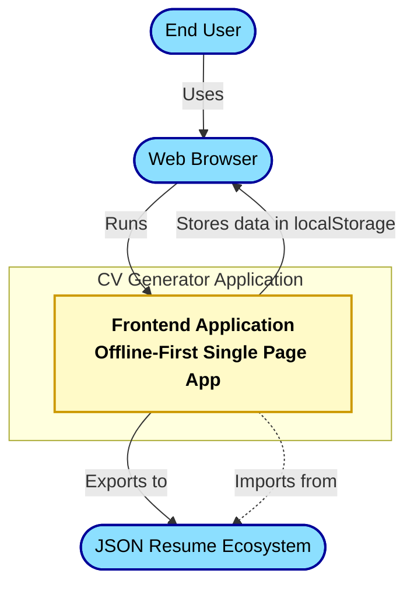
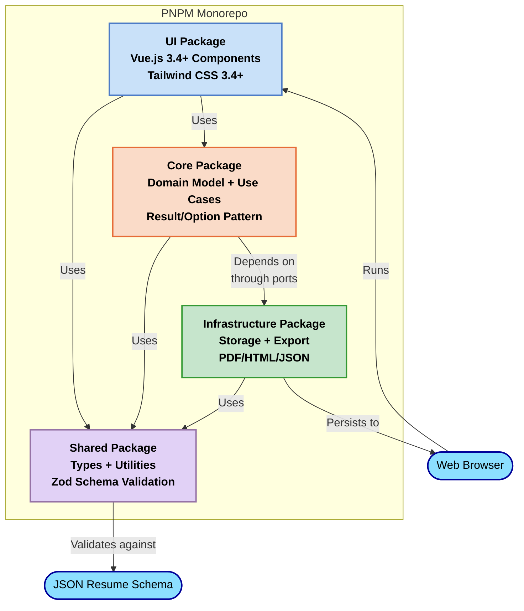
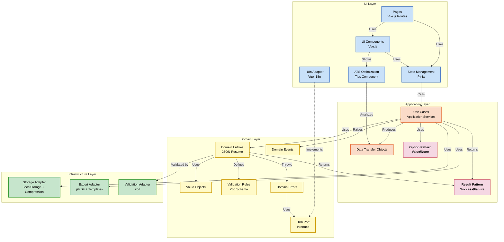
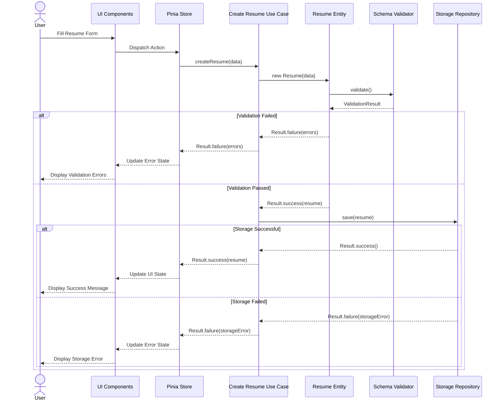
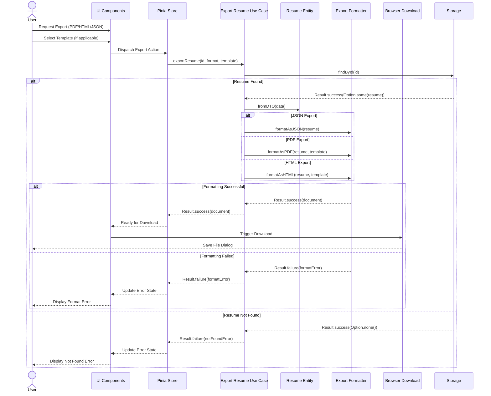
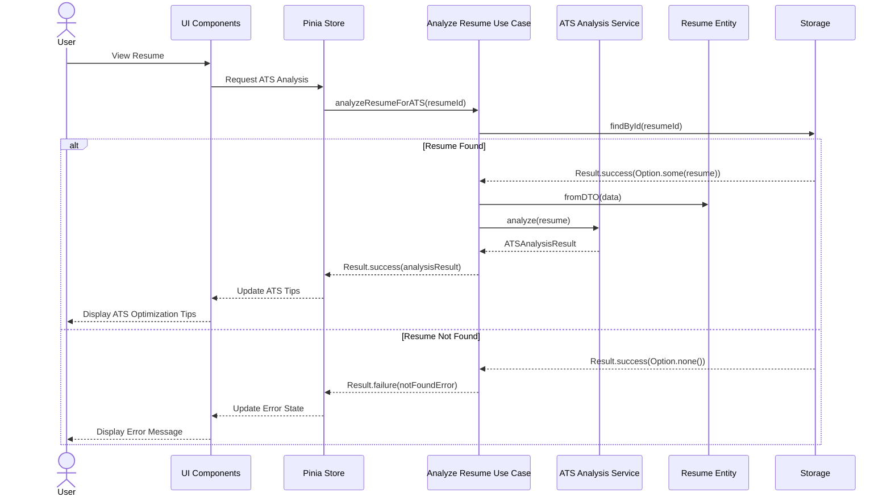
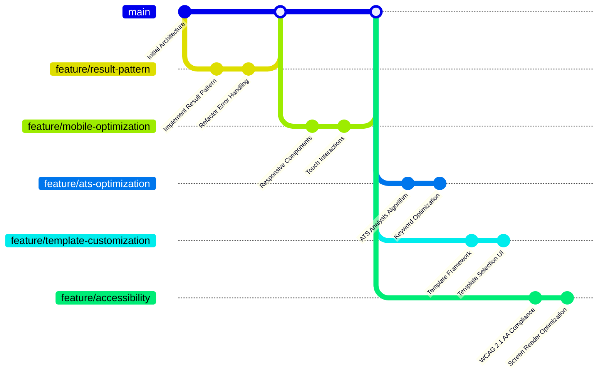

# CV Generator System Architecture

## 1. Introduction

This document describes the architecture of the CV Generator system, providing a comprehensive view of the frontend-only application structure. It follows a three-tiered approach to architecture documentation, allowing readers to understand the system at different levels of abstraction.

This architecture aligns with the Project Foundation (version 1.3.0) and the Product Requirements Document (version 2.0.0), reflecting the current state of the project as it progresses through the refinement phase.

### 1.1 Purpose

This architecture documentation aims to:

- Provide a clear understanding of the system structure and components
- Document key technical decisions and their rationales
- Establish a foundation for future development and maintenance
- Serve as a reference for onboarding new team members

### 1.2 Scope

This document covers:

- System context and external integrations
- High-level monorepo package structure
- Detailed component structure following Clean Architecture
- Data flows between components
- Key interfaces and dependencies

## 2. Level 1: System Context Diagram

The System Context diagram shows the CV Generator application in the context of its users and external systems.



### 2.1 Context Elements

#### End User

- **Description**: Primary users creating and managing CV/resumes
- **Interactions**: Creates/edits CVs, exports documents, imports JSON Resume files
- **Requirements**: Needs intuitive interface with responsive design and accessibility support (WCAG 2.1 AA)

#### Web Browser

- **Description**: Platform running the application
- **Interactions**: Renders the application, provides localStorage API for offline data persistence
- **Requirements**: Modern browser with localStorage support, responsive design capabilities

#### JSON Resume Ecosystem

- **Description**: Community standard for resume data
- **Interactions**: Defines schema, provides validation, ensures interoperability
- **Requirements**: Compatibility with JSON Resume schema standard version 1.0.0
- **Integration**: Bi-directional with import/export capabilities

## 3. Level 2: Monorepo Package Diagram

The Package diagram shows the high-level structure of the CV Generator as a PNPM monorepo.



### 3.1 Package Elements

#### UI Package (@cv-generator/ui)

- **Technology**: Vue.js 3.4+, Tailwind CSS 3.4+, Vue Router 4.2+, Pinia 2.3+
- **Responsibility**: User interface components, pages, and stores (presentation)
- **Key Features**: Responsive design, internationalization, form components, ATS optimization tips
- **Dependencies**: Core package, Shared package

#### Core Package (@cv-generator/core)

- **Technology**: TypeScript 5.7+, Result/Option pattern
- **Responsibility**: Domain entities, use cases based on JSON Resume standard
- **Key Features**: Business logic, validation rules, domain events, error handling
- **Dependencies**: Shared package, Infrastructure interfaces (ports)

#### Infrastructure Package (@cv-generator/infrastructure)

- **Technology**: TypeScript 5.7+, localStorage API, jsPDF 2.5+
- **Responsibility**: Concrete implementations for storage and exports
- **Key Features**: Data persistence, PDF/HTML/JSON generation, data compression, template rendering
- **Dependencies**: Shared package

#### Shared Package (@cv-generator/shared)

- **Technology**: TypeScript 5.7+, Zod 3.22+
- **Responsibility**: Shared types, constants, utilities, validators, and i18n keys
- **Key Features**: JSON Resume schema validation, shared interfaces, utility functions, centralized translation keys
- **Dependencies**: None (foundational package)

## 4. Level 3: Clean Architecture Component Diagram

The Component diagram shows the detailed structure following Clean Architecture principles.



### 4.1 Component Details: Resume Entity (Domain Layer)

- **Responsibility**: Core domain entity representing a resume in JSON Resume format
- **Properties**:
  - `basics`: Personal information (name, email, location, etc.)
  - `work`: Work experience entries
  - `education`: Education history entries
  - `skills`: Technical and soft skills
  - `projects`: Personal or professional projects
  - `certificates`: Professional certifications
  - Additional properties as defined in JSON Resume schema
- **Methods**:
  - `validate(): Result<Resume, ValidationError[]>`: Validates the entire resume
  - `addWorkExperience(work: Work): Result<Resume, Error>`: Adds work experience
  - `updateBasics(basics: Basics): Result<Resume, Error>`: Updates basic information
  - `toDTO(): ResumeDTO`: Converts to data transfer object
  - `isATSCompliant(): ATSComplianceResult`: Checks ATS compatibility
  - `clone(): Resume`: Creates a deep copy of the resume
  - `applyTemplate(template: TemplateType): Result<Resume, Error>`: Applies template formatting
- **Constraints**:
  - Must conform to JSON Resume schema
  - Must maintain data integrity
  - Must be serializable for localStorage
  - Must support internationalization
- **Technical Decisions**:
  - Implements Rich Domain Model pattern
  - Uses Result/Option pattern for error handling
  - Implements entity equality based on ID
  - Implements immutability for predictable state

### 4.2 Component Details: Storage Repository (Infrastructure Layer)

- **Responsibility**: Handles persistence of resume data in localStorage
- **Interfaces**:
  - `save(resume: Resume): Result<void, StorageError>`
  - `findById(id: string): Result<Option<Resume>, StorageError>`
  - `findAll(): Result<Resume[], StorageError>`
  - `delete(id: string): Result<boolean, StorageError>`
- **Implementation Details**:
  - Uses browser's localStorage API
  - Implements data compression for large resumes
  - Provides auto-save functionality
  - Handles browser storage limitations
  - Implements backup/restore mechanism
- **Technical Decisions**:
  - Implements Repository pattern
  - Uses adapter for localStorage
  - Provides abstract interface for potential future storage options (IndexedDB)
  - Returns Result type for error handling

### 4.3 Component Details: Export Service (Application Layer)

- **Responsibility**: Handles exporting resumes in various formats
- **Interfaces**:
  - `exportAsJSON(resume: Resume): Result<Blob, ExportError>`
  - `exportAsPDF(resume: Resume, template: Template): Result<Blob, ExportError>`
  - `exportAsHTML(resume: Resume, template: Template): Result<Blob, ExportError>`
- **Implementation Details**:
  - Uses jsPDF for PDF generation
  - Ensures JSON Resume standard compliance
  - Applies formatting templates
  - Handles various template styles
  - Provides progress feedback for large documents
- **Technical Decisions**:
  - Isolates export logic in application layer
  - Uses strategy pattern for different export formats
  - Implements asynchronous processing for large documents
  - Returns Result type for error handling

### 4.4 Component Details: Result/Option Patterns

- **Result Pattern**:

  - **Purpose**: Handle success/failure outcomes without exceptions
  - **Implementation**: `Result<T, E>` generic type
  - **Methods**:
    - `isSuccess(): boolean`: Checks if result is successful
    - `isFailure(): boolean`: Checks if result is a failure
    - `getOrThrow(): T`: Returns value or throws error
    - `map<U>(fn: (value: T) => U): Result<U, E>`: Maps success value
    - `mapError<F>(fn: (error: E) => F): Result<T, F>`: Maps error value
    - `fold<R>(onSuccess: (value: T) => R, onFailure: (error: E) => R): R`: Handles both cases
  - **Usage**: Return from methods that can fail instead of throwing exceptions

- **Option Pattern**:
  - **Purpose**: Handle presence/absence of values (null/undefined) safely
  - **Implementation**: `Option<T>` generic type
  - **Methods**:
    - `isSome(): boolean`: Checks if value exists
    - `isNone(): boolean`: Checks if value is absent
    - `getOrThrow(): T`: Returns value or throws
    - `getOrElse(defaultValue: T): T`: Returns value or default
    - `map<U>(fn: (value: T) => U): Option<U>`: Maps value if present
    - `fold<R>(onSome: (value: T) => R, onNone: () => R): R`: Handles both cases
  - **Usage**: Used for possibly missing values like database lookups

## 5. Data Flow Diagrams

### 5.1 Resume Creation Flow



### 5.2 Export Flow



### 5.3 ATS Optimization Flow



## 6. Internationalization Architecture

```mermaid
flowchart TD
    subgraph "UI Layer"
        VueI18n[Vue I18n Plugin\nMultilingual Support]
        I18nAdapter[I18n Adapter\nBridge Implementation]
        UIComponents[UI Components\nUses $t() function]
        LangSelector[Language Selector\nUser Preference]
    end

    subgraph "Domain Layer"
        I18nPort[I18n Port Interface\nDomain Contract]
        DomainEntities[Domain Entities\nError Messages]
        ValidationErrors[Validation Errors\nKey-Based Messages]
    end

    subgraph "Shared Layer"
        TranslationKeys[Translation Keys\nCentralized Constants]
        Messages[Message Collections\nBy Language]
        LanguageDetector[Language Detection\nBrowser Based]
    end

    UIComponents -->|Uses| VueI18n
    LangSelector -->|Updates| VueI18n
    VueI18n -->|Loads| Messages
    I18nAdapter -->|Implements| I18nPort
    I18nAdapter -->|Uses| VueI18n
    DomainEntities -->|Uses| I18nPort
    ValidationErrors -->|References| TranslationKeys
    Messages -->|Organized by| TranslationKeys
    VueI18n -->|Detects| LanguageDetector
    LangSelector -->|Saves Preference in| localStorage

    %% Enhanced styling for better clarity
    classDef ui fill:#C9E1F9,stroke:#4D7CC7,stroke-width:2px,color:#000
    classDef domain fill:#FFFAC8,stroke:#CC9900,stroke-width:2px,color:#000
    classDef shared fill:#E1D1F6,stroke:#9673A6,stroke-width:2px,color:#000
    classDef storage fill:#C6E5CC,stroke:#339933,stroke-width:2px,color:#000

    class VueI18n,I18nAdapter,UIComponents,LangSelector ui
    class I18nPort,DomainEntities,ValidationErrors domain
    class TranslationKeys,Messages,LanguageDetector shared
    class localStorage storage
```

### 6.1 Internationalization Components

#### Translation Key Management

- **Key Organization**: Translation keys are centralized in the shared package
- **Namespace Structure**: Keys are organized by functional domain (ui, validation, resume, export)
- **Key Format**: Dot notation for hierarchical organization (e.g., `resume.basics.name.label`)
- **Key Usage**: Keys are exported as constants to ensure type safety

#### Vue I18n Integration

- **Framework**: Vue I18n 11.0+ with composition API support
- **Message Loading**: Dynamic loading of language packs
- **Functions**:
  - `$t(key, params)`: Basic translation
  - `$tc(key, count, params)`: Pluralized translation
  - `$d(value, format)`: Date formatting
  - `$n(value, format)`: Number formatting
- **Language Detection**: Automatic detection of browser language
- **Language Preference**: User preference stored in localStorage

#### Domain Internationalization

- **Port Interface**: The domain defines a port (`DomainI18nPortInterface`) with methods:
  - `translate(key: string, params?: Record<string, any>): string`
  - `getLocale(): string`
  - `setLocale(locale: string): void`
- **Adapter Implementation**: UI layer provides a concrete adapter that connects to Vue I18n
- **Error Messages**: Domain errors reference keys instead of hardcoded messages

#### Translation Verification

- **Completeness Check**: Automated tests verify all keys have translations in all supported languages
- **Consistency Check**: Scripts ensure consistent formatting and variable usage
- **Missing Translation Handling**: Fallback to key name with warning in development

### 6.2 Language Support

- **Current Languages**:
  - English (en): Primary development language
  - French (fr): Complete translation
- **Planned Languages**:
  - Spanish (es): In progress
  - German (de): Planned
- **Language Selection**: User can switch languages via UI dropdown
- **Persistence**: Selected language is stored in localStorage
- **Default Language**: Browser preferred language or English

## 7. Performance Considerations

### 7.1 Client-Side Performance

- **Bundle Optimization**:
  - Lazy loading of components and routes
  - Efficient state management with Pinia
  - Code splitting for optimal chunk sizes
  - Tree-shaking for reduced bundle size
  - Modern browser features through Vite build
  - Dynamic imports for large components
- **Rendering Performance**:
  - Virtual scrolling for large lists
  - Memoization of expensive computations
  - Efficient reactive updates with Vue 3
  - Component lazy loading
  - Optimized CSS with Tailwind JIT compiler

### 7.2 Data Management

- **Local Storage Optimization**:
  - Data compression for large resumes (LZ-based compression)
  - Incremental updates to avoid full saves
  - Batch operations for multi-document operations
  - Automatic cleanup of outdated data
  - Storage limit detection and user warnings
- **Form Performance**:
  - Debounced input validation
  - Progressive form validation
  - Cached validation results
  - Field dependency tracking
  - Form section lazy loading

### 7.3 Export Performance

- **Document Generation**:
  - Asynchronous PDF generation with Web Workers
  - Progress indicators for long operations
  - Throttling for resource-intensive tasks
  - Template pre-compilation
  - Image optimization before embedding
  - Background processing for large documents
- **Template Rendering**:
  - Cached template instances
  - Progressive template loading
  - Optimized layout calculations
  - Responsive image handling
  - Print-specific style optimization

### 7.4 Mobile Optimization

- **Responsive Design**:
  - Mobile-first approach with Tailwind CSS
  - Adaptive layout using CSS Grid and Flexbox
  - Touch-friendly UI elements (larger hit areas)
  - Gesture support for common operations
  - Content prioritization on small screens
- **Mobile Performance**:
  - Reduced animations on low-power devices
  - Optimized paint and layout operations
  - Efficient touch event handling
  - Reduced network requests
  - Battery-friendly background operations
- **Mobile Storage**:
  - Enhanced compression for limited storage
  - Critical data prioritization
  - Storage quota management
  - Background data synchronization
  - Storage usage monitoring and warnings

### 7.5 Accessibility Performance

- **Screen Reader Optimization**:
  - Semantic HTML for better parsing
  - Aria attributes added progressively
  - Reduced unnecessary announcements
  - Optimized focus management
- **Keyboard Navigation**:
  - Efficient tab order implementation
  - Shortcut key registration
  - Focus visibility optimization
  - Command pattern for keyboard operations

## 8. Technical Debt and Evolution

### 8.1 Current Technical Debt

| Item                                 | Description                                      | Impact                               | Remediation Plan                               | Status         |
| ------------------------------------ | ------------------------------------------------ | ------------------------------------ | ---------------------------------------------- | -------------- |
| Form Component Complexity            | Form components handle too many responsibilities | Reduced maintainability              | Refactor into smaller, more focused components | 🟡 In Progress |
| Result/Option Pattern Implementation | Partial implementation across codebase           | Inconsistent error handling          | Complete implementation in all layers          | 🟡 In Progress |
| Mobile Experience                    | Limited optimization for mobile devices          | Reduced UX on smaller screens        | Implement responsive design improvements       | 🟡 In Progress |
| ATS Optimization Algorithms          | Basic implementations without advanced analysis  | Limited value for optimization tips  | Enhance algorithms with keyword analysis       | ⏳ Planned     |
| Template Customization               | Limited template options for exports             | Reduced user flexibility             | Implement template selection and customization | ⏳ Planned     |
| Accessibility Compliance             | Partial WCAG 2.1 AA implementation               | Limited accessibility for some users | Complete accessibility audit and remediation   | 🟡 In Progress |
| i18n Completion                      | French and English support only                  | Limited global reach                 | Add Spanish and German languages               | ⏳ Planned     |

### 8.2 Resolved Technical Debt

| Item                      | Description                               | Resolution Approach                                      | Completion Date |
| ------------------------- | ----------------------------------------- | -------------------------------------------------------- | --------------- |
| Limited Test Coverage     | Unit tests covered <80% of core           | Implemented TDD for new features, added test automation  | 2025-03-15      |
| i18n Message Organization | Some hardcoded strings remained           | Extraction to translation files, key centralization      | 2025-03-10      |
| localStorage Limitations  | No backup mechanism for large resumes     | Implemented compression and backup/restore functionality | 2025-02-25      |
| Docker Configuration      | Incomplete Docker development environment | Multi-stage Docker with optimized layers                 | 2025-02-15      |

### 8.3 Evolution Path



### 8.4 Future Architecture Features

#### 8.4.1 PWA Implementation

- **Description**: Converting the application to a Progressive Web App
- **Benefits**: True offline functionality, installable on devices, background sync
- **Implementation**: Service workers, manifest.json, caching strategies
- **Timeline**: Post version 1.0 release

#### 8.4.2 Advanced Storage Options

- **Description**: Adding IndexedDB as an alternative storage mechanism
- **Benefits**: Increased storage capacity, better performance for large datasets
- **Implementation**: Storage strategy pattern with adapter interfaces
- **Timeline**: Planned for Q2 2025

#### 8.4.3 Template Engine

- **Description**: Enhanced template system for exports with user customization
- **Benefits**: More flexible document generation, personalization options
- **Implementation**: Template component system with style customization
- **Timeline**: In progress, target completion Q2 2025

#### 8.4.4 ATS Optimization Engine

- **Description**: Advanced algorithms for resume optimization
- **Benefits**: Better job application success rate, personalized advice
- **Implementation**: Keyword analysis, industry-specific recommendations
- **Timeline**: In progress, target completion Q2 2025

## 9. Specialized Architecture Approaches

### 9.1 Accessibility Architecture

#### 9.1.1 WCAG 2.1 AA Implementation Strategy

- **Semantic Structure**:
  - Proper HTML5 semantic elements (`nav`, `main`, `section`, etc.)
  - ARIA landmarks for enhanced navigation
  - Hierarchical heading structure (h1-h6)
  - Semantic forms with proper labels and descriptions
- **Keyboard Navigation**:
  - Full keyboard accessibility for all features
  - Logical tab order implementation
  - Focus management for modal dialogs and custom components
  - Skip links for main content
  - Keyboard shortcuts with proper documentation
- **Screen Reader Compatibility**:
  - ARIA attributes for dynamic content
  - Live regions for updates
  - Meaningful alt text for images
  - Descriptive link text (avoiding "click here")
  - Form validation announcements
- **Visual Considerations**:
  - Contrast ratios meeting WCAG 2.1 AA standards (4.5:1 for normal text, 3:1 for large text)
  - Text resizing support up to 200%
  - No information conveyed by color alone
  - Visual focus indicators
  - Responsive design supporting zoom to 400%

#### 9.1.2 Accessibility Testing Approach

- **Automated Testing**:
  - Axe-core integration in CI/CD pipeline
  - Lighthouse accessibility audits
  - HTML validation for proper semantics
- **Manual Testing**:
  - Screen reader testing (NVDA, VoiceOver)
  - Keyboard-only navigation testing
  - Color contrast verification
  - Content readability assessment
- **User Testing**:
  - Structured testing with assistive technology users
  - Feedback collection and implementation

### 9.2 Mobile Responsiveness Strategy

#### 9.2.1 Responsive Design Principles

- **Mobile-First Approach**:
  - Base styles for mobile devices
  - Progressive enhancement for larger screens
  - Breakpoint system aligned with common device sizes
  - Flexbox and CSS Grid for flexible layouts
- **Touch Optimization**:
  - Minimum touch target size of 44px × 44px
  - Appropriate spacing between interactive elements
  - Swipe gestures for common actions
  - Touch feedback for interactive elements
- **Content Prioritization**:
  - Critical functions accessible without scrolling
  - Progressive disclosure of complex forms
  - Content adaptation based on screen size
  - Collapsible sections for dense content

#### 9.2.2 Mobile-Specific Features

- **Layout Adaptations**:
  - Single-column layout on small screens
  - Multi-column on larger screens
  - Fixed navigation elements for easy access
  - Optimized form inputs for touch devices
- **Performance Optimizations**:
  - Reduced JavaScript execution on low-power devices
  - Optimized rendering for mobile GPUs
  - Image lazy loading and optimization
  - Reduced animation complexity

#### 9.2.3 Mobile Testing Approach

- **Device Testing**:
  - Physical device testing on iOS and Android
  - Emulator/simulator testing for broader coverage
  - Testing at various screen sizes and pixel densities
- **Performance Testing**:
  - CPU/memory usage monitoring
  - Frame rate testing for animations
  - Load time measurement on various connection speeds
  - Battery usage assessment

### 9.3 ATS Optimization Architecture

#### 9.3.1 ATS Analysis Approach

- **Resume Content Analysis**:
  - Keyword extraction and frequency analysis
  - Job description comparison
  - Industry-specific term identification
  - Skills gap identification
- **Scoring Methodology**:
  - Section completeness scoring
  - Keyword relevance scoring
  - Format compatibility assessment
  - Overall ATS readability score
- **Recommendation Engine**:
  - Contextual improvement suggestions
  - Keyword enhancement recommendations
  - Format optimization tips
  - Section-specific advice

#### 9.3.2 Technical Implementation

- **Analysis Components**:
  - Text processing utilities in shared package
  - Domain-specific analysis rules
  - Scoring algorithms based on industry research
  - Recommendation generation service
- **UI Integration**:
  - Real-time feedback during editing
  - Score visualization components
  - Inline improvement suggestions
  - Comprehensive report view

## 10. Appendix

### 10.1 Technology Stack Summary

| Component            | Technology     | Version | Notes                                        |
| -------------------- | -------------- | ------- | -------------------------------------------- |
| Framework            | Vue.js         | 3.4+    | Using Composition API exclusively            |
| Language             | TypeScript     | 5.7+    | Strict mode enabled                          |
| State Management     | Pinia          | 2.3+    | Replacing Vuex in Vue 3 ecosystem            |
| Routing              | Vue Router     | 4.2+    | History mode with route-based code splitting |
| Internationalization | Vue I18n       | 11.0+   | With Composition API integration             |
| Styling              | Tailwind CSS   | 3.4+    | JIT compiler for optimized builds            |
| Validation           | Zod            | 3.22+   | Type-safe schema validation                  |
| PDF Generation       | jsPDF          | 2.5+    | With custom template rendering               |
| Icons                | Heroicons Vue  | 2.2+    | Optimized SVG icons for Vue                  |
| Utilities            | Lodash-es      | 4.17+   | Tree-shakable ES modules                     |
| ID Generation        | UUID           | 11.1+   | For unique entity identification             |
| Monorepo             | PNPM Workspace | 8.6+    | Efficient dependency management              |
| Linting              | Biome          | 1.9+    | Fast JavaScript/TypeScript linter            |
| Testing              | Vitest         | 0.34+   | Fast unit/component testing                  |
| E2E Testing          | Playwright     | 1.40+   | Cross-browser testing automation             |
| Build Tool           | Vite           | 6.2+    | Fast dev server and optimized builds         |

### 10.2 Glossary

| Term               | Definition                                                                                                                             |
| ------------------ | -------------------------------------------------------------------------------------------------------------------------------------- |
| ATS                | Applicant Tracking System - software used by employers to manage job applications                                                      |
| JSON Resume        | Open standard format for resume data (https://jsonresume.org/schema/)                                                                  |
| Clean Architecture | Architectural pattern focusing on separation of concerns and domain-centric design                                                     |
| DDD                | Domain-Driven Design - approach to software development focusing on domain logic                                                       |
| SOLID              | Set of design principles for OOP: Single Responsibility, Open-Closed, Liskov Substitution, Interface Segregation, Dependency Inversion |
| Monorepo           | Development approach where multiple related projects are stored in the same repository                                                 |
| Result Pattern     | Functional programming pattern for handling success/failure without exceptions                                                         |
| Option Pattern     | Functional programming pattern for handling presence/absence of values without null/undefined                                          |
| WCAG               | Web Content Accessibility Guidelines - standards for making web content accessible                                                     |
| i18n               | Internationalization - process of designing software for adaptation to different languages                                             |

### 10.3 References

- [JSON Resume Schema](https://jsonresume.org/schema/)
- [Clean Architecture](https://blog.cleancoder.com/uncle-bob/2012/08/13/the-clean-architecture.html)
- [Domain-Driven Design](https://domainlanguage.com/ddd/)
- [PNPM Workspace](https://pnpm.io/workspaces)
- [WCAG 2.1 Guidelines](https://www.w3.org/TR/WCAG21/)
- [Vue Composition API](https://vuejs.org/guide/extras/composition-api-faq.html)
- [Result/Option Patterns](https://medium.com/@dhruvrajvanshi/making-exceptions-type-safe-in-typescript-c4d200ee78e9)

### 10.4 Document History

| Version | Date       | Author            | Changes                                                                     |
| ------- | ---------- | ----------------- | --------------------------------------------------------------------------- |
| 0.1     | 2023-05-15 | Initial Team      | Initial draft                                                               |
| 0.2     | 2023-06-10 | Architecture Team | Added component diagrams                                                    |
| 1.0     | 2023-08-20 | Architecture Team | First approved version                                                      |
| 1.1     | 2025-04-04 | Architecture Team | Updated with Result pattern, mobile optimization, and accessibility details |
