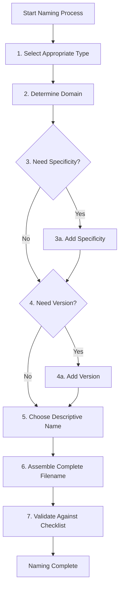

# 📝 Cursor Rules Naming Convention

## 📋 Overview

This rule defines the official naming convention for all Cursor rules. It implements a standardized structure that ensures coherence, discoverability, and scalability as the number of rules increases. This convention facilitates organization, maintenance, and efficient search across all rules.

> ⚠️ **Warning**: This is a critical meta-rule that applies to ALL rules. Strict adherence is required for consistency across the system.

## 🎯 Objectives

- Define a clear, unambiguous standard for naming all Cursor rules
- Improve discoverability through a systematic and intuitive naming scheme
- Support efficient grouping and categorization of related rules
- Enable easy versioning and evolution of the rules system
- Facilitate management of a large number of rules across diverse domains

## 🏗️ Rules System Architecture

The following diagram shows the type-based organization of the rules system:

```mermaid
flowchart TD
    Root[Rules System] --> Meta[Meta Rules]
    Root --> CodeRules[Code Rules]
    Root --> ToolProcess[Tools & Processes]
    Root --> QualityDomain[Quality & Domain]

    Meta --> MetaFormat[Format Standards]
    Meta --> MetaNaming[Naming Convention]
    Meta --> MetaRef[Naming Reference]

    CodeRules --> Lang[Language Rules]
    CodeRules --> Frame[Framework Rules]

    Lang --> JS[JavaScript Rules]
    Lang --> TS[TypeScript Rules]
    Lang --> Python[Python Rules]

    Frame --> React[React Rules]
    Frame --> Vue[Vue Rules]
    Frame --> Angular[Angular Rules]

    ToolProcess --> Tools[Tool Rules]
    ToolProcess --> Proc[Process Rules]
    ToolProcess --> Templ[Template Rules]

    Tools --> ESLint[ESLint Rules]
    Tools --> Git[Git Rules]
    Tools --> Docker[Docker Rules]

    Proc --> Agile[Agile Workflows]
    Proc --> Review[Code Review]

    Templ --> Arch[Architecture Templates]
    Templ --> Doc[Documentation Templates]
    Templ --> User[User Stories Templates]

    QualityDomain --> QA[Quality Rules]
    QualityDomain --> Domain[Domain Rules]
    QualityDomain --> Ext[Extension Rules]

    style Root fill:#f9f,stroke:#333,stroke-width:2px
    style Meta fill:#bbf,stroke:#333,stroke-width:2px
    style CodeRules fill:#dfd,stroke:#333,stroke-width:2px
    style Lang fill:#bfb,stroke:#333,stroke-width:2px
    style Frame fill:#fbf,stroke:#333,stroke-width:2px
    style ToolProcess fill:#ddf,stroke:#333,stroke-width:2px
    style Tools fill:#bff,stroke:#333,stroke-width:2px
    style Proc fill:#ffb,stroke:#333,stroke-width:2px
    style Templ fill:#fbb,stroke:#333,stroke-width:2px
    style QualityDomain fill:#fdd,stroke:#333,stroke-width:2px
    style QA fill:#9ff,stroke:#333,stroke-width:2px
    style Domain fill:#f99,stroke:#333,stroke-width:2px
    style Ext fill:#ddd,stroke:#333,stroke-width:2px
```



## 📄 Standard Naming Format

### Complete Filename Structure

All rule files must follow this exact structure:

```
type-domain[-specificity][@version][-name].mdc
```

The following diagram illustrates how each component fits in the filename structure:

```mermaid
flowchart LR
    B[type] --"Type"--> C[domain]
    C --"Domain"--> D[specificity]
    D --"Optional"--> E[@version]
    E --"Optional"--> F[name]
    F --"Name"--> G[.mdc]

    style B fill:#bbf,stroke:#333,stroke-width:2px
    style C fill:#bfb,stroke:#333,stroke-width:2px
    style D fill:#fbb,stroke:#333,stroke-width:2px,stroke-dasharray: 5 5
    style E fill:#fbf,stroke:#333,stroke-width:2px,stroke-dasharray: 5 5
    style F fill:#bff,stroke:#333,stroke-width:2px
    style G fill:#ddd,stroke:#333,stroke-width:2px
```

Where:

- `type`: Rule type identifier (mandatory)
- `domain`: Primary domain of application (mandatory)
- `specificity`: Additional precision on domain (optional)
- `@version`: Version specification when necessary (optional)
- `name`: Descriptive name using kebab-case (mandatory)
- `.mdc`: File extension for markdown cursor rules (mandatory)

## 🏷️ Rule Types

The type element must be one of these standard identifiers and serves as the primary organizational structure:

| Type | Description                           | Usage examples                               |
| ---- | ------------------------------------- | -------------------------------------------- |
| std  | Standard - Best practices/conventions | std-js-syntax, std-react-components          |
| cfg  | Configuration - Tool setup            | cfg-eslint-react, cfg-webpack-optimization   |
| tpl  | Template - Models to follow           | tpl-architecture-document, tpl-component     |
| wf   | Workflow - Process to follow          | wf-agile-sprint, wf-git-flow                 |
| prc  | Procedure - Detailed instructions     | prc-deployment-aws, prc-review-checklist     |
| pat  | Pattern - Design patterns             | pat-react-composition, pat-state-management  |
| lib  | Library - Library usage               | lib-lodash-usage, lib-axios-interceptors     |
| api  | API - API interaction                 | api-rest-versioning, api-graphql-schema      |
| sec  | Security - Security practices         | sec-input-validation, sec-authentication     |
| perf | Performance - Optimizations           | perf-react-memoization, perf-db-indexing     |
| doc  | Documentation - Doc standards         | doc-jsdoc-usage, doc-swagger-api             |
| ql   | Quality - Quality assurance           | ql-testing-coverage, ql-complexity           |
| db   | Database - DB practices               | db-sql-queries, db-mongodb-schema            |
| ui   | User interface - UI standards         | ui-components-accessibility, ui-responsive   |
| a11y | Accessibility - A11y standards        | a11y-aria-usage, a11y-contrast               |
| i18n | Internationalization - i18n standards | i18n-translation-keys, i18n-rtl-support      |
| meta | Meta - Rules about rules              | meta-rules-naming, meta-rules-structure      |
| proj | Project - Project-specific            | proj-ecommerce-architecture, proj-crm-api    |
| dev  | Development - Dev environment setup   | dev-local-setup, dev-editor-config           |
| dep  | Deployment - Deployment practices     | dep-azure-pipeline, dep-kubernetes           |
| test | Testing - Testing methodologies       | test-unit-structure, test-e2e-guidelines     |
| ci   | CI - Continuous integration           | ci-github-actions, ci-jenkins-pipeline       |
| cd   | CD - Continuous delivery/deployment   | cd-release-process, cd-blue-green            |
| mon  | Monitoring - System monitoring        | mon-metrics-collection, mon-alert-thresholds |
| log  | Logging - Logging standards           | log-structure, log-level-usage               |
| err  | Error - Error handling practices      | err-boundary-react, err-global-handler       |
| arch | Architecture - System architecture    | arch-microservices, arch-event-driven        |
| int  | Integration - System integration      | int-third-party, int-service-communication   |
| ver  | Version - Version control practices   | ver-semantic, ver-git-commit                 |
| pkg  | Package - Package management          | pkg-npm-strategy, pkg-dependency-policy      |
| data | Data - Data handling practices        | data-schema-design, data-migration           |
| auth | Authentication - Auth practices       | auth-oauth-flow, auth-jwt-usage              |
| cmp  | Compliance - Regulatory compliance    | cmp-gdpr, cmp-hipaa                          |
| seo  | SEO - Search engine optimization      | seo-metadata, seo-structure                  |
| loc  | Localization - Content localization   | loc-date-format, loc-currency                |
| inf  | Infrastructure - Infrastructure setup | inf-terraform, inf-ansible                   |
| scl  | Scalability - Scaling practices       | scl-horizontal, scl-load-balancing           |
| res  | Resilience - System resilience        | res-circuit-breaker, res-retries             |
| gov  | Governance - Project governance       | gov-review-process, gov-decision-making      |
| col  | Collaboration - Team collaboration    | col-pr-review, col-pair-programming          |

## 🌐 Domain and Specificity

The domain element indicates the primary technology, tool, or concept the rule applies to:

- Use lowercase and single-word identifiers where possible
- For programming languages: `js`, `ts`, `py`, `go`, etc.
- For frameworks: `react`, `vue`, `angular`, etc.
- For general applicability: `global`
- For specific tools: `git`, `eslint`, `webpack`, etc.

The optional specificity element provides additional precision:

- `react-hooks`, `ts-types`, `git-workflow`
- Use only when necessary to distinguish between similar rules

## 📊 Version Specification

When a rule is specific to a particular version of a technology, add the version after the domain with an @ symbol:

- Format: `@X` or `@X.Y` or `@name`
- Examples: `js@es2022`, `react@18.2`, `ts@5`
- Only include when practices differ significantly between versions

## 📝 Descriptive Name

The name element should be descriptive, concise, and use kebab-case:

- Use only lowercase letters
- Separate words with hyphens
- Be descriptive but concise (3-5 words max)
- Focus on the key concept or function
- Examples: `naming-convention`, `component-structure`, `error-handling`

## 🚀 Rule Naming Decision Process

When naming a new rule, follow this decision process:



## 📋 Examples

For comprehensive examples of rule sets for different project types and stages of development, please refer to the [Cursor Rules Naming Reference](meta-rules-naming-reference.md#complete-rule-set-examples). This includes:

- Minimal Rule Set for React Project
- Intermediate Rule Set for React Project
- Complete Rule Set for Angular Project
- Completed Rules Examples for Vue3

## 🧩 Step-by-Step Naming Example

Let's walk through an example of naming a rule for React component best practices:

1. **Select Type**: It defines best practices → "std" type
2. **Determine Domain**: The rule is for React → "react" domain
3. **Need Version?**: It applies to React 18.2 specifically → "@18.2"
4. **Choose Name**: It's about component architecture → "component-architecture"
5. **Assemble Filename**: [Cursor Rules Naming Reference](meta-rules-naming-reference.md#complete-rule-set-examples)

> **Note on Automation**: When creating a new rule with `meta-cursor-rules.mdc`, this entire naming process is automated. The system will find the appropriate name using the "Naming Convention" pattern and select the optimal type based on the reference information in `meta-rules-naming-reference.md`. No manual intervention is typically required, as the rule creation system automatically applies these naming standards.

## ⚠️ Common Mistakes and Corrections

| ❌ Incorrect                        | ✅ Correct                          | Issue                                |
| ----------------------------------- | ----------------------------------- | ------------------------------------ |
| `React-components.mdc`              | `std-react-component-patterns.mdc`  | Missing type, uppercase domain       |
| `react-hooks.mdc`                   | `std-react-hooks-patterns.mdc`      | Missing type                         |
| `std_react_hooks.mdc`               | `std-react-hooks-patterns.mdc`      | Using underscores instead of hyphens |
| `std-react-component standards.mdc` | `std-react-component-standards.mdc` | Space in filename                    |
| `react-std-hooks-patterns.mdc`      | `std-react-hooks-patterns.mdc`      | Incorrect element order              |
| `std-React@18.2-hooks-patterns.mdc` | `std-react@18.2-hooks-patterns.mdc` | Uppercase domain                     |
| `stdreact-hooks.mdc`                | `std-react-hooks-patterns.mdc`      | Missing hyphen between elements      |

## 🔎 Discoverability and Search

This naming convention enables powerful search capabilities:

- Find all rules of a specific type: `std-*`
- Find all rules for a technology: `*-react@*-*`
- Find all template rules: `tpl-*`
- Find all workflow rules for agile: `wf-agile-*`

### Search Query Examples

| To find                     | Use this search pattern |
| --------------------------- | ----------------------- |
| All JavaScript standards    | `std-js*`               |
| All React rules             | `*-react*`              |
| All configuration files     | `cfg-*`                 |
| All TypeScript 5.x rules    | `*-ts@5*`               |
| All template files          | `tpl-*`                 |
| All workflow files          | `wf-*`                  |
| All meta rules              | `meta-*`                |
| All ESLint configurations   | `cfg-eslint*`           |
| All accessibility standards | `a11y-*`                |

## ⚠️ Critical Points

<critical>
- ALWAYS choose the most appropriate type identifier
- ALWAYS use lowercase and hyphens for all elements
- NEVER use spaces or underscores in filenames
- ALWAYS use type as the primary organizational element
- ALWAYS use domain as the secondary organizational element
- ALWAYS place rules in the correct section of the documentation hierarchy
</critical>

## ✅ Best Practices

When creating or updating rules:

- Check existing rules to avoid duplication
- Use the template generator (`meta-rules-template-generator.mdc`)
- Keep the filename elements as concise as possible
- Use meaningful and descriptive names
- Include appropriate tags in the frontmatter
- Follow the frontmatter standards defined in `meta-rules-format-standard.mdc`

## 🔗 References

- [Cursor Rules Naming Reference](meta-rules-naming-reference.md)
- [Standard Format for Cursor Rules](meta-cursor-rules.md)
- [Cursor Documentation on Rules](https://docs.cursor.com/context/rules-for-ai)
