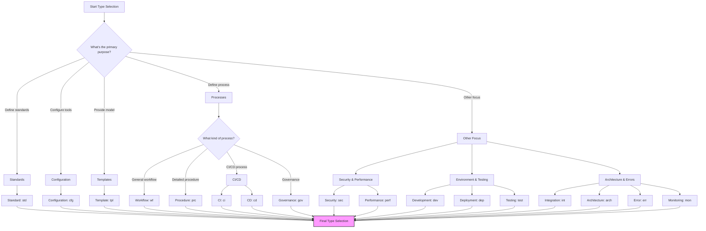
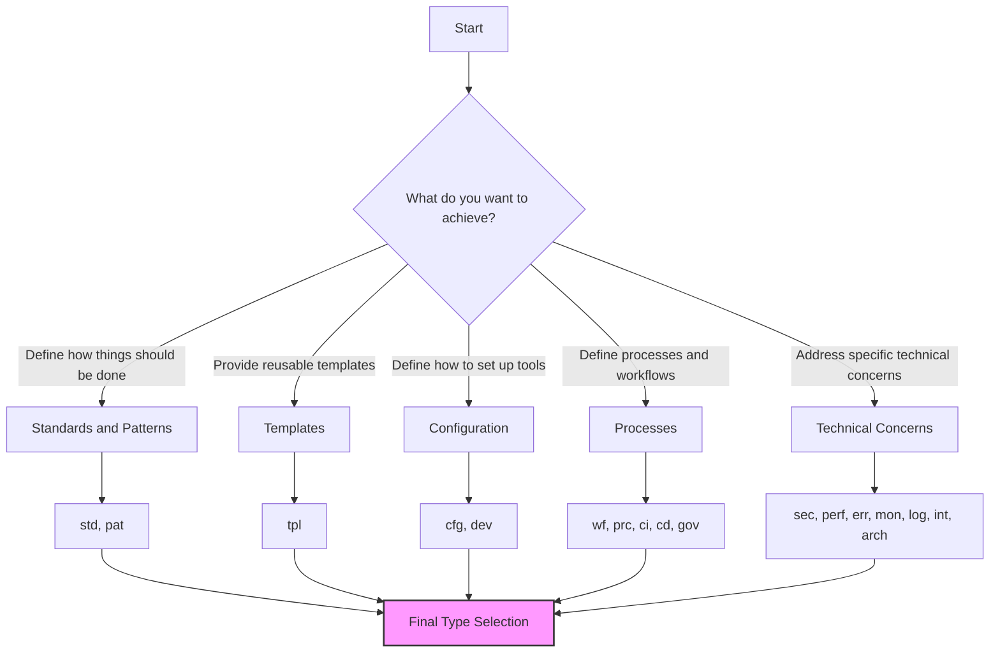
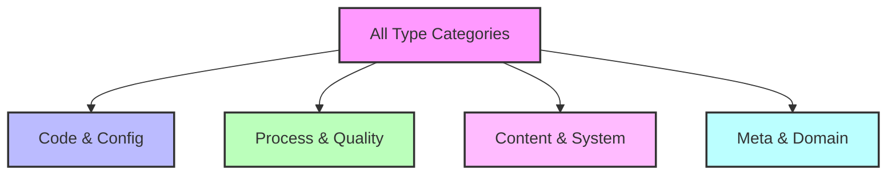
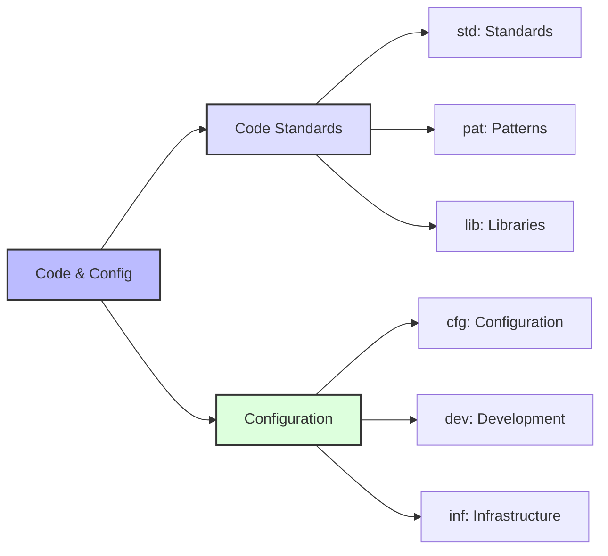
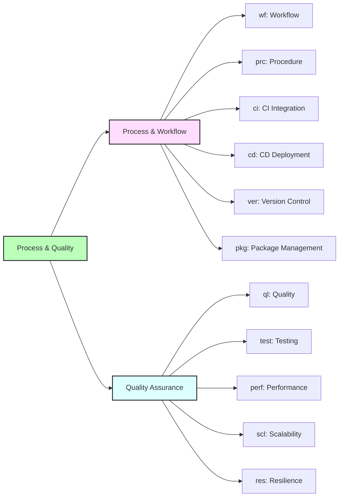
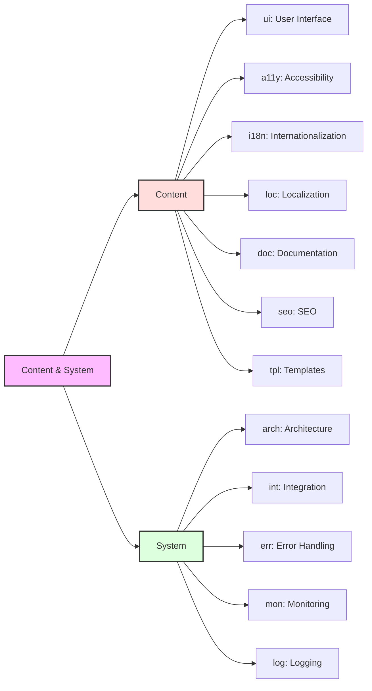
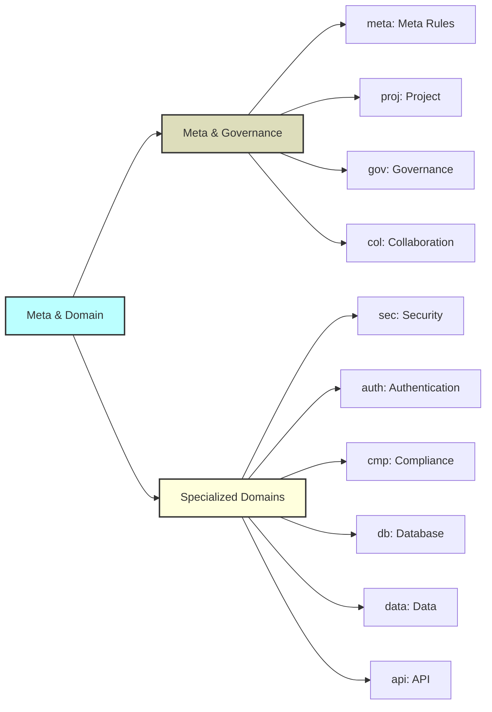
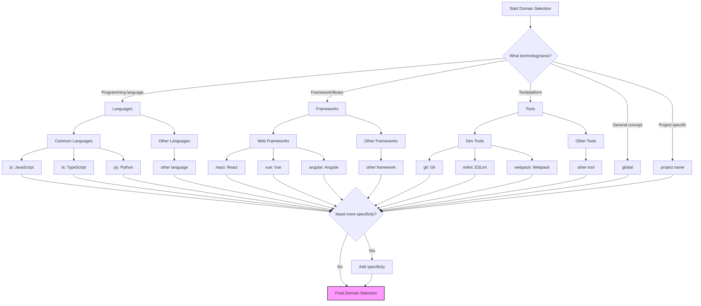
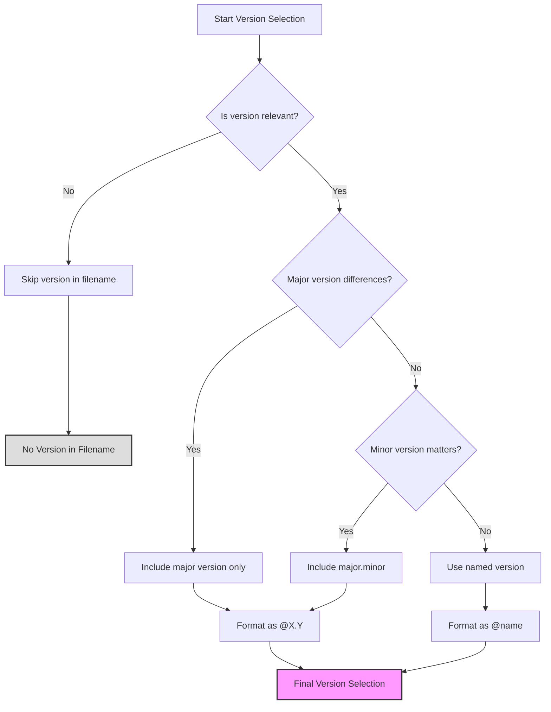

# 📚 Cursor Rules Naming Reference

## 📋 Overview

This rule provides detailed reference and concrete examples for applying the naming convention defined in `meta-rules-naming-convention.md`. It is designed as a practical guide to facilitate the creation of new rules and their proper categorization.

> ⚠️ **Warning**: This rule complements the main naming rule `meta-rules-naming-convention.md` which should be consulted first.

<requires>meta-rules-naming-convention</requires>

## 🎯 Objective

Provide concrete examples, templates, and detailed guidelines for the consistent application of the Cursor rules naming convention.

## 🏷️ Type Selection Guide

### Type Decision Tree



### Comprehensive Type Selection Process

Choosing the correct type is crucial for proper rule organization. Follow this systematic process:

#### 1. Intent-Based Type Selection

First, identify the primary intent of your rule:



#### 2. Comprehensive Type Classification System

The following classification provides a complete overview of all available types organized by functional categories:



##### Code & Config Types



##### Process & Quality Types



##### Content & System Types



##### Meta & Domain Types



This hierarchical classification helps identify the most appropriate type by first selecting the relevant functional category, then determining the specific type within that category.

#### 3. Common Scenarios and Recommended Types

| If your rule is about...    | Consider using these types (in order of priority) |
| --------------------------- | ------------------------------------------------- |
| Coding conventions          | `std`, `pat`                                      |
| Tool configuration          | `cfg`, `dev`                                      |
| Document structures         | `tpl`, `doc`                                      |
| Development workflows       | `wf`, `prc`, `gov`                                |
| Frontend components         | `ui`, `a11y`, `pat`                               |
| CI/CD pipelines             | `ci`, `cd`, `dep`                                 |
| Security and compliance     | `sec`, `auth`, `cmp`                              |
| System architecture         | `arch`, `pat`, `int`                              |
| Data handling               | `data`, `db`                                      |
| Testing strategies          | `test`, `ql`                                      |
| Optimization                | `perf`, `scl`                                     |
| API design                  | `api`, `int`                                      |
| Error management            | `err`, `res`                                      |
| Infrastructure setup        | `inf`, `dep`                                      |
| Package management          | `pkg`, `dep`                                      |
| Internationalization        | `i18n`, `loc`                                     |
| Project governance          | `gov`, `col`, `meta`                              |
| Rules about rules           | `meta`                                            |
| Project-specific guidelines | `proj`, plus relevant domain type                 |
| Monitoring and logging      | `mon`, `log`                                      |
| Version control             | `ver`                                             |
| Search engine optimization  | `seo`                                             |

#### 4. Domain-Type Affinity Matrix

Use this matrix to see which types are most commonly associated with specific domains:

| Domain       | Primary Types       | Secondary Types      |
| ------------ | ------------------- | -------------------- |
| JavaScript   | `std`, `pat`        | `cfg`, `perf`, `err` |
| TypeScript   | `std`, `pat`        | `cfg`, `err`         |
| React        | `std`, `pat`, `tpl` | `perf`, `err`        |
| Node.js      | `std`, `cfg`        | `dep`, `err`, `mon`  |
| Git          | `wf`, `cfg`         | `prc`, `ver`         |
| CI/CD        | `ci`, `cd`, `wf`    | `dep`, `prc`         |
| Database     | `db`, `data`        | `perf`, `sec`        |
| Security     | `sec`, `auth`       | `prc`, `std`         |
| Testing      | `test`              | `wf`, `prc`          |
| UI/UX        | `ui`, `a11y`        | `std`, `tpl`         |
| Global       | `std`, `wf`         | `prc`, `sec`, `perf` |
| Architecture | `arch`              | `pat`, `std`         |
| Meta-rules   | `meta`              | `std`                |

#### 5. Content Type Determination

Analyze what your rule actually contains:

| Content Type               | Recommended Type | Example                                          |
| -------------------------- | ---------------- | ------------------------------------------------ |
| Principles and conventions | `std`            | Coding standards, naming conventions             |
| Tool configuration         | `cfg`            | Linter configs, build tool settings              |
| Reusable templates         | `tpl`            | Document templates, code snippets                |
| Step-by-step processes     | `prc`            | Deployment procedures, migrations                |
| Higher-level workflows     | `wf`             | Development cycles, release processes            |
| Design patterns            | `pat`            | Software design patterns, architectural patterns |
| Security practices         | `sec`            | Security checks, input validation                |
| Performance optimization   | `perf`           | Optimization techniques, benchmarking            |
| Development setup          | `dev`            | Local environment, IDE configuration             |
| Testing protocols          | `test`           | Test structure, coverage requirements            |
| Error handling             | `err`            | Error management strategies                      |
| Integration guidance       | `int`            | Third-party integration, service connections     |

#### 6. Decision Scoring Method

When multiple types seem appropriate, use this scoring system:

1. For each candidate type, assign points (0-3) for each criterion:

   - **Fit to primary purpose** (0-3 points)
   - **Domain affinity** (0-3 points)
   - **Content alignment** (0-3 points)
   - **Search discoverability** (0-3 points)
   - **Consistency with similar rules** (0-3 points)

2. Choose the type with the highest total score

Example scoring for a React hooks utility rule:
| Type | Purpose | Domain | Content | Search | Consistency | Total |
|------|---------|--------|---------|--------|-------------|-------|
| `std`| 2 | 2 | 2 | 3 | 3 | 12 |
| `pat`| 3 | 3 | 3 | 2 | 2 | 13 |
| `lib`| 2 | 1 | 3 | 1 | 1 | 8 |

In this example, `pat` (pattern) would be the recommended type.

#### 7. Common Edge Cases and Type Selection

| Edge Case                      | Competing Types       | Recommended Approach                                                                             |
| ------------------------------ | --------------------- | ------------------------------------------------------------------------------------------------ |
| Code style guide               | `std` vs `cfg`        | Use `std` for general principles, `cfg` for tool-specific settings                               |
| Design patterns implementation | `pat` vs `std`        | Use `pat` for recognized patterns, `std` for organizational conventions                          |
| Documentation templates        | `tpl` vs `doc`        | Use `tpl` for the template itself, `doc` for documentation standards                             |
| DevOps practices               | `ci` vs `cd` vs `dep` | Use `ci` for integration, `cd` for delivery/deployment automation, `dep` for deployment strategy |
| API definitions                | `api` vs `doc`        | Use `api` for API structure/behavior, `doc` for API documentation standards                      |
| Framework guidelines           | `std` vs `pat`        | Use `std` for best practices, `pat` for reusable patterns                                        |
| Compliance rules               | `cmp` vs `sec`        | Use `cmp` for regulatory compliance, `sec` for security-specific practices                       |

### Type Determination Questions

To choose the appropriate type, ask yourself the following questions:

1. **What is the main purpose of the rule?**

   - Define general best practices → `std`
   - Configure a tool or environment → `cfg`
   - Provide a model to follow → `tpl`
   - Define a process → `wf` or `prc`
   - Document a design pattern → `pat`
   - Secure systems/code → `sec`
   - Optimize performance → `perf`
   - Set up development environment → `dev`
   - Manage deployments → `dep`
   - Establish testing practices → `test`
   - Define system architecture → `arch`
   - Handle errors → `err`
   - Monitor systems → `mon`

2. **How will the rule be used?**
   - As a reference for code → `std`, `pat`, `lib`, `err`
   - As a configuration to apply → `cfg`
   - As a template to copy/adapt → `tpl`
   - As a process to follow → `wf`, `prc`, `ci`, `cd`, `gov`
   - As an integration guide → `int`
   - As a deployment strategy → `dep`
   - As a monitoring setup → `mon`

### Differences Between Similar Types

- `wf` vs `prc`: `wf` defines a global workflow, `prc` details precise steps
- `std` vs `pat`: `std` defines general rules, `pat` defines specific patterns
- `tpl` vs `std`: `tpl` provides a concrete model, `std` defines principles
- `ci` vs `cd`: `ci` focuses on integration testing, `cd` on deployment
- `dev` vs `dep`: `dev` addresses local development, `dep` addresses production deployment
- `arch` vs `pat`: `arch` covers system-level architecture, `pat` covers code-level patterns
- `mon` vs `log`: `mon` focuses on system monitoring, `log` on logging practices

### Type Selection Examples

| Rule Purpose                       | Recommended Type | Example Filename                 |
| ---------------------------------- | ---------------- | -------------------------------- |
| JavaScript coding standards        | `std`            | `std-js-coding-standards.mdc`    |
| ESLint configuration template      | `cfg`            | `cfg-eslint@8-base-config.mdc`   |
| React component structure template | `tpl`            | `tpl-react-component.mdc`        |
| Git workflow process               | `wf`             | `wf-git-workflow.mdc`            |
| Security validation procedure      | `prc`            | `prc-security-validation.mdc`    |
| React hooks pattern                | `pat`            | `pat-react-hooks-custom.mdc`     |
| API documentation standard         | `doc`            | `doc-api-documentation.mdc`      |
| Database query optimization        | `perf`           | `perf-db-query-optimization.mdc` |
| Local development setup            | `dev`            | `dev-vscode-setup.mdc`           |
| Kubernetes deployment              | `dep`            | `dep-kubernetes-cluster.mdc`     |
| Unit testing methodology           | `test`           | `test-unit-structure.mdc`        |
| GitHub Actions CI pipeline         | `ci`             | `ci-github-actions-node.mdc`     |
| Blue/Green deployment              | `cd`             | `cd-blue-green-strategy.mdc`     |
| Prometheus monitoring              | `mon`            | `mon-prometheus-setup.mdc`       |
| Global error handling              | `err`            | `err-global-handler.mdc`         |
| Microservice architecture          | `arch`           | `arch-microservices.mdc`         |
| Third-party service integration    | `int`            | `int-third-party-auth.mdc`       |
| Semantic versioning                | `ver`            | `ver-semantic-releases.mdc`      |
| Log structure and format           | `log`            | `log-structured-format.mdc`      |
| Data migration guidelines          | `data`           | `data-migration-strategy.mdc`    |
| Code review process                | `gov`            | `gov-review-process.mdc`         |

## 🌐 Domain and Specificity Selection Guide

### Domain Selection Framework



### Standard Domains

- `global`: Rules applicable to the entire project
- `js`, `ts`, `py`, etc.: Programming languages
- `react`, `vue`, `angular`, etc.: Frameworks
- `node`, `deno`, etc.: Runtime environments
- `aws`, `azure`, `gcp`, etc.: Cloud platforms
- `ci`, `cd`, `devops`: Integration and deployment processes
- `db`, `sql`, `nosql`: Databases

### Recommended Specificities

- For languages: `syntax`, `modules`, `async`, `types`, etc.
- For frameworks: `components`, `state`, `routing`, `hooks`, etc.
- For tools: `config`, `plugins`, `extensions`, etc.
- For workflows: `planning`, `review`, `testing`, `deployment`, etc.

### Specificity Examples

| Domain   | Possible Specificities              | Example                           |
| -------- | ----------------------------------- | --------------------------------- |
| `js`     | `syntax`, `modules`, `async`, `es6` | `js-modules`, `js-async`          |
| `ts`     | `types`, `interfaces`, `generics`   | `ts-types`, `ts-interfaces`       |
| `react`  | `hooks`, `components`, `state`      | `react-hooks`, `react-components` |
| `git`    | `workflow`, `commits`, `branching`  | `git-workflow`, `git-commits`     |
| `eslint` | `config`, `plugins`, `rules`        | `eslint-plugins`, `eslint-config` |
| `agile`  | `sprint`, `planning`, `stories`     | `agile-sprint`, `agile-stories`   |
| `global` | `error`, `logging`, `naming`        | `global-error`, `global-naming`   |

## 📊 Version Management Guide

### Version Decision Process



### When to Include a Version

- When the rule is specific to a particular version of a technology
- When practices differ significantly between versions
- When compatibility is limited to certain versions

### Recommended Version Formats

- Major version only: `@3`, `@4`
- Major.minor version: `@3.1`, `@18.2`
- With specificity: `@es2022`, `@typescript5`

### Version Usage Examples

- `js@es2022`: JavaScript with ES2022 features
- `react@18.2`: Specific to React 18.2
- `node@18`: For Node.js version 18.x
- `eslint@8`: Configuration for ESLint version 8.x

### When to Omit Version

Version should be omitted when:

- The rule applies to all versions of the technology
- The differences between versions are not significant
- The rule describes general principles not tied to a specific version

## 📝 Naming Guide

### Name Conventions

- Use only lowercase letters
- Separate words with hyphens (`-`)
- Be concise but descriptive
- Avoid non-standard abbreviations
- Limit to 3-5 words maximum

### Recommended Name Structure

- Start with the main subject
- Followed by the specific aspect
- End with the purpose or action if necessary

### Examples of Good Names

- `hooks-patterns`: Hook usage patterns
- `component-architecture`: Component architecture
- `error-handling`: Error handling
- `state-management`: State management
- `commit-messages`: Commit message format

### Naming Do's and Don'ts

| ✅ Do                     | ❌ Don't                      | Reason                      |
| ------------------------- | ----------------------------- | --------------------------- |
| Use descriptive names     | Use abbreviations             | Improves readability        |
| Keep names concise        | Use unnecessarily long names  | Improves filename usability |
| Use kebab-case (hyphens)  | Use camelCase or snake_case   | Convention consistency      |
| Focus on the key concept  | Include auxiliary information | Keeps names focused         |
| Include purpose or action | Be vague or too general       | Clarifies the rule's intent |
| Use standard terms        | Invent new terminology        | Improves discoverability    |

## 📋 Ready-to-Use Templates

### For a Standard Rule

```
std-[domain]-[specificity]-[name].mdc
```

### For a Configuration Rule

```
cfg-[technology]@[version]-[aspect]-config.mdc
```

### For a Template

```
tpl-[domain]-[document-type].mdc
```

### For a Workflow

```
wf-[process]-[aspect].mdc
```

### For a Development Environment Setup

```
dev-[environment]-[aspect]-setup.mdc
```

### For a Deployment Strategy

```
dep-[platform]-[strategy].mdc
```

### For a Testing Methodology

```
test-[type]-[aspect].mdc
```

## 🔎 Useful Search Queries

### Find All Rules of a Type

- `std-*`: All standards
- `cfg-*`: All configurations
- `tpl-*`: All templates
- `wf-*`: All workflows
- `dev-*`: All development setups
- `test-*`: All testing methodologies
- `dep-*`: All deployment strategies

### Find All Rules for a Technology

- `*-react@*-*`: All rules for React
- `*-ts@*-*`: All rules for TypeScript
- `*-git@*-*`: All rules for Git

### Advanced Search Examples

| To find                              | Search query                       |
| ------------------------------------ | ---------------------------------- |
| TypeScript type definitions          | `std-ts*-types-*`                  |
| React component architecture         | `*-react*-component-architecture*` |
| All workflow rules                   | `wf-*`                             |
| ESLint configurations for TypeScript | `cfg-eslint*-ts*`                  |
| Security-related rules               | `sec-*`                            |
| Rules related to testing             | `test-*`                           |
| Template rules for documentation     | `tpl-*-documentation*`             |
| All rules for React hooks            | `*-react*-hooks*`                  |
| All monitoring setups                | `mon-*`                            |
| All architecture rules               | `arch-*`                           |
| All error handling practices         | `err-*`                            |

## ⚠️ Critical Points

<critical>
- ALWAYS consult this reference when creating a new rule
- ALWAYS check if a similar rule already exists before creating a new one
- ALWAYS maintain consistency with the main convention
- NEVER use a format not documented in the main convention
- ALWAYS use type as the primary organizational element
- ALWAYS use domain as the secondary organizational element
</critical>

## ✅ Validation Checklist

Use this checklist to verify compliance of a rule name:

- [ ] The selected type is appropriate for the rule content
- [ ] The domain is clearly identified
- [ ] The version (if applicable) is correctly formatted with @
- [ ] The name is concise, descriptive, and uses hyphens
- [ ] The name contains only lowercase letters and hyphens
- [ ] The file has the .mdc extension
- [ ] The frontmatter includes title, version, description, and compliant globs
- [ ] The convention is consistent with similar existing rules

## 🧩 Practical Examples

### Example 1: Creating a JavaScript ES6 Standard

1. **Type**: Standard → std
2. **Domain**: JavaScript → js
3. **Version**: ES6 specific → @es6
4. **Name**: Arrow functions usage → arrow-functions
5. **Final filename**: `std-js@es6-arrow-functions.mdc`

### Example 2: Creating a React Component Template

1. **Type**: Template → tpl
2. **Domain**: React → react
3. **Specificity**: Components → components
4. **Name**: Functional component → functional-component
5. **Final filename**: `tpl-react-components-functional-component.mdc`

### Example 3: Creating a Git Workflow Rule

1. **Type**: Workflow → wf
2. **Domain**: Git → git
3. **Name**: Branch naming → branch-naming
4. **Final filename**: `wf-git-branch-naming.mdc`

### Example 4: Creating a Development Environment Setup

1. **Type**: Development → dev
2. **Domain**: VSCode → vscode
3. **Name**: Extension setup → extension-setup
4. **Final filename**: `dev-vscode-extension-setup.mdc`

### Example 5: Creating a Monitoring Configuration

1. **Type**: Monitoring → mon
2. **Domain**: Prometheus → prometheus
3. **Name**: Alert rules → alert-rules
4. **Final filename**: `mon-prometheus-alert-rules.mdc`

## 📦 Complete Rule Set Examples

> The **Origin** column in all examples indicates whether a rule is a **Base Rule** (foundational rule from the initial repository setup) or a **Project Rule** (generated during project development based on specific project needs).

### Minimal Rule Set for React Project

> This minimal set represents the essential rules needed when starting a React project. It provides the foundation for building a structured development environment.

| Filename                            | Description                         | Origin       |
| ----------------------------------- | ----------------------------------- | ------------ |
| `meta-cursor-rules.mdc`             | Standard format for cursor rules    | Base Rule    |
| `std-global-naming-conventions.mdc` | Global naming conventions           | Base Rule    |
| `std-react-components.mdc`          | React component structure standards | Base Rule    |
| `cfg-eslint-react.mdc`              | ESLint configuration for React      | Base Rule    |
| `tpl-react-component.mdc`           | Template for React components       | Base Rule    |
| `std-react-hooks.mdc`               | React hooks usage standards         | Project Rule |

### Intermediate Rule Set for React Project

> As a React project matures, more specialized rules are needed to maintain quality and consistency across the growing codebase.

| Filename                              | Description                               | Origin       |
| ------------------------------------- | ----------------------------------------- | ------------ |
| `meta-cursor-rules.mdc`               | Standard format for cursor rules          | Base Rule    |
| `std-global-naming-conventions.mdc`   | Global naming conventions                 | Base Rule    |
| `std-react-components.mdc`            | React component structure standards       | Base Rule    |
| `cfg-eslint-react.mdc`                | ESLint configuration for React            | Base Rule    |
| `tpl-react-component.mdc`             | Template for React components             | Base Rule    |
| `std-react-hooks.mdc`                 | React hooks usage standards               | Project Rule |
| `std-react@18.2-state-management.mdc` | State management in React 18.2            | Project Rule |
| `pat-react-composition.mdc`           | Component composition patterns            | Project Rule |
| `test-react-unit.mdc`                 | React unit testing standards              | Project Rule |
| `wf-git-workflow.mdc`                 | Git workflow for team collaboration       | Base Rule    |
| `doc-react-component-api.mdc`         | Component API documentation standard      | Project Rule |
| `perf-react-optimization.mdc`         | React performance optimization techniques | Project Rule |

### Complete Rule Set for Angular Project

> A mature Angular project requires comprehensive rules covering all aspects from architecture to testing, accessibility, and performance.

| Filename                             | Description                             | Origin       |
| ------------------------------------ | --------------------------------------- | ------------ |
| `meta-cursor-rules.mdc`              | Standard format for cursor rules        | Base Rule    |
| `std-global-naming-conventions.mdc`  | Global naming conventions               | Base Rule    |
| `std-angular@15-architecture.mdc`    | Angular 15 architecture standards       | Base Rule    |
| `std-angular-components.mdc`         | Angular component standards             | Base Rule    |
| `cfg-eslint-angular.mdc`             | ESLint configuration for Angular        | Base Rule    |
| `cfg-angular@15-tsconfig.mdc`        | TypeScript configuration for Angular 15 | Base Rule    |
| `tpl-angular-component.mdc`          | Template for Angular components         | Base Rule    |
| `tpl-angular-service.mdc`            | Template for Angular services           | Base Rule    |
| `pat-angular-di.mdc`                 | Dependency injection patterns           | Project Rule |
| `pat-angular-reactive.mdc`           | Reactive programming patterns           | Project Rule |
| `std-angular@15-forms.mdc`           | Angular 15 forms standards              | Project Rule |
| `std-angular-state-management.mdc`   | State management standards              | Project Rule |
| `test-angular-unit.mdc`              | Angular unit testing standards          | Project Rule |
| `test-angular-e2e.mdc`               | Angular E2E testing standards           | Project Rule |
| `a11y-angular-standards.mdc`         | Angular accessibility standards         | Project Rule |
| `perf-angular-optimization.mdc`      | Angular performance optimization        | Project Rule |
| `i18n-angular-setup.mdc`             | Internationalization setup              | Project Rule |
| `wf-angular-feature-development.mdc` | Feature development workflow            | Project Rule |
| `doc-angular-api.mdc`                | API documentation standards             | Project Rule |
| `doc-angular-component-library.mdc`  | Component library documentation         | Project Rule |

### Completed Rules Examples for Vue3

> This complete set shows a real-world Vue 3 project with a mature rules ecosystem. It includes both foundational base rules and project-specific rules that evolved during development.

| Type-Based Name                             | Description                             | Origin       |
| ------------------------------------------- | --------------------------------------- | ------------ |
| `meta-cursor-rules.mdc`                     | Standard format for cursor rules        | Base Rule    |
| `std-global-naming-conventions.mdc`         | Global naming conventions               | Base Rule    |
| `wf-tdd-workflow.mdc`                       | Test-Driven Development workflow        | Base Rule    |
| `std-docker-standards.mdc`                  | Docker development standards            | Base Rule    |
| `cfg-global-alias.mdc`                      | Global alias configuration              | Base Rule    |
| `cfg-git-config.mdc`                        | Git configuration standards             | Base Rule    |
| `std-md-docs.mdc`                           | Markdown documentation standards        | Base Rule    |
| `doc-project-readme.mdc`                    | Project README standards                | Base Rule    |
| `doc-global-changelog.mdc`                  | Changelog documentation standards       | Base Rule    |
| `tpl-project-foundation.mdc`                | Project foundation template             | Base Rule    |
| `wf-agile-workflow.mdc`                     | Agile workflow standards                | Base Rule    |
| `std-global-code-generation.mdc`            | Code generation standards               | Base Rule    |
| `std-global-overengineering-prevention.mdc` | Overengineering prevention standards    | Base Rule    |
| `pat-refactoring-pattern-propagation.mdc`   | Refactoring pattern propagation pattern | Base Rule    |
| `wf-composer-workflow.mdc`                  | Composer workflow standards             | Base Rule    |
| `tpl-prd-document.mdc`                      | Product Requirements Document template  | Base Rule    |
| `tpl-arch-document.mdc`                     | Architecture document template          | Base Rule    |
| `tpl-agile-story.mdc`                       | Agile user story template               | Base Rule    |
| `wf-agile-story-splitting.mdc`              | Agile story splitting workflow          | Base Rule    |
| `std-vue@3-tailwind.mdc`                    | Vue 3 with Tailwind standards           | Project Rule |
| `std-vue@3-components.mdc`                  | Vue 3 component standards               | Project Rule |
| `pat-vue@3-composables.mdc`                 | Vue 3 composables patterns              | Project Rule |
| `wf-git-push-command.mdc`                   | Git push command workflow               | Project Rule |
| `std-global-overengineering.mdc`            | Global overengineering standards        | Project Rule |
| `wf-global-riper5.mdc`                      | Riper5 operational workflow             | Project Rule |
| `doc-project-overview.mdc`                  | Project overview documentation          | Project Rule |
| `test-vue@3-vitest-setup.mdc`               | Vitest configuration for Vue 3 projects | Project Rule |
| `test-vue@3-vitest-mocking.mdc`             | Component mocking with Vitest for Vue 3 | Project Rule |
| `test-vue@3-e2e-cypress.mdc`                | E2E testing with Cypress for Vue 3      | Project Rule |
| `cfg-vite-vue3.mdc`                         | Vite configuration for Vue 3 projects   | Project Rule |
| `perf-vue@3-optimization.mdc`               | Performance optimization for Vue 3      | Project Rule |
| `i18n-vue@3-setup.mdc`                      | Internationalization setup for Vue 3    | Project Rule |
| `i18n-vue@3-route-localization.mdc`         | Route localization for Vue 3            | Project Rule |
| `std-vue@3-composition-api.mdc`             | Composition API best practices          | Project Rule |
| `pat-vue@3-state-management.mdc`            | State management patterns for Vue 3     | Project Rule |
| `std-vue@3-typescript.mdc`                  | TypeScript integration for Vue 3        | Project Rule |
| `a11y-vue@3-standards.mdc`                  | Accessibility standards for Vue 3       | Project Rule |
| `tpl-vue@3-component.mdc`                   | Template for Vue 3 components           | Project Rule |

## 🔗 References

- [Cursor Rules Naming Convention](meta-rules-naming-convention.md)
- [Standard Format for Cursor Rules](meta-cursor-rules.md)
- [Cursor Documentation on Rules](https://docs.cursor.com/context/rules-for-ai)
