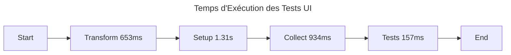

# Changelog

---

title: CV Generator Changelog
date: 2024-02-20
status: maintained
version: 0.1.2

---

> ℹ️ **Note:** Ce fichier suit les recommandations de [Keep a Changelog](https://keepachangelog.com/fr/1.1.0/) et respecte [Semantic Versioning](https://semver.org/spec/v2.0.0.html).

## [Unreleased]

### Added 🎉

#### Core Module Setup 🏗️

- Configuration TypeScript avec support strict mode
- Configuration Vitest pour les tests
- Configuration Biome pour le linting
- Structure de dossiers Clean Architecture

#### Domain Layer Implementation ✨

- Implémentation de l'entité `Basics` pour le CV
  - Support complet du schéma JSON Resume
  - Validation stricte via Zod
  - Pattern Result pour la gestion des erreurs
  - Méthodes de création et mise à jour immutables
  - Sérialisation JSON avec gestion des champs optionnels

#### Application Layer Implementation 🔄

- Implémentation du use case `ManageResume`
  - Interface `ResumeRepository` pour l'abstraction de la persistence
  - Méthodes CRUD pour la gestion des CV
  - Support de l'export en différents formats (JSON, PDF, HTML)
  - Gestion des erreurs avec types TypeScript

#### UI Layer Implementation 🎨

- Configuration du store Pinia pour la gestion d'état
  - Store `resume` avec gestion asynchrone
  - Actions pour charger, sauvegarder, exporter et importer
  - Gestion des états de chargement et des erreurs
  - Tests unitaires complets avec mocks
  - Factory pattern pour l'injection des dépendances
  - Intégration avec le use case ManageResume
  - Support complet TypeScript avec types stricts

#### Testing Infrastructure 🧪

- Mise en place des tests pour tous les packages
  - `shared`: 1 test passé
  - `core`: 15 tests passés
  - `ui`: 29 tests passés dans 6 fichiers
    - Tests des composables (`useModelUpdate`, `useFieldValidation`)
    - Tests des composants (`BasicsForm`, `ResumeForm`)
    - Tests du store Pinia
    - Tests de l'application

#### UI Components Implementation ✨

- Implémentation du composant `BasicsForm`

  - Support de la validation en temps réel
  - Gestion des erreurs avec feedback visuel
  - Tests unitaires complets (6 tests)
  - Intégration avec les composables
  - Utilisation des CSS variables pour le theming
  - Support complet de l'accessibilité (ARIA)
  - Gestion des états de chargement

- Création des composants de formulaire partagés
  - `Form.vue`: Composant de base pour les formulaires
  - `FormField.vue`: Champ de formulaire réutilisable
  - Support des différents types d'input (text, email)
  - Gestion des états required et disabled
  - Feedback visuel des erreurs

#### Composables Development 🔄

- Création du composable `useFieldValidation`

  - Validation des champs requis
  - Validation du format email
  - Tests unitaires (5 tests)
  - Support des messages d'erreur personnalisés
  - Validation en temps réel et à la soumission

- Création du composable `useModelUpdate`
  - Gestion du v-model avec TypeScript
  - Tests unitaires (3 tests)
  - Support des mises à jour partielles
  - Préservation de l'immutabilité

#### Styling Enhancement 🎨

- Intégration de Tailwind CSS v4
  - Configuration personnalisée avec variables CSS
  - Support des plugins forms, typography et aspect-ratio
  - Thème adaptatif avec variables CSS
  - Styles de formulaire optimisés

### Changed 🔄

- Migration de `ResumeForm` vers `BasicsForm` pour une meilleure séparation des responsabilités
- Amélioration de la gestion d'état avec Pinia
  - Initialisation immédiate des données
  - Prévention des chargements multiples
  - Gestion améliorée des erreurs
- Optimisation de la configuration TypeScript
  - Ajout des alias de chemins pour une meilleure DX
  - Support strict des types pour les composants Vue
  - Configuration optimisée pour le développement
- Suppression des barrel files (index.ts) pour améliorer la maintenabilité
- Amélioration de la gestion des erreurs
  - Types d'erreur plus précis
  - Messages d'erreur plus descriptifs
  - Gestion des erreurs non-Error
- Amélioration de la structure des tests
  - Organisation par feature
  - Tests isolés par composant
  - Meilleure couverture du code

### Technical Details 🔧

#### Domain Entities

```typescript
// Basics Entity - Core domain logic for CV basic information
class Basics {
  private constructor(
    private readonly _name: string,
    private readonly _email: string // ... autres champs
  ) {}

  // Factory method avec validation
  static create(data: Partial<BasicsInterface>): Result<Basics>;

  // Méthode de mise à jour immutable
  update(data: Partial<BasicsInterface>): Result<Basics>;

  // Sérialisation JSON avec gestion des champs optionnels
  toJSON(): BasicsInterface;
}
```

#### Use Cases

```typescript
// ManageResume - Application layer use case
export class ManageResume {
  constructor(private readonly repository: ResumeRepository) {}

  async loadResume(): Promise<Resume>;
  async createResume(data: ResumeInterface): Promise<void>;
  async exportResume(format: "json" | "pdf" | "html"): Promise<Blob>;
  async importResume(file: Blob): Promise<Resume>;
}
```

#### Store Implementation

```typescript
// Resume Store - UI layer state management
export const useResumeStore = defineStore("resume", () => {
  const resume = ref<Resume | null>(null);
  const loading = ref(false);
  const error = ref<Error | null>(null);

  async function loadResume(): Promise<void>;
  async function saveResume(data: Resume): Promise<void>;
  async function exportResume(format: string): Promise<Blob>;
  async function importResume(file: Blob): Promise<void>;
});
```

#### Test Coverage

| Package        | Files | Tests | Status |
| :------------- | :---: | :---: | -----: |
| shared         |   1   |   1   |     ✅ |
| core           |   2   |  15   |     ✅ |
| ui             |   6   |  29   |     ✅ |
| infrastructure |   0   |   0   |     ⚠️ |

#### Performance des Tests



### Dependencies 📦

| Package                   | Version | Description              |
| :------------------------ | :-----: | :----------------------- |
| zod                       | ^3.22.4 | Validation de schéma     |
| vitest                    | ^1.6.1  | Framework de test        |
| @vitest/coverage-istanbul | ^1.4.0  | Couverture de code       |
| typescript                | ~5.7.3  | Langage de programmation |
| pinia                     | ^2.1.7  | Gestion d'état           |
| @pinia/testing            | ^1.0.0  | Tests de store           |
| vue                       | ^3.4.15 | Framework UI             |

> 💡 **Prochaines étapes:** Implémentation des tests pour le package infrastructure

### Story Progress 📋

| Story ID | Status | Description                                           |
| :------- | :----: | :---------------------------------------------------- |
| story-1  |   ✅   | Setup initial project structure and core architecture |
| story-2  |   🚧   | Implementation of Basics entity with validation       |
