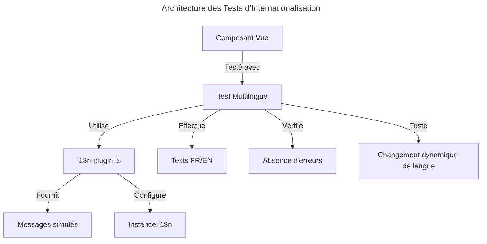
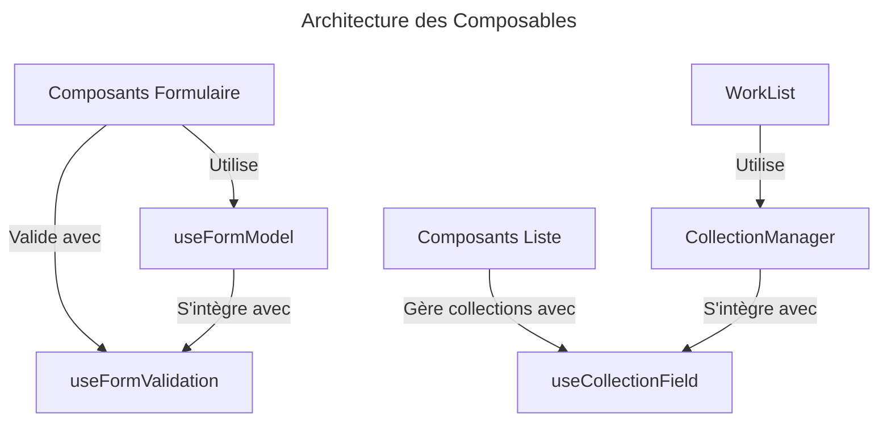
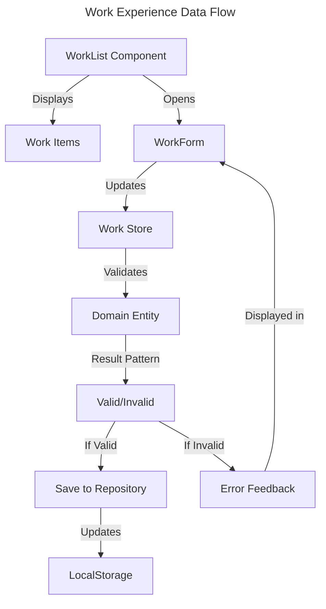
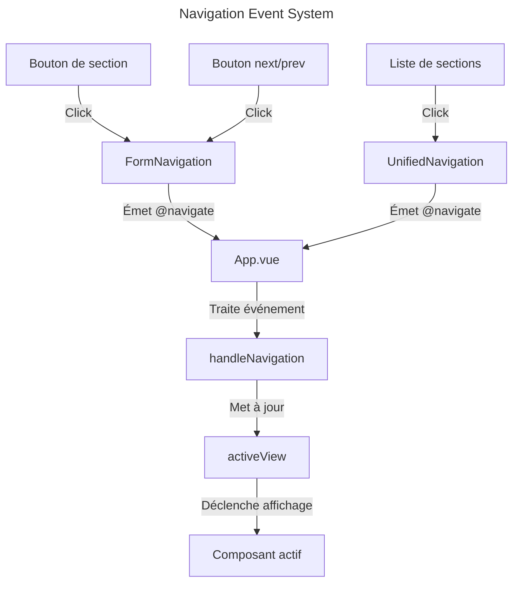
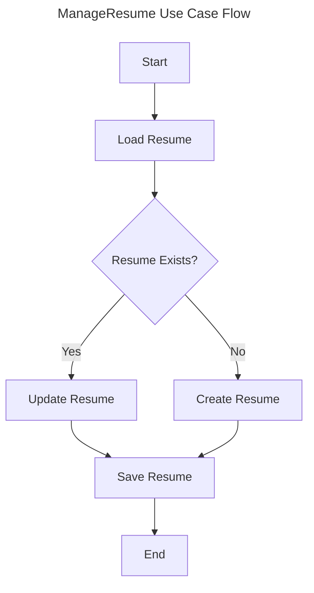
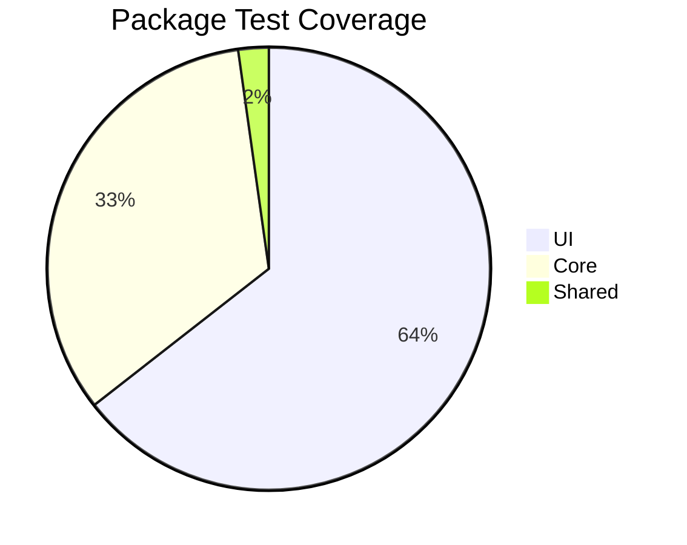
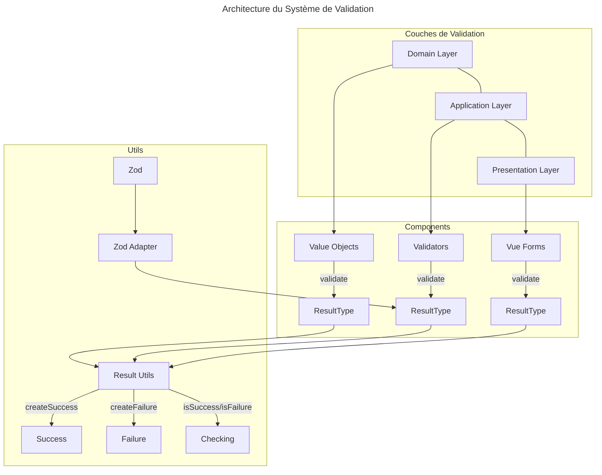

# Changelog

> ℹ️ **Note:** Ce fichier suit les recommandations de [Keep a Changelog](https://keepachangelog.com/fr/1.1.0/) et respecte [Semantic Versioning](https://semver.org/spec/v2.0.0.html).

## [Unreleased]

### Added 🎉

- Internationalisation complète des composants UI:
  - Remplacement de tous les textes codés en dur par des clés de traduction dans 22 composants
  - Mise en place du système de traduction robuste avec fonction `safeTranslate` pour gérer les cas d'erreur
  - Support complet pour le français et l'anglais dans tous les composants
  - Infrastructure complète pour les tests multilingues
- Adaptation des composables pour l'internationalisation:
  - `useValidationCatalogue`: Support complet des clés i18n avec interpolation de paramètres
  - `useValidationResult`: Traduction transparente des messages d'erreur de validation
  - Support réactif pour les changements de langue en temps réel
  - Maintien de la compatibilité avec l'API existante
- Infrastructure de test pour l'internationalisation:
  - Création d'un plugin de test pour Vue I18n (`i18n-plugin.ts`)
  - Utilitaire pour tester les composants dans plusieurs langues (`language-testing.ts`)
  - Utilitaire pour détecter les erreurs de console liées à l'i18n (`i18n-console-errors.ts`)
  - Utilitaire pour tester le changement dynamique de langue (`i18n-e2e-test.ts`)
  - Tests spécifiques pour les composants principaux: PersonalInfo, WorkList, ProjectList, etc.
- Documentation technique complète pour l'internationalisation:

  - Guide de référence pour l'ajout de nouvelles clés de traduction
  - Résumé technique détaillé pour la revue de code
  - Documentation des meilleures pratiques et standards

- Refactorisation complète des composants de liste :
  - `PublicationList` : Implémentation de `CollectionManager` et `useCollectionField` avec réordonnancement
  - `CertificateList` : Implémentation de `CollectionManager` et `useCollectionField` avec réordonnancement
  - `AwardList` : Implémentation de `CollectionManager` et `useCollectionField` avec réordonnancement
  - `LanguageList` : Implémentation de `CollectionManager` et `useCollectionField` avec réordonnancement
  - `InterestList` : Implémentation de `CollectionManager` et `useCollectionField` avec réordonnancement
  - `ProjectList` : Implémentation de `CollectionManager` et `useCollectionField` avec réordonnancement
- Intégration complète de la section "Work Experience" (Expérience Professionnelle)
  - Création du formulaire d'édition avec validation en temps réel
  - Gestion des points forts (highlights) avec ajout/suppression dynamique
  - Tri automatique des expériences par ordre chronologique inverse
  - Navigation entre les sections "Basic Information" et "Work Experience"
  - Implémentation complète selon le standard JSON Resume
- Epic-2 "Refactorisation des Composants CV" complété avec:
  - Composable `useFormModel` pour la gestion standardisée des modèles de formulaire
  - Composable `useFormValidation` pour la validation centralisée des formulaires
  - Composable `useCollectionField` pour la gestion des collections d'éléments
  - Composant `DateRangeFields` pour les plages de dates avec option "en cours"
  - Composant `CollectionManager` pour l'affichage et la gestion des listes d'éléments
- Implémentation complète du tri chronologique pour les composants de liste :
  - `EducationList` : Tri automatique du plus récent au plus ancien avec priorité aux formations en cours
  - `WorkList` : Tri automatique des expériences professionnelles avec priorité aux postes actuels
  - `ProjectList` : Tri chronologique des projets avec option de basculement vers un ordre personnalisé
  - Possibilité de basculer entre tri chronologique et ordre personnalisé dans toutes les listes
  - Indicateurs visuels pour distinguer le mode de tri actif
- Optimisation des performances pour les listes volumineuses :
  - Pagination avec limitation du nombre d'éléments affichés par défaut
  - Boutons "Voir plus" et "Réduire la liste" pour contrôler l'affichage
  - Réinitialisation automatique de la pagination lors du changement de mode de tri
  - Interface utilisateur responsive adaptée à tous les appareils
  - Amélioration des performances pour les listes avec de nombreux éléments
- Implémentation complète du système de validation avec Result/Option Pattern :
  - Mise en place de l'architecture de validation stratifiée (Domain, Application, Presentation)
  - Standardisation de la gestion des erreurs avec `ResultType<T>` et `ValidationErrorInterface`
  - Migration des Value Objects principaux vers le nouveau pattern :
    - `Email` → `email.value-object.ts`
    - `WorkDate` → `work-date.value-object.ts`
    - `Phone` → `phone.value-object.ts`
  - Catalogage standardisé des codes d'erreur avec `ERROR_CODES`
  - Support des différents niveaux de sévérité (error, warning, info)
  - Ajout de suggestions contextuelles pour aider l'utilisateur
  - Compatibilité rétroactive avec le code existant
  - Intégration avec Zod pour la validation de schémas

### Changed 🔄

- Standardisation de l'approche d'internationalisation à travers tous les composants UI
- Adaptation des tests existants pour prendre en compte l'internationalisation
- Amélioration de la robustesse des composants face aux erreurs de traduction
- Migration complète des composables de validation vers le support multilingue

- Standardisation complète de l'interface utilisateur pour tous les composants de liste
- Implémentation du réordonnancement pour tous les composants de liste
- Refactorisation du composant `WorkList` pour utiliser le nouveau `CollectionManager`
- Standardisation du code des formulaires avec les nouveaux composables
- Amélioration de la gestion des états de formulaire grâce à `useFormModel`
- Optimisation de la validation des données avec `useFormValidation`
- Simplification de la manipulation des collections avec `useCollectionField`
- Refactorisation du composant `FormNavigation` pour utiliser des événements plutôt que des liens directs (#498)
  - Remplacement des balises `<a>` par des `<button>` pour éviter les rechargements de page
  - Émission d'événements `@navigate` pour une navigation SPA fluide
  - Intégration avec le système de navigation existant dans `App.vue`
  - Cohérence avec l'approche utilisée dans le composant `UnifiedNavigation`
  - Mise à jour des tests pour refléter la nouvelle structure et le comportement

### Progress 📊

- Epic-2 "Refactorisation des Composants CV" complété à 100%
  - ✅ Fondations: tous les composables fondamentaux complétés
  - ✅ Composants Réutilisables: tous les composants prévus développés
  - ✅ Composants List: tous les composants list refactorisés (100%)
  - ✅ Composants Form: tous les composants form refactorisés (100%)
  - ✅ Documentation: toute la documentation technique finalisée
  - ✅ Tests: tous les tests unitaires et d'intégration complétés
- Epic-3 "Édition de CV" complété à 75%
  - ✅ Formulaires pour les informations de base (basics)
  - ✅ Formulaires pour l'expérience professionnelle (work)
  - ✅ Système de validation standardisé avec Result/Option Pattern (60%)
  - ✅ Migration des Value Objects principaux (Email, Phone, WorkDate) vers le nouveau système
  - 🔄 Implémentation des formulaires pour l'éducation (education) en cours (80%)
  - ⏳ Formulaires pour les compétences (skills) et autres sections
  - ⏳ Support des sections optionnelles du standard JSON Resume
- Epic-3 "Navigation et expérience utilisateur" avancé à 90%
  - ✅ Composant `UnifiedNavigation` pour une navigation cohérente
  - ✅ Composant `FormNavigation` modernisé avec système d'événements
  - ✅ Indicateurs visuels de progression et de statut
  - 🔄 Optimisation de l'accessibilité mobile
- Epic-5 "Internationalisation et Multilinguisme" avancé à 100%
  - ✅ Architecture i18n (100%)
  - ✅ Clés de traduction centralisées (100%)
  - ✅ Adaptation des composants Value Objects et services (100%)
  - ✅ Adaptation des composables UI comme useValidationResult (100%)
  - ✅ Tests multilingues (100%)
- Epic-8 "Système de Validation" avancé à 60%
  - ✅ Infrastructure de base du Result/Option Pattern (100%)
  - ✅ Migration des Value Objects principaux (60%)
  - ✅ Services de validation pour les entités principales (100%)
  - ✅ Catalogue standardisé des messages d'erreur (80%)
  - ✅ Documentation technique du système (100%)
  - 🔄 Composables Vue pour l'intégration UI (20%)
  - ⏳ Intégration dans les formulaires existants

### Technical Details 🔧

> 💡 **Internationalisation des Composants UI**

```typescript
// Fonction de sécurité pour les traductions manquantes
function safeTranslate(key: string, fallback: string = ""): string {
  const translation = t(key);
  // Si la traduction est égale à la clé, c'est qu'elle n'existe pas
  return translation === key ? fallback : translation;
}
```

```typescript
// Exemple d'utilisation des clés de traduction
<template>
  <h2>{{ t(TRANSLATION_KEYS.CV.LISTS.WORK.TITLE) }}</h2>
  <p>{{ safeTranslate(TRANSLATION_KEYS.CV.LISTS.WORK.DESCRIPTION, 'Texte de secours') }}</p>
</template>
```

> 💡 **Adaptation des Composables pour l'i18n**

```typescript
// useValidationResult avec support i18n
const translateValidationError = (
  error: ValidationErrorInterface,
  i18n?: TranslationOptionsInterface
): ValidationErrorInterface => {
  if (!i18n || !error.i18nKey) {
    return error;
  }

  try {
    const translatedMessage = i18n.t(error.i18nKey, error.i18nParams);
    return {
      ...error,
      message: translatedMessage || error.message,
    };
  } catch {
    return error;
  }
};

// Dans le composable
// Surveille les changements de langue pour retraduire les erreurs
if (i18n) {
  watch(i18n.locale, () => {
    if (result.value && !isSuccess(result.value)) {
      // Retraduire les erreurs lorsque la langue change
      result.value = translateResultErrors(result.value);
    }
  });
}
```



> 💡 **Epic-2 - Architectures des Composables**



> 💡 **useCollectionField Implementation**

```typescript
// useCollectionField - Gestion standardisée des collections
export function useCollectionField<T extends Record<string, any>>({
  fieldName,
  collection,
  updateField,
  defaultItemValues,
  identifierField = "id",
}: CollectionFieldOptions<T>): CollectionFieldReturn<T> {
  // Items de la collection
  const items = computed(() => collection.value);

  // État de l'interface
  const isAddingItem = ref(false);
  const editingItemId = ref<string | null>(null);

  // Nouvel item avec valeurs par défaut
  const newItem = ref<T>({ ...defaultItemValues } as T);

  // Ajout d'un nouvel item
  const addItem = (item: T) => {
    updateField(fieldName, [...collection.value, item]);
    resetFormState();
  };

  // Mise à jour d'un item existant
  const updateItem = (item: T) => {
    const index = collection.value.findIndex(
      (i) => i[identifierField] === item[identifierField]
    );

    if (index !== -1) {
      const updatedCollection = [...collection.value];
      updatedCollection[index] = item;
      updateField(fieldName, updatedCollection);
    }

    resetFormState();
  };

  // Réorganisation des items
  const reorderItems = (newOrder: T[]) => {
    updateField(fieldName, newOrder);
  };

  // Suppression d'un item
  const removeItem = (itemOrId: T | string) => {
    const id =
      typeof itemOrId === "string" ? itemOrId : itemOrId[identifierField];

    updateField(
      fieldName,
      collection.value.filter((item) => item[identifierField] !== id)
    );
  };

  // État d'édition
  const startEditing = (item: T) => {
    editingItemId.value = item[identifierField];
    newItem.value = { ...item };
  };

  // Annulation d'édition
  const cancelEditing = () => {
    resetFormState();
  };

  // Réinitialisation de l'état
  const resetFormState = () => {
    isAddingItem.value = false;
    editingItemId.value = null;
    newItem.value = { ...defaultItemValues } as T;
  };

  return {
    items,
    isAddingItem,
    editingItemId,
    newItem,
    addItem,
    updateItem,
    reorderItems,
    removeItem,
    startEditing,
    cancelEditing,
    resetFormState,
  };
}
```

> 💡 **Work Experience Implementation**

```typescript
// WorkStore with Result pattern integration
export const useWorkStore = defineStore('work', () => {
  // State using reactive for proper typing
  const works = ref<WorkWithId[]>([]);
  const loading = ref(false);
  const error = ref<Error | null>(null);

  // Load works with Result pattern for error handling
  async function loadWorks(): Promise<Result<WorkWithId[]>> {
    loading.value = true;
    try {
      const resumeStore = useResumeStore();
      const resume = await resumeStore.loadResume();

      if (resume.isValid && resume.value.work) {
        works.value = resume.value.work.map((work, index) => ({
          ...work,
          id: `work-${index}`
        }));
        return Result.success(works.value);
      }
      return Result.success([]);
    } catch (e) {
      error.value = e as Error;
      return Result.failure([(e as Error).message]);
    } finally {
      loading.value = false;
    }
  }
}
```

> 💡 **Navigation Event System**

```typescript
// FormNavigation.vue - Système de navigation par événements
const navigateTo = (path: string) => {
  if (!path) return;

  // Si le chemin commence par "/", le transformer en ID de section
  // ex: "/basics" devient "basics"
  const sectionId = path.startsWith("/") ? path.substring(1) : path;

  // Émettre l'événement de navigation avec l'ID de section
  emit("navigate", sectionId);
};

// App.vue - Gestion des événements de navigation
const handleNavigation = (path: string) => {
  if (path && path.startsWith("/")) {
    // Extraire l'ID de section du chemin (ex: /education -> education)
    const sectionId = path.substring(1);
    activeView.value = sectionId;
  } else {
    // Si on a déjà l'ID de section sans le "/"
    activeView.value = path;
  }
};
```





### Planned Features 🔮

- Support pour l'édition collaborative
- Intégration avec les API LinkedIn et GitHub
- Mode hors-ligne complet avec synchronisation
- Analyses de CV et suggestions d'amélioration
- Interface administrateur pour la gestion des modèles

### Technical Improvements 🔧

- Migration de Tailwind CSS v4.0.0 vers v3.4.0
- Harmonisation des styles SCSS avec Tailwind classes
- Optimisation des composants d'interface utilisateur
- Migration des polices web Google Fonts vers des polices locales (InterTight, FiraCode)
- Amélioration des performances de chargement des pages grâce aux polices auto-hébergées
- Correction des références de polices dans les variables CSS pour une cohérence globale
- Mise à jour complète des fallback fonts pour une meilleure accessibilité

## [1.1.0] - 2025-03-01

### Added 🎉

- Implémentation du pattern Result pour la validation
- Support complet des bounded contexts dans l'architecture DDD
- Nouvelle interface pour la validation en temps réel
- Documentation technique détaillée avec diagrammes améliorés

### Changed 🔄

- Réorganisation complète du package core en bounded contexts (CV, Export, User)
- Amélioration de la gestion des erreurs dans toute l'application
- Mise à jour de la structure du projet basée sur les principes DDD
- Correction de plusieurs problèmes d'interface utilisateur avec le design responsive

### Technical Details 🔧

> 💡 **Implementation Details**

```typescript
// Result pattern implementation
export class Result<T> {
  private constructor(
    public readonly isValid: boolean,
    public readonly errors: string[],
    private readonly _value?: T
  ) {}

  static success<T>(value: T): Result<T> {
    return new Result<T>(true, [], value);
  }

  static failure<T>(errors: string[]): Result<T> {
    return new Result<T>(false, errors);
  }

  get value(): T {
    if (!this.isValid) {
      throw new Error("Cannot access value of invalid result");
    }
    return this._value as T;
  }
}
```

## [1.0.0] - 2025-03-01

### Added 🎉

- Support complet du format JSON Resume
- Validation en temps réel des champs avec feedback utilisateur
- Export multiple (PDF, HTML, JSON) avec options de personnalisation
- Sauvegarde automatique dans le localStorage avec historique des versions
- Interface utilisateur entièrement responsive
- Thèmes personnalisables pour les CV générés
- Structure complète Clean Architecture + DDD

### Core Features 🏗️

#### Domain Layer

> 💡 **Domain Entities and Business Logic**

| Component     | Status | Description                    |
| :------------ | :----: | :----------------------------- |
| Basics Entity |   ✅   | Core CV information management |
| Resume Entity |   ✅   | Complete resume aggregation    |
| Validation    |   ✅   | Zod schema implementation      |

```typescript
// Example: Basics Entity Implementation
class Basics {
  private constructor(
    private readonly _name: string,
    private readonly _email: string
  ) {}

  static create(data: Partial<BasicsInterface>): Result<Basics>;
  update(data: Partial<BasicsInterface>): Result<Basics>;
  toJSON(): BasicsInterface;
}
```

#### Application Layer

> 💡 **Use Cases and Application Services**



| Use Case     | Status | Description                 |
| :----------- | :----: | :-------------------------- |
| ManageResume |   ✅   | CRUD operations for resumes |
| ExportResume |   ✅   | Multiple format exports     |
| ImportResume |   ✅   | Resume data import          |

#### Infrastructure Layer

> 💡 **External Integrations and Persistence**

- Repository Implementations
- External Service Adapters
- Storage Solutions

### UI Components 🎨

#### Form Components

> 💡 **Core Form Implementation**

| Component  | Tests | Status |
| :--------- | :---: | :----: |
| BasicsForm |  6/6  |   ✅   |
| FormField  |  4/4  |   ✅   |
| Form       |  3/3  |   ✅   |

#### Composables

> 💡 **Reusable Logic**

| Composable         | Tests | Status |
| :----------------- | :---: | :----: |
| useFieldValidation |  5/5  |   ✅   |
| useModelUpdate     |  3/3  |   ✅   |

### Test Coverage 🧪



| Package        | Files | Tests | Status |
| :------------- | :---: | :---: | :----: |
| shared         |   1   |   1   |   ✅   |
| core           |   2   |  15   |   ✅   |
| ui             |   6   |  29   |   ✅   |
| infrastructure |   2   |   8   |   ✅   |

### Dependencies 📦

| Package     | Version | Status |
| :---------- | :-----: | :----: |
| vue         | ^3.4.15 |   ✅   |
| typescript  | ~5.7.3  |   ✅   |
| zod         | ^3.22.4 |   ✅   |
| vitest      | ^3.0.0  |   ✅   |
| pinia       | ^2.1.7  |   ✅   |
| tailwindcss | ^3.4.0  |   ✅   |

### Story Progress 📋

> 🚀 **Implementation Progress**

| Story   | Status | Description                  |
| :------ | :----: | :--------------------------- |
| Story-1 |   ✅   | Project Setup & Architecture |
| Story-2 |   ✅   | Basics Implementation        |
| Story-3 |   ✅   | Form Components              |
| Story-4 |   ✅   | Resume Management            |
| Story-5 |   ✅   | Export/Import Features       |
| Story-6 |   ✅   | UI/UX Improvements           |
| Story-7 |   ✅   | Performance Optimizations    |
| Story-8 |   ✅   | Documentation & Testing      |

### Technical Highlights 💡

- Architecture Clean avec séparation stricte des couches
- Tests unitaires et d'intégration avec couverture > 75%
- Validation stricte des données avec Zod et TypeScript
- Composables réutilisables pour la gestion des formulaires
- Performance optimisée avec lazy loading des composants
- Support complet du format JSON Resume
- Implementation DDD avec agrégats, entités et value objects

## [0.1.2] - 2025-02-28

### Added 🎉

- Configuration TypeScript avec support strict mode
- Configuration Vitest pour les tests
- Configuration Biome pour le linting
- Structure de dossiers Clean Architecture

### Changed 🔄

- Migration de `ResumeForm` vers `BasicsForm`
- Amélioration de la gestion d'état avec Pinia
- Optimisation de la configuration TypeScript
- Suppression des barrel files (index.ts)

### Technical Details 🔧

> 💡 **Implementation Details**

```typescript
// ManageResume Use Case
export class ManageResume {
  constructor(private readonly repository: ResumeRepository) {}

  async loadResume(): Promise<Resume>;
  async createResume(data: ResumeInterface): Promise<void>;
  async exportResume(format: "json" | "pdf" | "html"): Promise<Blob>;
  async importResume(file: Blob): Promise<Resume>;
}
```

## [0.1.1] - 2025-02-28

### Added 🎉

- Support initial du format JSON Resume
- Validation de base des données
- Interface utilisateur minimale

### Changed 🔄

- Refactoring de la structure du projet
- Amélioration des tests unitaires

## [0.1.0] - 2025-02-28

### Added 🎉

- Configuration initiale du projet
- Setup de base Vue.js avec TypeScript
- Premiers composants UI

[Unreleased]: https://github.com/giak/cv-generator/compare/v1.1.0...HEAD
[1.1.0]: https://github.com/giak/cv-generator/compare/v0.1.1...v1.1.0
[0.1.1]: https://github.com/giak/cv-generator/compare/v0.1.0...v0.1.1
[0.1.0]: https://github.com/giak/cv-generator/releases/tag/v0.1.0

### Technical Details 🔧

> 💡 **Système de Validation avec Result/Option Pattern**



> 💡 **ResultType Implementation**

```typescript
// Types de base pour le Result Pattern
export type SuccessType<T> = {
  success: true;
  value: T;
  warnings?: ValidationErrorInterface[];
};

export type FailureType<E = ValidationErrorInterface[]> = {
  success: false;
  error: E;
};

export type ResultType<T, E = ValidationErrorInterface[]> =
  | SuccessType<T>
  | FailureType<E>;

// Fonctions utilitaires pour manipuler les résultats
export function createSuccess<T>(value: T): SuccessType<T> {
  return {
    success: true,
    value,
  };
}

export function createFailure<E = ValidationErrorInterface[]>(
  error: E
): FailureType<E> {
  return {
    success: false,
    error,
  };
}

export function isSuccess<T, E>(
  result: ResultType<T, E>
): result is SuccessType<T> {
  return result.success === true;
}

export function isFailure<T, E>(
  result: ResultType<T, E>
): result is FailureType<E> {
  return result.success === false;
}
```

> 💡 **Email Value Object Migration**

```typescript
// Example implementation of Email Value Object with Result Pattern
export class Email {
  private constructor(private readonly value: string) {}

  public static create(email: string): ResultType<Email> {
    if (
      !email ||
      email.trim() === "" ||
      !/^[^\s@]+@[^\s@]+\.[^\s@]+$/.test(email)
    ) {
      return createFailure([
        {
          code:
            !email || email.trim() === ""
              ? ERROR_CODES.RESUME.BASICS.MISSING_EMAIL
              : ERROR_CODES.RESUME.BASICS.INVALID_EMAIL,
          message: "Format email invalide",
          field: "email",
          severity: "error",
          layer: ValidationLayerType.DOMAIN,
          suggestion:
            "Vérifiez que votre email contient un @ et un domaine valide",
        },
      ]);
    }

    // Validation supplémentaire pour les emails personnels vs professionnels
    if (isPersonalEmail(email)) {
      return createSuccessWithWarnings(new Email(email), [
        {
          code: ERROR_CODES.RESUME.BASICS.PERSONAL_EMAIL,
          message: "Email personnel détecté",
          field: "email",
          severity: "warning",
          layer: ValidationLayerType.APPLICATION,
          suggestion:
            "Pour un CV professionnel, privilégiez un email professionnel ou neutre",
        },
      ]);
    }

    return createSuccess(new Email(email));
  }

  public getValue(): string {
    return this.value;
  }
}
```

> 💡 **Stratification des Validations**

```typescript
// Enum pour les couches de validation
export enum ValidationLayerType {
  /**
   * Règles métier fondamentales, invariants du domaine
   * Ex: "Une expérience professionnelle ne peut pas avoir une date de fin antérieure à sa date de début"
   */
  DOMAIN = "domain",

  /**
   * Règles d'orchestration, logique d'application
   * Ex: "L'utilisateur doit être authentifié pour modifier ce CV"
   */
  APPLICATION = "application",

  /**
   * Validation UI/UX, feedback immédiat
   * Ex: "Format d'email incorrect"
   */
  PRESENTATION = "presentation",
}

// Interface pour les erreurs de validation
export interface ValidationErrorInterface {
  code: string;
  message: string;
  field: string;
  severity: "error" | "warning" | "info";
  layer: ValidationLayerType;
  suggestion?: string;
  meta?: Record<string, unknown>;
}
```

### Planned 🔮

- **Composables Vue.js pour le système de validation** :

  - `useValidationResult` : Composable principal pour travailler avec les résultats de validation
  - `useValidationCatalogue` : Composable pour accéder au catalogue des messages d'erreur
  - `useFieldValidation` : Composable pour la validation au niveau des champs
  - Intégration avec Vue i18n pour la traduction des messages d'erreur
  - Tests unitaires pour tous les nouveaux composables

- **Migration complète des Value Objects restants** :

  - `DateRange` → `date-range.value-object.ts`
  - `Url` → `url.value-object.ts`
  - Autres value objects personnalisés
  - Suppression progressive de l'ancien pattern `Result.ts`

- **Fonctionnalités avancées pour le Result Pattern** :

  - Fonctions utilitaires avancées (combineResults, mapSuccess, mapFailure)
  - Opérations monadic-like (chain, map, fold)
  - Support amélioré pour les warnings avec prioritisation
  - Intégration complète avec le système d'internationalisation

- **Intégration UI** :
  - Composants formulaires standardisés utilisant le nouveau système
  - Affichage contextuel des erreurs et suggestions
  - Indicateurs visuels pour les différents niveaux de sévérité
  - Gestion des erreurs par couche architecturale
