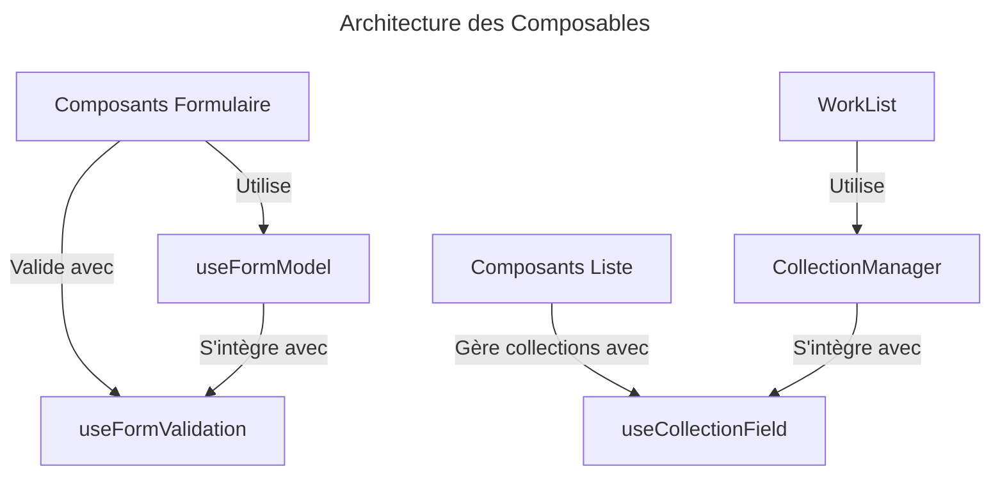
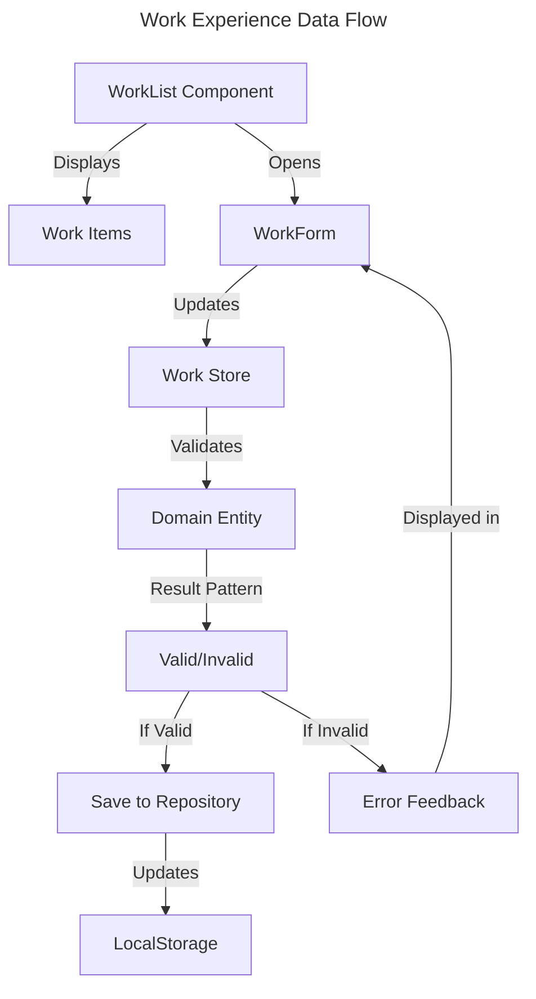
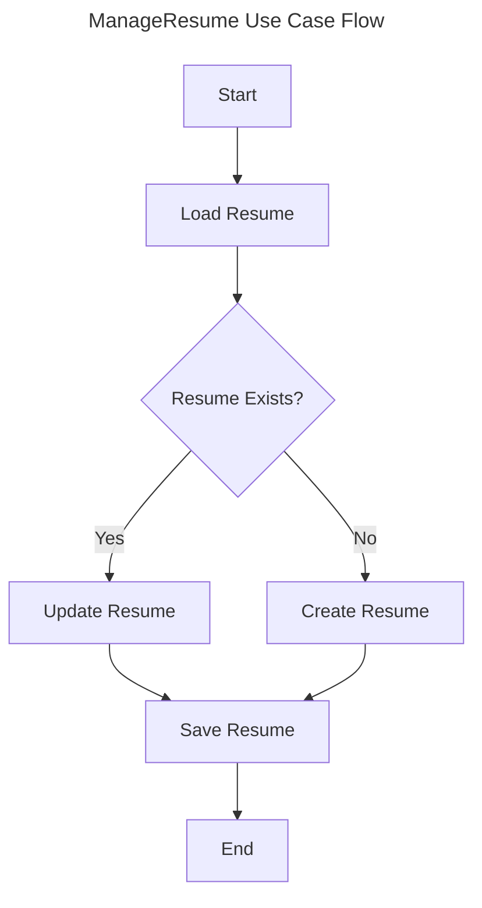
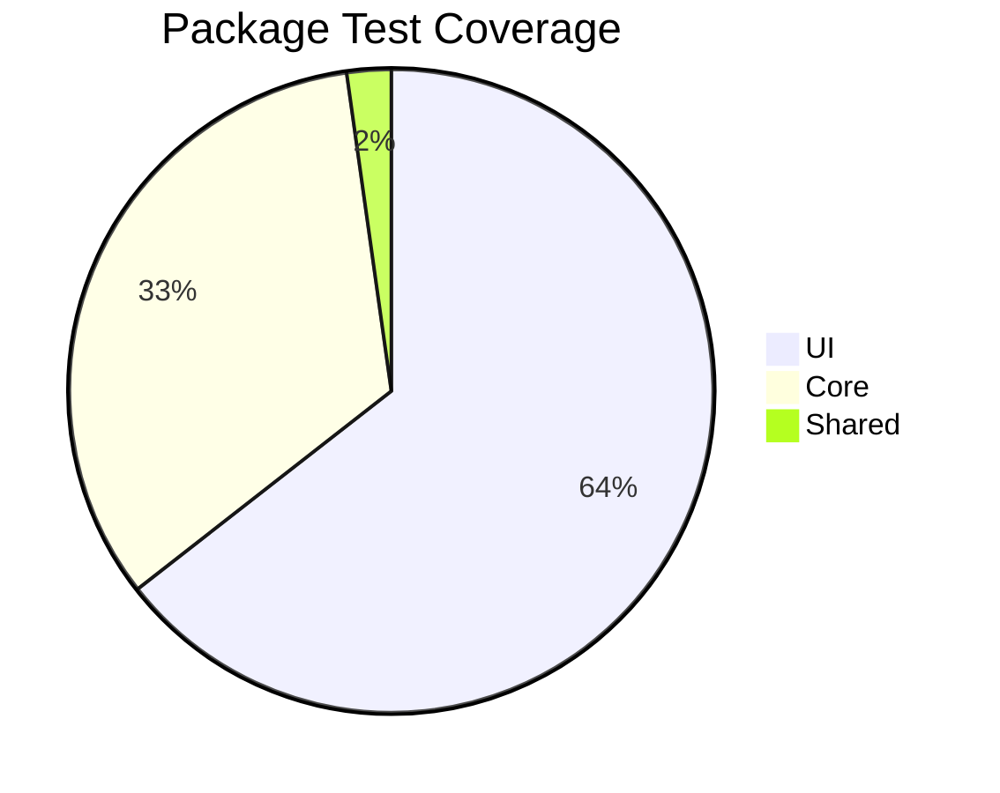

# Changelog

> ℹ️ **Note:** Ce fichier suit les recommandations de [Keep a Changelog](https://keepachangelog.com/fr/1.1.0/) et respecte [Semantic Versioning](https://semver.org/spec/v2.0.0.html).

## [Unreleased]

### Added 🎉

- Intégration complète de la section "Work Experience" (Expérience Professionnelle)
  - Création du formulaire d'édition avec validation en temps réel
  - Gestion des points forts (highlights) avec ajout/suppression dynamique
  - Tri automatique des expériences par ordre chronologique inverse
  - Navigation entre les sections "Basic Information" et "Work Experience"
  - Implémentation complète selon le standard JSON Resume
- Epic-2 "Refactorisation des Composants CV" complété avec:
  - Composable `useFormModel` pour la gestion standardisée des modèles de formulaire
  - Composable `useFormValidation` pour la validation centralisée des formulaires
  - Composable `useCollectionField` pour la gestion des collections d'éléments
  - Composant `DateRangeFields` pour les plages de dates avec option "en cours"
  - Composant `CollectionManager` pour l'affichage et la gestion des listes d'éléments

### Changed 🔄

- Refactorisation du composant `WorkList` pour utiliser le nouveau `CollectionManager`
- Standardisation du code des formulaires avec les nouveaux composables
- Amélioration de la gestion des états de formulaire grâce à `useFormModel`
- Optimisation de la validation des données avec `useFormValidation`
- Simplification de la manipulation des collections avec `useCollectionField`

### Progress 📊

- Epic-2 "Refactorisation des Composants CV" complété à 100%
  - ✅ Fondations: tous les composables fondamentaux complétés
  - ✅ Composants Réutilisables: tous les composants prévus développés
  - ✅ Documentation: toute la documentation technique finalisée
  - ✅ Tests: tous les tests unitaires et d'intégration complétés
- Epic-2 "Édition de CV" complété à 60%
  - ✅ Formulaires pour les informations de base (basics)
  - ✅ Formulaires pour l'expérience professionnelle (work)
  - 🔄 Implémentation des formulaires pour l'éducation (education)
  - ⏳ Formulaires pour les compétences (skills) et autres sections
  - ⏳ Support des sections optionnelles du standard JSON Resume

### Technical Details 🔧

> 💡 **Epic-2 - Architectures des Composables**



> 💡 **useFormModel Implementation**

```typescript
// useFormModel - Gestion des modèles de formulaire
export function useFormModel<T extends Record<string, any>>({
  modelValue,
  emit,
  defaultValues,
  enableLogging = false,
}: FormModelOptions<T>): FormModelReturn<T> {
  const localModel = computed({
    get: () => modelValue.value || defaultValues,
    set: (newValue) => emit("update:modelValue", newValue),
  });

  // Mise à jour d'un champ simple
  const updateField = (field: keyof T, value: any) => {
    emit("update:modelValue", {
      ...modelValue.value,
      [field]: value,
    });
  };

  // Mise à jour d'un champ imbriqué
  const updateNestedField = <K extends keyof T, N extends keyof T[K]>(
    object: K,
    field: N,
    value: T[K][N]
  ) => {
    emit("update:modelValue", {
      ...modelValue.value,
      [object]: {
        ...modelValue.value[object],
        [field]: value,
      },
    });
  };

  return { localModel, updateField, updateNestedField };
}
```

> 💡 **Work Experience Implementation**

```typescript
// WorkStore with Result pattern integration
export const useWorkStore = defineStore('work', () => {
  // State using reactive for proper typing
  const works = ref<WorkWithId[]>([]);
  const loading = ref(false);
  const error = ref<Error | null>(null);

  // Load works with Result pattern for error handling
  async function loadWorks(): Promise<Result<WorkWithId[]>> {
    loading.value = true;
    try {
      const resumeStore = useResumeStore();
      const resume = await resumeStore.loadResume();

      if (resume.isValid && resume.value.work) {
        works.value = resume.value.work.map((work, index) => ({
          ...work,
          id: `work-${index}`
        }));
        return Result.success(works.value);
      }
      return Result.success([]);
    } catch (e) {
      error.value = e as Error;
      return Result.failure([(e as Error).message]);
    } finally {
      loading.value = false;
    }
  }
}
```



### Planned Features 🔮

- Support pour l'édition collaborative
- Intégration avec les API LinkedIn et GitHub
- Mode hors-ligne complet avec synchronisation
- Analyses de CV et suggestions d'amélioration
- Interface administrateur pour la gestion des modèles
- Internationalisation (i18n) pour l'interface utilisateur
- Migration des composants existants vers les nouveaux composables de l'Epic-2
- Refactorisation progressive des composants d'interface utilisateur

### Technical Improvements 🔧

- Migration de Tailwind CSS v4.0.0 vers v3.4.0
- Harmonisation des styles SCSS avec Tailwind classes
- Optimisation des composants d'interface utilisateur
- Migration des polices web Google Fonts vers des polices locales (InterTight, FiraCode)
- Amélioration des performances de chargement des pages grâce aux polices auto-hébergées
- Correction des références de polices dans les variables CSS pour une cohérence globale
- Mise à jour complète des fallback fonts pour une meilleure accessibilité

## [1.1.0] - 2025-03-01

### Added 🎉

- Implémentation du pattern Result pour la validation
- Support complet des bounded contexts dans l'architecture DDD
- Nouvelle interface pour la validation en temps réel
- Documentation technique détaillée avec diagrammes améliorés

### Changed 🔄

- Réorganisation complète du package core en bounded contexts (CV, Export, User)
- Amélioration de la gestion des erreurs dans toute l'application
- Mise à jour de la structure du projet basée sur les principes DDD
- Correction de plusieurs problèmes d'interface utilisateur avec le design responsive

### Technical Details 🔧

> 💡 **Implementation Details**

```typescript
// Result pattern implementation
export class Result<T> {
  private constructor(
    public readonly isValid: boolean,
    public readonly errors: string[],
    private readonly _value?: T
  ) {}

  static success<T>(value: T): Result<T> {
    return new Result<T>(true, [], value);
  }

  static failure<T>(errors: string[]): Result<T> {
    return new Result<T>(false, errors);
  }

  get value(): T {
    if (!this.isValid) {
      throw new Error("Cannot access value of invalid result");
    }
    return this._value as T;
  }
}
```

## [1.0.0] - 2025-03-01

### Added 🎉

- Support complet du format JSON Resume
- Validation en temps réel des champs avec feedback utilisateur
- Export multiple (PDF, HTML, JSON) avec options de personnalisation
- Sauvegarde automatique dans le localStorage avec historique des versions
- Interface utilisateur entièrement responsive
- Thèmes personnalisables pour les CV générés
- Structure complète Clean Architecture + DDD

### Core Features 🏗️

#### Domain Layer

> 💡 **Domain Entities and Business Logic**

| Component     | Status | Description                    |
| :------------ | :----: | :----------------------------- |
| Basics Entity |   ✅   | Core CV information management |
| Resume Entity |   ✅   | Complete resume aggregation    |
| Validation    |   ✅   | Zod schema implementation      |

```typescript
// Example: Basics Entity Implementation
class Basics {
  private constructor(
    private readonly _name: string,
    private readonly _email: string
  ) {}

  static create(data: Partial<BasicsInterface>): Result<Basics>;
  update(data: Partial<BasicsInterface>): Result<Basics>;
  toJSON(): BasicsInterface;
}
```

#### Application Layer

> 💡 **Use Cases and Application Services**



| Use Case     | Status | Description                 |
| :----------- | :----: | :-------------------------- |
| ManageResume |   ✅   | CRUD operations for resumes |
| ExportResume |   ✅   | Multiple format exports     |
| ImportResume |   ✅   | Resume data import          |

#### Infrastructure Layer

> 💡 **External Integrations and Persistence**

- Repository Implementations
- External Service Adapters
- Storage Solutions

### UI Components 🎨

#### Form Components

> 💡 **Core Form Implementation**

| Component  | Tests | Status |
| :--------- | :---: | :----: |
| BasicsForm |  6/6  |   ✅   |
| FormField  |  4/4  |   ✅   |
| Form       |  3/3  |   ✅   |

#### Composables

> 💡 **Reusable Logic**

| Composable         | Tests | Status |
| :----------------- | :---: | :----: |
| useFieldValidation |  5/5  |   ✅   |
| useModelUpdate     |  3/3  |   ✅   |

### Test Coverage 🧪



| Package        | Files | Tests | Status |
| :------------- | :---: | :---: | :----: |
| shared         |   1   |   1   |   ✅   |
| core           |   2   |  15   |   ✅   |
| ui             |   6   |  29   |   ✅   |
| infrastructure |   2   |   8   |   ✅   |

### Dependencies 📦

| Package     | Version | Status |
| :---------- | :-----: | :----: |
| vue         | ^3.4.15 |   ✅   |
| typescript  | ~5.7.3  |   ✅   |
| zod         | ^3.22.4 |   ✅   |
| vitest      | ^3.0.0  |   ✅   |
| pinia       | ^2.1.7  |   ✅   |
| tailwindcss | ^3.4.0  |   ✅   |

### Story Progress 📋

> 🚀 **Implementation Progress**

| Story   | Status | Description                  |
| :------ | :----: | :--------------------------- |
| Story-1 |   ✅   | Project Setup & Architecture |
| Story-2 |   ✅   | Basics Implementation        |
| Story-3 |   ✅   | Form Components              |
| Story-4 |   ✅   | Resume Management            |
| Story-5 |   ✅   | Export/Import Features       |
| Story-6 |   ✅   | UI/UX Improvements           |
| Story-7 |   ✅   | Performance Optimizations    |
| Story-8 |   ✅   | Documentation & Testing      |

### Technical Highlights 💡

- Architecture Clean avec séparation stricte des couches
- Tests unitaires et d'intégration avec couverture > 75%
- Validation stricte des données avec Zod et TypeScript
- Composables réutilisables pour la gestion des formulaires
- Performance optimisée avec lazy loading des composants
- Support complet du format JSON Resume
- Implementation DDD avec agrégats, entités et value objects

## [0.1.2] - 2025-02-28

### Added 🎉

- Configuration TypeScript avec support strict mode
- Configuration Vitest pour les tests
- Configuration Biome pour le linting
- Structure de dossiers Clean Architecture

### Changed 🔄

- Migration de `ResumeForm` vers `BasicsForm`
- Amélioration de la gestion d'état avec Pinia
- Optimisation de la configuration TypeScript
- Suppression des barrel files (index.ts)

### Technical Details 🔧

> 💡 **Implementation Details**

```typescript
// ManageResume Use Case
export class ManageResume {
  constructor(private readonly repository: ResumeRepository) {}

  async loadResume(): Promise<Resume>;
  async createResume(data: ResumeInterface): Promise<void>;
  async exportResume(format: "json" | "pdf" | "html"): Promise<Blob>;
  async importResume(file: Blob): Promise<Resume>;
}
```

## [0.1.1] - 2025-02-28

### Added 🎉

- Support initial du format JSON Resume
- Validation de base des données
- Interface utilisateur minimale

### Changed 🔄

- Refactoring de la structure du projet
- Amélioration des tests unitaires

## [0.1.0] - 2025-02-28

### Added 🎉

- Configuration initiale du projet
- Setup de base Vue.js avec TypeScript
- Premiers composants UI

[Unreleased]: https://github.com/giak/cv-generator/compare/v1.1.0...HEAD
[1.1.0]: https://github.com/giak/cv-generator/compare/v0.1.1...v1.1.0
[0.1.1]: https://github.com/giak/cv-generator/compare/v0.1.0...v0.1.1
[0.1.0]: https://github.com/giak/cv-generator/releases/tag/v0.1.0
