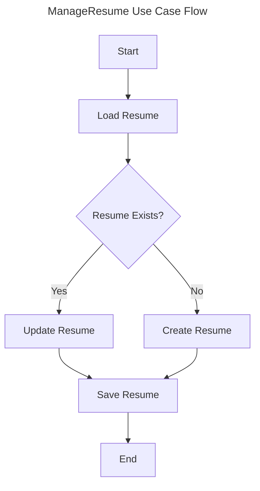
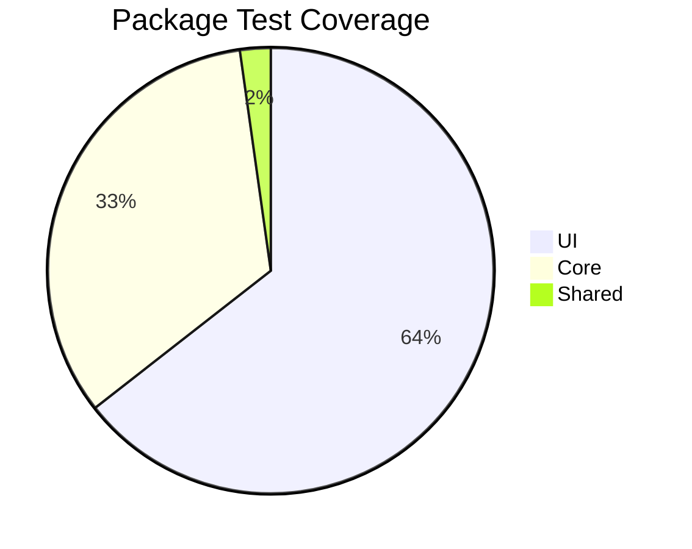

# Changelog

---

title: CV Generator Changelog
author: Giak
date: 2024-02-20
status: maintained
version: 0.1.2

---

> ℹ️ **Note:** Ce fichier suit les recommandations de [Keep a Changelog](https://keepachangelog.com/fr/1.1.0/) et respecte [Semantic Versioning](https://semver.org/spec/v2.0.0.html).

## [Unreleased]

### Core Features 🏗️

#### Domain Layer

> 💡 **Domain Entities and Business Logic**

| Component     | Status | Description                    |
| :------------ | :----: | :----------------------------- |
| Basics Entity |   ✅   | Core CV information management |
| Resume Entity |   ✅   | Complete resume aggregation    |
| Validation    |   ✅   | Zod schema implementation      |

```typescript
// Example: Basics Entity Implementation
class Basics {
  private constructor(
    private readonly _name: string,
    private readonly _email: string
  ) {}

  static create(data: Partial<BasicsInterface>): Result<Basics>;
  update(data: Partial<BasicsInterface>): Result<Basics>;
  toJSON(): BasicsInterface;
}
```

#### Application Layer

> 💡 **Use Cases and Application Services**



| Use Case     | Status | Description                 |
| :----------- | :----: | :-------------------------- |
| ManageResume |   ✅   | CRUD operations for resumes |
| ExportResume |   ✅   | Multiple format exports     |
| ImportResume |   ✅   | Resume data import          |

#### Infrastructure Layer

> 💡 **External Integrations and Persistence**

- Repository Implementations
- External Service Adapters
- Storage Solutions

### UI Components 🎨

#### Form Components

> 💡 **Core Form Implementation**

| Component  | Tests | Status |
| :--------- | :---: | :----: |
| BasicsForm |  6/6  |   ✅   |
| FormField  |  4/4  |   ✅   |
| Form       |  3/3  |   ✅   |

#### Composables

> 💡 **Reusable Logic**

| Composable         | Tests | Status |
| :----------------- | :---: | :----: |
| useFieldValidation |  5/5  |   ✅   |
| useModelUpdate     |  3/3  |   ✅   |

### Test Coverage 🧪



| Package        | Files | Tests | Status |
| :------------- | :---: | :---: | :----: |
| shared         |   1   |   1   |   ✅   |
| core           |   2   |  15   |   ✅   |
| ui             |   6   |  29   |   ✅   |
| infrastructure |   0   |   0   |   ⚠️   |

### Dependencies 📦

| Package    | Version | Status |
| :--------- | :-----: | :----: |
| vue        | ^3.4.15 |   ✅   |
| typescript | ~5.7.3  |   ✅   |
| zod        | ^3.22.4 |   ✅   |
| vitest     | ^1.6.1  |   ✅   |
| pinia      | ^2.1.7  |   ✅   |

### Story Progress 📋

> 🚀 **Implementation Progress**

| Story   | Status | Description                  |
| :------ | :----: | :--------------------------- |
| Story-1 |   ✅   | Project Setup & Architecture |
| Story-2 |   🚧   | Basics Implementation        |

## [0.1.2] - 2024-02-20

### Added 🎉

- Configuration TypeScript avec support strict mode
- Configuration Vitest pour les tests
- Configuration Biome pour le linting
- Structure de dossiers Clean Architecture

### Changed 🔄

- Migration de `ResumeForm` vers `BasicsForm`
- Amélioration de la gestion d'état avec Pinia
- Optimisation de la configuration TypeScript
- Suppression des barrel files (index.ts)

### Technical Details 🔧

> 💡 **Implementation Details**

```typescript
// ManageResume Use Case
export class ManageResume {
  constructor(private readonly repository: ResumeRepository) {}

  async loadResume(): Promise<Resume>;
  async createResume(data: ResumeInterface): Promise<void>;
  async exportResume(format: "json" | "pdf" | "html"): Promise<Blob>;
  async importResume(file: Blob): Promise<Resume>;
}
```

## [0.1.1] - 2024-02-15

### Added 🎉

- Support initial du format JSON Resume
- Validation de base des données
- Interface utilisateur minimale

### Changed 🔄

- Refactoring de la structure du projet
- Amélioration des tests unitaires

## [0.1.0] - 2024-02-10

### Added 🎉

- Configuration initiale du projet
- Setup de base Vue.js avec TypeScript
- Premiers composants UI

[Unreleased]: https://github.com/giak/cv-generator/compare/v0.1.2...HEAD
[0.1.2]: https://github.com/giak/cv-generator/compare/v0.1.1...v0.1.2
[0.1.1]: https://github.com/giak/cv-generator/compare/v0.1.0...v0.1.1
[0.1.0]: https://github.com/giak/cv-generator/releases/tag/v0.1.0
