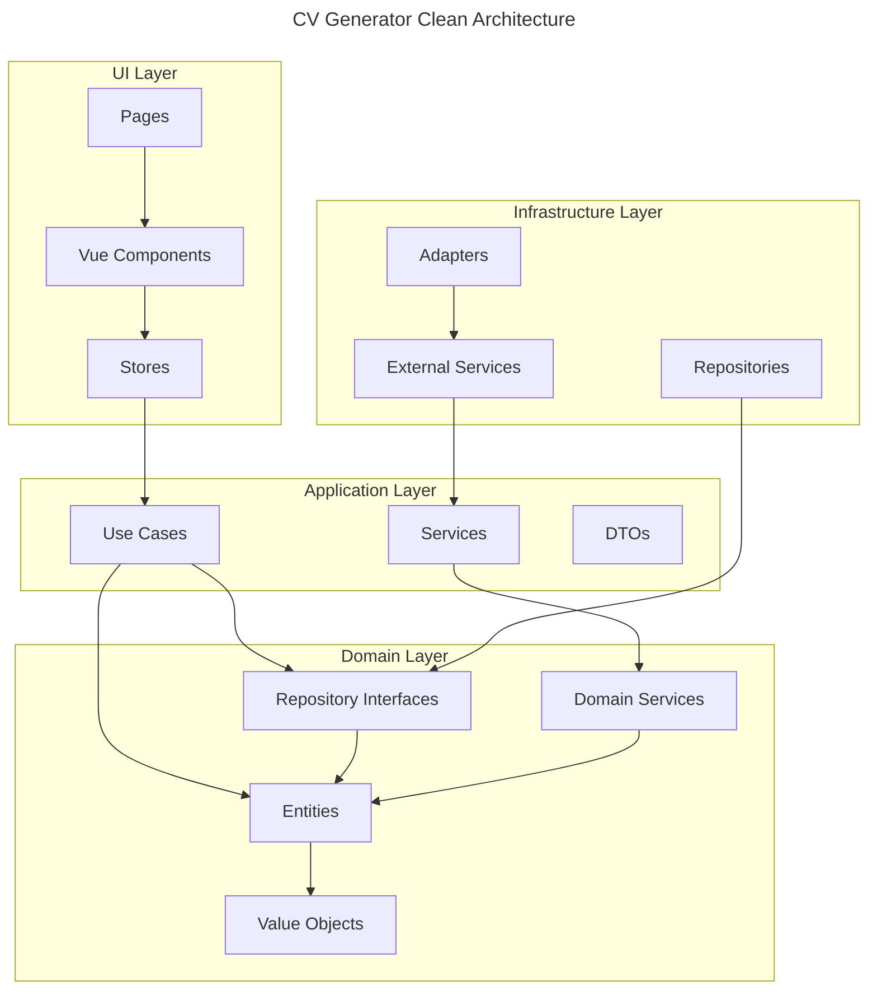

# CV Generator

[](https://github.com/giak/cv-generator/actions)
[](https://codecov.io/gh/giak/cv-generator)
[](https://github.com/giak/cv-generator/releases)
[](LICENSE)

> 💡 **Modern CV builder with JSON Resume support**

## Table of Contents

- [Overview](#overview)
- [Tech Stack](#tech-stack)
- [Project Structure](#project-structure)
- [Architecture](#architecture)
  - [Key Principles](#key-principles)
- [Getting Started](#getting-started)
  - [Prerequisites](#prerequisites)
  - [Installation](#installation)
  - [Development Commands](#development-commands)
- [Features](#features)
- [Contributing](#contributing)
- [License](#license)
- [Acknowledgments](#acknowledgments)
- [Maintenance](#maintenance)

## Overview

CV Generator is a modern web application built with Vue 3, TypeScript, and Vite that helps you create professional CVs using the JSON Resume standard. The application features a clean, intuitive interface and supports multiple export formats.

## Tech Stack

- Vue 3 with Composition API
- TypeScript 5.7+
- Vite 6.1
- Tailwind CSS 4
- Vitest for Testing
- Clean Architecture & DDD principles

## Project Structure

```
cv-generator/
├── packages/
│   ├── core/           # Domain & Business Logic
│   │   ├── src/
│   │   │   ├── domain/
│   │   │   │   ├── entities/      # Business objects
│   │   │   │   ├── repositories/   # Repository interfaces
│   │   │   │   └── services/       # Domain services
│   │   │   └── application/
│   │   │       ├── useCases/       # Application use cases
│   │   │       └── services/       # Application services
│   │   └── __tests__/             # Core tests
│   │
│   ├── infrastructure/ # External Integrations
│   │   ├── src/
│   │   │   ├── repositories/       # Repository implementations
│   │   │   ├── services/          # External service integrations
│   │   │   └── adapters/          # External adapters
│   │   └── __tests__/             # Infrastructure tests
│   │
│   ├── shared/         # Shared Types & Utils
│   │   ├── src/
│   │   │   ├── types/             # Shared TypeScript types
│   │   │   ├── utils/             # Shared utilities
│   │   │   └── constants/         # Shared constants
│   │   └── __tests__/             # Shared module tests
│   │
│   └── ui/            # Vue 3 Frontend App
│       ├── src/
│       │   ├── assets/            # Static assets
│       │   ├── components/        # Shared components
│       │   ├── modules/           # Feature modules
│       │   │   └── cv/
│       │   │       ├── domain/    # Module-specific domain
│       │   │       ├── application/# Module-specific logic
│       │   │       └── presentation/# UI components
│       │   ├── stores/            # Pinia stores
│       │   └── types/             # UI-specific types
│       ├── e2e/                   # E2E tests
│       └── __tests__/             # Unit tests
│
├── docs/              # Project Documentation
│   ├── architecture/  # Architecture decisions
│   ├── api/          # API documentation
│   └── guides/       # Development guides
│
└── .github/          # GitHub Actions & Config
    ├── workflows/    # CI/CD pipelines
    └── environments/ # Environment configs
```

## Architecture



### Key Principles

1. **Clean Architecture**

   - Independent of frameworks
   - Testable by design
   - Independent of UI
   - Independent of database
   - Independent of external services

2. **Domain-Driven Design**

   - Rich domain model
   - Encapsulated business logic
   - Ubiquitous language
   - Bounded contexts

3. **SOLID Principles**

   - Single Responsibility
   - Open/Closed
   - Liskov Substitution
   - Interface Segregation
   - Dependency Inversion

4. **Testing Strategy**
   - Unit tests for domain logic
   - Integration tests for repositories
   - E2E tests for critical paths
   - Component tests for UI

## Getting Started

### Prerequisites

- Node.js 22+
- pnpm 10+

### Installation

```bash
# Clone the repository
git clone https://github.com/yourusername/cv-generator.git

# Install dependencies
pnpm install

# Start development server
pnpm dev
```

### Development Commands

| Command         | Description              |
| :-------------- | :----------------------- |
| `pnpm dev`      | Start development server |
| `pnpm build`    | Build for production     |
| `pnpm test`     | Run unit tests           |
| `pnpm test:e2e` | Run end-to-end tests     |
| `pnpm lint`     | Lint code                |
| `pnpm format`   | Format code              |

## Features

- 📝 JSON Resume format support
- 🎨 Modern, responsive design
- 📤 Multiple export formats
- 🔄 Real-time preview
- 💾 Local storage support
- 🌐 Offline capabilities

## Contributing

1. Fork the repository
2. Create your feature branch
3. Commit your changes
4. Push to the branch
5. Create a Pull Request

> ℹ️ **Note:** Please read our [Contributing Guide](CONTRIBUTING.md) for details on our code of conduct and development process.

## License

This project is licensed under the MIT License - see the [LICENSE](LICENSE) file for details.

## Acknowledgments

- [JSON Resume](https://jsonresume.org/) for the CV schema standard
- [Vue.js](https://vuejs.org/) for the excellent framework
- [Vite](https://vitejs.dev/) for the blazing fast build tool

## Maintenance

### Known Issues

- PDF export may have formatting issues with certain special characters
- Local storage has a size limitation of 5MB for saved resumes

### Troubleshooting

- If the development server fails to start, ensure all dependencies are installed with `pnpm install`
- For PDF export issues, try using plain text characters instead of special Unicode characters
- Clear browser cache and local storage if the application behaves unexpectedly

### Update Procedures

1. Update dependencies: `pnpm update`
2. Run tests: `pnpm test`
3. Check for breaking changes in the [CHANGELOG.md](CHANGELOG.md)
4. Follow the migration guides in the documentation if available

### FAQ

**Q: Can I use npm instead of pnpm?**
A: While possible, we recommend using pnpm for consistent dependency management and better disk space usage.

**Q: How do I customize the CV themes?**
A: Themes can be customized by modifying the files in `packages/ui/src/assets/themes/`.

**Q: What's the maximum size of a resume?**
A: The local storage implementation has a 5MB limit. For larger resumes, consider using the export feature.
