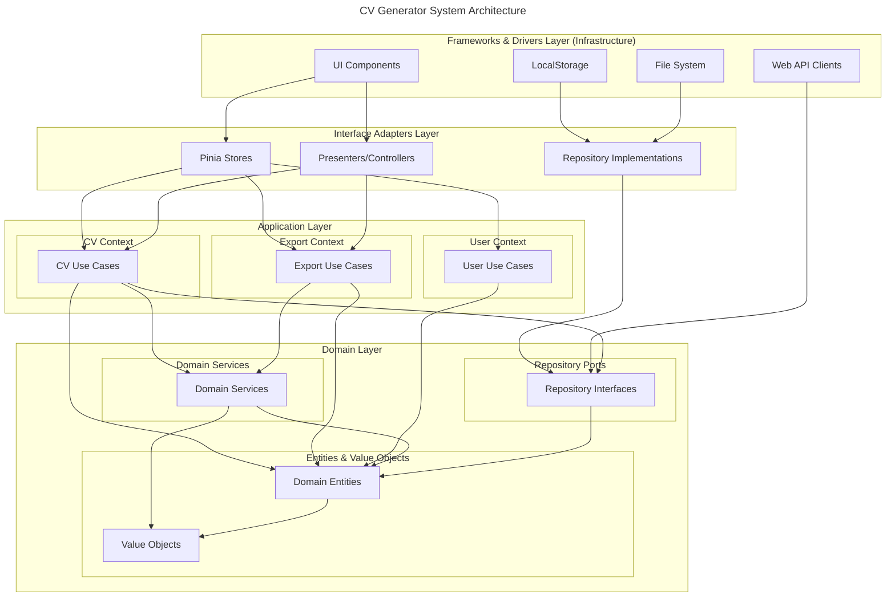

# CV Generator

[](https://github.com/giak/cv-generator/actions)
[](https://codecov.io/gh/giak/cv-generator)
[](https://github.com/giak/cv-generator/releases)
[](LICENSE)
[](https://jsonresume.org/)
[](https://github.com/giak/cv-generator)

> 💡 **Modern CV builder with full [JSON Resume](https://jsonresume.org/) standard support, real-time validation, and multiple export formats**


## Quick Start

```bash
# Installation
pnpm install

# Development
pnpm dev

# Visit http://localhost:3000
```

## Table of Contents

- [Overview](#overview)
- [Features](#features)
- [Tech Stack](#tech-stack)
- [Current Status](#current-status)
  - [Implementation Progress](#implementation-progress)
  - [Latest Feature: Validation System Implementation](#latest-feature-validation-system-implementation)
  - [Reusable Composables](#reusable-composables)
- [Architecture](#architecture)
  - [Key Principles](#key-principles)
  - [Clean Architecture](#clean-architecture)
  - [Domain-Driven Design](#domain-driven-design)
  - [JSON Resume Interoperability](#json-resume-interoperability)
  - [ATS Optimization](#ats-optimization)
- [Getting Started](#getting-started)
  - [Prerequisites](#prerequisites)
  - [Installation](#installation)
  - [Development Commands](#development-commands)
  - [Docker Deployment](#docker-deployment)
- [Usage](#usage)
  - [Creating a New CV](#creating-a-new-cv)
  - [Editing CV Sections](#editing-cv-sections)
  - [Exporting Your CV](#exporting-your-cv)
  - [Importing Existing Data](#importing-existing-data)
- [Project Structure](#project-structure)
- [Development](#development)
  - [Testing Strategy](#testing-strategy)
  - [Code Style](#code-style)
  - [Contributing](#contributing)
- [Deployment](#deployment)
  - [Build](#build)
  - [Configuration](#configuration)
  - [Supported Platforms](#supported-platforms)
  - [Docker](#docker)
- [Maintenance](#maintenance)
  - [Known Issues](#known-issues)
  - [Troubleshooting](#troubleshooting)
  - [Update Procedures](#update-procedures)
  - [FAQ](#faq)
- [Changelog](#changelog)
  - [Recent Updates](#recent-updates-v110)
- [License](#license)
- [Acknowledgments](#acknowledgments)

## Overview

CV Generator is a modern web application that helps you create professional CVs using the [JSON Resume](https://jsonresume.org/) standard. Built with Vue 3, TypeScript, and following Clean Architecture principles, it offers a seamless experience for creating, editing, and exporting CVs in multiple formats.

### Problem Statement

Managing and updating CVs in various formats can be challenging and time-consuming. Traditional word processors lack standardization and make it difficult to maintain consistent formatting across different versions.

### Solution

CV Generator provides a structured, standardized approach to CV creation using the JSON Resume format ([https://jsonresume.org/schema/](https://jsonresume.org/schema/)), combined with a modern, intuitive interface and real-time preview capabilities. The application ensures your CV data is always compliant with the standard, enabling interoperability with other tools in the JSON Resume ecosystem.

## Features

- 📝 **JSON Resume Standard Support**

  - 100% compliant with the official [JSON Resume schema](https://jsonresume.org/schema/)
  - Real-time schema validation and error detection
  - Complete implementation of all schema sections and properties
  - Seamless import/export for interoperability with JSON Resume ecosystem
  - Compatibility with existing JSON Resume themes and tools

- 🎨 **Modern UI/UX**

  - Real-time preview of changes
  - Responsive design for all devices
  - Customizable themes and layouts
  - Drag-and-drop field organization
  - Event-based navigation without page reloads (SPA)
  - Visual indicators for form completion status
  - Intuitive progress tracking across all CV sections

- 🌍 **Internationalization & Multilingual Support**

  - Complete UI internationalization with 22 components translated
  - Support for English and French languages
  - Safe translation system with fallback handling
  - Extensible translation key structure
  - Comprehensive testing infrastructure for multilingual validation
  - Developer-friendly tools for adding new translations

- 💾 **Data Management**

  - Automatic local storage backup
  - Offline capabilities with PWA support
  - Auto-save functionality with history
  - Version control for CV iterations
  - State preservation during navigation

- ✅ **Validation Strategy**

  - Robust Result/Option Pattern implementation
  - Multi-layer validation (Domain, Application, Presentation)
  - Comprehensive error catalog with standardized codes
  - Detailed validation messages with helpful suggestions
  - Warning support for non-blocking validation issues
  - Rich error context with severity levels and field mapping
  - Type-safe validation with TypeScript generics
  - Backward-compatible migration strategy
  - Zod integration for schema-based validation

- 🚦 **Advanced Navigation**

  - True Single-Page Application experience
  - Smart section suggestion based on completion status
  - Visual progress indicators for each section
  - Consistent navigation patterns across components
  - Event-based navigation system for seamless transitions

- 📤 **Export Options**
  - PDF export with customizable styles
  - HTML export for online publishing
  - JSON export for data portability
  - Multiple theme selection for exports

## Tech Stack

| Technology   | Version | Purpose                                         | Benefits                                            |
| ------------ | ------- | ----------------------------------------------- | --------------------------------------------------- |
| Vue.js       | 3.4+    | Frontend framework and component architecture   | Reactivity, composition API, TypeScript support     |
| TypeScript   | 5.7+    | Type safety and enhanced developer experience   | Strong typing, better IDE support, error prevention |
| Vite         | 6.0+    | Build tool and development server               | Fast HMR, efficient bundling, plugins               |
| Tailwind CSS | 3.4.0   | Utility-first styling framework                 | Responsive design, minimal CSS, customizability     |
| Vitest       | 3.x+    | Testing framework integrated with Vite          | Fast test execution, Vue component testing          |
| Pinia        | 2.1+    | State management with TypeScript support        | DevTools, modular stores, composition API           |
| Zod          | 3.22+   | Schema validation and runtime type checking     | Type inference, custom validations                  |
| pnpm         | 10+     | Package manager with monorepo workspace support | Efficient disk usage, workspaces, speed             |
| Vue Router   | 4.2+    | Client-side routing and navigation              | Seamless SPA transitions, lazy loading              |
| Mermaid      | 10.x+   | Diagrams and visualization                      | Documentation, architecture visualization           |

## Current Status

### Implementation Progress

- **Epic-1: Fondation du système** ✅ 100% Complété
  - Architecture Clean Architecture mise en place
  - Structure en packages établie
  - Modèles de données JSON Resume implémentés
- **Epic-2: Refactorisation des Composants CV** ✅ 100% Complété
  - ✅ Composable `useFormModel` pour la gestion standardisée des modèles de formulaire
  - ✅ Composable `useFormValidation` pour la validation centralisée des formulaires
  - ✅ Composable `useCollectionField` pour la gestion des collections d'éléments
  - ✅ Composant `DateRangeFields` pour les plages de dates avec option "en cours"
  - ✅ Composant `CollectionManager` pour l'affichage et la gestion des listes d'éléments
  - ✅ Tous les composants formulaires (12/12) refactorisés
  - ✅ Tous les composants listes (10/10) refactorisés
  - ✅ Documentation technique et tests unitaires complétés
- **Epic-3: Édition de CV** 🔄 75% Complété
  - ✅ Formulaires pour les informations de base (basics)
  - ✅ Formulaires pour l'expérience professionnelle (work)
  - ✅ Tri chronologique implémenté pour les listes éducation
  - ✅ Système de validation standardisé avec Result/Option Pattern (60%)
  - ✅ Migration des Value Objects principaux (Email, Phone, WorkDate) vers le nouveau système
  - 🔄 Implémentation des formulaires pour l'éducation (education) en cours (80%)
  - ✅ Système de navigation modernisé avec émission d'événements
  - ✅ Composant `UnifiedNavigation` pour une navigation cohérente
  - ✅ Composant `FormNavigation` refactorisé pour utiliser le même système d'événements
  - 🔄 Optimisation pour l'expérience mobile en cours
  - ⏳ Formulaires pour les compétences (skills) et autres sections planifiés
  - ⏳ Support des sections optionnelles du standard JSON Resume
- **Epic-5: Internationalisation & Multilinguisme** ✅ 100% Complété
  - ✅ Internationalisation complète des 22 composants UI
  - ✅ Support du français et de l'anglais dans l'interface
  - ✅ Infrastructure de test complète pour validation multilingue
  - ✅ Documentation technique et guides de référence pour l'i18n
  - ✅ Système robuste de gestion des traductions manquantes
- **Epic-4: Prévisualisation et exportation** ⏳ Planifié
- **Epic-6: Optimisation ATS** ⏳ Planifié

### Latest Feature: Internationalization & Multilingualism

✨ **Recent Achievement: Complete UI Internationalization** ✨

The application now features a comprehensive internationalization system:

- ✅ **Translated Components**:

  - All 22 UI components are now fully internationalized
  - Support for English and French languages
  - Robust translation key structure for easy maintenance
  - Safe translation handling with fallback mechanism

- ✅ **Testing Infrastructure**:

  - Specialized i18n testing plugin for Vue components
  - Utilities for testing components in multiple languages
  - Automated detection of i18n-related console errors
  - Multilingual testing scripts for efficient validation

- ✅ **Developer Experience**:
  - Reference guide for adding new translation keys
  - Standardized approach for component internationalization
  - Comprehensive technical documentation for code review
  - Best practices for UI text internationalization

This enhancement brings several benefits:

1. **Improved user experience** with native language support
2. **Global accessibility** for French and English-speaking users
3. **Enhanced maintainability** with centralized translation keys
4. **Robust testing** ensuring correct translations across the application
5. **Framework for future languages** with minimal additional effort

```typescript
// Example: Safe translation function
function safeTranslate(key: string, fallback: string = ""): string {
  const translation = t(key);
  // If translation equals the key, it doesn't exist
  return translation === key ? fallback : translation;
}
```

```typescript
// Example: Component with i18n support
<template>
  <h2>{{ t(TRANSLATION_KEYS.CV.LISTS.WORK.TITLE) }}</h2>
  <p>{{ safeTranslate(TRANSLATION_KEYS.CV.LISTS.WORK.DESCRIPTION, 'Fallback text') }}</p>
</template>
```

For detailed information about the internationalization system, check the documentation in [docs/epic-5/i18n-reference-guide.md](docs/epic-5/i18n-reference-guide.md) and [docs/epic-5/i18n-technical-review.md](docs/epic-5/i18n-technical-review.md).

### Reusable Composables

The Epic-2 has delivered several high-quality, reusable composables:

- **useFormModel**: Standardized form state management with TypeScript safety

  ```typescript
  const { localModel, updateField, updateNestedField } = useFormModel({
    modelValue: computed(() => props.modelValue),
    emit: (event, value) => emit(event, value),
    defaultValues: {
      /* default values */
    },
  });
  ```

## Architecture

The application follows a Clean Architecture approach with Domain-Driven Design principles:

### Key Patterns

- **Result Pattern**: Functional approach to error handling returning success/failure objects

  ```typescript
  // Example of Result pattern implementation
  export class Result<T> {
    private constructor(
      public readonly isValid: boolean,
      public readonly errors: string[],
      private readonly _value?: T
    ) {}

    static success<T>(value: T): Result<T> { ... }
    static failure<T>(errors: string[]): Result<T> { ... }
  }
  ```

- **Value Objects Pattern**: Encapsulation of validation and behavior in immutable objects

  ```typescript
  // Example of Email Value Object
  export class Email {
    private constructor(private readonly value: string) {}

    static create(email: string): Result<Email> {
      // Validation logic here
      return Result.success(new Email(email));
    }

    getValue(): string {
      return this.value;
    }
  }
  ```

- **Repository Pattern**: Abstraction layer for data persistence
- **Clean Architecture**: Separation of concerns with domain, application, and infrastructure layers
- **Domain-Driven Design**: Rich domain model with entities and value objects
- **Composable Pattern**: Reusable logic with Vue Composition API
  ```typescript
  // Example of Composable Pattern with useFormModel
  export function useFormModel<T>({ modelValue, emit, defaultValues }) {
    // Implementation...
    return { localModel, updateField, updateNestedField };
  }
  ```



### Key Principles

1. **Clean Architecture**

   - Independent of frameworks
   - Testable by design
   - Independent of UI
   - Independent of database
   - Independent of external services

2. **Domain-Driven Design**

   - Rich domain model
   - Encapsulated business logic
   - Ubiquitous language
   - Bounded contexts

3. **SOLID Principles**

   - **S**ingle Responsibility: Each class has one reason to change
   - **O**pen/Closed: Open for extension, closed for modification
   - **L**iskov Substitution: Subtypes must be substitutable for base types
   - **I**nterface Segregation: Clients shouldn't depend on interfaces they don't use
   - **D**ependency Inversion: High-level modules shouldn't depend on low-level modules

4. **Testing Strategy**
   - Unit tests for domain logic
   - Integration tests for repositories
   - E2E tests for critical paths
   - Component tests for UI

### JSON Resume Interoperability

The application is fully compatible with the [JSON Resume](https://jsonresume.org/) ecosystem:

- Complete implementation of the JSON Resume schema
- Validation against the official schema specification
- Import/export support for seamless integration with other tools
- Support for all required and optional fields defined in the standard

### ATS Optimization

The application includes features to optimize your CV for Applicant Tracking Systems:

- Real-time analysis of CV content for ATS compatibility
- Keyword suggestions based on job market trends
- Readability score calculation
- Format optimization for parsing by recruitment software
- Best practices recommendations

## Getting Started

### Prerequisites

- Node.js 22+ (LTS recommended)
- pnpm 10+
- Modern web browser (Chrome, Firefox, Safari, Edge)
- Git (for development)

### Installation

1. Clone the repository:

   ```bash
   git clone https://github.com/giak/cv-generator.git
   cd cv-generator
   ```

2. Install dependencies:

   ```bash
   pnpm install
   ```

3. Start development server:
   ```bash
   pnpm dev
   ```
4. Open your browser:
   ```
   http://localhost:3000
   ```

### Development Commands

| Command          | Description                                | When to Use                       |
| ---------------- | ------------------------------------------ | --------------------------------- |
| `pnpm dev`       | Start development server                   | Local development                 |
| `pnpm build`     | Build for production                       | Preparing for deployment          |
| `pnpm test`      | Run unit tests                             | Verifying component functionality |
| `pnpm test:e2e`  | Run end-to-end tests                       | Testing user flows                |
| `pnpm lint`      | Lint code for errors and style issues      | Code quality checks               |
| `pnpm format`    | Format code according to project standards | Maintaining consistent style      |
| `pnpm storybook` | Run Storybook component explorer           | Component development and testing |
| `pnpm docs:dev`  | Run documentation site locally             | Working on project documentation  |

### Docker Deployment

You can also run the application using Docker, which provides an isolated, consistent environment across different platforms.

#### Prerequisites for Docker

- Docker 24.x+
- Docker Compose 2.x+

#### Quick Start with Docker

```bash
# Start in production mode (default port: 8080)
./start.sh
# or
pnpm docker:start

# Start in development mode with hot-reload
./start.sh development
# or
pnpm docker:start:dev
```

#### Docker Commands

| Command                 | Description                                   |
| ----------------------- | --------------------------------------------- |
| `pnpm docker:start`     | Start production environment                  |
| `pnpm docker:start:dev` | Start development environment with hot-reload |
| `pnpm docker:setup`     | Setup complete development environment        |
| `pnpm docker:test`      | Run tests in Docker environment               |
| `pnpm docker:clean`     | Clean Docker resources                        |
| `pnpm docker:logs`      | View container logs                           |
| `pnpm docker:health`    | Check health of Docker containers             |

For detailed information about Docker deployment, see [README.docker.md](README.docker.md) or the [Docker Deployment Guide](docs/guides/docker-deployment.md).

## Usage

### Creating a New CV

1. Click on "Create New CV" from the home screen
2. Choose a template for your CV
3. Fill in your basic information in the form
4. Navigate through sections using the sidebar
5. Save your progress at any time with the "Save" button


### Editing CV Sections

Each section of your CV can be edited independently:

- **Basics**: Personal information and contact details
- **Work Experience**: Your professional history
- **Education**: Academic background
- **Skills**: Technical and soft skills
- **Projects**: Significant projects you've worked on
- **Publications**: Papers, articles, or books
- **References**: Professional recommendations

All fields have real-time validation with helpful error messages.

#### Basic Information

The Basic Information section allows you to manage your personal and contact details:

1. Complete the form with your personal information:
   - Name, email, and phone number
   - Professional title/label
   - Website URL
   - Professional summary
2. Add your location details:
   - Address, city, postal code, and region
3. Link your professional profiles:
   - Add multiple social/professional network profiles
   - Specify the network name and your profile URL

The form provides real-time validation to ensure all required fields are properly filled.

#### Work Experience

The Work Experience section allows you to showcase your professional history:

1. Click "Add Work Experience" to create a new entry
2. Complete the form with your work details:
   - Company name and position
   - Start and end dates (leave end date empty for current positions)
   - Company website URL (optional)
   - Job description summary
3. Add key highlights for each position:
   - Click "Add Highlight" to add accomplishments or responsibilities
   - Highlights can be reordered by dragging
   - Remove unwanted highlights with the delete button
4. Edit existing work experiences by clicking on the edit button
5. Change the order of work experiences using the arrow buttons

The section automatically organizes entries in reverse chronological order (most recent first).

### Exporting Your CV

1. Click the "Export" button in the top menu
2. Select your desired format:
   - PDF (for printing or sharing)
   - HTML (for web portfolios)
   - JSON (for data backup)
3. Choose a theme for your export
4. Download your completed CV

### Importing Existing Data

1. Click "Import" in the main menu
2. Select a JSON Resume file from your computer
3. Review and confirm the imported data
4. Make any necessary adjustments

## Project Structure

```
cv-generator/
├── packages/
│   ├── core/           # Domain & Business Logic
│   │   ├── src/
│   │   │   ├── cv/              # CV bounded context
│   │   │   │   ├── domain/       # CV domain entities, value objects
│   │   │   │   ├── application/  # CV use cases
│   │   │   │   └── ports/        # CV repository interfaces
│   │   │   │
│   │   │   ├── export/          # Export bounded context
│   │   │   │   ├── domain/       # Export domain entities
│   │   │   │   ├── application/  # Export use cases
│   │   │   │   └── ports/        # Export service interfaces
│   │   │   │
│   │   │   ├── user/            # User bounded context
│   │   │   │   └── ...
│   │   │   │
│   │   │   └── shared/          # Shared modules
│   │   │       ├── domain/       # Shared domain objects (Result, etc.)
│   │   │       └── utils/        # Shared utilities
│   │   │
│   │   │
│   │   └── __tests__/           # Core tests
│   │
│   ├── infrastructure/ # External Integrations
│   │   ├── src/
│   │   │   ├── repositories/     # Repository implementations
│   │   │   ├── services/         # External service integrations
│   │   │   └── adapters/         # External adapters
│   │   └── __tests__/           # Infrastructure tests
│   │
│   ├── shared/         # Shared Types & Utils
│   │   ├── src/
│   │   │   ├── types/           # Shared TypeScript types
│   │   │   ├── utils/           # Shared utilities
│   │   │   └── constants/       # Shared constants
│   │   └── __tests__/           # Shared module tests
│   │
│   └── ui/            # Vue 3 Frontend App
│       ├── src/
│       │   ├── assets/          # Static assets
│       │   ├── components/      # Shared components
│       │   ├── modules/         # Feature modules
│       │   │   └── cv/
│       │   │       ├── domain/  # Module-specific domain
│       │   │       ├── application/# Module-specific logic
│       │   │       └── presentation/# UI components
│       │   ├── stores/          # Pinia stores
│       │   └── types/           # UI-specific types
│       ├── e2e/                 # E2E tests
│       └── __tests__/           # Unit tests
│
├── docs/              # Project Documentation
│   ├── architecture/  # Architecture decisions
│   ├── api/          # API documentation
│   └── guides/       # Development guides
│
└── .github/          # GitHub Actions & Config
    ├── workflows/    # CI/CD pipelines
    └── environments/ # Environment configs
```

Each package has its own responsibilities:

| Package        | Purpose                               | Key Files                                               |
| -------------- | ------------------------------------- | ------------------------------------------------------- |
| core           | Business logic and domain models      | `src/cv/domain/entities/Resume.ts`                      |
| infrastructure | External services and persistence     | `src/repositories/LocalStorageResumeRepository.ts`      |
| shared         | Common utilities and types            | `src/types/resume.interface.ts`                         |
| ui             | User interface and presentation logic | `src/modules/cv/presentation/components/BasicsForm.vue` |

## Development

### Testing Strategy

Our application follows a comprehensive testing approach:

- **Unit Tests**: For all domain entities, services, and business logic

  ```bash
  pnpm test:unit
  ```

- **Component Tests**: For UI components and composables

  ```bash
  pnpm test:components
  ```

- **Integration Tests**: For store interactions and use cases

  ```bash
  pnpm test:integration
  ```

- **E2E Tests**: For critical user flows
  ```bash
  pnpm test:e2e
  ```

Test coverage requirements:

- Domain logic: 90%+ coverage
- UI components: 80%+ coverage
- Overall project: 75%+ coverage

### Code Style

We enforce strict code quality standards:

- ESLint configuration with TypeScript integration

  ```bash
  pnpm lint
  ```

- Prettier formatting

  ```bash
  pnpm format
  ```

- TypeScript strict mode with no implicit any
- Vue component conventions:
  - Composition API with `<script setup>`
  - Typed props and emits
  - Single-file components
  - Test co-location

### Contributing

1. Fork the repository
2. Create your feature branch
   ```bash
   git checkout -b feature/amazing-feature
   ```
3. Commit your changes following conventional commits
   ```bash
   git commit -m "feat: add amazing feature"
   ```
4. Push to the branch
   ```bash
   git push origin feature/amazing-feature
   ```
5. Create a Pull Request

> ℹ️ **Note:** Please read our [Contributing Guide](CONTRIBUTING.md) for details on our code of conduct and development process.

## Deployment

### Build

To build the application for production:

```bash
pnpm build
```

This creates optimized files in the `dist` folder, ready for deployment.

### Configuration

Configure the application using environment variables:

```
# .env.production
NODE_ENV=production
APP_TITLE=CV Generator
APP_DESCRIPTION=Modern CV builder with JSON Resume support
API_URL=https://your-api-endpoint.com/api
```

### Supported Platforms

The application can be deployed to any platform that supports static hosting:

- Netlify
- Vercel
- GitHub Pages
- AWS S3 + CloudFront
- Any web server (Nginx, Apache, etc.)

### Docker

The application can be easily deployed using Docker:

```bash
# Quick start with default settings
./start.sh

# Development mode on port 3000
./start.sh development 3000

# Production mode on port 8080
./start.sh production 8080
```

#### Docker Benefits

- Consistent environment across different machines
- Easy deployment with a single command
- Isolated environment for testing and development
- No need to install Node.js or PNPM locally

#### Docker Documentation

For detailed instructions on Docker deployment, see [README.docker.md](README.docker.md).

#### Running Tests in Docker

You can run tests in a Docker environment to ensure consistent results:

```bash
# Run unit tests
./test-docker.sh unit

# Run end-to-end tests
./test-docker.sh e2e

# Run all tests with coverage
./test-docker.sh all true
```

## Maintenance

### Known Issues

- PDF export formatting with special characters
  - Workaround: Use basic Latin characters for best results
- 5MB local storage limitation
  - Workaround: Export regularly to JSON and import when needed
- Font rendering differences across browsers
  - Workaround: Stick to system fonts for consistent display
- Validation errors sometimes unclear on nested objects
  - Workaround: Check parent fields when validation errors occur
- [Track issues on GitHub](https://github.com/giak/cv-generator/issues)

### Troubleshooting

1. **Development Server Issues**

   - Clear node_modules: `pnpm clean && pnpm install`
   - Check Node.js version: `node --version`
   - Verify Vite configuration: `vite.config.ts`

2. **Build Problems**

   - Clear cache: `pnpm clean:cache`
   - Update dependencies: `pnpm update`
   - Check for TypeScript errors: `pnpm typecheck`

3. **Data Loss Issues**
   - Check localStorage in browser DevTools
   - Verify exports work correctly
   - Consider enabling the debug mode: `localStorage.setItem('debug', 'true')`

### Update Procedures

1. Update dependencies:

   ```bash
   pnpm update
   ```

2. Run tests to ensure compatibility:

   ```bash
   pnpm test
   ```

3. Check for breaking changes in [CHANGELOG.md](CHANGELOG.md)

4. Update documentation if necessary:
   ```bash
   pnpm docs:build
   ```

### FAQ

**Q: Can I use npm or yarn instead of pnpm?**  
A: Yes, but pnpm is recommended for better dependency management and workspace support.

**Q: How do I customize themes?**  
A: Edit files in `packages/ui/src/assets/themes/` or create a new theme by copying an existing one.

**Q: What's the maximum CV size?**  
A: Local storage limit is 5MB. Use export for larger files.

**Q: Is my data stored on a server?**  
A: No, all data is stored locally in your browser. No server storage is used.

**Q: Can I share my CV directly from the app?**  
A: Currently, you need to export and share the file. Direct sharing is planned for a future release.

**Q: How do I report bugs or suggest features?**  
A: Please open an issue on our [GitHub repository](https://github.com/giak/cv-generator/issues).

## Changelog

Pour une liste détaillée des modifications, consultez le [CHANGELOG.md](CHANGELOG.md).

### Recent Updates (v1.1.0)

- **Internationalization**: Complete UI components translation with English and French support
- **i18n Testing**: Advanced testing infrastructure for multilingual components
- **NavigationSystem**: Completely refactored navigation with event-based architecture
- **FormComponents**: Standardized all form components with TypeScript type safety
- **CollectionManager**: Added unified list management with drag-and-drop support
- **ValidationSystem**: Implemented robust Result/Option Pattern for standardized validation
- **Performance**: Improved rendering performance for large CV collections

## License

[MIT License](LICENSE)

## Acknowledgments

- [JSON Resume](https://jsonresume.org/) for the standardized format
- [Vue.js](https://vuejs.org/) for the excellent frontend framework
- [Vite](https://vitejs.dev/) for the blazing fast development experience
- [Tailwind CSS](https://tailwindcss.com/) for the utility-first styling approach
- [Zod](https://zod.dev/) for the schema validation system
- All our contributors and community members

---

_Last updated: March 06, 2025_
