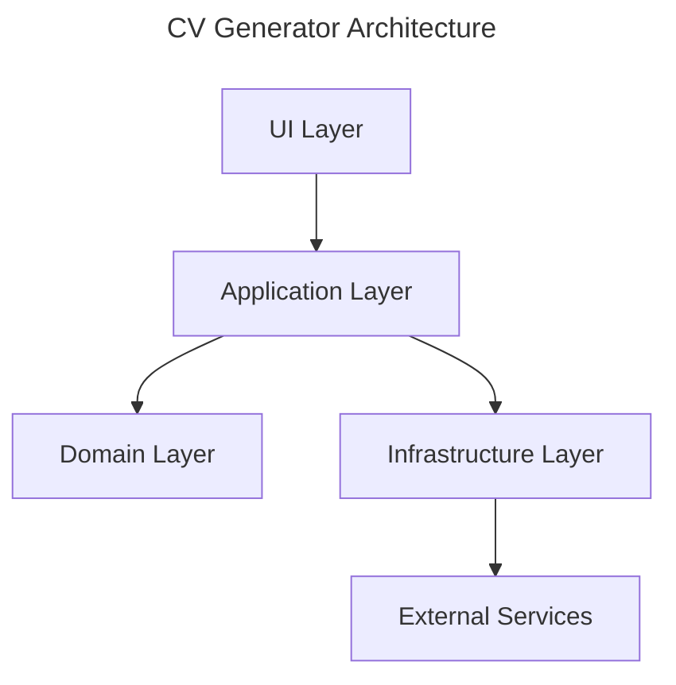

# CV Generator

> 💡 **Modern CV builder with JSON Resume support**

## Overview

CV Generator is a modern web application built with Vue 3, TypeScript, and Vite that helps you create professional CVs using the JSON Resume standard. The application features a clean, intuitive interface and supports multiple export formats.

## Tech Stack

- Vue 3 with Composition API
- TypeScript 5.7+
- Vite 6.1
- Tailwind CSS 4
- Vitest for Testing
- Clean Architecture & DDD principles

## Project Structure

```
cv-generator/
├── packages/
│   ├── core/           # Domain & Business Logic
│   ├── infrastructure/ # External Integrations
│   ├── shared/         # Shared Types & Utils
│   └── ui/            # Vue 3 Frontend App
├── docs/              # Project Documentation
└── .github/           # GitHub Actions & Config
```

## Getting Started

### Prerequisites

- Node.js 22+
- pnpm 10+

### Installation

```bash
# Clone the repository
git clone https://github.com/yourusername/cv-generator.git

# Install dependencies
pnpm install

# Start development server
pnpm dev
```

### Development Commands

| Command         | Description              |
| :-------------- | :----------------------- |
| `pnpm dev`      | Start development server |
| `pnpm build`    | Build for production     |
| `pnpm test`     | Run unit tests           |
| `pnpm test:e2e` | Run end-to-end tests     |
| `pnpm lint`     | Lint code                |
| `pnpm format`   | Format code              |

## Architecture



## Features

- 📝 JSON Resume format support
- 🎨 Modern, responsive design
- 📤 Multiple export formats
- 🔄 Real-time preview
- 💾 Local storage support
- 🌐 Offline capabilities

## Contributing

1. Fork the repository
2. Create your feature branch
3. Commit your changes
4. Push to the branch
5. Create a Pull Request

> ℹ️ **Note:** Please read our [Contributing Guide](CONTRIBUTING.md) for details on our code of conduct and development process.

## License

This project is licensed under the MIT License - see the [LICENSE](LICENSE) file for details.

## Acknowledgments

- [JSON Resume](https://jsonresume.org/) for the CV schema standard
- [Vue.js](https://vuejs.org/) for the excellent framework
- [Vite](https://vitejs.dev/) for the blazing fast build tool
