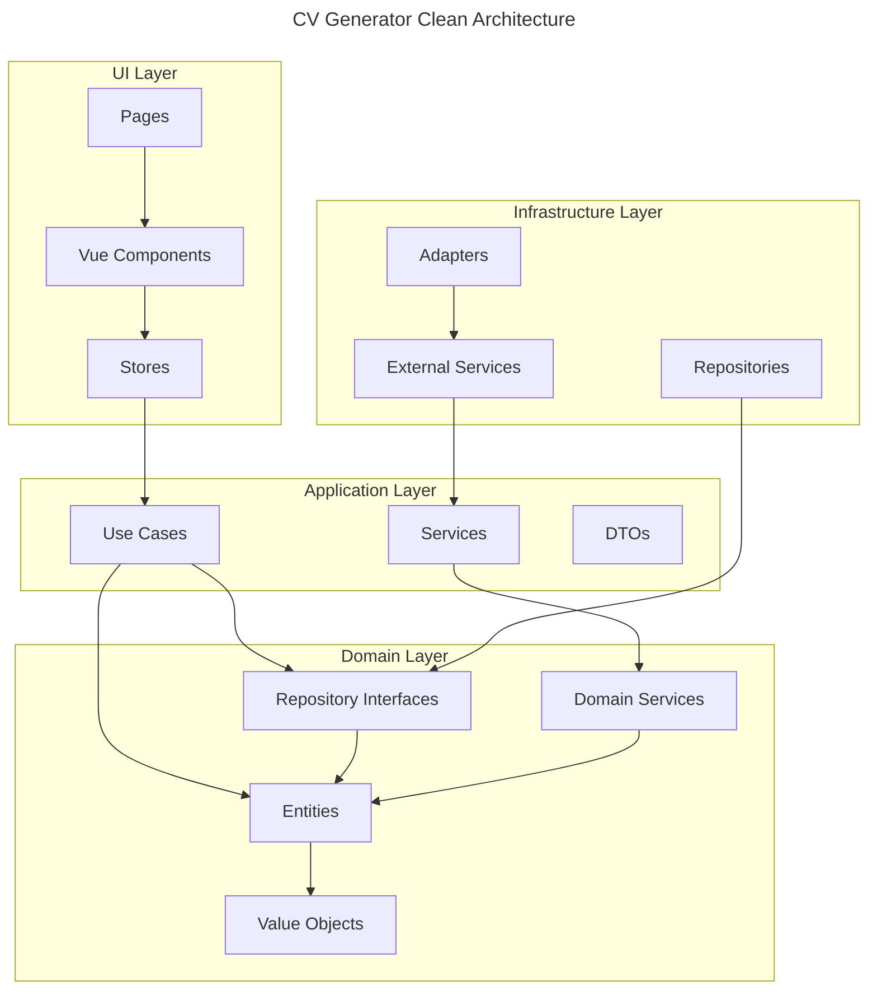

# CV Generator

[](https://github.com/giak/cv-generator/actions)
[](https://codecov.io/gh/giak/cv-generator)
[](https://github.com/giak/cv-generator/releases)
[](LICENSE)

> 💡 **Modern CV builder with JSON Resume support**

## Quick Start

```bash
# Installation
pnpm install

# Development
pnpm dev
```

## Table of Contents

- [Overview](#overview)
- [Features](#features)
- [Tech Stack](#tech-stack)
- [Getting Started](#getting-started)
  - [Prerequisites](#prerequisites)
  - [Installation](#installation)
  - [Development Commands](#development-commands)
- [Project Structure](#project-structure)
- [Architecture](#architecture)
  - [Key Principles](#key-principles)
  - [Clean Architecture](#clean-architecture)
  - [Domain-Driven Design](#domain-driven-design)
- [Development](#development)
  - [Testing Strategy](#testing-strategy)
  - [Code Style](#code-style)
  - [Contributing](#contributing)
- [Deployment](#deployment)
  - [Build](#build)
  - [Configuration](#configuration)
- [Maintenance](#maintenance)
  - [Known Issues](#known-issues)
  - [Troubleshooting](#troubleshooting)
  - [Update Procedures](#update-procedures)
  - [FAQ](#faq)
- [License](#license)
- [Acknowledgments](#acknowledgments)

## Overview

CV Generator is a modern web application that helps you create professional CVs using the JSON Resume standard. Built with Vue 3, TypeScript, and following Clean Architecture principles, it offers a seamless experience for creating, editing, and exporting CVs in multiple formats.

### Problem Statement

Managing and updating CVs in various formats can be challenging and time-consuming. Traditional word processors lack standardization and make it difficult to maintain consistent formatting across different versions.

### Solution

CV Generator provides a structured, standardized approach to CV creation using the JSON Resume format, combined with a modern, intuitive interface and real-time preview capabilities.

## Features

- 📝 **JSON Resume Format**

  - Standard-compliant schema
  - Validation and formatting
  - Import/Export support

- 🎨 **Modern UI/UX**

  - Real-time preview
  - Responsive design
  - Customizable themes

- 💾 **Data Management**

  - Local storage support
  - Offline capabilities
  - Auto-save functionality

- 📤 **Export Options**
  - PDF export
  - HTML export
  - JSON export

## Tech Stack

| Technology   | Version | Purpose            |
| ------------ | ------- | ------------------ |
| Vue.js       | 3.4+    | Frontend framework |
| TypeScript   | 5.7+    | Type safety        |
| Vite         | 6.1     | Build tool         |
| Tailwind CSS | 4.0     | Styling            |
| Vitest       | Latest  | Testing framework  |
| Pinia        | Latest  | State management   |

## Getting Started

### Prerequisites

- Node.js 22+
- pnpm 10+
- Modern web browser

### Installation

1. Clone the repository:

   ```bash
   git clone https://github.com/giak/cv-generator.git
   cd cv-generator
   ```

2. Install dependencies:

   ```bash
   pnpm install
   ```

3. Start development server:
   ```bash
   pnpm dev
   ```

### Development Commands

| Command         | Description              |
| --------------- | ------------------------ |
| `pnpm dev`      | Start development server |
| `pnpm build`    | Build for production     |
| `pnpm test`     | Run unit tests           |
| `pnpm test:e2e` | Run end-to-end tests     |
| `pnpm lint`     | Lint code                |
| `pnpm format`   | Format code              |

## Project Structure

```
cv-generator/
├── packages/
│   ├── core/           # Domain & Business Logic
│   │   ├── src/
│   │   │   ├── domain/
│   │   │   │   ├── entities/      # Business objects
│   │   │   │   ├── repositories/   # Repository interfaces
│   │   │   │   └── services/       # Domain services
│   │   │   └── application/
│   │   │       ├── useCases/       # Application use cases
│   │   │       └── services/       # Application services
│   │   └── __tests__/             # Core tests
│   │
│   ├── infrastructure/ # External Integrations
│   │   ├── src/
│   │   │   ├── repositories/       # Repository implementations
│   │   │   ├── services/          # External service integrations
│   │   │   └── adapters/          # External adapters
│   │   └── __tests__/             # Infrastructure tests
│   │
│   ├── shared/         # Shared Types & Utils
│   │   ├── src/
│   │   │   ├── types/             # Shared TypeScript types
│   │   │   ├── utils/             # Shared utilities
│   │   │   └── constants/         # Shared constants
│   │   └── __tests__/             # Shared module tests
│   │
│   └── ui/            # Vue 3 Frontend App
│       ├── src/
│       │   ├── assets/            # Static assets
│       │   ├── components/        # Shared components
│       │   ├── modules/           # Feature modules
│       │   │   └── cv/
│       │   │       ├── domain/    # Module-specific domain
│       │   │       ├── application/# Module-specific logic
│       │   │       └── presentation/# UI components
│       │   ├── stores/            # Pinia stores
│       │   └── types/             # UI-specific types
│       ├── e2e/                   # E2E tests
│       └── __tests__/             # Unit tests
│
├── docs/              # Project Documentation
│   ├── architecture/  # Architecture decisions
│   ├── api/          # API documentation
│   └── guides/       # Development guides
│
└── .github/          # GitHub Actions & Config
    ├── workflows/    # CI/CD pipelines
    └── environments/ # Environment configs
```

## Architecture



### Key Principles

1. **Clean Architecture**

   - Independent of frameworks
   - Testable by design
   - Independent of UI
   - Independent of database
   - Independent of external services

2. **Domain-Driven Design**

   - Rich domain model
   - Encapsulated business logic
   - Ubiquitous language
   - Bounded contexts

3. **SOLID Principles**

   - Single Responsibility
   - Open/Closed
   - Liskov Substitution
   - Interface Segregation
   - Dependency Inversion

4. **Testing Strategy**
   - Unit tests for domain logic
   - Integration tests for repositories
   - E2E tests for critical paths
   - Component tests for UI

## Development

### Testing Strategy

- **Unit Tests**: Core business logic and components
- **Integration Tests**: API and store interactions
- **E2E Tests**: Critical user flows
- **Component Tests**: UI components

### Code Style

- ESLint configuration
- Prettier formatting
- TypeScript strict mode
- Component conventions

### Contributing

1. Fork the repository
2. Create your feature branch
3. Commit your changes
4. Push to the branch
5. Create a Pull Request

> ℹ️ **Note:** Please read our [Contributing Guide](CONTRIBUTING.md) for details on our code of conduct and development process.

## Deployment

### Build

```bash
# Production build
pnpm build

# Preview build
pnpm preview
```

### Configuration

- Environment variables
- Build configuration
- Deployment platforms

## Maintenance

### Known Issues

- PDF export formatting with special characters
- 5MB local storage limitation
- [Track issues on GitHub](https://github.com/giak/cv-generator/issues)

### Troubleshooting

1. **Development Server Issues**

   - Clear node_modules: `pnpm clean && pnpm install`
   - Check Node.js version: `node --version`

2. **Build Problems**
   - Clear cache: `pnpm clean:cache`
   - Update dependencies: `pnpm update`

### Update Procedures

1. Update dependencies:

   ```bash
   pnpm update
   ```

2. Run tests:

   ```bash
   pnpm test
   ```

3. Check for breaking changes in [CHANGELOG.md](CHANGELOG.md)

### FAQ

**Q: Can I use npm instead of pnpm?**
A: Yes, but pnpm is recommended for better dependency management.

**Q: How do I customize themes?**
A: Edit files in `packages/ui/src/assets/themes/`.

**Q: What's the maximum CV size?**
A: Local storage limit is 5MB. Use export for larger files.

## License

[MIT License](LICENSE)

## Acknowledgments

- [JSON Resume](https://jsonresume.org/)
- [Vue.js](https://vuejs.org/)
- [Vite](https://vitejs.dev/)
