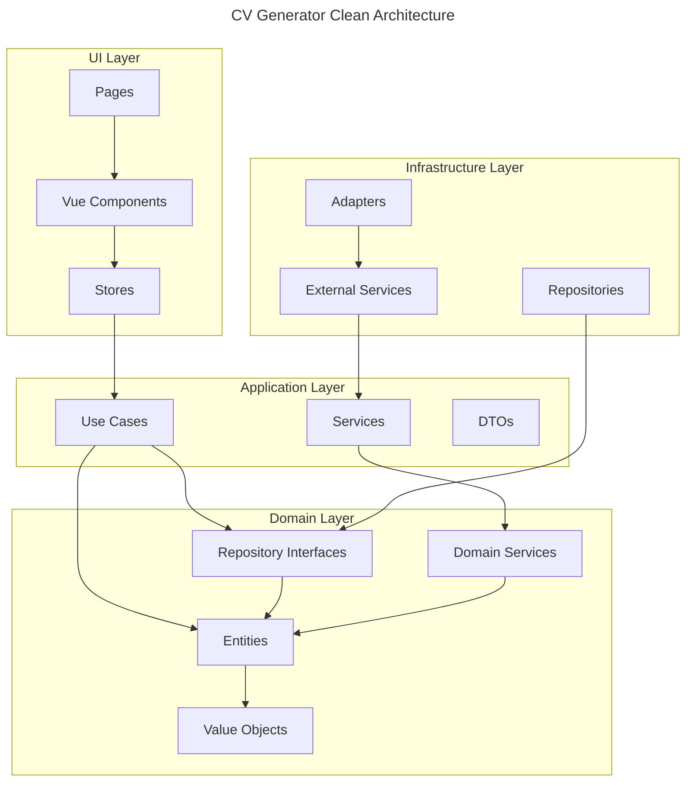

# CV Generator

[](https://github.com/giak/cv-generator/actions)
[](https://codecov.io/gh/giak/cv-generator)
[](https://github.com/giak/cv-generator/releases)
[](LICENSE)

> 💡 **Modern CV builder with JSON Resume support, real-time validation, and multiple export formats**


## Quick Start

```bash
# Installation
pnpm install

# Development
pnpm dev

# Visit http://localhost:3000
```

## Table of Contents

- [Overview](#overview)
- [Features](#features)
- [Tech Stack](#tech-stack)
- [Getting Started](#getting-started)
  - [Prerequisites](#prerequisites)
  - [Installation](#installation)
  - [Development Commands](#development-commands)
- [Usage](#usage)
  - [Creating a New CV](#creating-a-new-cv)
  - [Editing CV Sections](#editing-cv-sections)
  - [Exporting Your CV](#exporting-your-cv)
  - [Importing Existing Data](#importing-existing-data)
- [Project Structure](#project-structure)
- [Architecture](#architecture)
  - [Key Principles](#key-principles)
  - [Clean Architecture](#clean-architecture)
  - [Domain-Driven Design](#domain-driven-design)
- [Development](#development)
  - [Testing Strategy](#testing-strategy)
  - [Code Style](#code-style)
  - [Contributing](#contributing)
- [Deployment](#deployment)
  - [Build](#build)
  - [Configuration](#configuration)
  - [Supported Platforms](#supported-platforms)
- [Maintenance](#maintenance)
  - [Known Issues](#known-issues)
  - [Troubleshooting](#troubleshooting)
  - [Update Procedures](#update-procedures)
  - [FAQ](#faq)
- [License](#license)
- [Acknowledgments](#acknowledgments)

## Overview

CV Generator is a modern web application that helps you create professional CVs using the JSON Resume standard. Built with Vue 3, TypeScript, and following Clean Architecture principles, it offers a seamless experience for creating, editing, and exporting CVs in multiple formats.

### Problem Statement

Managing and updating CVs in various formats can be challenging and time-consuming. Traditional word processors lack standardization and make it difficult to maintain consistent formatting across different versions.

### Solution

CV Generator provides a structured, standardized approach to CV creation using the JSON Resume format, combined with a modern, intuitive interface and real-time preview capabilities.

## Features

- 📝 **JSON Resume Format**

  - Standard-compliant schema validation
  - Real-time error detection and formatting
  - Complete schema implementation
  - Import/Export support for interoperability

- 🎨 **Modern UI/UX**

  - Real-time preview of changes
  - Responsive design for all devices
  - Customizable themes and layouts
  - Drag-and-drop field organization

- 💾 **Data Management**

  - Automatic local storage backup
  - Offline capabilities with PWA support
  - Auto-save functionality with history
  - Version control for CV iterations

- 📤 **Export Options**
  - PDF export with customizable styles
  - HTML export for online publishing
  - JSON export for data portability
  - Multiple theme selection for exports

## Tech Stack

| Technology   | Version | Purpose                                         | Benefits                                            |
| ------------ | ------- | ----------------------------------------------- | --------------------------------------------------- |
| Vue.js       | 3.4+    | Frontend framework and component architecture   | Reactivity, composition API, TypeScript support     |
| TypeScript   | 5.7+    | Type safety and enhanced developer experience   | Strong typing, better IDE support, error prevention |
| Vite         | 5.0+    | Build tool and development server               | Fast HMR, efficient bundling, plugins               |
| Tailwind CSS | 4.0     | Utility-first styling framework                 | Responsive design, minimal CSS, customizability     |
| Vitest       | 1.6+    | Testing framework integrated with Vite          | Fast test execution, Vue component testing          |
| Pinia        | 2.1+    | State management with TypeScript support        | DevTools, modular stores, composition API           |
| Zod          | 3.22+   | Schema validation and runtime type checking     | Type inference, custom validations                  |
| pnpm         | 10+     | Package manager with monorepo workspace support | Efficient disk usage, workspaces, speed             |

## Getting Started

### Prerequisites

- Node.js 22+ (LTS recommended)
- pnpm 10+
- Modern web browser (Chrome, Firefox, Safari, Edge)
- Git (for development)

### Installation

1. Clone the repository:

   ```bash
   git clone https://github.com/giak/cv-generator.git
   cd cv-generator
   ```

2. Install dependencies:

   ```bash
   pnpm install
   ```

3. Start development server:
   ```bash
   pnpm dev
   ```
4. Open your browser:
   ```
   http://localhost:3000
   ```

### Development Commands

| Command          | Description                                | When to Use                       |
| ---------------- | ------------------------------------------ | --------------------------------- |
| `pnpm dev`       | Start development server                   | Local development                 |
| `pnpm build`     | Build for production                       | Preparing for deployment          |
| `pnpm test`      | Run unit tests                             | Verifying component functionality |
| `pnpm test:e2e`  | Run end-to-end tests                       | Testing user flows                |
| `pnpm lint`      | Lint code for errors and style issues      | Code quality checks               |
| `pnpm format`    | Format code according to project standards | Maintaining consistent style      |
| `pnpm storybook` | Run Storybook component explorer           | Component development and testing |

## Usage

### Creating a New CV

1. Click on "Create New CV" from the home screen
2. Choose a template for your CV
3. Fill in your basic information in the form
4. Navigate through sections using the sidebar
5. Save your progress at any time with the "Save" button


### Editing CV Sections

Each section of your CV can be edited independently:

- **Basics**: Personal information and contact details
- **Work Experience**: Your professional history
- **Education**: Academic background
- **Skills**: Technical and soft skills
- **Projects**: Significant projects you've worked on
- **Publications**: Papers, articles, or books
- **References**: Professional recommendations

All fields have real-time validation with helpful error messages.

### Exporting Your CV

1. Click the "Export" button in the top menu
2. Select your desired format:
   - PDF (for printing or sharing)
   - HTML (for web portfolios)
   - JSON (for data backup)
3. Choose a theme for your export
4. Download your completed CV

### Importing Existing Data

1. Click "Import" in the main menu
2. Select a JSON Resume file from your computer
3. Review and confirm the imported data
4. Make any necessary adjustments

## Project Structure

```
cv-generator/
├── packages/
│   ├── core/           # Domain & Business Logic
│   │   ├── src/
│   │   │   ├── domain/
│   │   │   │   ├── entities/      # Business objects
│   │   │   │   ├── repositories/   # Repository interfaces
│   │   │   │   └── services/       # Domain services
│   │   │   └── application/
│   │   │       ├── useCases/       # Application use cases
│   │   │       └── services/       # Application services
│   │   └── __tests__/             # Core tests
│   │
│   ├── infrastructure/ # External Integrations
│   │   ├── src/
│   │   │   ├── repositories/       # Repository implementations
│   │   │   ├── services/          # External service integrations
│   │   │   └── adapters/          # External adapters
│   │   └── __tests__/             # Infrastructure tests
│   │
│   ├── shared/         # Shared Types & Utils
│   │   ├── src/
│   │   │   ├── types/             # Shared TypeScript types
│   │   │   ├── utils/             # Shared utilities
│   │   │   └── constants/         # Shared constants
│   │   └── __tests__/             # Shared module tests
│   │
│   └── ui/            # Vue 3 Frontend App
│       ├── src/
│       │   ├── assets/            # Static assets
│       │   ├── components/        # Shared components
│       │   ├── modules/           # Feature modules
│       │   │   └── cv/
│       │   │       ├── domain/    # Module-specific domain
│       │   │       ├── application/# Module-specific logic
│       │   │       └── presentation/# UI components
│       │   ├── stores/            # Pinia stores
│       │   └── types/             # UI-specific types
│       ├── e2e/                   # E2E tests
│       └── __tests__/             # Unit tests
│
├── docs/              # Project Documentation
│   ├── architecture/  # Architecture decisions
│   ├── api/          # API documentation
│   └── guides/       # Development guides
│
└── .github/          # GitHub Actions & Config
    ├── workflows/    # CI/CD pipelines
    └── environments/ # Environment configs
```

Each package has its own responsibilities:

| Package        | Purpose                               | Key Files                                               |
| -------------- | ------------------------------------- | ------------------------------------------------------- |
| core           | Business logic and domain models      | `src/domain/entities/Resume.ts`                         |
| infrastructure | External services and persistence     | `src/repositories/LocalStorageRepository.ts`            |
| shared         | Common utilities and types            | `src/types/resume.interface.ts`                         |
| ui             | User interface and presentation logic | `src/modules/cv/presentation/components/BasicsForm.vue` |

## Architecture



### Key Principles

1. **Clean Architecture**

   - Independent of frameworks
   - Testable by design
   - Independent of UI
   - Independent of database
   - Independent of external services

2. **Domain-Driven Design**

   - Rich domain model
   - Encapsulated business logic
   - Ubiquitous language
   - Bounded contexts

3. **SOLID Principles**

   - **S**ingle Responsibility: Each class has one reason to change
   - **O**pen/Closed: Open for extension, closed for modification
   - **L**iskov Substitution: Subtypes must be substitutable for base types
   - **I**nterface Segregation: Clients shouldn't depend on interfaces they don't use
   - **D**ependency Inversion: High-level modules shouldn't depend on low-level modules

4. **Testing Strategy**
   - Unit tests for domain logic
   - Integration tests for repositories
   - E2E tests for critical paths
   - Component tests for UI

## Development

### Testing Strategy

Our application follows a comprehensive testing approach:

- **Unit Tests**: For all domain entities, services, and business logic

  ```bash
  pnpm test:unit
  ```

- **Component Tests**: For UI components and composables

  ```bash
  pnpm test:components
  ```

- **Integration Tests**: For store interactions and use cases

  ```bash
  pnpm test:integration
  ```

- **E2E Tests**: For critical user flows
  ```bash
  pnpm test:e2e
  ```

Test coverage requirements:

- Domain logic: 90%+ coverage
- UI components: 80%+ coverage
- Overall project: 75%+ coverage

### Code Style

We enforce strict code quality standards:

- ESLint configuration with TypeScript integration

  ```bash
  pnpm lint
  ```

- Prettier formatting

  ```bash
  pnpm format
  ```

- TypeScript strict mode with no implicit any
- Vue component conventions:
  - Composition API with `<script setup>`
  - Typed props and emits
  - Single-file components
  - Test co-location

### Contributing

1. Fork the repository
2. Create your feature branch
   ```bash
   git checkout -b feature/amazing-feature
   ```
3. Commit your changes following conventional commits
   ```bash
   git commit -m "feat: add amazing feature"
   ```
4. Push to the branch
   ```bash
   git push origin feature/amazing-feature
   ```
5. Create a Pull Request

> ℹ️ **Note:** Please read our [Contributing Guide](CONTRIBUTING.md) for details on our code of conduct and development process.

## Deployment

### Build

```bash
# Production build
pnpm build

# Preview build
pnpm preview
```

The production build creates optimized assets in the `dist/` directory.

### Configuration

Environment-specific configuration can be set up using:

- `.env` files for different environments
- Environment variables for sensitive information
- Runtime configuration via JSON files

Required environment variables:

- `VITE_API_URL`: API endpoint (if applicable)
- `VITE_STORAGE_PREFIX`: Prefix for localStorage keys
- `VITE_ENABLE_ANALYTICS`: Enable/disable analytics

### Supported Platforms

The application is designed to work on:

- **Deployment Platforms**:

  - Vercel
  - Netlify
  - GitHub Pages
  - Any static hosting service

- **Browsers**:
  - Chrome (latest 2 versions)
  - Firefox (latest 2 versions)
  - Safari (latest 2 versions)
  - Edge (latest 2 versions)

## Maintenance

### Known Issues

- PDF export formatting with special characters
  - Workaround: Use basic Latin characters for best results
- 5MB local storage limitation
  - Workaround: Export regularly to JSON and import when needed
- Font rendering differences across browsers
  - Workaround: Stick to system fonts for consistent display
- [Track issues on GitHub](https://github.com/giak/cv-generator/issues)

### Troubleshooting

1. **Development Server Issues**

   - Clear node_modules: `pnpm clean && pnpm install`
   - Check Node.js version: `node --version`
   - Verify Vite configuration: `vite.config.ts`

2. **Build Problems**

   - Clear cache: `pnpm clean:cache`
   - Update dependencies: `pnpm update`
   - Check for TypeScript errors: `pnpm typecheck`

3. **Data Loss Issues**
   - Check localStorage in browser DevTools
   - Verify exports work correctly
   - Consider enabling the debug mode: `localStorage.setItem('debug', 'true')`

### Update Procedures

1. Update dependencies:

   ```bash
   pnpm update
   ```

2. Run tests to ensure compatibility:

   ```bash
   pnpm test
   ```

3. Check for breaking changes in [CHANGELOG.md](CHANGELOG.md)

4. Update documentation if necessary:
   ```bash
   pnpm docs:build
   ```

### FAQ

**Q: Can I use npm or yarn instead of pnpm?**  
A: Yes, but pnpm is recommended for better dependency management and workspace support.

**Q: How do I customize themes?**  
A: Edit files in `packages/ui/src/assets/themes/` or create a new theme by copying an existing one.

**Q: What's the maximum CV size?**  
A: Local storage limit is 5MB. Use export for larger files.

**Q: Is my data stored on a server?**  
A: No, all data is stored locally in your browser. No server storage is used.

**Q: Can I share my CV directly from the app?**  
A: Currently, you need to export and share the file. Direct sharing is planned for a future release.

## License

[MIT License](LICENSE)

## Acknowledgments

- [JSON Resume](https://jsonresume.org/) for the standardized format
- [Vue.js](https://vuejs.org/) for the excellent frontend framework
- [Vite](https://vitejs.dev/) for the blazing fast development experience
- [Tailwind CSS](https://tailwindcss.com/) for the utility-first styling approach
- [Zod](https://zod.dev/) for the schema validation system
- All our contributors and community members
