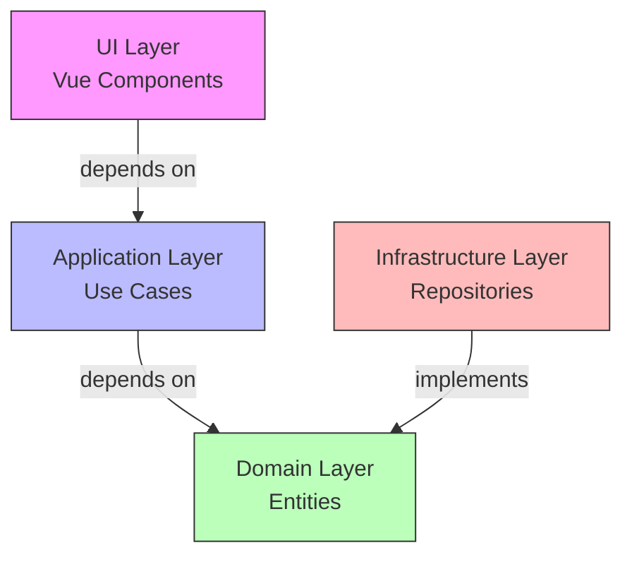
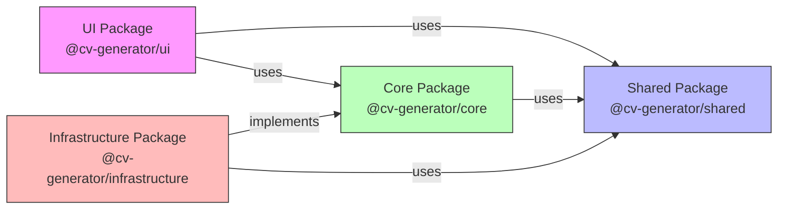

# Architecture for CV Generator

## Status: Draft

## Technical Summary

Le CV Generator est une application web moderne pour la création et la gestion de CV au format JSON Resume. L'architecture suit les principes de Clean Architecture et Domain-Driven Design (DDD) pour assurer une séparation claire des responsabilités, une maintenance facilitée et une évolution flexible du système.

L'application est structurée en modules indépendants suivant une architecture monorepo, permettant une séparation claire entre le domaine métier, l'interface utilisateur et l'infrastructure.

## Technology Table

| Technology      | Description                                 |
| --------------- | ------------------------------------------- |
| TypeScript 5.7+ | Langage principal avec typage strict        |
| Vue.js 3.4+     | Framework UI avec Composition API           |
| Vite 6+         | Build tool et dev server                    |
| Pinia           | State management                            |
| Tailwind CSS 4  | Utility-first CSS framework                 |
| Zod             | Validation de schéma et typage runtime      |
| Vitest          | Framework de test unitaire et d'intégration |
| Playwright      | Tests end-to-end                            |
| pnpm            | Package manager avec support workspaces     |
| Biome           | Linting et formatting                       |

## Architectural Diagrams

### Clean Architecture Overview



### Module Communication



## Data Models

### Domain Interfaces

```typescript
// Core Resume Types
export interface ResumeInterface {
  basics: BasicsInterface;
  work?: WorkInterface[];
  education?: EducationInterface[];
  skills?: SkillInterface[];
}

// Basics Section
export interface BasicsInterface {
  name: string;
  label?: string;
  email: string;
  phone?: string;
  url?: string;
  summary?: string;
  location?: LocationInterface;
  profiles?: ProfileInterface[];
}

// Validation Schema (Zod)
export const basicsSchema = z
  .object({
    name: z.string().min(1),
    label: z.string().optional(),
    email: z.string().email(),
    phone: z.string().optional(),
    url: z.string().url().optional(),
    summary: z.string().optional(),
    location: locationSchema.optional(),
    profiles: z.array(profileSchema).optional(),
  })
  .strict() as z.ZodType<BasicsInterface>;
```

### Domain Entities

```typescript
export class Resume {
  private constructor(private readonly data: ResumeInterface) {}

  static create(
    data: ResumeInterface
  ): ValidationResultType & { resume?: Resume } {
    const validation = resumeSchema.safeParse(data);
    // ... validation logic
  }

  toJSON(): ResumeInterface {
    return { ...this.data };
  }
}
```

## Project Structure

```
/
├── packages/                    # Monorepo workspace
│   ├── core/                   # Domain & Application layers
│   │   └── src/
│   │       └── modules/
│   │           └── cv/
│   │               ├── domain/     # Domain layer
│   │               │   ├── entities/   # Domain entities
│   │               │   ├── validators/ # Schema validation
│   │               │   └── shared/     # Shared domain logic
│   │               └── application/ # Application layer
│   │                   └── use-cases/  # Business use cases
│   ├── ui/                    # Presentation layer
│   │   └── src/
│   │       ├── components/    # Vue components
│   │       │   └── shared/    # Shared components
│   │       │       └── form/  # Form components
│   │       │           ├── Form.vue      # Base form component
│   │       │           └── FormField.vue # Reusable form field
│   │       ├── modules/       # Feature modules
│   │       │   └── cv/       # CV module
│   │       │       └── presentation/
│   │       │           ├── components/
│   │       │           │   └── BasicsForm.vue
│   │       │           └── composables/
│   │       │               ├── useFieldValidation.ts
│   │       │               └── useModelUpdate.ts
│   │       └── stores/       # Pinia stores
│   │           └── resume.ts
│   ├── infrastructure/        # Infrastructure layer
│   │   └── src/
│   │       ├── repositories/  # Data persistence
│   │       └── services/     # External services
│   └── shared/               # Shared utilities
│       └── src/
│           ├── types/        # Shared TypeScript types
│           └── validators/   # Shared validation schemas
```

### Package Responsibilities

#### Core (@cv-generator/core)

- Entités du domaine
- Logique métier
- Validation des données
- Use cases
- Interfaces des repositories

#### UI (@cv-generator/ui)

- Composants Vue.js
  - Composants partagés réutilisables (`Form`, `FormField`)
  - Composants spécifiques aux modules (`BasicsForm`)
- Composables pour la logique réutilisable
  - Validation des champs (`useFieldValidation`)
  - Gestion du v-model (`useModelUpdate`)
- Gestion d'état avec Pinia
- Styles avec Tailwind CSS v4
  - Variables CSS pour le theming
  - Plugins forms, typography, aspect-ratio
  - Support de l'accessibilité

#### Infrastructure (@cv-generator/infrastructure)

- Implémentation des repositories
- Gestion de la persistence
- Services externes
- Adapters

#### Shared (@cv-generator/shared)

- Types partagés
- Utilitaires communs
- Constants
- Helpers

## Change Log

| Change                     | Story ID | Description                                                                  |
| -------------------------- | -------- | ---------------------------------------------------------------------------- |
| Initial Architecture       | story-1  | Setup initial project structure and core architecture                        |
| Core Domain Implementation | story-2  | Implementation of Basics entity with validation                              |
| Remove Barrel Files        | story-2  | Removed index.ts files and updated import conventions                        |
| Form Components            | story-2  | Added shared form components (Form, FormField) and BasicsForm implementation |
| Composables                | story-2  | Added validation and model update composables with tests                     |
| UI Architecture Update     | story-2  | Enhanced component architecture with form validation system                  |

## Future Considerations

### Component Library

- Documentation des composants avec Storybook
- Tests d'accessibilité automatisés
- Guidelines de design system
- Support des thèmes personnalisés
- Validation de formulaire avancée

### Performance

- Lazy loading des composants
- Optimisation des re-renders
- Memoization des calculs coûteux
- Bundle splitting intelligent

### Security

- Validation stricte des entrées
- Sanitization des sorties
- Protection XSS
- Audit des dépendances

### Maintainability

- Tests exhaustifs
- Documentation complète
- Standards de code stricts
- Monitoring et logging
