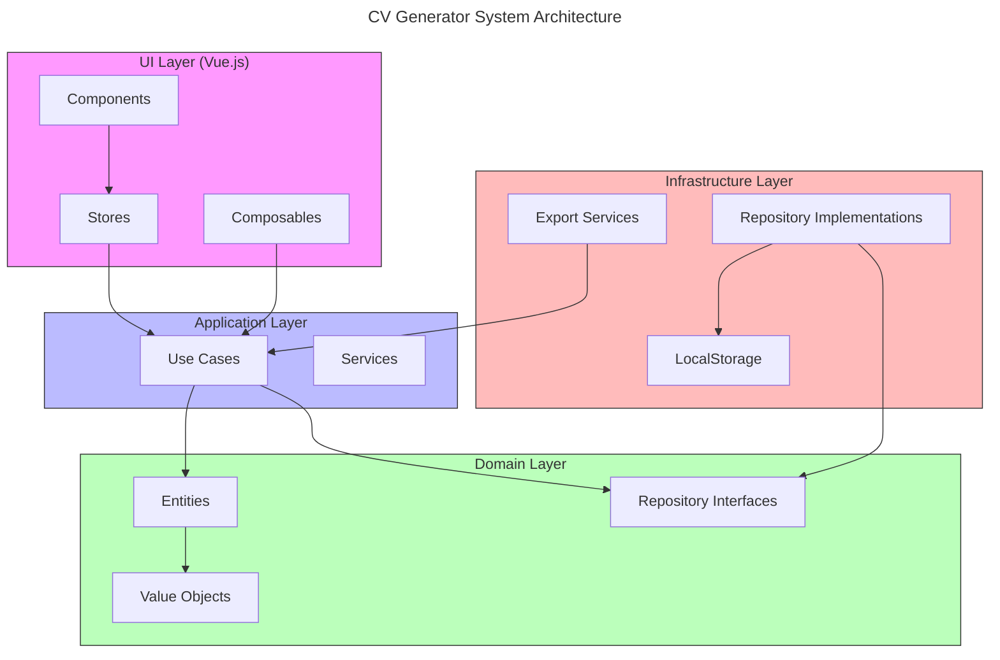
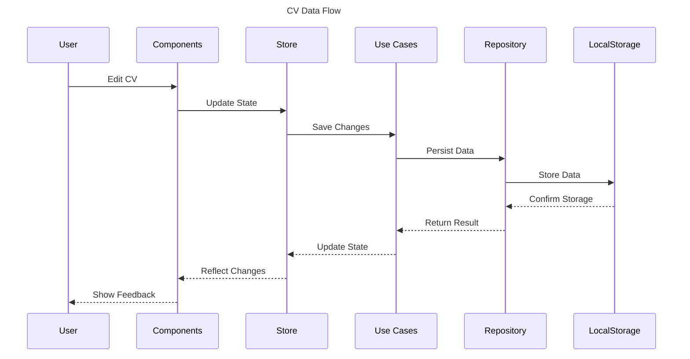

# Architecture for CV Generator

## Status: Approved

## Technical Summary

Le CV Generator est une application web moderne pour la création et la gestion de CV au format JSON Resume. L'architecture suit les principes de Clean Architecture et Domain-Driven Design (DDD) pour assurer une séparation claire des responsabilités, une maintenance facilitée et une évolution flexible du système.

### Key Architectural Decisions

1. **Clean Architecture**

   - Séparation stricte des couches (UI, Application, Domain, Infrastructure)
   - Dépendances orientées vers l'intérieur
   - Inversion de dépendance pour les repositories

2. **Domain-Driven Design**

   - Entités riches avec logique métier encapsulée
   - Value Objects pour les types complexes
   - Agrégats pour maintenir la cohérence

3. **Monorepo Structure**
   - Packages indépendants avec responsabilités claires
   - Shared utilities pour la réutilisation
   - Tests co-localisés avec le code

## Technology Table

| Technology   | Version | Description                             | Status |
| ------------ | ------- | --------------------------------------- | ------ |
| TypeScript   | 5.7+    | Langage principal avec typage strict    | ✅     |
| Vue.js       | 3.4+    | Framework UI avec Composition API       | ✅     |
| Vite         | 6+      | Build tool et dev server                | ✅     |
| Pinia        | 2.1+    | State management                        | ✅     |
| Tailwind CSS | 4.0     | Utility-first CSS framework             | ✅     |
| Zod          | 3.22+   | Validation de schéma et typage runtime  | ✅     |
| Vitest       | 1.6+    | Framework de test                       | ✅     |
| Playwright   | Latest  | Tests end-to-end                        | 🚧     |
| pnpm         | 10+     | Package manager avec support workspaces | ✅     |
| Biome        | Latest  | Linting et formatting                   | ✅     |

## Architectural Diagrams

### System Overview



### Data Flow



## Data Models

### Core Interfaces

```typescript
// Resume Domain Model
export interface ResumeInterface {
  basics: BasicsInterface;
  work?: WorkInterface[];
  education?: EducationInterface[];
  skills?: SkillInterface[];
}

// Basics Section
export interface BasicsInterface {
  name: string;
  label?: string;
  email: string;
  phone?: string;
  url?: string;
  summary?: string;
  location?: LocationInterface;
  profiles?: ProfileInterface[];
}

// Validation Schema (Zod)
export const basicsSchema = z
  .object({
    name: z.string().min(1),
    label: z.string().optional(),
    email: z.string().email(),
    phone: z.string().optional(),
    url: z.string().url().optional(),
    summary: z.string().optional(),
    location: locationSchema.optional(),
    profiles: z.array(profileSchema).optional(),
  })
  .strict();
```

## Project Structure

```
/
├── packages/                    # Monorepo workspace
│   ├── core/                   # Domain & Application layers
│   │   └── src/
│   │       └── modules/
│   │           └── cv/
│   │               ├── domain/     # Domain layer
│   │               │   ├── entities/   # Domain entities
│   │               │   ├── validators/ # Schema validation
│   │               │   └── shared/     # Shared domain logic
│   │               └── application/ # Application layer
│   │                   └── use-cases/  # Business use cases
│   ├── ui/                    # Presentation layer
│   │   └── src/
│   │       ├── components/    # Vue components
│   │       │   └── shared/    # Shared components
│   │       │       └── form/  # Form components
│   │       ├── modules/       # Feature modules
│   │       │   └── cv/       # CV module
│   │       │       └── presentation/
│   │       │           ├── components/
│   │       │           └── composables/
│   │       └── stores/       # Pinia stores
│   ├── infrastructure/        # Infrastructure layer
│   │   └── src/
│   │       ├── repositories/  # Data persistence
│   │       └── services/     # External services
│   └── shared/               # Shared utilities
│       └── src/
│           ├── types/        # Shared TypeScript types
│           └── validators/   # Shared validation schemas
```

### Package Responsibilities

#### Core (@cv-generator/core)

- Entités du domaine et logique métier
- Validation des données
- Use cases et interfaces des repositories

#### UI (@cv-generator/ui)

- Composants Vue.js et composables
- Gestion d'état avec Pinia
- Styles avec Tailwind CSS

#### Infrastructure (@cv-generator/infrastructure)

- Implémentation des repositories
- Services externes et adapters

#### Shared (@cv-generator/shared)

- Types et utilitaires partagés
- Schémas de validation

## Change Log

| Change                     | Story ID | Description                                           |
| -------------------------- | -------- | ----------------------------------------------------- |
| Initial Architecture       | story-1  | Setup initial project structure and core architecture |
| Core Domain Implementation | story-2  | Implementation of Basics entity with validation       |
| Form Components            | story-2  | Added shared form components and BasicsForm           |
| Composables                | story-2  | Added validation and model update composables         |
| Remove Barrel Files        | story-2  | Removed index.ts files for better maintainability     |
| UI Architecture Update     | story-2  | Enhanced component architecture with validation       |

## Future Considerations

### Technical Roadmap

1. **Component Library**

   - Documentation avec Storybook
   - Tests d'accessibilité
   - Design system guidelines

2. **Performance**

   - Lazy loading
   - Bundle splitting
   - Optimisation des re-renders

3. **Security**

   - Validation stricte
   - Protection XSS
   - Audit des dépendances

4. **Maintainability**
   - Tests exhaustifs
   - Documentation complète
   - Monitoring et logging
