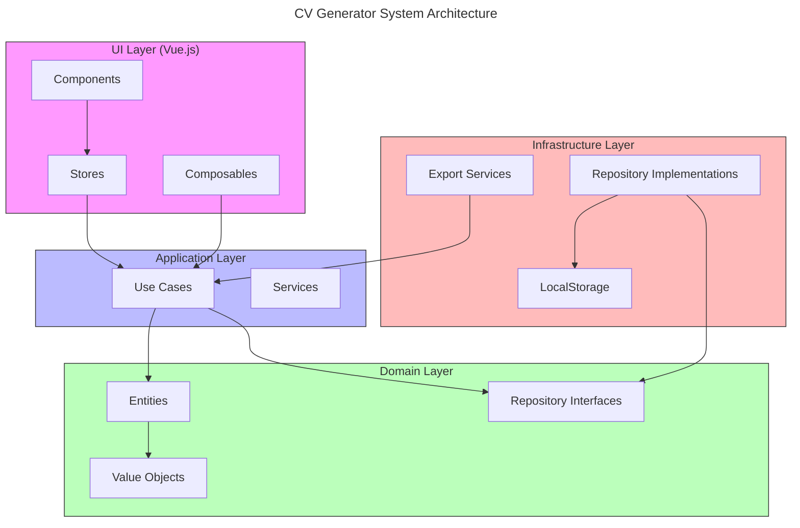
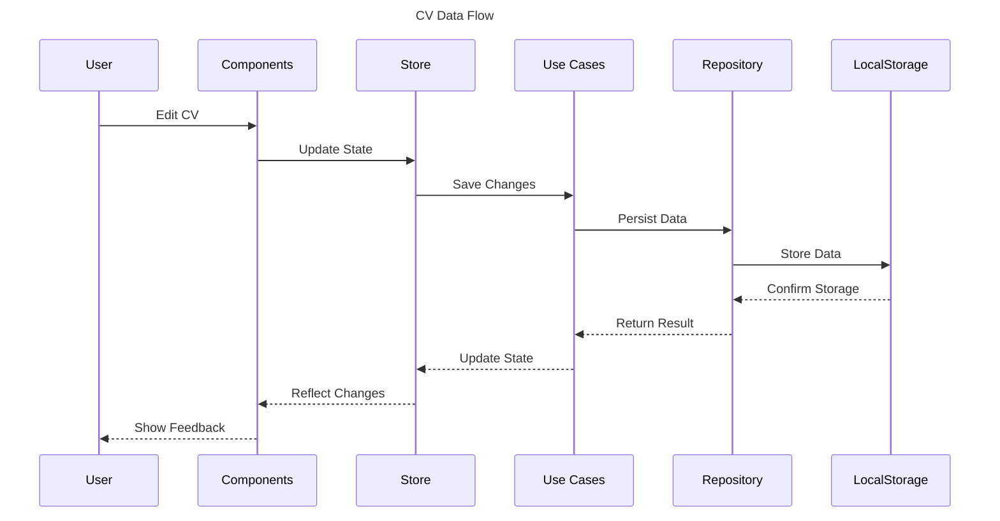
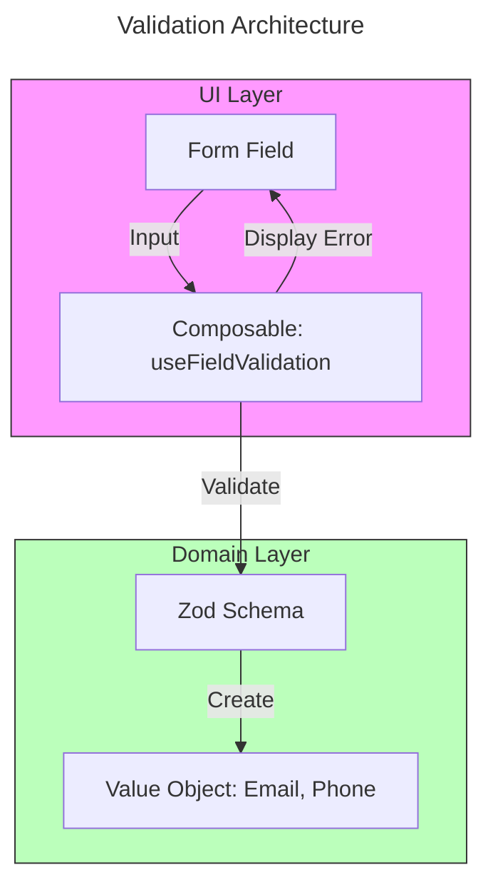

# Architecture for CV Generator

## Status: Approved

## Technical Summary

Le CV Generator est une application web moderne pour la création et la gestion de CV au format JSON Resume. L'architecture suit les principes de Clean Architecture et Domain-Driven Design (DDD) pour assurer une séparation claire des responsabilités, une maintenance facilitée et une évolution flexible du système.

### Key Architectural Decisions

1. **Clean Architecture**

   - Séparation stricte des couches (UI, Application, Domain, Infrastructure)
   - Dépendances orientées vers l'intérieur
   - Inversion de dépendance pour les repositories

2. **Domain-Driven Design**

   - Entités riches avec logique métier encapsulée
   - Value Objects pour les types complexes (Email, Phone)
   - Agrégats pour maintenir la cohérence (Resume)

3. **Monorepo Structure**

   - Packages indépendants avec responsabilités claires
   - Shared utilities pour la réutilisation
   - Tests co-localisés avec le code

4. **Validation Strategy**
   - Validation de schéma avec Zod
   - Composables spécialisés pour la validation des formulaires
   - Validation en temps réel avec feedback utilisateur
   - Séparation entre validation UI et validation domaine

## Technology Table

| Technology   | Version | Description                             | Status      |
| ------------ | ------- | --------------------------------------- | ----------- |
| TypeScript   | 5.7+    | Langage principal avec typage strict    | ✅ Utilisé  |
| Vue.js       | 3.4+    | Framework UI avec Composition API       | ✅ Utilisé  |
| Vite         | 5.0+    | Build tool et dev server                | ✅ Utilisé  |
| Pinia        | 2.1+    | State management                        | ✅ Utilisé  |
| Tailwind CSS | 4.0     | Utility-first CSS framework             | ✅ Utilisé  |
| Zod          | 3.22+   | Validation de schéma et typage runtime  | ✅ Utilisé  |
| Vitest       | 1.6+    | Framework de test                       | ✅ Utilisé  |
| Playwright   | Latest  | Tests end-to-end                        | 🚧 Planifié |
| pnpm         | 10+     | Package manager avec support workspaces | ✅ Utilisé  |
| ESLint       | Latest  | Linting du code                         | ✅ Utilisé  |
| Prettier     | Latest  | Formatting du code                      | ✅ Utilisé  |

## Architectural Diagrams

### System Overview



### Data Flow



### Form Validation Flow



## Data Models

### Core Interfaces

```typescript
// Resume Domain Model
export interface ResumeInterface {
  basics: BasicsInterface;
  work?: WorkInterface[];
  education?: EducationInterface[];
  skills?: SkillInterface[];
}

// Basics Section
export interface BasicsInterface {
  name: string;
  label?: string;
  email: string;
  phone?: string;
  url?: string;
  summary?: string;
  location?: LocationInterface;
  profiles?: ProfileInterface[];
}

// Validation Schema (Zod)
export const basicsSchema = z
  .object({
    name: z.string().min(1, "Le nom est requis"),
    label: z.string().optional(),
    email: z.string().email("Format email invalide"),
    phone: z.string().optional(),
    url: z.string().url("Format URL invalide").optional(),
    summary: z.string().optional(),
    location: locationSchema.optional(),
    profiles: z.array(profileSchema).optional(),
  })
  .strict();
```

### Key Composables

```typescript
// useFieldValidation - Composable pour valider un champ individuel
export function useFieldValidation<T>(
  schema: z.ZodType<T>,
  options?: ValidationOptions
) {
  const error = ref<string>("");
  const isValid = ref<boolean>(true);

  const validate = async (value: unknown): Promise<boolean> => {
    const result = await schema.safeParseAsync(value);
    isValid.value = result.success;
    error.value = result.success ? "" : formatError(result.error);
    return isValid.value;
  };

  return { validate, error, isValid };
}

// useCVFieldValidation - Composable spécialisé pour les champs CV
export function useCVFieldValidation() {
  const errors = ref<Record<string, string>>({});

  const validateField = (field: string, value: unknown): boolean => {
    // Validation spécifique au champ
    // ...
    return true;
  };

  const validateForm = (data: Record<string, unknown>): boolean => {
    // Validation du formulaire complet
    // ...
    return true;
  };

  return { validateField, validateForm, errors };
}
```

## Project Structure

```
/
├── packages/                    # Monorepo workspace
│   ├── core/                   # Domain & Application layers
│   │   └── src/
│   │       └── modules/
│   │           └── cv/
│   │               ├── domain/     # Domain layer
│   │               │   ├── entities/   # Domain entities
│   │               │   │   └── Resume.ts # Entité principale
│   │               │   ├── value-objects/ # Value Objects
│   │               │   │   ├── Email.ts
│   │               │   │   └── Phone.ts
│   │               │   └── shared/     # Shared domain logic
│   │               └── application/ # Application layer
│   │                   └── use-cases/  # Business use cases
│   │                       └── ManageResume.ts # Cas d'utilisation principal
│   ├── ui/                    # Presentation layer
│   │   └── src/
│   │       ├── components/    # Vue components
│   │       │   └── shared/    # Shared components
│   │       │       └── form/  # Form components
│   │       │           ├── Form.vue    # Composant formulaire
│   │       │           └── FormField.vue # Champ de formulaire
│   │       ├── modules/       # Feature modules
│   │       │   └── cv/       # CV module
│   │       │       └── presentation/
│   │       │           ├── components/   # Composants de présentation
│   │       │           │   ├── BasicsForm.vue # Formulaire informations de base
│   │       │           │   └── __tests__/   # Tests co-localisés
│   │       │           ├── composables/   # Logique réutilisable
│   │       │           │   ├── useCVFieldValidation.ts # Validation spécifique CV
│   │       │           │   ├── useModelUpdate.ts # Gestion des modèles
│   │       │           │   └── __tests__/  # Tests des composables
│   │       │           └── stores/      # Stores Pinia
│   │       │               └── resume.ts  # Store principal
│   │       └── App/       # Application root
│   │           └── App.vue  # Composant principal
│   ├── infrastructure/        # Infrastructure layer
│   │   └── src/
│   │       ├── repositories/  # Data persistence
│   │       │   └── LocalStorageResumeRepository.ts # Stockage local
│   │       └── services/     # External services
│   └── shared/               # Shared utilities
│       └── src/
│           ├── types/        # Shared TypeScript types
│           │   └── resume.interface.ts # Interfaces partagées
│           └── validators/   # Shared validation schemas
│               └── resumeSchema.ts # Schémas Zod
```

### Package Responsibilities

#### Core (@cv-generator/core)

- Entités du domaine et logique métier
- Validation des données
- Use cases et interfaces des repositories

#### UI (@cv-generator/ui)

- Composants Vue.js et composables
- Gestion d'état avec Pinia
- Styles avec Tailwind CSS
- Tests unitaires co-localisés

#### Infrastructure (@cv-generator/infrastructure)

- Implémentation des repositories
- Services externes et adapters
- Persistence des données (LocalStorage)

#### Shared (@cv-generator/shared)

- Types et utilitaires partagés
- Schémas de validation
- Interfaces communes

## Change Log

| Change                       | Story ID | Description                                                 |
| ---------------------------- | -------- | ----------------------------------------------------------- |
| Initial Architecture         | story-1  | Setup initial project structure and core architecture       |
| Core Domain Implementation   | story-2  | Implementation of Basics entity with validation             |
| Form Components              | story-3  | Added shared form components and BasicsForm                 |
| Composables                  | story-3  | Added validation and model update composables               |
| Remove Barrel Files          | story-2  | Removed index.ts files for better maintainability           |
| UI Architecture Update       | story-3  | Enhanced component architecture with validation             |
| Field Validation Composables | story-4  | Specialized composables for form validation                 |
| CV Store Implementation      | story-4  | Added Pinia store for CV state management                   |
| Test Co-location             | story-4  | Moved tests next to their respective components/composables |
| Use Case Implementation      | story-4  | ManageResume use case for persistence                       |

## Future Considerations

### Technical Roadmap

1. **Component Library**

   - Documentation avec Storybook
   - Tests d'accessibilité
   - Design system guidelines

2. **Performance**

   - Lazy loading
   - Bundle splitting
   - Optimisation des re-renders

3. **Security**

   - Validation stricte
   - Protection XSS
   - Audit des dépendances

4. **Maintainability**

   - Tests exhaustifs
   - Documentation complète
   - Monitoring et logging

5. **Export Capabilities**
   - Génération PDF
   - Export HTML responsive
   - Options de personnalisation
