# Architecture for CV Generator

## Status: Approved

## Technical Summary

Le CV Generator est une application web moderne pour la création et la gestion de CV au format JSON Resume. L'architecture suit les principes de Clean Architecture et Domain-Driven Design (DDD) pour assurer une séparation claire des responsabilités, une maintenance facilitée et une évolution flexible du système.

### Key Architectural Decisions

1. **Clean Architecture**

   - Séparation stricte des couches (UI, Application, Domain, Infrastructure)
   - Dépendances orientées vers l'intérieur
   - Inversion de dépendance pour les repositories

2. **Domain-Driven Design**

   - Organisation par bounded contexts (CV, Export, User)
   - Entités riches avec logique métier encapsulée
   - Value Objects pour les types complexes (Email, Phone)
   - Agrégats pour maintenir la cohérence (Resume)
   - Interfaces de ports explicites dans chaque bounded context

3. **Monorepo Structure**

   - Packages indépendants avec responsabilités claires
   - Shared utilities pour la réutilisation
   - Tests co-localisés avec le code

4. **Validation Strategy**
   - Validation de schéma avec Zod
   - Composables spécialisés pour la validation des formulaires
   - Validation en temps réel avec feedback utilisateur
   - Séparation entre validation UI et validation domaine

## Technology Table

| Technology   | Version | Description                             | Status      |
| ------------ | ------- | --------------------------------------- | ----------- |
| TypeScript   | 5.7+    | Langage principal avec typage strict    | ✅ Utilisé  |
| Vue.js       | 3.4+    | Framework UI avec Composition API       | ✅ Utilisé  |
| Vite         | 5.0+    | Build tool et dev server                | ✅ Utilisé  |
| Pinia        | 2.1+    | State management                        | ✅ Utilisé  |
| Tailwind CSS | 4.0     | Utility-first CSS framework             | ✅ Utilisé  |
| Zod          | 3.22+   | Validation de schéma et typage runtime  | ✅ Utilisé  |
| Vitest       | 1.6+    | Framework de test                       | ✅ Utilisé  |
| Playwright   | Latest  | Tests end-to-end                        | 🚧 Planifié |
| pnpm         | 10+     | Package manager avec support workspaces | ✅ Utilisé  |
| ESLint       | Latest  | Linting du code                         | ✅ Utilisé  |
| Prettier     | Latest  | Formatting du code                      | ✅ Utilisé  |

## Architectural Diagrams

### System Overview

```mermaid
---
title: CV Generator System Architecture
---
graph TD
    %% Légende en haut
    subgraph LEGEND["🔍 Légende"]
        direction LR
        L1["➡️ : Dépend de"]
        L2["--➡️ : Implémente"]
        L3["💎 Domain Layer: Règles métier"]
        L4["⚙️ Application Layer: Orchestration"]
        L5["🔄 Interface Adapters: Conversion"]
        L6["🖥️ Frameworks & Drivers: UI et systèmes externes"]
    end

    %% Les couches de Clean Architecture
    subgraph UI["🖥️ Frameworks & Drivers Layer (External)"]
        direction TB
        C1[UI Components]
        COM[Composables]
        RT[Routes]
        style UI fill:#e6ffec,stroke:#333,stroke-width:2px

        %% Sous-groupe pour les composants UI par bounded context
        subgraph UI_COMPONENTS["UI Components by Context"]
            CV_COMP["CV Editor Components"]
            EXP_COMP["Export Components"]
            USR_COMP["User Profile Components"]
        end
    end

    subgraph ADAPT["🔄 Interface Adapters Layer"]
        direction TB
        STORE[Pinia Stores]
        PRES[Presenters]
        CONT[Controllers]
        style ADAPT fill:#e6e6ff,stroke:#333,stroke-width:2px

        %% Sous-groupe pour les stores par bounded context
        subgraph STORES["Stores by Context"]
            CV_STORE["CV Store"]
            EXP_STORE["Export Store"]
            USR_STORE["User Store"]
        end
    end

    subgraph APP["⚙️ Application Layer (Use Cases)"]
        direction TB
        style APP fill:#fff0e6,stroke:#333,stroke-width:2px

        subgraph CV_APP["CV Bounded Context"]
            CV_UC["Use Cases:
            - CreateResume
            - UpdateResume
            - ValidateResume"]
        end

        subgraph EXP_APP["Export Bounded Context"]
            EXP_UC["Use Cases:
            - ExportResume
            - ChooseFormat
            - PreviewExport"]
        end

        subgraph USR_APP["User Bounded Context"]
            USR_UC["Use Cases:
            - ManagePreferences
            - StoreUserData"]
        end

        subgraph SHR_APP["Shared Application"]
            SHR_SVC["Services:
            - ValidationService
            - NotificationService"]
        end
    end

    subgraph DOMAIN["💎 Domain Layer (Entities)"]
        direction TB
        style DOMAIN fill:#f5e6ff,stroke:#333,stroke-width:2px,stroke-dasharray: 5 5

        subgraph CV_DOM["CV Domain"]
            CV_ENT["Entities:
            - Resume
            - WorkExperience
            - Education"]
            CV_VO["Value Objects:
            - Email
            - Phone
            - Date"]
            CV_PORTS["Repository Ports:
            - ResumeRepository
            - TemplateRepository"]
        end

        subgraph EXP_DOM["Export Domain"]
            EXP_ENT["Entities:
            - ExportFormat
            - ExportTemplate"]
            EXP_PORTS["Service Ports:
            - ExportService
            - FormatConverter"]
        end

        subgraph USR_DOM["User Domain"]
            USR_ENT["Entities:
            - User
            - UserPreferences"]
            USR_PORTS["Repository Ports:
            - UserRepository
            - PreferencesRepository"]
        end

        subgraph SHR_DOM["Shared Domain"]
            SHR_ERR["Errors:
            - ValidationError
            - ApplicationError"]
            SHR_VO["Value Objects:
            - Result
            - Identifier"]
        end
    end

    subgraph INFRA["🔧 Infrastructure Layer (Implementations)"]
        direction TB
        style INFRA fill:#fff8e6,stroke:#333,stroke-width:2px

        LS["LocalStorage Implementation"]
        EXS["Export Services Implementation"]
        REP["Repository Implementations:
        - LocalStorageResumeRepository
        - LocalStorageUserRepository"]
        API["API Clients"]
    end

    %% Relations entre les couches (Les flèches vont de l'extérieur vers l'intérieur selon Clean Architecture)

    %% UI dépend des Interface Adapters
    C1 -->|"uses"| PRES
    C1 -->|"interacts with"| STORE
    COM -->|"calls"| CONT
    CV_COMP -->|"bound to"| CV_STORE
    EXP_COMP -->|"bound to"| EXP_STORE
    USR_COMP -->|"bound to"| USR_STORE

    %% Interface Adapters dépendent des Use Cases
    STORE -->|"executes"| CV_UC
    STORE -->|"executes"| EXP_UC
    STORE -->|"executes"| USR_UC
    CONT -->|"calls"| CV_UC
    CONT -->|"calls"| EXP_UC
    PRES -->|"formats data from"| CV_UC
    PRES -->|"formats data from"| SHR_SVC

    %% Application Use Cases dépendent du Domain
    CV_UC -->|"uses"| CV_ENT
    CV_UC -->|"interacts via"| CV_PORTS
    EXP_UC -->|"uses"| EXP_ENT
    EXP_UC -->|"interacts via"| EXP_PORTS
    USR_UC -->|"uses"| USR_ENT
    USR_UC -->|"interacts via"| USR_PORTS
    SHR_SVC -->|"uses"| SHR_ERR
    SHR_SVC -->|"uses"| SHR_VO

    %% Domain shared dependencies
    CV_ENT -->|"uses"| SHR_VO
    EXP_ENT -->|"uses"| SHR_VO
    USR_ENT -->|"uses"| SHR_VO
    CV_UC -->|"throws"| SHR_ERR

    %% Infrastructure implements domain ports (Inversion de dépendance)
    REP -.->|"implements"| CV_PORTS
    REP -.->|"implements"| USR_PORTS
    EXS -.->|"implements"| EXP_PORTS

    %% Infrastructure details
    REP -->|"uses"| LS
    REP -->|"uses"| API
    EXS -->|"uses"| API
```



### Bounded Contexts Structure

```mermaid
---
title: DDD Bounded Contexts
---
graph TD
    %% Légende en haut
    subgraph LEGEND["🔍 Légende des Bounded Contexts"]
        direction LR
        L1["➡️ : Dépend de"]
        L2["📦 Bounded Context: domaine métier isolé"]
        L3["🔄 Application: orchestration des cas d'usage"]
        L4["💎 Domain: entités, value objects, règles métier"]
        L5["🔌 Ports: interfaces pour l'infrastructure"]
    end

    subgraph CV["📄 CV Bounded Context"]
        direction TB
        CVD["💎 Domain:
        - Resume
        - WorkExperience
        - Education
        - Email (Value Object)"]
        CVA["🔄 Application:
        - CreateResume
        - UpdateResume
        - ValidateResume"]
        CVP["🔌 Ports:
        - ResumeRepository
        - TemplateRepository"]
        style CV fill:#e6ffec,stroke:#333,stroke-width:2px
    end

    subgraph EXP["📤 Export Bounded Context"]
        direction TB
        EXPD["💎 Domain:
        - ExportFormat
        - ExportTemplate"]
        EXPA["🔄 Application:
        - ExportResume
        - ChooseFormat"]
        EXPP["🔌 Ports:
        - ExportService
        - FormatConverter"]
        style EXP fill:#e6e6ff,stroke:#333,stroke-width:2px
    end

    subgraph USR["👤 User Bounded Context"]
        direction TB
        USRD["💎 Domain:
        - User
        - UserPreferences"]
        USRA["🔄 Application:
        - ManagePreferences
        - StoreUserData"]
        USRP["🔌 Ports:
        - UserRepository
        - PreferencesRepository"]
        style USR fill:#fff0e6,stroke:#333,stroke-width:2px
    end

    subgraph SHR["🔄 Shared"]
        direction TB
        SHRD["💎 Domain:
        - ValidationError
        - Result
        - Identifier"]
        SHRA["🔄 Application:
        - ValidationService
        - NotificationService"]
        style SHR fill:#f5e6ff,stroke:#333,stroke-width:2px
    end

    %% Relations internes dans chaque context
    CVA -->|"utilise"| CVD
    CVA -->|"dépend de"| CVP
    EXPA -->|"utilise"| EXPD
    EXPA -->|"dépend de"| EXPP
    USRA -->|"utilise"| USRD
    USRA -->|"dépend de"| USRP

    %% Relations avec le contexte partagé
    CVD -->|"utilise"| SHRD
    EXPD -->|"utilise"| SHRD
    USRD -->|"utilise"| SHRD
    CVA -->|"utilise"| SHRA
    EXPA -->|"utilise"| SHRA
    USRA -->|"utilise"| SHRA
```



### Data Flow


### Form Validation Flow

```mermaid
---
title: Validation Architecture
---
graph TD
    %% Légende en haut
    subgraph LEGEND["🔍 Légende du flux de validation"]
        direction LR
        L1["➡️ : Flux de données"]
        L2["🖼️ UI Layer: Interface utilisateur"]
        L3["💎 Domain Layer: Règles métier"]
        L4["✅ Validation: Vérification des données"]
    end

    subgraph UI["🖼️ UI Layer"]
        direction TB
        FF["📝 Form Field:
        - Input text
        - Select
        - Checkbox"]

        CF["🔄 Composable:
        useFieldValidation
        - validate()
        - error
        - isValid"]

        style UI fill:#e6ffec,stroke:#333,stroke-width:2px
    end

    subgraph DOM["💎 Domain Layer"]
        direction TB
        VO["💠 Value Objects:
        - Email
        - Phone
        - Date"]

        ZS["✅ Zod Schema:
        - Type validation
        - Business rules
        - Error messages"]

        style DOM fill:#f5e6ff,stroke:#333,stroke-width:2px
    end

    %% Flux de validation
    FF -->|"1. Saisie utilisateur"| CF
    CF -->|"2. Validation avec schéma"| ZS
    ZS -->|"3. Création si valide"| VO
    ZS -->|"4. Erreurs si invalide"| CF
    CF -->|"5. Affichage feedback"| FF
```



## Data Models

### Core Interfaces

```typescript
// Resume Domain Model
export interface ResumeInterface {
  basics: BasicsInterface;
  work?: WorkInterface[];
  education?: EducationInterface[];
  skills?: SkillInterface[];
}

// Basics Section
export interface BasicsInterface {
  name: string;
  label?: string;
  email: string;
  phone?: string;
  url?: string;
  summary?: string;
  location?: LocationInterface;
  profiles?: ProfileInterface[];
}

// Validation Schema (Zod)
export const basicsSchema = z
  .object({
    name: z.string().min(1, "Le nom est requis"),
    label: z.string().optional(),
    email: z.string().email("Format email invalide"),
    phone: z.string().optional(),
    url: z.string().url("Format URL invalide").optional(),
    summary: z.string().optional(),
    location: locationSchema.optional(),
    profiles: z.array(profileSchema).optional(),
  })
  .strict();
```

### Key Composables

```typescript
// useFieldValidation - Composable pour valider un champ individuel
export function useFieldValidation<T>(
  schema: z.ZodType<T>,
  options?: ValidationOptions
) {
  const error = ref<string>("");
  const isValid = ref<boolean>(true);

  const validate = async (value: unknown): Promise<boolean> => {
    const result = await schema.safeParseAsync(value);
    isValid.value = result.success;
    error.value = result.success ? "" : formatError(result.error);
    return isValid.value;
  };

  return { validate, error, isValid };
}

// useCVFieldValidation - Composable spécialisé pour les champs CV
export function useCVFieldValidation() {
  const errors = ref<Record<string, string>>({});

  const validateField = (field: string, value: unknown): boolean => {
    // Validation spécifique au champ
    // ...
    return true;
  };

  const validateForm = (data: Record<string, unknown>): boolean => {
    // Validation du formulaire complet
    // ...
    return true;
  };

  return { validateField, validateForm, errors };
}
```

## Project Structure

```
/
├── packages/                    # Monorepo workspace
│   ├── core/                   # Domain & Application layers
│   │   └── src/
│   │       ├── cv/              # CV Bounded Context
│   │       │   ├── domain/      # Domain layer
│   │       │   │   ├── entities/   # Domain entities
│   │       │   │   │   └── Resume.ts
│   │       │   │   │   └── value-objects/ # Value Objects
│   │       │   │       ├── Email.ts
│   │       │   │       └── Phone.ts
│   │       │   ├── application/ # Application layer
│   │       │   │   └── use-cases/  # Business use cases
│   │       │   │       └── ManageResume.ts
│   │       │   └── ports/       # Interface ports
│   │       │   │       └── repositories/
│   │       │   │           └── ResumeRepository.ts
│   │       │   ├── export/          # Export Bounded Context
│   │       │   │   ├── domain/
│   │       │   │   │   └── entities/
│   │       │   │   │       └── ExportFormat.ts
│   │       │   │   ├── application/
│   │       │   │   │   └── use-cases/
│   │       │   │   │       └── ExportResume.ts
│   │       │   │   └── ports/
│   │       │   │   │       └── services/
│   │       │   │   │           └── ExportService.ts
│   │       │   ├── user/            # User Bounded Context
│   │       │   │   ├── domain/
│   │       │   │   │   └── entities/
│   │       │   │   │       └── User.ts
│   │       │   │   ├── application/
│   │       │   │   │   └── use-cases/
│   │       │   │   │       └── ManageUserPreferences.ts
│   │       │   │   └── ports/
│   │       │   │   │       └── repositories/
│   │       │   │   │           └── UserRepository.ts
│   │       │   └── shared/          # Shared domain elements
│   │       │   │   ├── domain/
│   │       │   │   │   ├── errors/
│   │       │   │   │   │   └── ValidationError.ts
│   │       │   │   │   └── value-objects/
│   │       │   │   │       └── Result.ts
│   │       │   │   └── application/
│   │       │   │   │   └── interfaces/
│   ├── ui/                    # Presentation layer
│   │   └── src/
│   │       ├── components/    # Vue components
│   │       │   └── shared/    # Shared components
│   │       │       └── form/  # Form components
│   │       │           ├── Form.vue    # Composant formulaire
│   │       │           └── FormField.vue # Champ de formulaire
│   │       ├── modules/       # Feature modules
│   │       │   └── cv/       # CV module
│   │       │       └── presentation/
│   │       │           ├── components/   # Composants de présentation
│   │       │           │   ├── BasicsForm.vue # Formulaire informations de base
│   │       │           │   └── __tests__/   # Tests co-localisés
│   │       │           ├── composables/   # Logique réutilisable
│   │       │           │   ├── useCVFieldValidation.ts # Validation spécifique CV
│   │       │           │   ├── useModelUpdate.ts # Gestion des modèles
│   │       │           │   └── __tests__/  # Tests des composables
│   │       │           └── stores/      # Stores Pinia
│   │       │               └── resume.ts  # Store principal
│   │       └── App/       # Application root
│   │           └── App.vue  # Composant principal
│   ├── infrastructure/        # Infrastructure layer
│   │   └── src/
│   │       ├── repositories/  # Data persistence
│   │       │   └── LocalStorageResumeRepository.ts # Stockage local
│   │       └── services/     # External services
│   └── shared/               # Shared utilities
│       └── src/
│           ├── types/        # Shared TypeScript types
│           │   └── resume.interface.ts # Interfaces partagées
│           └── validators/   # Shared validation schemas
│               └── resumeSchema.ts # Schémas Zod
```

### Package Responsibilities

#### Core (@cv-generator/core)

- Organisation en bounded contexts DDD:
  - **CV Context**: Entités de CV, logique métier, validation
  - **Export Context**: Formats d'export, gestion des conversions
  - **User Context**: Gestion utilisateur, préférences
  - **Shared**: Utilities partagées (Result, ValidationError)
- Interfaces de ports explicites pour l'inversion de dépendance
- Alias TypeScript par contexte métier (@core/cv/_, @core/export/_, etc.)

#### UI (@cv-generator/ui)

- Composants Vue.js et composables
- Gestion d'état avec Pinia
- Styles avec Tailwind CSS
- Tests unitaires co-localisés

#### Infrastructure (@cv-generator/infrastructure)

- Implémentation des repositories
- Services externes et adapters
- Persistence des données (LocalStorage)

#### Shared (@cv-generator/shared)

- Types et utilitaires partagés
- Schémas de validation
- Interfaces communes

## Change Log

| Change                       | Story ID | Description                                                 |
| ---------------------------- | -------- | ----------------------------------------------------------- |
| Initial Architecture         | story-1  | Setup initial project structure and core architecture       |
| Core Domain Implementation   | story-2  | Implementation of Basics entity with validation             |
| Form Components              | story-3  | Added shared form components and BasicsForm                 |
| Composables                  | story-3  | Added validation and model update composables               |
| Remove Barrel Files          | story-2  | Removed index.ts files for better maintainability           |
| UI Architecture Update       | story-3  | Enhanced component architecture with validation             |
| Field Validation Composables | story-4  | Specialized composables for form validation                 |
| CV Store Implementation      | story-4  | Added Pinia store for CV state management                   |
| Test Co-location             | story-4  | Moved tests next to their respective components/composables |
| Use Case Implementation      | story-4  | ManageResume use case for persistence                       |
| DDD Bounded Contexts         | story-5  | Reorganized core into CV, Export and User bounded contexts  |
| TypeScript Path Aliases      | story-5  | Updated path aliases to follow bounded context structure    |
| Validation Result Object     | story-5  | Added shared Result object for validation operations        |
| Port Interfaces Extraction   | story-5  | Explicit repository and service interfaces in ports folders |

## Future Considerations

### Technical Roadmap

1. **Component Library**

   - Documentation avec Storybook
   - Tests d'accessibilité
   - Design system guidelines

2. **Performance**

   - Lazy loading
   - Bundle splitting
   - Optimisation des re-renders

3. **Security**

   - Validation stricte
   - Protection XSS
   - Audit des dépendances

4. **Maintainability**

   - Tests exhaustifs
   - Documentation complète
   - Monitoring et logging

5. **Export Capabilities**
   - Génération PDF
   - Export HTML responsive
   - Options de personnalisation
