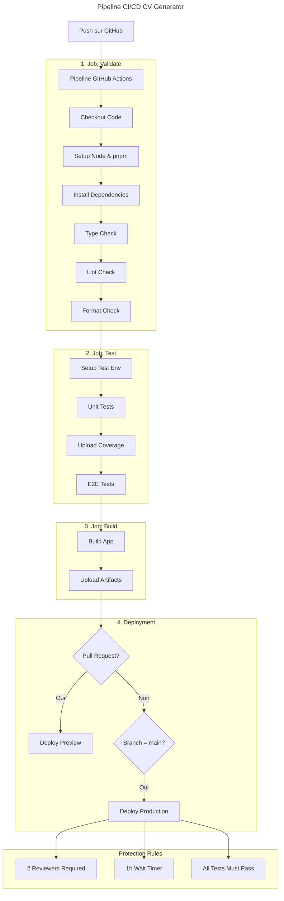

# Configuration CI/CD du CV Generator

## Vue d'ensemble

Ce document détaille la configuration CI/CD mise en place pour le projet CV Generator. Notre pipeline automatise la validation, les tests, la construction et le déploiement de l'application.



## Structure des Fichiers

```
.github/
├── workflows/
│   └── main.yml           # Pipeline principal
├── environments/
│   ├── preview.yml        # Config environnement preview
│   └── production.yml     # Config environnement production
```

## Configuration Détaillée

### 1. Workflow Principal

Le workflow principal est déclenché sur :

- Push sur la branche `main`
- Création/mise à jour de Pull Requests

> 💡 **Tip:** Les variables d'environnement globales sont définies au début du workflow pour une maintenance facilitée.

```yaml
env:
  NODE_VERSION: "22.x"
  PNPM_VERSION: "10.x"
```

### 2. Jobs Configurés

#### Job: Validate

Vérifie la qualité du code avant tout test ou build.

| Étape      | Description                  | Commande         |
| :--------- | :--------------------------- | :--------------- |
| Type Check | Vérifie les types TypeScript | `pnpm typecheck` |
| Lint       | Analyse le code avec Biome   | `pnpm lint`      |
| Format     | Vérifie le formatage         | `pnpm format`    |

#### Job: Test

Exécute la suite de tests complète.

> ℹ️ **Note:** Les rapports de couverture sont automatiquement uploadés comme artefacts.

```yaml
- name: Upload coverage
  uses: actions/upload-artifact@v4
  with:
    name: coverage
    path: packages/ui/coverage/
```

#### Job: Build

Construit l'application et sauvegarde les artefacts.

> 🚨 **Warning:** Un seul build est créé et promu à travers les environnements pour garantir la cohérence.

### 3. Environnements

#### Preview

- Déployé sur chaque PR
- 1 reviewer requis
- Pas de délai d'attente
- Variables d'environnement spécifiques :
  ```yaml
  env:
    NODE_ENV: preview
    API_URL: https://api.preview.cv-generator.app
    ENABLE_ANALYTICS: false
  ```

#### Production

- Déployé uniquement depuis `main`
- Protection renforcée :
  - 2 reviewers requis
  - Délai d'attente de 1h
  - Tous les tests doivent passer
- Variables d'environnement spécifiques :
  ```yaml
  env:
    NODE_ENV: production
    API_URL: https://api.cv-generator.app
    ENABLE_ANALYTICS: true
  ```

## Sécurité

### Règles de Protection

1. **Reviewers**

   - Preview : 1 reviewer
   - Production : 2 reviewers

2. **Délais d'Attente**

   - Preview : Aucun
   - Production : 1 heure

3. **Contextes Requis**
   - Validate
   - Test
   - Build

> 🚨 **Warning:** Les secrets et clés d'API doivent être configurés dans les paramètres GitHub Actions.

## Prochaines Étapes

1. Configuration du provider de déploiement
2. Mise en place du monitoring
3. Configuration des alertes
4. Documentation des métriques

## Références

- [GitHub Actions Documentation](https://docs.github.com/en/actions)
- [Environments Documentation](https://docs.github.com/en/actions/deployment/targeting-different-environments)
- [Security Best Practices](https://docs.github.com/en/actions/security-guides)
