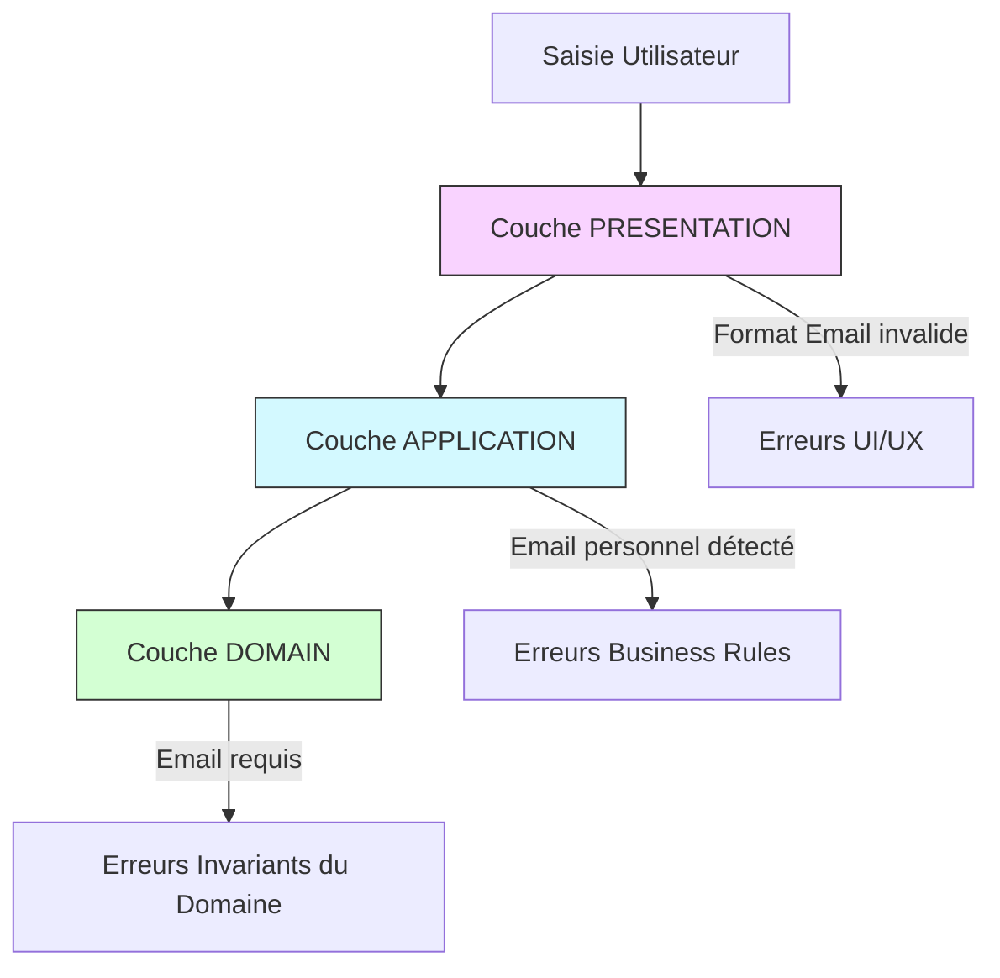
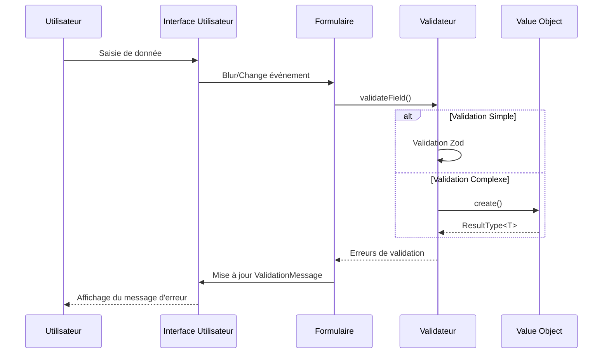
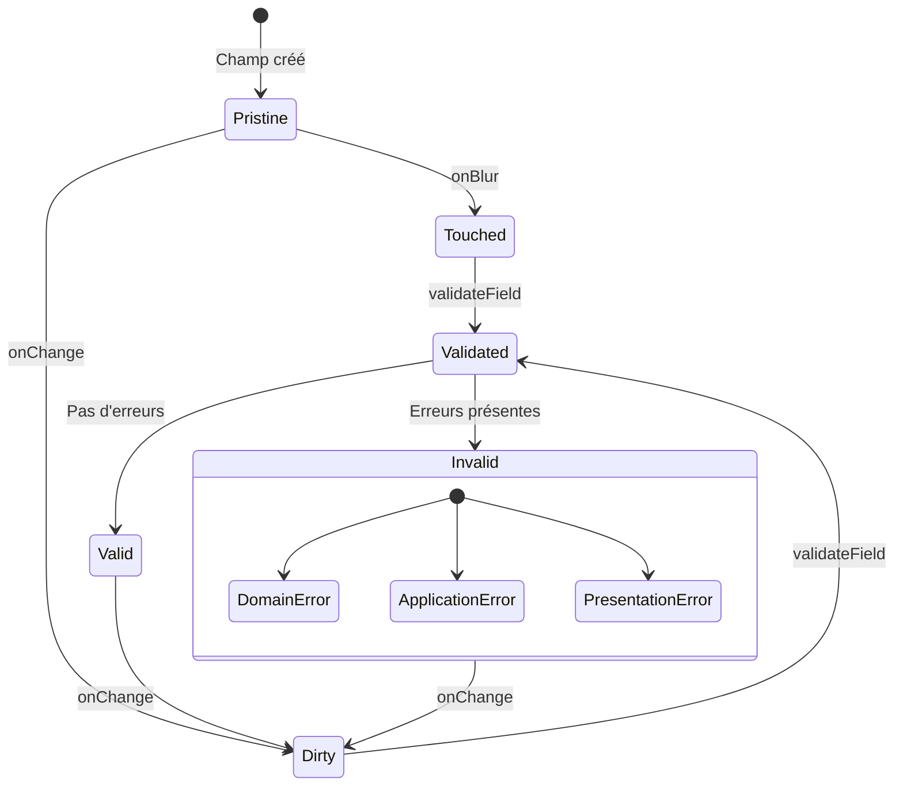
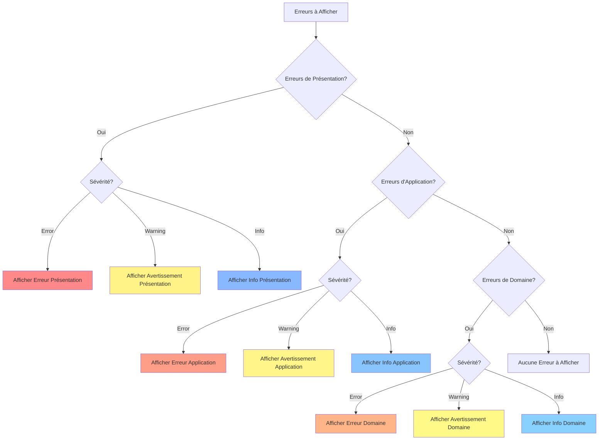
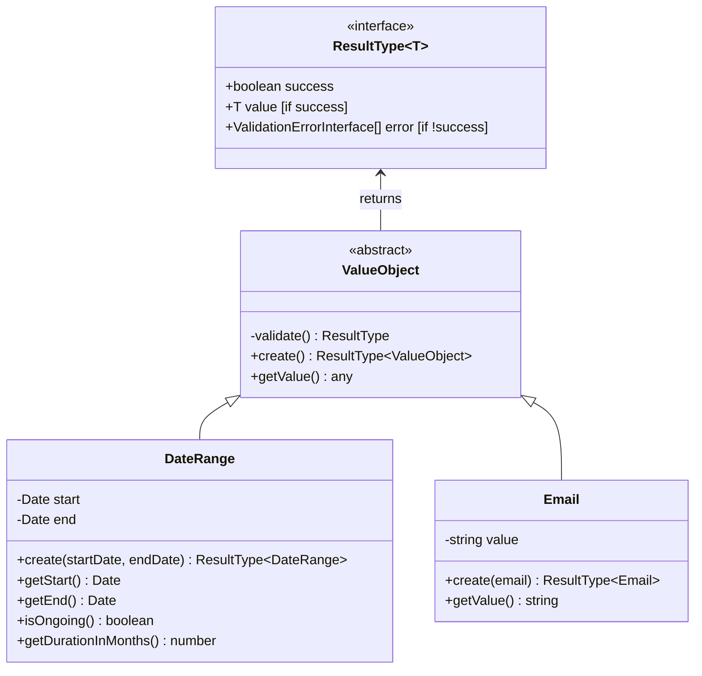

# Catalogue des Messages d'Erreur et d'Aide

**Date**: 2025-04-10  
**Auteur**: Équipe de développement  
**Version**: 1.1.0  
**Statut**: Proposition de mise à jour  
**Documents associés**: `result-pattern-impl.md`, `message-systeme-validation.md`

## 1. Introduction

Ce document définit un catalogue complet des messages d'erreur et d'aide pour l'application CV Generator. Il sert de référence unique pour assurer la cohérence et la qualité des messages à travers toute l'application. Les messages sont organisés par section du CV, par type d'erreur, et par couche architecturale.

## 2. Structure des Messages

### 2.1 Interface des Erreurs de Validation

```typescript
/** Niveaux de sévérité pour les erreurs */
export type ValidationSeverityType = "info" | "warning" | "error";

/** Couches architecturales où les validations peuvent se produire */
export enum ValidationLayerType {
  DOMAIN = "domain", // Règles métier fondamentales
  APPLICATION = "application", // Règles d'orchestration
  PRESENTATION = "presentation", // Validation UI/UX
}

/** Interface pour les erreurs de validation */
export interface ValidationErrorInterface {
  /** Code unique identifiant le type d'erreur */
  code: string;
  /** Message explicatif */
  message: string;
  /** Champ concerné par l'erreur */
  field: string;
  /** Niveau de sévérité */
  severity: ValidationSeverityType;
  /** Couche architecturale responsable de la validation */
  layer: ValidationLayerType;
  /** Suggestion optionnelle pour résoudre le problème */
  suggestion?: string;
  /** Informations supplémentaires */
  additionalInfo?: Record<string, unknown>;
}
```



### 2.2 Interface des Messages d'Aide

```typescript
/** Interface pour les messages d'aide */
export interface HelpMessageInterface {
  /** Identifiant unique du message */
  id: string;
  /** Titre court du message */
  title: string;
  /** Contenu détaillé */
  content: string;
  /** Champ concerné */
  field: string;
  /** Si le message doit être affiché automatiquement */
  autoShow?: boolean;
  /** Exemples de valeurs correctes */
  examples?: string[];
}
```

### 2.3 Constantes de Codes d'Erreur

Pour faciliter la maintenance et garantir la cohérence, les codes d'erreur sont définis comme constantes typées:

```typescript
// packages/shared/src/constants/error-codes.const.ts
export const ERROR_CODES = {
  COMMON: {
    INVALID_DATE_FORMAT: "invalid_date_format",
    REQUIRED_FIELD: "required_field",
    INVALID_FORMAT: "invalid_format",
    TOO_LONG: "too_long",
    TOO_SHORT: "too_short",
    FUTURE_DATE: "future_date",
  },
  SYSTEM: {
    UNEXPECTED_ERROR: "unexpected_error",
    EXTERNAL_SERVICE_ERROR: "external_service_error",
    NETWORK_ERROR: "network_error",
    PERMISSION_DENIED: "permission_denied",
  },
  RESUME: {
    BASICS: {
      MISSING_NAME: "missing_name",
      MISSING_EMAIL: "missing_email",
      INVALID_EMAIL: "invalid_email",
      PERSONAL_EMAIL: "personal_email",
      MISSING_PHONE: "missing_phone",
      INVALID_PHONE: "invalid_phone",
      MISSING_LOCATION: "missing_location",
      VAGUE_LOCATION: "vague_location",
      MISSING_SUMMARY: "missing_summary",
      BRIEF_SUMMARY: "brief_summary",
    },
    WORK: {
      MISSING_COMPANY: "missing_company",
      VAGUE_POSITION: "vague_position",
      MISSING_POSITION: "missing_position",
      MISSING_START_DATE: "missing_start_date",
      END_BEFORE_START: "end_before_start",
      FUTURE_DATE: "future_date",
      MISSING_SUMMARY: "missing_summary",
      BRIEF_DESCRIPTION: "brief_description",
      MISSING_HIGHLIGHTS: "missing_highlights",
      VAGUE_HIGHLIGHTS: "vague_highlights",
    },
    // Autres sections avec leurs codes respectifs...
  },
} as const;

// Type pour l'autocomplétion et la sécurité de type
export type ErrorCodeType = typeof ERROR_CODES;
```

## 3. Utilisation du Catalogue

Cette section explique comment utiliser le catalogue des codes d'erreur dans l'implémentation et comment l'étendre selon les besoins du projet.

### 3.1 Utilisation dans le Code Actuel

Le catalogue de codes d'erreur est utilisé à travers l'application pour garantir une cohérence dans l'identification et le traitement des erreurs.

#### 3.1.1 Dans les Value Objects

```typescript
// Exemple dans email.value-object.ts
public static create(email: string): ResultType<Email> {
  if (!email || email.trim() === '' || !/^[^\s@]+@[^\s@]+\.[^\s@]+$/.test(email)) {
    return createFailure([{
      code: !email || email.trim() === '' ?
        ERROR_CODES.RESUME.BASICS.MISSING_EMAIL :
        ERROR_CODES.RESUME.BASICS.INVALID_EMAIL,
      message: "Format email invalide",
      field: "email",
      severity: "error",
      layer: ValidationLayerType.DOMAIN,
      suggestion: "Vérifiez que votre email contient un @ et un domaine valide"
    }]);
  }

  // Validation supplémentaire pour les emails personnels vs professionnels
  if (isPersonalEmail(email)) {
    return createSuccessWithWarnings(new Email(email), [{
      code: ERROR_CODES.RESUME.BASICS.PERSONAL_EMAIL,
      message: "Email personnel détecté",
      field: "email",
      severity: "warning",
      layer: ValidationLayerType.APPLICATION,
      suggestion: "Pour un CV professionnel, privilégiez un email professionnel ou neutre"
    }]);
  }

  return createSuccess(new Email(email));
}
```

#### 3.1.2 Dans les Services de Validation

```typescript
// Exemple dans work-validation.service.ts
public validate(work: WorkInterface): ResultType<WorkInterface> {
  const errors: ValidationErrorInterface[] = [];

  // Validation du nom de l'entreprise
  if (this.isEmpty(work.company)) {
    errors.push(this.createError(
      ERROR_CODES.RESUME.WORK.MISSING_COMPANY,
      "Le nom de l'entreprise est requis",
      "company",
      ValidationLayerType.APPLICATION
    ));
  } else if (work.company.length < 2) {
    errors.push(this.createError(
      ERROR_CODES.COMMON.TOO_SHORT,
      "Le nom de l'entreprise est trop court",
      "company",
      ValidationLayerType.APPLICATION,
      "warning",
      {
        suggestion: "Entrez le nom complet de l'entreprise pour plus de clarté"
      }
    ));
  }

  // Autres validations...

  // Retourner le résultat approprié
  return errors.length > 0
    ? createFailure(errors)
    : createSuccess(work);
}
```

#### 3.1.3 Dans les Composants Vue

```typescript
// Exemple dans un composant Vue
const handleSubmit = async () => {
  const result = await workValidationService.validate(formData.value);

  if (isSuccess(result)) {
    // Traitement en cas de succès
  } else {
    // Filtrer et traiter les erreurs par code
    const missingFieldsErrors = result.error.filter(
      (e) =>
        e.code === ERROR_CODES.COMMON.REQUIRED_FIELD ||
        e.code === ERROR_CODES.RESUME.WORK.MISSING_COMPANY ||
        e.code === ERROR_CODES.RESUME.WORK.MISSING_POSITION
    );

    const formatErrors = result.error.filter(
      (e) =>
        e.code === ERROR_CODES.COMMON.INVALID_FORMAT ||
        e.code === ERROR_CODES.COMMON.INVALID_DATE_FORMAT
    );

    // Affichage adapté selon le type d'erreur
    if (missingFieldsErrors.length > 0) {
      showRequiredFieldsMessage(missingFieldsErrors);
    }

    if (formatErrors.length > 0) {
      showFormatErrorsMessage(formatErrors);
    }
  }
};
```

### 3.2 Extension du Catalogue

Le catalogue peut être étendu pour inclure de nouveaux codes d'erreur selon les besoins:

#### 3.2.1 Ajout de Nouveaux Codes

1. Identifier la section appropriée dans `ERROR_CODES` ou créer une nouvelle section si nécessaire
2. Ajouter le nouveau code avec une chaîne en snake_case
3. Mettre à jour la documentation pour refléter le nouveau code
4. Considérer les traductions si l'application est multilingue

Exemple d'extension:

```typescript
// Ajout d'une nouvelle section pour les certifications
export const ERROR_CODES = {
  // Sections existantes...

  RESUME: {
    // Sous-sections existantes...

    CERTIFICATIONS: {
      MISSING_NAME: "missing_certification_name",
      MISSING_ISSUER: "missing_certification_issuer",
      EXPIRED_CERTIFICATION: "expired_certification",
      UNVERIFIABLE_CERTIFICATION: "unverifiable_certification",
    },
  },
};
```

#### 3.2.2 Internationalisation des Messages

Pour les applications multilingues, les codes d'erreur peuvent être utilisés comme clés pour récupérer des messages localisés:

```typescript
// Fichier de traduction fr.json
{
  "errors": {
    "missing_certification_name": "Le nom de la certification est requis",
    "missing_certification_issuer": "L'émetteur de la certification est requis",
    "expired_certification": "Cette certification est expirée",
    "unverifiable_certification": "Cette certification ne peut pas être vérifiée"
  }
}

// Utilisation dans le code
const message = i18n.t(`errors.${error.code}`);
```

### 3.3 Bonnes Pratiques

1. **Cohérence des noms**: Utiliser systématiquement snake_case pour les codes d'erreur
2. **Spécificité**: Créer des codes suffisamment spécifiques pour identifier précisément le problème
3. **Hiérarchie**: Organiser les codes en sections et sous-sections logiques
4. **Documentation**: Tenir à jour la documentation des codes et leur signification
5. **Réutilisation**: Privilégier l'utilisation des codes communs (`COMMON`) pour les erreurs génériques
6. **Extensibilité**: Concevoir la structure pour permettre l'ajout facile de nouveaux codes

## 4. Catalogue des Messages d'Erreur

Cette version améliorée du catalogue organise les messages par section du CV, et pour chaque message, spécifie la couche architecturale appropriée.

### 4.1 Informations Personnelles (`BasicsForm`)

#### 4.1.1 Erreurs Courantes

| Code                             | Message                              | Champ      | Sévérité | Couche       | Suggestion                                                                                                          |
| -------------------------------- | ------------------------------------ | ---------- | -------- | ------------ | ------------------------------------------------------------------------------------------------------------------- |
| `RESUME.BASICS.MISSING_NAME`     | Le nom est requis                    | `name`     | error    | DOMAIN       | Indiquez votre nom complet tel qu'il apparaîtra sur votre CV                                                        |
| `RESUME.BASICS.MISSING_EMAIL`    | L'adresse email est requise          | `email`    | error    | DOMAIN       | Ajoutez une adresse email professionnelle où les recruteurs peuvent vous contacter                                  |
| `RESUME.BASICS.INVALID_EMAIL`    | Format d'email invalide              | `email`    | error    | DOMAIN       | Vérifiez que votre email contient un @ et un domaine valide                                                         |
| `RESUME.BASICS.PERSONAL_EMAIL`   | Email personnel détecté              | `email`    | warning  | DOMAIN       | Pour un CV professionnel, préférez utiliser une adresse email professionnelle plutôt que @gmail.com ou @hotmail.com |
| `RESUME.BASICS.MISSING_PHONE`    | Le numéro de téléphone est requis    | `phone`    | error    | APPLICATION  | Ajoutez un numéro où les recruteurs peuvent vous joindre                                                            |
| `RESUME.BASICS.INVALID_PHONE`    | Format de téléphone non reconnu      | `phone`    | warning  | PRESENTATION | Utilisez un format standard avec indicatif: +33 6 12 34 56 78                                                       |
| `RESUME.BASICS.MISSING_LOCATION` | La localisation est requise          | `location` | error    | APPLICATION  | Indiquez votre ville et pays de résidence                                                                           |
| `RESUME.BASICS.VAGUE_LOCATION`   | Localisation trop vague              | `location` | warning  | APPLICATION  | Précisez au moins la ville et le pays pour faciliter le matching géographique                                       |
| `RESUME.BASICS.MISSING_SUMMARY`  | Le résumé professionnel est manquant | `summary`  | warning  | APPLICATION  | Un résumé de 3-5 lignes augmente fortement l'impact de votre CV                                                     |
| `RESUME.BASICS.BRIEF_SUMMARY`    | Résumé trop court                    | `summary`  | info     | PRESENTATION | Un résumé efficace fait généralement 3-5 phrases, soit 300-500 caractères                                           |

#### 4.1.2 Messages d'Aide

| ID                    | Titre                                     | Champ     | Contenu                                                                                                                                                                                                                                           |
| --------------------- | ----------------------------------------- | --------- | ------------------------------------------------------------------------------------------------------------------------------------------------------------------------------------------------------------------------------------------------- |
| `basics_summary_help` | Rédiger un résumé percutant               | `summary` | Votre résumé professionnel est la première chose que les recruteurs liront. Il doit synthétiser votre expérience, vos compétences clés et votre valeur ajoutée en 3-5 phrases. Évitez les banalités et concentrez-vous sur ce qui vous distingue. |
| `basics_email_help`   | Choisir une adresse email professionnelle | `email`   | Votre adresse email doit refléter votre professionnalisme. Préférez une adresse au format prenom.nom@domaine.com et évitez les adresses personnelles ou fantaisistes.                                                                             |
| `basics_phone_help`   | Format de téléphone                       | `phone`   | Utilisez un format international avec l'indicatif du pays, par exemple: +33 6 12 34 56 78 pour un numéro français. Cela facilite le contact international.                                                                                        |

### 4.2 Expérience Professionnelle (`WorkForm`)

#### 4.2.1 Erreurs Courantes

| Code                             | Message                                 | Champ        | Sévérité | Couche       | Suggestion                                                                                    |
| -------------------------------- | --------------------------------------- | ------------ | -------- | ------------ | --------------------------------------------------------------------------------------------- |
| `RESUME.WORK.MISSING_COMPANY`    | Le nom de l'entreprise est requis       | `company`    | error    | DOMAIN       | Indiquez le nom de l'entreprise où vous avez travaillé                                        |
| `RESUME.WORK.VAGUE_POSITION`     | L'intitulé du poste est trop vague      | `position`   | warning  | APPLICATION  | Utilisez un titre de poste précis qui reflète votre niveau de responsabilité                  |
| `RESUME.WORK.MISSING_POSITION`   | L'intitulé du poste est requis          | `position`   | error    | DOMAIN       | Indiquez votre fonction ou titre dans cette entreprise                                        |
| `RESUME.WORK.MISSING_START_DATE` | La date de début est requise            | `startDate`  | error    | DOMAIN       | Indiquez quand vous avez commencé à travailler dans cette entreprise                          |
| `RESUME.WORK.END_BEFORE_START`   | La date de fin précède la date de début | `endDate`    | error    | DOMAIN       | La date de fin doit être postérieure à la date de début                                       |
| `RESUME.WORK.FUTURE_DATE`        | La date indiquée est dans le futur      | `startDate`  | warning  | DOMAIN       | Vérifiez la date saisie, elle semble être dans le futur                                       |
| `RESUME.WORK.MISSING_SUMMARY`    | La description du poste est requise     | `summary`    | error    | APPLICATION  | Décrivez brièvement vos responsabilités et le contexte du poste                               |
| `RESUME.WORK.BRIEF_DESCRIPTION`  | Description trop succincte              | `summary`    | warning  | APPLICATION  | Ajoutez plus de détails pour valoriser cette expérience (au moins 200 caractères recommandés) |
| `RESUME.WORK.MISSING_HIGHLIGHTS` | Aucune réalisation notable mentionnée   | `highlights` | warning  | APPLICATION  | Incluez 2-3 réalisations quantifiables pour valoriser cette expérience                        |
| `RESUME.WORK.VAGUE_HIGHLIGHTS`   | Réalisations peu précises               | `highlights` | info     | PRESENTATION | Quantifiez vos réalisations (%, chiffres, impact) pour plus d'impact                          |

#### 4.2.2 Messages d'Aide

| ID                     | Titre                                 | Champ        | Contenu                                                                                                                                                                                                           |
| ---------------------- | ------------------------------------- | ------------ | ----------------------------------------------------------------------------------------------------------------------------------------------------------------------------------------------------------------- |
| `work_position_help`   | Choisir un bon intitulé de poste      | `position`   | Utilisez un intitulé précis reflétant votre niveau de séniorité et vos responsabilités. Évitez les titres trop génériques comme "Développeur" et préférez "Développeur Frontend Senior" ou "Architecte Logiciel". |
| `work_highlights_help` | Formuler des réalisations percutantes | `highlights` | Chaque réalisation doit suivre la structure "Action → Résultat → Impact". Par exemple: "Optimisation des requêtes SQL, réduisant les temps de réponse de 40% et améliorant la satisfaction utilisateur".          |
| `work_summary_help`    | Rédiger une description efficace      | `summary`    | La description doit inclure: le contexte de l'entreprise, votre rôle, vos responsabilités principales, les technologies ou méthodologies utilisées, et l'environnement de travail. Visez 3-4 phrases complètes.   |

### 4.3 Compétences (`SkillForm`)

#### 4.3.1 Erreurs Courantes

| Code                               | Message                            | Champ      | Sévérité | Couche       | Suggestion                                                                                                   |
| ---------------------------------- | ---------------------------------- | ---------- | -------- | ------------ | ------------------------------------------------------------------------------------------------------------ |
| `RESUME.SKILLS.MISSING_SKILL_NAME` | Le nom de la compétence est requis | `name`     | error    | DOMAIN       | Indiquez le nom de la technologie ou compétence                                                              |
| `RESUME.SKILLS.BRIEF_SKILL_NAME`   | Nom de compétence trop court       | `name`     | warning  | APPLICATION  | Utilisez un terme plus précis et reconnaissable                                                              |
| `RESUME.SKILLS.UNDEFINED_LEVEL`    | Niveau de compétence non reconnu   | `level`    | warning  | APPLICATION  | Utilisez un niveau standard (Débutant, Intermédiaire, Avancé, Expert)                                        |
| `RESUME.SKILLS.MISSING_KEYWORDS`   | Aucun mot-clé associé              | `keywords` | info     | PRESENTATION | Ajoutez des mots-clés pour préciser votre expertise (frameworks, outils, méthodologies)                      |
| `RESUME.SKILLS.GENERIC_SKILL`      | Compétence trop générique          | `name`     | info     | APPLICATION  | Précisez davantage, par ex. "Programmation" → "JavaScript ES6", "Analyse" → "Analyse de données avec Python" |

#### 4.3.2 Messages d'Aide

| ID                    | Titre                               | Champ      | Contenu                                                                                                                                                                                                                                            |
| --------------------- | ----------------------------------- | ---------- | -------------------------------------------------------------------------------------------------------------------------------------------------------------------------------------------------------------------------------------------------- |
| `skill_name_help`     | Nommer efficacement vos compétences | `name`     | Utilisez les termes exacts reconnus dans votre secteur. Pour les langages de programmation et technologies, utilisez leur appellation officielle (ex: "JavaScript" et non "JS", "React.js" et non "React").                                        |
| `skill_level_help`    | Évaluer votre niveau correctement   | `level`    | • Débutant: utilisation basique, besoin de supervision<br>• Intermédiaire: utilisation autonome sur des cas standard<br>• Avancé: maîtrise des cas complexes, capable de former<br>• Expert: connaissance approfondie, contribution à l'écosystème |
| `skill_keywords_help` | Choisir des mots-clés pertinents    | `keywords` | Les mots-clés enrichissent votre compétence. Pour JavaScript, indiquez par exemple: "ES6+, Node.js, React, Vue.js, TypeScript". Ces termes aident au matching dans les ATS.                                                                        |

### 4.4 Formation (`EducationForm`)

#### 4.4.1 Erreurs Courantes

| Code                                   | Message                                 | Champ         | Sévérité | Couche       | Suggestion                                                            |
| -------------------------------------- | --------------------------------------- | ------------- | -------- | ------------ | --------------------------------------------------------------------- |
| `RESUME.EDUCATION.MISSING_INSTITUTION` | Le nom de l'établissement est requis    | `institution` | error    | DOMAIN       | Indiquez le nom de l'école ou université                              |
| `RESUME.EDUCATION.MISSING_AREA`        | Le domaine d'études est requis          | `area`        | error    | DOMAIN       | Précisez votre spécialité ou domaine d'études                         |
| `RESUME.EDUCATION.MISSING_STUDY_TYPE`  | Le type de diplôme est requis           | `studyType`   | error    | DOMAIN       | Indiquez le type de diplôme obtenu                                    |
| `RESUME.EDUCATION.MISSING_START_DATE`  | La date de début est requise            | `startDate`   | error    | DOMAIN       | Indiquez quand vous avez commencé cette formation                     |
| `RESUME.EDUCATION.END_BEFORE_START`    | La date de fin précède la date de début | `endDate`     | error    | DOMAIN       | La date de fin doit être postérieure à la date de début               |
| `RESUME.EDUCATION.MISSING_GPA`         | GPA ou mention non spécifiée            | `gpa`         | info     | APPLICATION  | Ajoutez votre GPA ou mention pour valoriser vos résultats académiques |
| `RESUME.EDUCATION.VAGUE_COURSES`       | Liste de cours trop vague               | `courses`     | info     | PRESENTATION | Citez les cours les plus pertinents pour le poste visé                |

#### 4.4.2 Messages d'Aide

| ID                         | Titre                               | Champ       | Contenu                                                                                                                                                                                                                                     |
| -------------------------- | ----------------------------------- | ----------- | ------------------------------------------------------------------------------------------------------------------------------------------------------------------------------------------------------------------------------------------- |
| `education_studyType_help` | Choisir le bon type de diplôme      | `studyType` | Utilisez la nomenclature officielle de votre diplôme. Pour les diplômes internationaux, vous pouvez ajouter une équivalence entre parenthèses. Par exemple: "Master of Science (Bac+5)" ou "Bachelor of Engineering (Diplôme d'ingénieur)". |
| `education_courses_help`   | Sélectionner les cours pertinents   | `courses`   | Ne listez que les cours directement liés au poste visé ou qui démontrent une expertise particulière. Privilégiez les cours avancés ou spécialisés plutôt que les cours fondamentaux.                                                        |
| `education_gpa_help`       | Présenter vos résultats académiques | `gpa`       | Si vous avez obtenu d'excellents résultats, indiquez votre moyenne ou mention. Formats courants: "GPA: 3.8/4.0", "Mention Très Bien", "Major de promotion (95e percentile)".                                                                |

### 4.5 Projets (`ProjectForm`)

#### 4.5.1 Erreurs Courantes

| Code                                  | Message                              | Champ         | Sévérité | Couche       | Suggestion                                                                         |
| ------------------------------------- | ------------------------------------ | ------------- | -------- | ------------ | ---------------------------------------------------------------------------------- |
| `RESUME.PROJECT.MISSING_PROJECT_NAME` | Le nom du projet est requis          | `name`        | error    | DOMAIN       | Donnez un nom clair à votre projet                                                 |
| `RESUME.PROJECT.MISSING_DESCRIPTION`  | La description du projet est requise | `description` | error    | DOMAIN       | Décrivez l'objectif et la nature du projet                                         |
| `RESUME.PROJECT.BRIEF_DESCRIPTION`    | Description trop succincte           | `description` | warning  | APPLICATION  | Développez davantage la description de ce projet (min. 200 caractères recommandés) |
| `RESUME.PROJECT.MISSING_START_DATE`   | La date de début est requise         | `startDate`   | error    | DOMAIN       | Indiquez quand vous avez commencé ce projet                                        |
| `RESUME.PROJECT.MISSING_KEYWORDS`     | Aucune technologie mentionnée        | `keywords`    | warning  | APPLICATION  | Précisez les technologies, langages ou outils utilisés                             |
| `RESUME.PROJECT.MISSING_URL`          | Lien vers le projet manquant         | `url`         | info     | PRESENTATION | Ajoutez un lien pour que le recruteur puisse voir votre travail                    |
| `RESUME.PROJECT.INVALID_URL`          | Format d'URL invalide                | `url`         | warning  | DOMAIN       | Vérifiez que l'URL commence par http:// ou https://                                |

#### 4.5.2 Messages d'Aide

| ID                         | Titre                                 | Champ         | Contenu                                                                                                                                                                                                                          |
| -------------------------- | ------------------------------------- | ------------- | -------------------------------------------------------------------------------------------------------------------------------------------------------------------------------------------------------------------------------- |
| `project_description_help` | Structurer la description d'un projet | `description` | Une bonne description inclut: le problème résolu, l'approche technique, votre rôle spécifique, les défis rencontrés et les résultats obtenus. Structurez par courtes phrases et utilisez des termes techniques précis.           |
| `project_keywords_help`    | Lister les technologies utilisées     | `keywords`    | Indiquez toutes les technologies significatives utilisées dans le projet. Privilégiez les mots-clés techniques que les recruteurs recherchent, comme les noms de frameworks, bibliothèques, ou plateformes.                      |
| `project_url_help`         | Ajouter des liens pertinents          | `url`         | Les liens peuvent mener vers: un site en production, un dépôt GitHub/GitLab, une démonstration, ou une documentation. Assurez-vous que les liens sont accessibles et ajoutez une mention si une authentification est nécessaire. |

### 4.6 Bénévolat (`VolunteerForm`)

#### 4.6.1 Erreurs Courantes

| Code                                    | Message                             | Champ          | Sévérité | Couche       | Suggestion                                                       |
| --------------------------------------- | ----------------------------------- | -------------- | -------- | ------------ | ---------------------------------------------------------------- |
| `RESUME.VOLUNTEER.MISSING_ORGANIZATION` | Le nom de l'organisation est requis | `organization` | error    | DOMAIN       | Indiquez le nom de l'organisation où vous avez été bénévole      |
| `RESUME.VOLUNTEER.MISSING_POSITION`     | Le rôle est requis                  | `position`     | error    | DOMAIN       | Précisez votre rôle ou fonction dans cette activité bénévole     |
| `RESUME.VOLUNTEER.MISSING_START_DATE`   | La date de début est requise        | `startDate`    | error    | DOMAIN       | Indiquez quand vous avez commencé cette activité                 |
| `RESUME.VOLUNTEER.MISSING_SUMMARY`      | La description est requise          | `summary`      | error    | APPLICATION  | Décrivez brièvement votre rôle et vos actions                    |
| `RESUME.VOLUNTEER.BRIEF_SUMMARY`        | Description trop succincte          | `summary`      | warning  | APPLICATION  | Développez davantage la description de cette expérience          |
| `RESUME.VOLUNTEER.MISSING_HIGHLIGHTS`   | Aucune réalisation mentionnée       | `highlights`   | info     | PRESENTATION | Ajoutez quelques points pour décrire vos contributions concrètes |

#### 4.6.2 Messages d'Aide

| ID                          | Titre                            | Champ        | Contenu                                                                                                                                                                                                      |
| --------------------------- | -------------------------------- | ------------ | ------------------------------------------------------------------------------------------------------------------------------------------------------------------------------------------------------------ |
| `volunteer_relevance_help`  | Rendre votre bénévolat pertinent | `summary`    | Même si l'activité n'est pas directement liée à votre domaine professionnel, mettez en avant les compétences transversales développées: gestion de projet, communication, leadership, travail d'équipe, etc. |
| `volunteer_highlights_help` | Valoriser votre impact           | `highlights` | Pour chaque réalisation, précisez l'impact concret: nombre de personnes aidées, amélioration mesurable, initiative particulière que vous avez pilotée, ou responsabilité spécifique assumée.                 |

### 4.7 Certifications (`CertificateForm`)

#### 4.7.1 Erreurs Courantes

| Code                                       | Message                               | Champ    | Sévérité | Couche       | Suggestion                                                                                                   |
| ------------------------------------------ | ------------------------------------- | -------- | -------- | ------------ | ------------------------------------------------------------------------------------------------------------ |
| `RESUME.CERTIFICATE.MISSING_NAME`          | Le nom de la certification est requis | `name`   | error    | DOMAIN       | Indiquez le nom exact de la certification obtenue                                                            |
| `RESUME.CERTIFICATE.MISSING_ISSUER`        | L'organisme certificateur est requis  | `issuer` | error    | DOMAIN       | Précisez qui a délivré cette certification                                                                   |
| `RESUME.CERTIFICATE.MISSING_DATE`          | La date d'obtention est requise       | `date`   | error    | DOMAIN       | Indiquez quand vous avez obtenu cette certification                                                          |
| `RESUME.CERTIFICATE.FUTURE_DATE`           | La date indiquée est dans le futur    | `date`   | warning  | DOMAIN       | Vérifiez la date, elle semble être dans le futur                                                             |
| `RESUME.CERTIFICATE.MISSING_URL`           | Lien de vérification manquant         | `url`    | info     | PRESENTATION | Ajoutez un lien permettant de vérifier votre certification                                                   |
| `RESUME.CERTIFICATE.EXPIRED_CERTIFICATION` | Certification potentiellement expirée | `date`   | warning  | APPLICATION  | Cette certification date de plus de 3 ans. Précisez si elle est toujours valide ou si vous l'avez renouvelée |

#### 4.7.2 Messages d'Aide

| ID                           | Titre                                    | Champ  | Contenu                                                                                                                                                                                                                           |
| ---------------------------- | ---------------------------------------- | ------ | --------------------------------------------------------------------------------------------------------------------------------------------------------------------------------------------------------------------------------- |
| `certificate_name_help`      | Nommer correctement votre certification  | `name` | Utilisez le nom officiel complet de la certification, y compris la version ou le niveau le cas échéant. Par exemple: "AWS Certified Solutions Architect - Associate" au lieu de "Certification AWS".                              |
| `certificate_relevance_help` | Prioriser les certifications pertinentes | `name` | Listez en priorité les certifications reconnues dans votre secteur et directement pertinentes pour le poste visé. Les certifications techniques ou spécialisées ont généralement plus d'impact que les certifications génériques. |

### 4.8 Publications (`PublicationForm`)

#### 4.8.1 Erreurs Courantes

| Code                                      | Message                               | Champ         | Sévérité | Couche       | Suggestion                                                                                    |
| ----------------------------------------- | ------------------------------------- | ------------- | -------- | ------------ | --------------------------------------------------------------------------------------------- |
| `RESUME.PUBLICATION.MISSING_NAME`         | Le titre de la publication est requis | `name`        | error    | DOMAIN       | Indiquez le titre exact de votre publication                                                  |
| `RESUME.PUBLICATION.MISSING_PUBLISHER`    | L'éditeur ou la plateforme est requis | `publisher`   | error    | DOMAIN       | Précisez où cette publication a été publiée                                                   |
| `RESUME.PUBLICATION.MISSING_RELEASE_DATE` | La date de publication est requise    | `releaseDate` | error    | DOMAIN       | Indiquez quand cette publication a été publiée                                                |
| `RESUME.PUBLICATION.FUTURE_DATE`          | La date indiquée est dans le futur    | `releaseDate` | warning  | DOMAIN       | Vérifiez la date, elle semble être dans le futur                                              |
| `RESUME.PUBLICATION.MISSING_URL`          | Lien vers la publication manquant     | `url`         | warning  | APPLICATION  | Ajoutez un lien permettant d'accéder à votre publication                                      |
| `RESUME.PUBLICATION.MISSING_SUMMARY`      | Résumé de la publication manquant     | `summary`     | info     | PRESENTATION | Un bref résumé aidera le recruteur à comprendre le sujet et l'importance de votre publication |

#### 4.8.2 Messages d'Aide

| ID                         | Titre                                   | Champ     | Contenu                                                                                                                                                                                                                                  |
| -------------------------- | --------------------------------------- | --------- | ---------------------------------------------------------------------------------------------------------------------------------------------------------------------------------------------------------------------------------------- |
| `publication_format_help`  | Formater correctement votre publication | `name`    | Utilisez le format de citation approprié pour votre domaine (APA, MLA, etc.). Pour un article académique, incluez les co-auteurs. Par exemple: "Smith, J., & Doe, A. (2022). Titre de l'article. Nom du Journal, Volume(Numéro), pages." |
| `publication_summary_help` | Rédiger un résumé efficace              | `summary` | Le résumé doit souligner la contribution unique de votre publication, son impact dans le domaine, et sa pertinence pour le poste visé. Évitez le jargon excessif et privilégiez la clarté.                                               |

### 4.9 Langues (`LanguageForm`)

#### 4.9.1 Erreurs Courantes

| Code                                 | Message                          | Champ      | Sévérité | Couche      | Suggestion                                                                     |
| ------------------------------------ | -------------------------------- | ---------- | -------- | ----------- | ------------------------------------------------------------------------------ |
| `RESUME.LANGUAGE.MISSING_LANGUAGE`   | Le nom de la langue est requis   | `language` | error    | DOMAIN      | Indiquez la langue maîtrisée                                                   |
| `RESUME.LANGUAGE.MISSING_FLUENCY`    | Le niveau de maîtrise est requis | `fluency`  | error    | DOMAIN      | Précisez votre niveau dans cette langue                                        |
| `RESUME.LANGUAGE.UNDEFINED_FLUENCY`  | Niveau de langue non standard    | `fluency`  | warning  | APPLICATION | Utilisez des niveaux standards (A1-C2, Débutant-Bilingue, etc.)                |
| `RESUME.LANGUAGE.REDUNDANT_LANGUAGE` | Langue déjà mentionnée           | `language` | warning  | APPLICATION | Cette langue apparaît déjà dans votre CV. Supprimez ce doublon ou modifiez-le. |

#### 4.9.2 Messages d'Aide

| ID                            | Titre                             | Champ     | Contenu                                                                                                                                                                                                                                                                                   |
| ----------------------------- | --------------------------------- | --------- | ----------------------------------------------------------------------------------------------------------------------------------------------------------------------------------------------------------------------------------------------------------------------------------------- |
| `language_fluency_help`       | Évaluer correctement votre niveau | `fluency` | • A1/Débutant: notions de base<br>• A2/Élémentaire: communication simple<br>• B1/Intermédiaire: peut se débrouiller<br>• B2/Avancé: communication fluide sur sujets complexes<br>• C1/Courant: expression précise et nuancée<br>• C2/Bilingue: maîtrise comparable à la langue maternelle |
| `language_certification_help` | Mentionner vos certifications     | `fluency` | Si vous avez passé des tests officiels (TOEFL, IELTS, DELF, HSK, etc.), mentionnez le score obtenu entre parenthèses. Par exemple: "B2 (TOEFL 95/120)" ou "C1 (DALF C1)".                                                                                                                 |

### 4.10 Prix et Distinctions (`AwardForm`)

#### 4.10.1 Erreurs Courantes

| Code                           | Message                                     | Champ     | Sévérité | Couche      | Suggestion                                                     |
| ------------------------------ | ------------------------------------------- | --------- | -------- | ----------- | -------------------------------------------------------------- |
| `RESUME.AWARD.MISSING_TITLE`   | Le titre de la distinction est requis       | `title`   | error    | DOMAIN      | Indiquez le nom du prix ou de la distinction reçue             |
| `RESUME.AWARD.MISSING_DATE`    | La date d'obtention est requise             | `date`    | error    | DOMAIN      | Précisez quand vous avez reçu cette distinction                |
| `RESUME.AWARD.MISSING_AWARDER` | L'institution décernant le prix est requise | `awarder` | error    | DOMAIN      | Indiquez qui a décerné ce prix ou cette distinction            |
| `RESUME.AWARD.MISSING_SUMMARY` | Description de la distinction manquante     | `summary` | warning  | APPLICATION | Expliquez brièvement pourquoi vous avez reçu cette distinction |
| `RESUME.AWARD.FUTURE_DATE`     | La date indiquée est dans le futur          | `date`    | warning  | DOMAIN      | Vérifiez la date, elle semble être dans le futur               |

#### 4.10.2 Messages d'Aide

| ID                     | Titre                                     | Champ     | Contenu                                                                                                                                                                                                                                                                 |
| ---------------------- | ----------------------------------------- | --------- | ----------------------------------------------------------------------------------------------------------------------------------------------------------------------------------------------------------------------------------------------------------------------- |
| `award_context_help`   | Contextualiser votre distinction          | `summary` | Précisez le contexte et l'importance de cette distinction: combien de personnes étaient en compétition, quelle est sa reconnaissance dans le domaine, quels critères ont été évalués, etc. Ces informations aident à mesurer la valeur réelle de votre accomplissement. |
| `award_relevance_help` | Sélectionner les distinctions pertinentes | `title`   | Incluez uniquement les distinctions significatives et pertinentes pour votre carrière. Les prix récents et directement liés à votre domaine professionnel ont généralement plus d'impact sur les recruteurs.                                                            |

### 4.11 Centres d'Intérêt (`InterestForm`)

#### 4.11.1 Erreurs Courantes

| Code                               | Message                               | Champ      | Sévérité | Couche       | Suggestion                                                    |
| ---------------------------------- | ------------------------------------- | ---------- | -------- | ------------ | ------------------------------------------------------------- |
| `RESUME.INTEREST.MISSING_NAME`     | Le nom du centre d'intérêt est requis | `name`     | error    | DOMAIN       | Indiquez votre centre d'intérêt ou hobby                      |
| `RESUME.INTEREST.BRIEF_NAME`       | Intitulé trop vague                   | `name`     | warning  | APPLICATION  | Précisez davantage ce centre d'intérêt                        |
| `RESUME.INTEREST.MISSING_KEYWORDS` | Détails manquants                     | `keywords` | info     | PRESENTATION | Ajoutez quelques mots-clés pour détailler ce centre d'intérêt |

#### 4.11.2 Messages d'Aide

| ID                        | Titre                                      | Champ      | Contenu                                                                                                                                                                                                                                        |
| ------------------------- | ------------------------------------------ | ---------- | ---------------------------------------------------------------------------------------------------------------------------------------------------------------------------------------------------------------------------------------------- |
| `interest_relevance_help` | Choisir des centres d'intérêt stratégiques | `name`     | Privilégiez les centres d'intérêt qui révèlent des qualités professionnelles valorisées (persévérance, créativité, leadership) ou qui pourraient créer une connexion avec le recruteur. Évitez les activités controversées ou trop génériques. |
| `interest_details_help`   | Enrichir vos centres d'intérêt             | `keywords` | Ajoutez des précisions révélatrices: niveau atteint, fréquence de pratique, réalisations concrètes. Par exemple, au lieu de simplement "Course à pied", indiquez "Course à pied (semi-marathons, 3 compétitions/an)".                          |

### 4.12 Références (`ReferenceForm`)

#### 4.12.1 Erreurs Courantes

| Code                                 | Message                                    | Champ       | Sévérité | Couche      | Suggestion                                                   |
| ------------------------------------ | ------------------------------------------ | ----------- | -------- | ----------- | ------------------------------------------------------------ |
| `RESUME.REFERENCE.MISSING_NAME`      | Le nom de la référence est requis          | `name`      | error    | DOMAIN      | Indiquez le nom complet de votre référence                   |
| `RESUME.REFERENCE.MISSING_REFERENCE` | Le témoignage est requis                   | `reference` | error    | APPLICATION | Ajoutez le témoignage ou la recommandation de cette personne |
| `RESUME.REFERENCE.BRIEF_REFERENCE`   | Témoignage trop court                      | `reference` | warning  | APPLICATION | Un témoignage plus substantiel aura plus d'impact            |
| `RESUME.REFERENCE.MISSING_POSITION`  | Le poste de la référence est manquant      | `position`  | warning  | APPLICATION | Indiquez le poste ou la fonction de cette personne           |
| `RESUME.REFERENCE.MISSING_COMPANY`   | L'entreprise de la référence est manquante | `company`   | warning  | APPLICATION | Précisez dans quelle entreprise travaille cette référence    |

#### 4.12.2 Messages d'Aide

| ID                          | Titre                                 | Champ  | Contenu                                                                                                                                                                                                                                                          |
| --------------------------- | ------------------------------------- | ------ | ---------------------------------------------------------------------------------------------------------------------------------------------------------------------------------------------------------------------------------------------------------------- |
| `reference_permission_help` | Obtenir les autorisations nécessaires | `name` | Assurez-vous d'avoir obtenu la permission explicite de mentionner cette personne comme référence. Si les coordonnées sont incluses, vérifiez qu'elles sont correctes et que la personne est disponible pour être contactée.                                      |
| `reference_quality_help`    | Sélectionner les bonnes références    | `name` | Privilégiez des références récentes qui ont directement supervisé votre travail et peuvent témoigner concrètement de vos compétences. Idéalement, choisissez des personnes occupant des postes à responsabilité et dont l'avis sera valorisé par les recruteurs. |



## 5. Stratégie d'Affichage des Messages

### 5.1 Timing pour l'Affichage des Erreurs

| Moment                              | Type d'erreur               | Justification                                           |
| ----------------------------------- | --------------------------- | ------------------------------------------------------- |
| Au changement de focus (blur)       | Erreurs de champ individuel | Permettre à l'utilisateur de terminer sa saisie         |
| À la soumission                     | Toutes les erreurs          | Validation complète avant envoi                         |
| Après un délai de frappe (debounce) | Erreurs de format évidents  | Feedback rapide pour les erreurs facilement détectables |
| À l'ouverture d'un formulaire       | Messages d'aide contextuels | Guider l'utilisateur avant qu'il ne commence            |



### 5.2 Niveaux de Sévérité et Comportement

| Sévérité  | Style visuel                        | Comportement                                           |
| --------- | ----------------------------------- | ------------------------------------------------------ |
| `error`   | Rouge, icône d'erreur               | Bloque la soumission du formulaire                     |
| `warning` | Orange/Jaune, icône d'avertissement | Permet la soumission avec confirmation                 |
| `info`    | Bleu/Gris, icône d'information      | Suggestion d'amélioration, n'affecte pas la soumission |

### 5.3 Priorisation par Couche Architecturale

| Couche         | Priorité d'affichage | Contexte d'utilisation                                                       |
| -------------- | -------------------- | ---------------------------------------------------------------------------- |
| `PRESENTATION` | Haute                | Erreurs de formatage, feedback immédiat pendant la saisie                    |
| `APPLICATION`  | Moyenne              | Erreurs liées au workflow, validation complète du formulaire                 |
| `DOMAIN`       | Basse                | Erreurs fondamentales, généralement capturées par les validations préalables |

Le composant d'affichage des erreurs (`ValidationMessage`) priorise les erreurs selon cette hiérarchie pour montrer les messages les plus pertinents au contexte d'interaction actuel.



### 5.4 Emplacement des Messages

| Contexte                   | Position                             | Format                                  | Couche prioritaire        |
| -------------------------- | ------------------------------------ | --------------------------------------- | ------------------------- |
| Erreurs de champ           | Sous le champ concerné               | Texte concis avec icône                 | PRESENTATION, APPLICATION |
| Suggestions d'amélioration | Sous le champ, après l'erreur        | Texte en italique avec icône d'ampoule  | APPLICATION               |
| Erreurs globales           | En haut du formulaire                | Boîte d'alerte avec liste des problèmes | DOMAIN, APPLICATION       |
| Messages d'aide            | Icône (i) à côté du libellé du champ | Popup/tooltip au survol ou clic         | N/A                       |

## 6. Exemples d'Intégration

### 6.1 Utilisation avec Value Objects

```typescript
// Dans un Value Object
import { ERROR_CODES } from "@shared/constants/error-codes.const";
import { ValidationLayerType } from "@shared/enums";

export class Email {
  private constructor(private readonly value: string) {}

  public static create(email: string): ResultType<Email> {
    if (!email || email.trim() === "") {
      return createFailure([
        {
          code: ERROR_CODES.RESUME.BASICS.MISSING_EMAIL,
          message: "L'adresse email est requise",
          field: "email",
          severity: "error",
          layer: ValidationLayerType.DOMAIN,
          suggestion: "Veuillez entrer votre adresse email professionnelle",
        },
      ]);
    }

    // Autres validations...

    return createSuccess(new Email(email));
  }
}
```



### 6.2 Intégration avec Zod

```typescript
// Dans un validateur utilisant Zod
import { z } from "zod";
import { zodToResult } from "@shared/utils/zod-adapter";
import { ERROR_CODES } from "@shared/constants/error-codes.const";
import { ValidationLayerType } from "@shared/enums";

const emailSchema = z
  .string({
    required_error: "L'adresse email est requise",
  })
  .min(1, "L'adresse email est requise")
  .email("Format d'email invalide")
  .refine(
    (email) => !email.endsWith("@gmail.com") && !email.endsWith("@hotmail.com"),
    {
      message: "Adresse email personnelle détectée",
    }
  );

// Utilisation avec map personnalisé pour correspondre au catalogue
function validateEmail(email: string): ResultType<string> {
  return zodToResult(emailSchema.safeParse(email), {
    layer: ValidationLayerType.APPLICATION,
    errorMap: (zodError) => {
      return zodError.errors.map((err) => {
        // Mapping à notre catalogue de codes d'erreur
        if (err.message === "L'adresse email est requise") {
          return {
            code: ERROR_CODES.RESUME.BASICS.MISSING_EMAIL,
            message: "L'adresse email est requise",
            field: "email",
            severity: "error",
            layer: ValidationLayerType.APPLICATION,
            suggestion:
              "Ajoutez une adresse email professionnelle où les recruteurs peuvent vous contacter",
          };
        }

        if (err.message === "Format d'email invalide") {
          return {
            code: ERROR_CODES.RESUME.BASICS.INVALID_EMAIL,
            message: "Format d'email invalide",
            field: "email",
            severity: "error",
            layer: ValidationLayerType.APPLICATION,
            suggestion:
              "Vérifiez que votre email contient un @ et un domaine valide",
          };
        }

        // Cas par défaut
        return {
          code:
            err.code === "custom"
              ? ERROR_CODES.RESUME.BASICS.PERSONAL_EMAIL
              : `invalid_email`,
          message: err.message,
          field: "email",
          severity: err.code === "custom" ? "warning" : "error",
          layer: ValidationLayerType.APPLICATION,
        };
      });
    },
  });
}
```

```mermaid
graph TD
    A[Input Data] --> B[Zod Schema]
    B -->|safeParse| C{Validation Result}
    C -->|Success| D[createSuccess]
    C -->|Failure| E[zodError]
    E --> F[ErrorMap]
    F --> G[ValidationErrorInterface[]]
    G --> H[createFailure]

    D --> I[ResultType<T>]
    H --> I

    style B fill:#d3f9ff,stroke:#333
    style D fill:#d3ffd3,stroke:#333
    style H fill:#f9d3d3,stroke:#333
    style I fill:#f9f9d3,stroke:#333
```

### 6.3 Affichage des Erreurs par Priorité

```vue
<!-- 
  Exemple d'utilisation du composant ValidationMessage avec
  la priorisation des erreurs par couche
-->
<ValidationMessage
  :errors="validation.getVisibleErrorsForField('email')"
  :help="helpSystem.getHelpMessageForField('email')"
  :showErrors="validation.shouldShowErrorsForField('email')"
  fieldName="email"
/>

<!-- Le composant priorise l'affichage comme suit: -->
<!-- 1. Erreurs PRESENTATION (feedback immédiat) -->
<!-- 2. Erreurs APPLICATION (règles de workflow) -->
<!-- 3. Erreurs DOMAIN (invariants du domaine) -->
```

## 7. Modèle pour Ajouter de Nouveaux Messages

### 7.1 Nouveau Message d'Erreur

```typescript
// Ajouter la constante de code d'erreur
// Dans ERROR_CODES.RESUME.WORK
INNOVATIVE_APPROACH_MISSING: "innovative_approach_missing";

// Utiliser le code d'erreur
const newErrorMessage: ValidationErrorInterface = {
  code: ERROR_CODES.RESUME.WORK.INNOVATIVE_APPROACH_MISSING,
  message: "Aucune approche innovante mentionnée",
  field: "summary",
  severity: "info",
  layer: ValidationLayerType.APPLICATION, // Spécifier la couche
  suggestion:
    "Mentionnez une approche innovante ou une initiative que vous avez prise",
  additionalInfo: {
    example:
      "J'ai mis en place un système d'amélioration continue qui a réduit les délais de 15%.",
  },
};
```

### 7.2 Nouveau Message d'Aide

```typescript
const newHelpMessage: HelpMessageInterface = {
  id: "work_innovation_help",
  title: "Mettre en avant l'innovation",
  content:
    "Les recruteurs recherchent des candidats capables d'innover et d'apporter des améliorations. Décrivez une initiative où vous avez proposé une nouvelle approche qui a eu un impact positif.",
  field: "summary",
  autoShow: false,
  examples: [
    "J'ai développé un script d'automatisation qui a réduit le temps de traitement de 40%",
    "J'ai proposé une réorganisation du workflow qui a amélioré la productivité de l'équipe de 25%",
  ],
};
```

## 8. Conclusion

Ce catalogue de messages enrichi avec la stratification par couche architecturale servira de référence unifiée pour toute l'application CV Generator. Il garantit une expérience utilisateur cohérente et de qualité en fournissant des messages d'erreur contextuels et des conseils pertinents, tout en respectant les principes de Clean Architecture et de DDD.

Tous les composants de formulaire suivront cette structure de messages, assurant ainsi une expérience utilisateur homogène tout au long du processus de création de CV.

---

## Références

- Document d'implémentation technique: `result-pattern-impl.md`
- Système de validation: `message-systeme-validation.md`
- [Material Design - Text Fields](https://material.io/components/text-fields)
- [Nielsen Norman Group - Form Design Guidelines](https://www.nngroup.com/articles/form-design-placeholders/)
- [WCAG 2.1 - Error Identification (3.3.1)](https://www.w3.org/WAI/WCAG21/Understanding/error-identification.html)
- [Zod Documentation](https://github.com/colinhacks/zod)
- [Clean Architecture - Uncle Bob](https://blog.cleancoder.com/uncle-bob/2012/08/13/the-clean-architecture.html)
