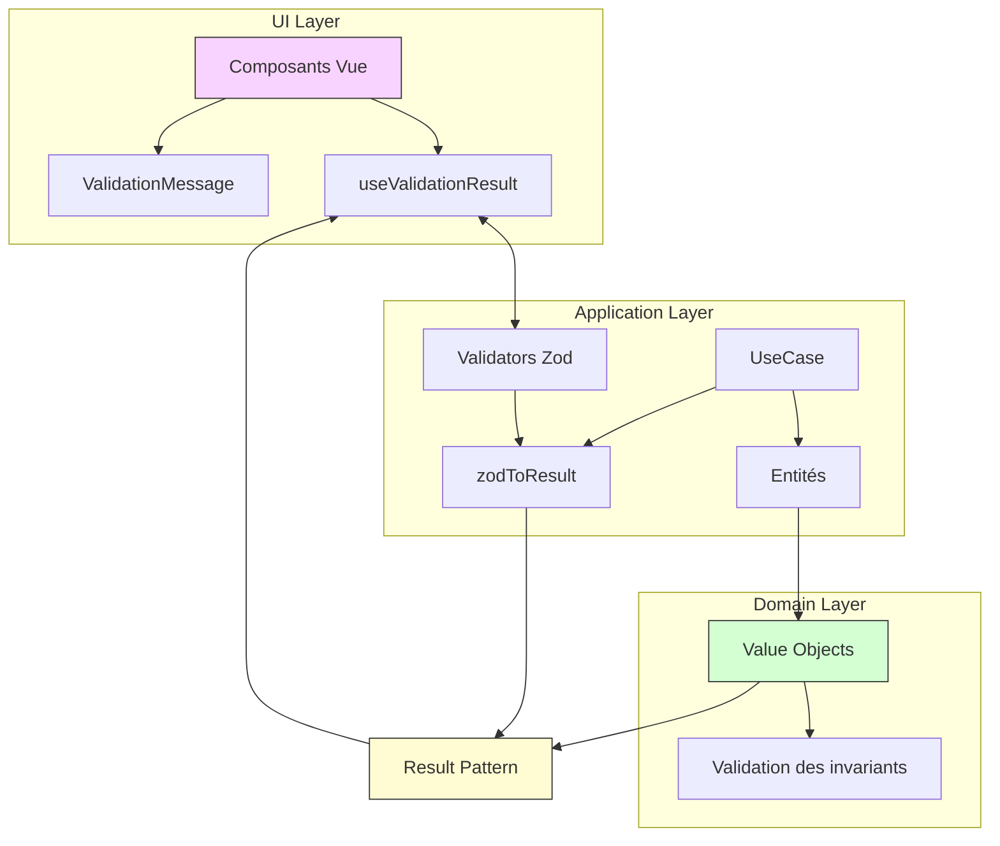
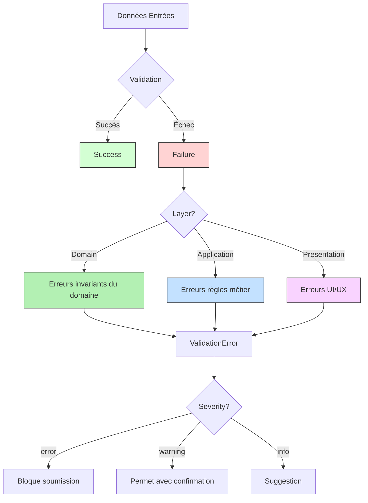
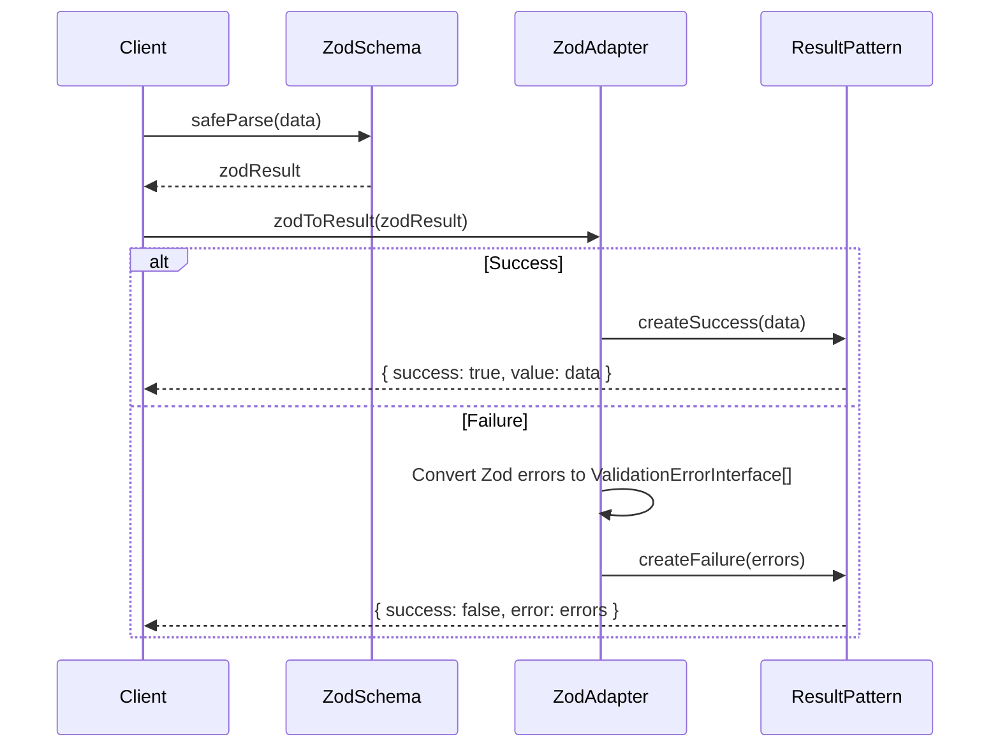
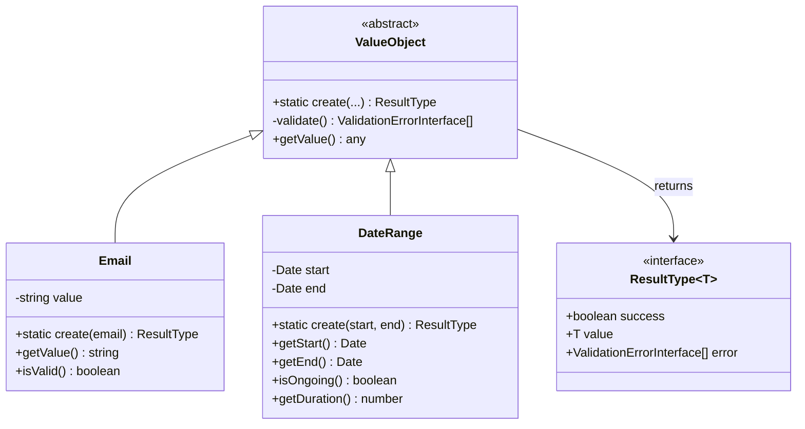
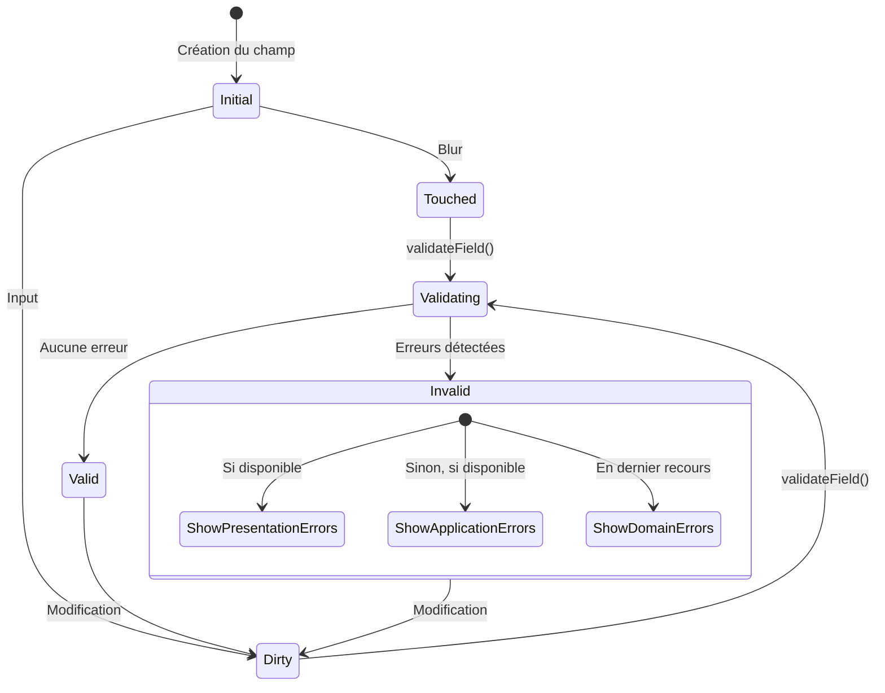
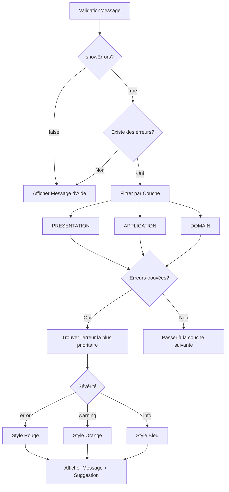
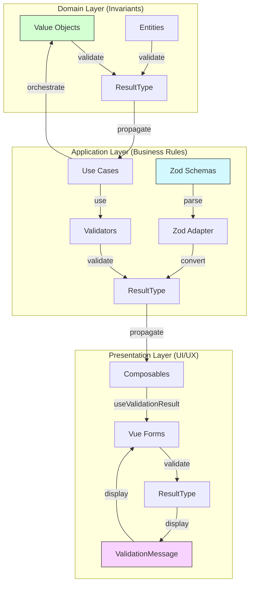

# Système de Messages d'Erreur et d'Aide dans CV Generator (Version améliorée)

**Date**: 2025-04-10  
**Auteur**: Équipe de développement  
**Version**: 1.1.0  
**Statut**: Proposition de mise à jour  
**Documents associés**: `result-pattern-impl.md`, `message-systeme-catalogue.md`

## 1. Contexte et Problématique

### 1.1 État Actuel de la Gestion des Erreurs

Dans notre application CV Generator, la gestion des messages d'erreur et d'aide n'est pas suffisamment unifiée et contextuelle. Les problèmes spécifiques incluent:

1. **Incohérence des messages**: Le format, le ton et le niveau de détail des messages varient entre les différents formulaires. Par exemple, les messages d'erreur dans `WorkForm` diffèrent significativement de ceux dans `SkillForm` ou `EducationForm`.

2. **Manque de contexte**: Les messages d'erreur sont souvent génériques sans offrir d'informations sur le contexte de l'erreur ou sur la façon de la résoudre.

3. **Absence de suggestions**: Les messages n'incluent pas de suggestions d'amélioration ou d'alternatives qui pourraient aider l'utilisateur.

4. **Gestion d'erreur fragmentée**: Les validations et la gestion des erreurs sont implémentées différemment selon les composants, ce qui complique la maintenance et l'évolution.

5. **Visibilité sous-optimale**: Les messages d'erreur ne sont pas toujours clairement visibles ou peuvent disparaître sans que l'utilisateur n'ait eu le temps de les lire.

### 1.2 Impact sur l'Expérience Utilisateur

Ces problèmes ont un impact significatif sur l'expérience utilisateur:

- **Frustration**: Les utilisateurs ne comprennent pas pourquoi leurs actions échouent
- **Perte de temps**: Sans guidance, les utilisateurs font des essais-erreurs
- **Abandon**: Un taux élevé d'abandons est observé dans les formulaires complexes
- **Support technique accru**: L'équipe support reçoit de nombreuses questions sur les erreurs

## 2. Objectifs

Nous visons à implémenter un système de messages d'erreur et d'aide qui:

1. **Unifie l'approche**: Crée une expérience cohérente à travers tous les formulaires et composants (`BasicsForm`, `WorkForm`, `SkillForm`, etc.)

2. **Contextualise les erreurs**: Fournit des informations précises sur ce qui a causé l'erreur

3. **Guide l'utilisateur**: Offre des suggestions claires pour résoudre les problèmes

4. **Prévient les erreurs**: Utilise des messages d'aide préventifs pour guider l'utilisateur avant que les erreurs ne surviennent

5. **Adapte les messages**: Ajuste le ton et le contenu des messages en fonction de la sévérité et du contexte (info, avertissement, erreur)

## 3. Approche Technique



### 3.1 Result/Option Pattern avec Stratification des Validations

Pour atteindre ces objectifs, nous adopterons le Result/Option Pattern intégré avec une stratification claire des validations par couche architecturale. Cette approche nous permettra de:

1. **Traiter systématiquement les erreurs**: Approche uniforme pour tous les composants
2. **Contextualiser les erreurs**: Structure de données riche pour les messages
3. **Composer les validations**: Chaîner les validations tout en préservant le contexte
4. **Respecter les responsabilités de chaque couche**: Séparation claire des préoccupations



#### 3.1.1 Types et Interfaces avec Stratification des Validations

```typescript
/** Niveaux de sévérité pour les erreurs */
export type ValidationSeverityType = "info" | "warning" | "error";

/** Couches architecturales où les validations peuvent se produire */
export enum ValidationLayerType {
  DOMAIN = "domain", // Règles métier fondamentales
  APPLICATION = "application", // Règles d'orchestration
  PRESENTATION = "presentation", // Validation UI/UX
}

/** Interface pour les erreurs de validation */
export interface ValidationErrorInterface {
  /** Code unique identifiant le type d'erreur */
  code: string;
  /** Message explicatif */
  message: string;
  /** Champ concerné par l'erreur */
  field: string;
  /** Niveau de sévérité */
  severity: ValidationSeverityType;
  /** Couche architecturale responsable de la validation */
  layer: ValidationLayerType;
  /** Suggestion optionnelle pour résoudre le problème */
  suggestion?: string;
  /** Informations supplémentaires */
  additionalInfo?: Record<string, unknown>;
}

/** Interface pour les messages d'aide */
export interface HelpMessageInterface {
  /** Identifiant unique du message */
  id: string;
  /** Titre court du message */
  title: string;
  /** Contenu détaillé */
  content: string;
  /** Champ concerné */
  field: string;
  /** Si le message doit être affiché automatiquement */
  autoShow?: boolean;
  /** Exemples de valeurs correctes */
  examples?: string[];
}
```

#### 3.1.2 Distinction des Responsabilités par Couche

| Couche           | Type de Validation    | Exemple                                                                                          | Implémentation                   |
| ---------------- | --------------------- | ------------------------------------------------------------------------------------------------ | -------------------------------- |
| **Domain**       | Invariants du domaine | "Une expérience professionnelle ne peut pas avoir une date de fin antérieure à sa date de début" | Value Objects et Entités         |
| **Application**  | Règles d'application  | "L'utilisateur doit être authentifié pour modifier ce CV"                                        | Services et Use Cases            |
| **Presentation** | Validation UI/UX      | "Format d'email incorrect" avec feedback immédiat                                                | Composables Vue et Validators UI |

### 3.2 Intégration avec Zod

Pour optimiser notre implémentation, nous intégrerons Zod (déjà présent dans nos dépendances) avec notre Result Pattern:

```typescript
// packages/shared/src/utils/zod-adapter.ts
import { z } from "zod";
import type { ResultType, ValidationErrorInterface } from "../types";
import { createSuccess, createFailure } from "./result.utils";
import { ValidationLayerType } from "../enums";

/**
 * Convertit le résultat d'une validation Zod en ResultType
 */
export function zodToResult<T>(
  zodResult: z.SafeParseReturnType<unknown, T>,
  options: {
    layer?: ValidationLayerType; // Couche par défaut
    errorMap?: (error: z.ZodError) => ValidationErrorInterface[];
  } = {}
): ResultType<T> {
  const { layer = ValidationLayerType.APPLICATION } = options;

  if (zodResult.success) {
    return createSuccess(zodResult.data);
  }

  // Conversion des erreurs Zod en format ValidationError
  const errors: ValidationErrorInterface[] = options.errorMap
    ? options.errorMap(zodResult.error)
    : zodResult.error.errors.map((err) => ({
        code: `invalid_${err.path.join("_") || "value"}`,
        message: err.message,
        field: err.path.join(".") || "_global",
        severity: "error",
        layer,
        suggestion: getSuggestionForZodError(err),
      }));

  return createFailure(errors);
}

/**
 * Génère des suggestions en fonction du type d'erreur Zod
 */
function getSuggestionForZodError(error: z.ZodIssue): string | undefined {
  switch (error.code) {
    case "invalid_type":
      return `Attendu: ${error.expected}, reçu: ${error.received}`;
    case "too_small":
      return `La valeur doit être ${
        error.type === "string" ? "plus longue" : "plus grande"
      } (minimum: ${error.minimum})`;
    case "too_big":
      return `La valeur doit être ${
        error.type === "string" ? "plus courte" : "plus petite"
      } (maximum: ${error.maximum})`;
    // Autres cas...
    default:
      return undefined;
  }
}
```



### 3.3 Standardisation des Codes d'Erreur avec le Catalogue

Pour assurer une cohérence avec notre catalogue de messages existant (`message-systeme-catalogue.md`), nous définirons des constantes typées:

```typescript
// packages/shared/src/constants/error-codes.const.ts
export const ERROR_CODES = {
  RESUME: {
    BASICS: {
      MISSING_NAME: "missing_name",
      MISSING_EMAIL: "missing_email",
      INVALID_EMAIL: "invalid_email",
      PERSONAL_EMAIL: "personal_email",
      // ... autres codes du catalogue
    },
    WORK: {
      MISSING_COMPANY: "missing_company",
      VAGUE_POSITION: "vague_position",
      MISSING_START_DATE: "missing_start_date",
      END_BEFORE_START: "end_before_start",
      // ... autres codes
    },
    // ... autres sections
  },
} as const;

// Type pour l'autocomplétion et la sécurité de type
export type ErrorCodeType = typeof ERROR_CODES;
```

### 3.4 Architecture du Système de Messages

```
packages/
├── shared/
│   └── src/
│       ├── types/
│       │   ├── result.type.ts             # Types ResultType/OptionType de base
│       │   └── validation.interface.ts    # Interface ValidationErrorInterface
│       ├── constants/
│       │   └── error-codes.const.ts       # Constantes pour les codes d'erreur
│       ├── enums/
│       │   └── validation.enum.ts         # Enum ValidationLayerType
│       └── utils/
│           ├── result.utils.ts            # Fonctions utilitaires génériques
│           └── zod-adapter.ts             # Adapter Zod vers Result Pattern
├── core/
│   └── src/
│       └── cv/
│           ├── domain/
│           │   ├── entities/
│           │   │   └── work-experience.entity.ts   # Entités du domaine
│           │   └── value-objects/
│           │       ├── date-range.value-object.ts  # Value Objects pour validation
│           │       └── email.value-object.ts       # Validation d'email
│           └── application/
│               ├── validators/
│               │   ├── base.validator.ts           # Classe de base pour validateurs
│               │   └── work-experience.validator.ts # Validateur spécifique
│               └── services/
│                   └── validation.service.ts       # Services de validation
└── ui/
    └── src/
        ├── modules/
        │   └── cv/
        │       └── presentation/
        │           ├── composables/
        │           │   ├── validation/
        │           │   │   ├── index.ts                   # Exports des composables
        │           │   │   ├── useValidationResult.ts     # Composable principal amélioré
        │           │   │   └── useValidationCatalogue.ts  # Gestion du catalogue
        │           │   └── helpers/
        │           │       └── result-handlers.utils.ts   # Utilitaires spécifiques
        │           └── components/
        │               └── validation/
        │                   └── ValidationMessage.vue      # Composant d'affichage
        └── utils/
            └── validation/
                └── messages.catalogue.ts                  # Catalogue des messages
```

## 4. Implémentation

### 4.1 Value Objects comme Gardiens du Domaine

Les Value Objects serviront de première ligne de défense pour protéger l'intégrité du domaine:

```typescript
// packages/core/src/cv/domain/value-objects/date-range.value-object.ts
import { ResultType, ValidationErrorInterface } from "@shared/types";
import { createSuccess, createFailure } from "@shared/utils/result.utils";
import { ERROR_CODES } from "@shared/constants/error-codes.const";
import { ValidationLayerType } from "@shared/enums";

export class DateRange {
  private constructor(
    private readonly start: Date,
    private readonly end: Date | null
  ) {}

  public static create(
    startDate: string,
    endDate: string | null
  ): ResultType<DateRange> {
    const start = new Date(startDate);
    const end = endDate ? new Date(endDate) : null;

    const errors: ValidationErrorInterface[] = [];

    if (isNaN(start.getTime())) {
      errors.push({
        code: ERROR_CODES.COMMON.INVALID_DATE_FORMAT,
        message: "Format de date invalide",
        field: "startDate",
        severity: "error",
        layer: ValidationLayerType.DOMAIN,
        suggestion: "Utilisez le format AAAA-MM-JJ (ex: 2024-01-15)",
      });
    }

    if (end && isNaN(end.getTime())) {
      errors.push({
        code: ERROR_CODES.COMMON.INVALID_DATE_FORMAT,
        message: "Format de date invalide",
        field: "endDate",
        severity: "error",
        layer: ValidationLayerType.DOMAIN,
        suggestion: "Utilisez le format AAAA-MM-JJ (ex: 2024-01-15)",
      });
    }

    if (end && start > end) {
      errors.push({
        code: ERROR_CODES.RESUME.WORK.END_BEFORE_START,
        message: "La date de fin doit être postérieure à la date de début",
        field: "endDate",
        severity: "error",
        layer: ValidationLayerType.DOMAIN,
        suggestion:
          "Assurez-vous que la date de fin est postérieure à la date de début",
      });
    }

    if (errors.length > 0) {
      return createFailure(errors);
    }

    return createSuccess(new DateRange(start, end));
  }

  public getStart(): Date {
    return this.start;
  }

  public getEnd(): Date | null {
    return this.end;
  }

  public isOngoing(): boolean {
    return this.end === null;
  }

  public getDurationInMonths(): number {
    const endDate = this.end || new Date();
    // Calcul de durée...
    return 0; // Logique de calcul à implémenter
  }
}

// Autre exemple - Value Object Email
// packages/core/src/cv/domain/value-objects/email.value-object.ts
export class Email {
  private constructor(private readonly value: string) {}

  public static create(email: string): ResultType<Email> {
    if (!email || email.trim() === "") {
      return createFailure([
        {
          code: ERROR_CODES.RESUME.BASICS.MISSING_EMAIL,
          message: "L'adresse email est requise",
          field: "email",
          severity: "error",
          layer: ValidationLayerType.DOMAIN,
          suggestion: "Veuillez entrer votre adresse email professionnelle",
        },
      ]);
    }

    const emailRegex = /^[^\s@]+@[^\s@]+\.[^\s@]+$/;
    if (!emailRegex.test(email)) {
      return createFailure([
        {
          code: ERROR_CODES.RESUME.BASICS.INVALID_EMAIL,
          message: "Format d'email invalide",
          field: "email",
          severity: "error",
          layer: ValidationLayerType.DOMAIN,
          suggestion:
            "Vérifiez que votre email contient un @ et un domaine valide",
        },
      ]);
    }

    if (email.endsWith("@gmail.com") || email.endsWith("@hotmail.com")) {
      return createFailure([
        {
          code: ERROR_CODES.RESUME.BASICS.PERSONAL_EMAIL,
          message: "Adresse email personnelle détectée",
          field: "email",
          severity: "warning",
          layer: ValidationLayerType.DOMAIN,
          suggestion:
            "Pour un CV professionnel, préférez utiliser une adresse email professionnelle",
        },
      ]);
    }

    return createSuccess(new Email(email));
  }

  public getValue(): string {
    return this.value;
  }
}
```



### 4.2 Schémas Zod pour la Validation d'Application

```typescript
// packages/core/src/cv/application/validators/work-experience.validator.ts
import { z } from "zod";
import { zodToResult } from "@shared/utils/zod-adapter";
import { ValidationLayerType } from "@shared/enums";
import { ERROR_CODES } from "@shared/constants/error-codes.const";
import type { WorkExperienceDTO, ResultType } from "@shared/types";

// Définition du schéma Zod avec messages personnalisés
const workExperienceSchema = z.object({
  company: z
    .string({
      required_error: "Le nom de l'entreprise est requis",
    })
    .min(1, "Le nom de l'entreprise est requis"),

  position: z
    .string({
      required_error: "L'intitulé du poste est requis",
    })
    .min(1, "L'intitulé du poste est requis")
    .min(5, "L'intitulé du poste est trop court"),

  startDate: z
    .string({
      required_error: "La date de début est requise",
    })
    .min(1, "La date de début est requise")
    .refine((d) => !isNaN(new Date(d).getTime()), "Format de date invalide"),

  endDate: z
    .string()
    .nullable()
    .optional()
    .refine(
      (d) => !d || !isNaN(new Date(d).getTime()),
      "Format de date invalide"
    ),

  summary: z
    .string({
      required_error: "La description du poste est requise",
    })
    .min(1, "La description du poste est requise")
    .min(50, "Description trop succincte (minimum 50 caractères)"),

  highlights: z
    .array(z.string())
    .optional()
    .refine((h) => !h || h.length > 0, "Ajoutez au moins une réalisation"),
});

export class WorkExperienceValidator {
  /**
   * Valide un DTO d'expérience professionnelle
   */
  public validate(data: unknown): ResultType<WorkExperienceDTO> {
    // Utilise l'adaptateur pour convertir le résultat Zod en ResultType
    return zodToResult(workExperienceSchema.safeParse(data), {
      layer: ValidationLayerType.APPLICATION,
      // Map personnalisé pour enrichir les erreurs avec des suggestions spécifiques
      errorMap: (zodError) => {
        return zodError.errors.map((err) => {
          // Mapping personnalisé par cas...
          if (err.code === "too_small" && err.path.includes("summary")) {
            return {
              code: ERROR_CODES.RESUME.WORK.BRIEF_DESCRIPTION,
              message: "Description trop succincte",
              field: "summary",
              severity: "warning",
              layer: ValidationLayerType.APPLICATION,
              suggestion:
                "Ajoutez plus de détails pour valoriser cette expérience (au moins 200 caractères recommandés)",
            };
          }

          // Cas par défaut
          return {
            code: `invalid_${err.path.join("_") || "value"}`,
            message: err.message,
            field: err.path.join(".") || "_global",
            severity: "error",
            layer: ValidationLayerType.APPLICATION,
          };
        });
      },
    });
  }

  /**
   * Valide uniquement un champ spécifique (pour validation temps réel)
   */
  public validateField(
    data: Partial<WorkExperienceDTO>,
    fieldName: string
  ): ResultType<Partial<WorkExperienceDTO>> {
    // Extrait uniquement le schéma pour le champ demandé
    const fieldSchema = z.object({
      [fieldName]:
        workExperienceSchema.shape[
          fieldName as keyof typeof workExperienceSchema.shape
        ],
    });

    return zodToResult(
      fieldSchema.safeParse({
        [fieldName]: data[fieldName as keyof typeof data],
      }),
      {
        layer: ValidationLayerType.PRESENTATION, // Validation UI en temps réel
      }
    );
  }
}
```

### 4.3 Composable `useValidationResult` Amélioré

Voici l'amélioration du composable avec un tracking d'état complet des champs:

```typescript
// packages/ui/src/modules/cv/presentation/composables/validation/useValidationResult.ts
import { ref, computed } from "vue";
import type {
  FormValidationResultType,
  ValidationErrorInterface,
} from "@shared/types";
import {
  isSuccess,
  createSuccess,
  createFailure,
} from "@shared/utils/result.utils";

export function useValidationResult<T>(initialValue: Partial<T> = {}) {
  // Résultat de validation
  const result = ref<FormValidationResultType<T>>(
    createSuccess(initialValue as T)
  );

  // États de champs
  const touchedFields = ref<Set<string>>(new Set());
  const dirtyFields = ref<Set<string>>(new Set());
  const validatedFields = ref<Set<string>>(new Set());

  // États globaux
  const isPending = ref(false);
  const hasBeenValidated = ref(false);

  // Getters pour accéder aux erreurs
  const getErrors = () => (isSuccess(result.value) ? [] : result.value.error);

  const getErrorsForField = (fieldName: string) =>
    getErrors().filter((error) => error.field === fieldName);

  // Gestion de l'état des champs
  const touchField = (fieldName: string) => {
    touchedFields.value.add(fieldName);
  };

  const markFieldAsDirty = (fieldName: string) => {
    dirtyFields.value.add(fieldName);
  };

  const markFieldAsValidated = (fieldName: string) => {
    validatedFields.value.add(fieldName);
  };

  // Détermine si les erreurs doivent être affichées pour un champ
  const shouldShowErrorsForField = (fieldName: string) => {
    // Toujours montrer après soumission complète
    if (hasBeenValidated.value) return true;

    // Montrer si touché ou modifié
    return (
      touchedFields.value.has(fieldName) || dirtyFields.value.has(fieldName)
    );
  };

  // Récupère uniquement les erreurs qui devraient être affichées
  const getVisibleErrorsForField = (fieldName: string) => {
    if (!shouldShowErrorsForField(fieldName)) {
      return [];
    }
    return getErrorsForField(fieldName);
  };

  // Validation avec gestion des erreurs intelligente
  const validate = async (
    validator?: (
      value: T
    ) => Promise<FormValidationResultType<T>> | FormValidationResultType<T>
  ) => {
    if (!validator) return result.value;

    isPending.value = true;

    try {
      const input = isSuccess(result.value) ? result.value.value : ({} as T);
      const validationResult = validator(input);
      result.value =
        validationResult instanceof Promise
          ? await validationResult
          : validationResult;
      hasBeenValidated.value = true;

      // Marquer tous les champs comme validés
      if (isSuccess(result.value)) {
        Object.keys(result.value.value).forEach((key) => {
          validatedFields.value.add(key);
        });
      } else {
        // Marquer uniquement les champs avec erreur comme validés
        result.value.error.forEach((err) => {
          if (err.field !== "_global") {
            validatedFields.value.add(err.field);
          }
        });
      }
    } catch (e) {
      // Conversion des exceptions en messages d'erreur structurés
      result.value = createFailure([
        {
          code: "unexpected_error",
          message:
            e instanceof Error
              ? e.message
              : "Une erreur inattendue est survenue",
          field: "_global",
          severity: "error",
          layer: "application", // Layer par défaut pour les erreurs système
        },
      ]);
    } finally {
      isPending.value = false;
    }

    return result.value;
  };

  // Validation d'un champ spécifique (temps réel)
  const validateField = async (
    fieldName: string,
    fieldValidator: (
      value: any
    ) => Promise<FormValidationResultType<any>> | FormValidationResultType<any>
  ) => {
    markFieldAsDirty(fieldName);

    try {
      const fieldValue = isSuccess(result.value)
        ? (result.value.value as any)[fieldName]
        : undefined;

      const fieldResult = await (fieldValidator(fieldValue) instanceof Promise
        ? fieldValidator(fieldValue)
        : Promise.resolve(fieldValidator(fieldValue)));

      // Mise à jour du résultat global
      if (!isSuccess(fieldResult)) {
        const currentErrors = [...getErrors()];
        // Filtrer les erreurs précédentes de ce champ
        const otherErrors = currentErrors.filter(
          (err) => err.field !== fieldName
        );
        // Ajouter les nouvelles erreurs
        result.value = createFailure([...otherErrors, ...fieldResult.error]);
      } else if (!isSuccess(result.value)) {
        // Si le champ est valide, supprimer ses erreurs du résultat global
        const currentErrors = [...result.value.error];
        const filteredErrors = currentErrors.filter(
          (err) => err.field !== fieldName
        );

        if (filteredErrors.length === 0) {
          // Si plus d'erreurs, convertir en succès
          result.value = createSuccess(fieldResult.value as unknown as T);
        } else {
          // Sinon mettre à jour les erreurs
          result.value = createFailure(filteredErrors);
        }
      }

      markFieldAsValidated(fieldName);
    } catch (e) {
      console.error(`Error validating field ${fieldName}:`, e);
    }
  };

  // Marquer tous les champs comme touchés (utile pour afficher toutes les erreurs)
  const touchAllFields = () => {
    if (isSuccess(result.value)) {
      Object.keys(result.value.value).forEach((key) => {
        touchedFields.value.add(key);
      });
    }
  };

  return {
    result,
    isPending,
    hasBeenValidated,
    getErrors,
    getErrorsForField,
    getVisibleErrorsForField,
    validate,
    validateField,
    touchField,
    markFieldAsDirty,
    markFieldAsValidated,
    touchAllFields,
    shouldShowErrorsForField,
    isTouched: (field: string) => touchedFields.value.has(field),
    isDirty: (field: string) => dirtyFields.value.has(field),
    isValidated: (field: string) => validatedFields.value.has(field),
  };
}
```



### 4.4 Composant `ValidationMessage` Adapté

```vue
<!-- packages/ui/src/modules/cv/presentation/components/validation/ValidationMessage.vue -->
<script setup lang="ts">
import { computed } from "vue";
import type {
  ValidationErrorInterface,
  HelpMessageInterface,
} from "@shared/types";

const props = defineProps<{
  errors?: ValidationErrorInterface[];
  help?: HelpMessageInterface;
  fieldName: string;
  showErrors: boolean;
}>();

// Filtrer par couche pour l'affichage avec priorité
const prioritizedErrors = computed(() => {
  if (!props.errors || !props.showErrors) return [];

  // Prioriser les erreurs de présentation pour le feedback immédiat
  const presentationErrors = props.errors.filter(
    (e) => e.layer === "presentation"
  );
  if (presentationErrors.length > 0) return presentationErrors;

  // Ensuite les erreurs d'application
  const applicationErrors = props.errors.filter(
    (e) => e.layer === "application"
  );
  if (applicationErrors.length > 0) return applicationErrors;

  // Enfin les erreurs de domaine
  return props.errors.filter((e) => e.layer === "domain");
});

const highestSeverityError = computed(() => {
  if (prioritizedErrors.value.length === 0) return null;

  // Trouver l'erreur avec la sévérité la plus élevée
  const errorPriority = { error: 3, warning: 2, info: 1 };
  return prioritizedErrors.value.reduce(
    (prev, current) =>
      errorPriority[current.severity] > errorPriority[prev.severity]
        ? current
        : prev,
    prioritizedErrors.value[0]
  );
});

const messageClass = computed(() => {
  if (!highestSeverityError.value) return "help-message";

  return {
    "error-message": highestSeverityError.value.severity === "error",
    "warning-message": highestSeverityError.value.severity === "warning",
    "info-message": highestSeverityError.value.severity === "info",
  };
});
</script>

<template>
  <div
    v-if="(showErrors && highestSeverityError) || help"
    class="validation-message"
    :class="messageClass"
  >
    <!-- Message d'erreur prioritaire -->
    <div v-if="showErrors && highestSeverityError" class="error-content">
      <span class="message">{{ highestSeverityError.message }}</span>
      <span v-if="highestSeverityError.suggestion" class="suggestion">
        Suggestion: {{ highestSeverityError.suggestion }}
      </span>

      <!-- Afficher le nombre total d'erreurs s'il y en a plus d'une -->
      <span v-if="prioritizedErrors.length > 1" class="additional-errors">
        +{{ prioritizedErrors.length - 1 }} autres problèmes
      </span>
    </div>

    <!-- Message d'aide -->
    <div v-if="help" class="help-content">
      <h4 v-if="help.title" class="help-title">{{ help.title }}</h4>
      <div class="help-body">{{ help.content }}</div>
      <div
        v-if="help.examples && help.examples.length > 0"
        class="help-examples"
      >
        <div>Exemples:</div>
        <ul>
          <li v-for="(example, index) in help.examples" :key="index">
            {{ example }}
          </li>
        </ul>
      </div>
    </div>
  </div>
</template>
```



## 5. Exemples d'Utilisation

### 5.1 Intégration dans un Formulaire Vue

```vue
<!-- packages/ui/src/modules/cv/presentation/components/work/WorkForm.vue -->
<script setup lang="ts">
import { ref, onMounted } from "vue";
import { useValidationResult } from "@/composables/validation/useValidationResult";
import { useHelpSystem } from "@/composables/validation/useHelpSystem";
import { WorkExperienceValidator } from "@core/cv/application/validators/work-experience.validator";
import ValidationMessage from "@/components/validation/ValidationMessage.vue";
import { ERROR_CODES } from "@shared/constants/error-codes.const";

const props = defineProps<{
  initialData?: Partial<WorkExperienceDTO>;
}>();

const emit = defineEmits<{
  (e: "submit", data: WorkExperienceDTO): void;
  (e: "cancel"): void;
}>();

// Instancier le validateur
const workValidator = new WorkExperienceValidator();

// Form state
const formData = ref({
  company: props.initialData?.company || "",
  position: props.initialData?.position || "",
  startDate: props.initialData?.startDate || "",
  endDate: props.initialData?.endDate || "",
  summary: props.initialData?.summary || "",
  highlights: props.initialData?.highlights || [],
});

// Validation et aide
const validation = useValidationResult(formData.value);
const helpSystem = useHelpSystem();

// Chargement des messages d'aide au montage
onMounted(() => {
  helpSystem.showHelpMessage("work_position_help");
  helpSystem.showHelpMessage("work_summary_help");
});

// Validation en temps réel d'un champ spécifique
const validateField = (field: string) => {
  validation.validateField(field, (value) =>
    workValidator.validateField({ [field]: value }, field)
  );
};

// Validation complète au submit
const handleSubmit = async () => {
  // Marquer tous les champs comme touchés pour afficher toutes les erreurs
  validation.touchAllFields();

  // Validation complète
  const result = await validation.validate(() =>
    workValidator.validate(formData.value)
  );

  if (isSuccess(result)) {
    emit("submit", result.value);
  }
};
</script>

<template>
  <form @submit.prevent="handleSubmit" class="work-experience-form">
    <div class="form-group">
      <label for="company">Entreprise*</label>
      <input
        id="company"
        v-model="formData.company"
        @blur="validation.touchField('company')"
        @input="validateField('company')"
        :class="{
          'has-error':
            validation.getVisibleErrorsForField('company').length > 0,
        }"
      />
      <ValidationMessage
        :errors="validation.getVisibleErrorsForField('company')"
        :help="helpSystem.getHelpMessageForField('company')"
        :showErrors="validation.shouldShowErrorsForField('company')"
        fieldName="company"
      />
    </div>

    <div class="form-group">
      <label for="position">Intitulé du poste*</label>
      <input
        id="position"
        v-model="formData.position"
        @blur="validation.touchField('position')"
        @input="validateField('position')"
        :class="{
          'has-error':
            validation.getVisibleErrorsForField('position').length > 0,
        }"
      />
      <ValidationMessage
        :errors="validation.getVisibleErrorsForField('position')"
        :help="helpSystem.getHelpMessageForField('position')"
        :showErrors="validation.shouldShowErrorsForField('position')"
        fieldName="position"
      />
    </div>

    <!-- Autres champs du formulaire -->

    <div class="form-actions">
      <button type="button" @click="emit('cancel')">Annuler</button>
      <button type="submit">Enregistrer</button>
    </div>
  </form>
</template>
```

### 5.2 Utilisation des Value Objects dans un Use Case

````typescript
// packages/core/src/cv/application/use-cases/create-work-experience.use-case.ts
import { inject, injectable } from 'tsyringe';
import { WorkExperienceRepository } from '@core/cv/domain/repositories/work-experience.repository.interface';
import { DateRange } from '@core/cv/domain/value-objects/date-range.value-object';
import { WorkExperienceEntity } from '@core/cv/domain/entities/work-experience.entity';
import { ResultType, WorkExperienceDTO } from '@shared/types';
import { isSuccess, createSuccess, createFailure } from '@shared/utils/result.utils';
import { ERROR_CODES } from '@shared/constants/error-codes.const';
import { ValidationLayerType } from '@shared/enums';

@injectable()
export class CreateWorkExperienceUseCase {
  constructor(
    @inject('WorkExperienceRepository')
    private readonly workExperienceRepo: WorkExperienceRepository
  ) {}

  async execute(dto: WorkExperienceDTO): Promise<ResultType<WorkExperienceEntity>> {
    try {
      // 1. Valider et créer les Value Objects
      const dateRangeResult = DateRange.create(dto.startDate, dto.endDate);
      if (!isSuccess(dateRangeResult)) {
        return dateRangeResult;
      }

      // 2. Créer l'entité du domaine avec les Value Objects validés
      const workExperienceResult = WorkExperienceEntity.create({
        id: dto.id,
        company: dto.company,
        position: dto.position,
        dateRange: dateRangeResult.value,
        summary: dto.summary,
        highlights: dto.highlights
      });

      if (!isSuccess(workExperienceResult)) {
        return workExperienceResult;
      }

      // 3. Persistance
      const savedEntity = await this.workExperienceRepo.save(workExperienceResult.value);

      return createSuccess(savedEntity);
    } catch (error) {
      return createFail
<think>
It looks like I need to continue the response that was cut off at the end. The last part was showing "Utilisation des Value Objects dans un Use Case" and got cut off in the middle of an error handling block. Let me continue from there with the remainder of the document.
</think>

```typescript
// Continuation du code précédent
      return createFailure([{
        code: ERROR_CODES.SYSTEM.UNEXPECTED_ERROR,
        message: error instanceof Error ? error.message : "Une erreur inattendue est survenue",
        field: "_global",
        severity: "error",
        layer: ValidationLayerType.APPLICATION
      }]);
    }
  }
}
````

## 6. Avantages de l'Approche Améliorée

### 6.1 Avantages Techniques

#### 6.1.1 Stratification Claire des Validations

La définition explicite des couches de validation (`ValidationLayerType`) permet:

- **Séparation des préoccupations**: Chaque couche est responsable de sa propre validation
- **Priorisation intelligente**: Le composant d'affichage peut choisir les erreurs les plus pertinentes
- **Traçabilité**: Source claire de chaque validation pour le débogage
- **Cohérence architecturale**: Alignement avec les principes Clean Architecture

#### 6.1.2 Intégration avec Zod

L'intégration explicite avec Zod apporte:

- **Réduction du code**: Moins de code de validation manuel
- **Validation déclarative**: Expression claire des règles
- **Typage sûr**: Inférence de types automatique
- **Adaptabilité**: Facile à étendre avec des validateurs personnalisés

#### 6.1.3 Standardisation des Codes d'Erreur

La définition d'un catalogue de codes d'erreur typés offre:

- **Cohérence**: Messages uniformes dans toute l'application
- **Sécurité de type**: Détection des erreurs à la compilation
- **Internationalisation**: Support facilité pour les traductions
- **Documentation intégrée**: Le catalogue sert de référence

#### 6.1.4 Value Objects Robustes

L'utilisation des Value Objects comme gardiens du domaine assure:

- **Invariants garantis**: Les objets du domaine sont toujours valides
- **Encapsulation optimale**: Logique de validation au plus près des données
- **Réutilisabilité**: Les Value Objects sont partagés entre les entités
- **Expressivité du domaine**: Modélisation précise des concepts métier

### 6.2 Avantages pour l'Expérience Utilisateur

#### 6.2.1 Tracking d'État Complet

Le tracking amélioré de l'état des champs permet:

- **Feedback adapté au contexte**: Erreurs affichées uniquement quand approprié
- **Expérience progressive**: Validation au fur et à mesure de l'interaction
- **Réduction de la frustration**: Pas de messages précoces ou incorrects
- **Contrôle granulaire**: Différentes stratégies d'affichage selon le contexte

#### 6.2.2 Affichage Priorisé des Erreurs

La hiérarchisation des erreurs selon la couche et la sévérité offre:

- **Information la plus pertinente d'abord**: L'utilisateur voit les erreurs les plus importantes
- **Réduction de la surcharge cognitive**: Pas de liste d'erreurs intimidante
- **Guidage progressif**: L'utilisateur corrige étape par étape
- **Adaptabilité contextuelle**: Différentes erreurs selon l'étape d'interaction

## 7. Stratégie d'Implémentation



### 7.1 Phases de Migration

Nous procéderons par phases incrémentales:

1. **Phase 1: Infrastructure** (2 semaines)

   - Implémenter les types et interfaces de base
   - Créer l'adaptateur Zod
   - Définir le catalogue de codes d'erreur

2. **Phase 2: Value Objects** (3 semaines)

   - Implémenter les Value Objects principaux
   - Intégrer la validation dans le domaine
   - Tester la robustesse des invariants

3. **Phase 3: Composables et Composants UI** (2 semaines)

   - Améliorer `useValidationResult`
   - Créer le composant `ValidationMessage` adapté
   - Tester les interactions utilisateur

4. **Phase 4: Formulaires Prioritaires** (3 semaines)

   - Migrer `BasicsForm`, `WorkForm`, `SkillForm`
   - Créer les validateurs Zod pour ces formulaires
   - Tests utilisateurs et ajustements

5. **Phase 5: Extension à Tous les Formulaires** (4 semaines)
   - Migrer progressivement les autres formulaires
   - Harmoniser les messages d'erreur
   - Finaliser le catalogue de messages

### 7.2 Priorités par Composant

| Priorité | Composants                                            | Justification                               |
| -------- | ----------------------------------------------------- | ------------------------------------------- |
| Élevée   | `BasicsForm`, `WorkForm`, `SkillForm`                 | Formulaires les plus utilisés et complexes  |
| Moyenne  | `EducationForm`, `ProjectForm`, `LanguageForm`        | Formulaires importants mais moins complexes |
| Normale  | `VolunteerForm`, `CertificateForm`, `PublicationForm` | Formulaires spécialisés                     |
| Basse    | `AwardForm`, `InterestForm`, `ReferenceForm`          | Formulaires simples avec peu de validations |

### 7.3 Métriques de Succès

Pour mesurer l'efficacité de cette amélioration, nous suivrons:

- **Taux d'abandon des formulaires**: Devrait diminuer de >30%
- **Tickets support liés aux erreurs**: Devrait diminuer de >50%
- **Temps moyen de complétion**: Devrait diminuer de >20%
- **Satisfaction utilisateur**: Mesurée via des enquêtes de satisfaction
- **Couverture de code des validations**: Objectif >90%

## 8. Conclusion

Cette version améliorée du système de messages d'erreur et d'aide apporte des avancées significatives sur plusieurs fronts:

1. **Architecture Clean/DDD renforcée**: La stratification claire des validations respecte et renforce les principes d'architecture propre et de DDD.

2. **Intégration optimisée avec Zod**: L'utilisation de Zod comme moteur de validation principal réduit le code tout en augmentant la robustesse.

3. **Value Objects comme première ligne de défense**: Les Value Objects garantissent l'intégrité du domaine et centralisent les règles métier fondamentales.

4. **Expérience utilisateur améliorée**: Le tracking d'état granulaire et l'affichage contextualisé des erreurs réduisent la friction et guident l'utilisateur.

5. **Standardisation complète**: Le catalogue de codes d'erreur associé à une représentation typée garantit cohérence et maintenabilité.

Ces améliorations nous permettront de fournir une expérience de création de CV plus fluide, intuitive et guidée, tout en renforçant la qualité du code et sa maintenabilité à long terme.

---

## Références

- Document d'implémentation technique: `result-pattern-impl.md`
- Catalogue des messages: `message-systeme-catalogue.md`
- [Vue.js Error Handling Best Practices](https://vuejs.org/guide/best-practices/error-handling.html)
- [Zod Documentation](https://github.com/colinhacks/zod)
- [GitHub: Design Patterns pour la gestion d'erreurs](https://github.com/giak/design-patterns-typescript/blob/main/src/docs/article/errorHandlers/03-analyse-detaillee.md)
- [Domain-Driven Design and the Notification Pattern](https://enterprisecraftsmanship.com/posts/notification-pattern/)
- [Clean Architecture - Uncle Bob](https://blog.cleancoder.com/uncle-bob/2012/08/13/the-clean-architecture.html)
