# Documentation Technique: Implémentation de la Fonctionnalité "Education" dans CV Generator

## 1. Introduction

Cette documentation détaille l'implémentation technique de la fonctionnalité "Education" dans l'application CV Generator, en suivant les principes de Clean Architecture. Cette fonctionnalité permet aux utilisateurs de créer, lire, mettre à jour et supprimer (CRUD) leurs expériences éducatives dans leur CV.

L'implémentation suit une architecture en couches clairement délimitées, avec une séparation des responsabilités conformément aux principes SOLID et Domain-Driven Design (DDD), garantissant une application maintenable, testable et évolutive.

## 2. Architecture Globale

L'application est structurée selon une version adaptée de Clean Architecture, optimisée pour le contexte d'une application frontend:

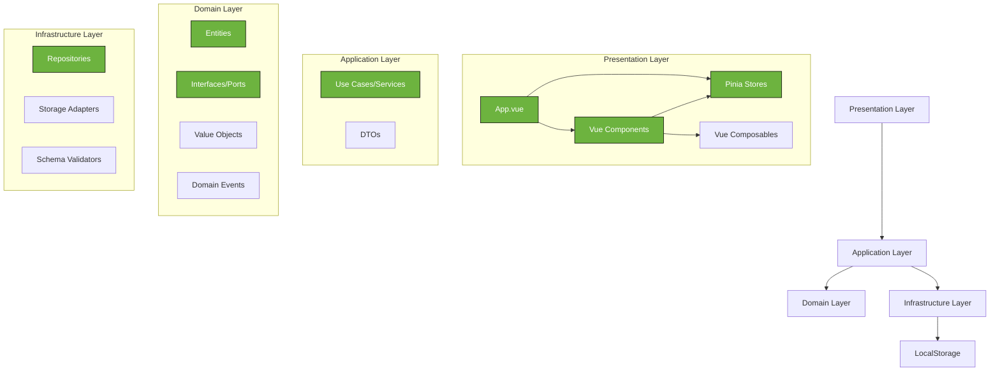
```mermaid
graph TD
    A[Presentation Layer] --> B[Application Layer]
    B --> C[Domain Layer]
    B --> D[Infrastructure Layer]
    D --> E[LocalStorage]

    subgraph "Presentation Layer"
        A1[Vue Components] --> A2[Pinia Stores]
        A1 --> A3[Vue Composables]
        A4[App.vue] --> A1
        A4 --> A2
    end

    subgraph "Application Layer"
        B1[Use Cases/Services]
        B2[DTOs]
    end

    subgraph "Domain Layer"
        C1[Entities]
        C2[Interfaces/Ports]
        C3[Value Objects]
        C4[Domain Events]
    end

    subgraph "Infrastructure Layer"
        D1[Repositories]
        D2[Storage Adapters]
        D3[Schema Validators]
    end

    classDef current fill:#6db33f,stroke:#000,color:white;
    class A1,A2,A4,B1,C1,C2,D1 current;
```

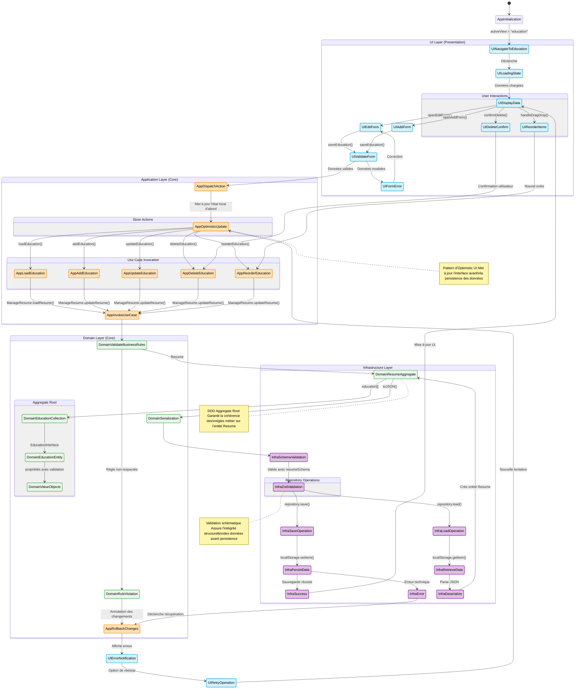
```mermaid
stateDiagram-v2
    %% Définition des styles par couche
    classDef uiLayer fill:#D4F1F9,stroke:#05AFF2,color:black,stroke-width:2px
    classDef appLayer fill:#FFE0B2,stroke:#FB8C00,color:black,stroke-width:2px
    classDef domainLayer fill:#E8F5E9,stroke:#4CAF50,color:black,stroke-width:2px
    classDef infraLayer fill:#E1BEE7,stroke:#8E24AA,color:black,stroke-width:2px

    %% Point de départ
    [*] --> AppInitialization
    AppInitialization --> UINavigateToEducation: activeView = "education"

    %% UI Layer (Presentation)
    state "UI Layer (Presentation)" as UI {
        UINavigateToEducation --> UILoadingState: Déclenche
        UILoadingState --> UIDisplayData: Données chargées

        state "User Interactions" as UserActions {
            UIDisplayData --> UIEditForm: openEditForm()
            UIDisplayData --> UIAddForm: openAddForm()
            UIDisplayData --> UIDeleteConfirm: confirmDelete()
            UIDisplayData --> UIReorderItems: handleDragDrop()
        }

        UIEditForm --> UIValidateForm: saveEducation()
        UIAddForm --> UIValidateForm: saveEducation()
        UIValidateForm --> UIFormError: Données invalides
        UIFormError --> UIEditForm: Correction
        UIValidateForm --> AppDispatchAction: Données valides
    }

    %% Application Layer (Core)
    state "Application Layer (Core)" as App {
        AppDispatchAction --> AppOptimisticUpdate: Met à jour l'état local d'abord

        state "Store Actions" as StoreActions {
            AppOptimisticUpdate --> AppLoadEducation: loadEducation()
            AppOptimisticUpdate --> AppAddEducation: addEducation()
            AppOptimisticUpdate --> AppUpdateEducation: updateEducation()
            AppOptimisticUpdate --> AppDeleteEducation: deleteEducation()
            AppOptimisticUpdate --> AppReorderEducation: reorderEducation()
        }

        state "Use Case Invocation" as UseCases {
            AppLoadEducation --> AppInvokeUseCase: ManageResume.loadResume()
            AppAddEducation --> AppInvokeUseCase: ManageResume.updateResume()
            AppUpdateEducation --> AppInvokeUseCase: ManageResume.updateResume()
            AppDeleteEducation --> AppInvokeUseCase: ManageResume.updateResume()
            AppReorderEducation --> AppInvokeUseCase: ManageResume.updateResume()
        }

        AppInvokeUseCase --> DomainValidateBusinessRules
    }

    %% Domain Layer (Core)
    state "Domain Layer (Core)" as Domain {
        state "Aggregate Root" as AggregateRoot {
            DomainValidateBusinessRules --> DomainResumeAggregate: Resume
            DomainResumeAggregate --> DomainEducationCollection: education[]
            DomainEducationCollection --> DomainEducationEntity: EducationInterface
            DomainEducationEntity --> DomainValueObjects: propriétés avec validation
        }

        DomainValidateBusinessRules --> DomainRuleViolation: Règle non respectée
        DomainRuleViolation --> AppRollbackChanges: Annulation des changements

        DomainResumeAggregate --> DomainSerialization: toJSON()
        DomainSerialization --> InfraSchemaValidation
    }

    %% Infrastructure Layer
    state "Infrastructure Layer" as Infra {
        InfraSchemaValidation --> InfraZodValidation: Valide avec resumeSchema

        state "Repository Operations" as RepoOps {
            InfraZodValidation --> InfraSaveOperation: repository.save()
            InfraZodValidation --> InfraLoadOperation: repository.load()
        }

        InfraSaveOperation --> InfraPersistData: localStorage.setItem()
        InfraLoadOperation --> InfraRetrieveData: localStorage.getItem()

        InfraPersistData --> InfraSuccess: Sauvegarde réussie
        InfraPersistData --> InfraError: Erreur technique

        InfraRetrieveData --> InfraDeserialize: Parse JSON
        InfraDeserialize --> DomainResumeAggregate: Crée entité Resume
    }

    %% Cross-cutting concerns
    InfraError --> AppRollbackChanges: Déclenche récupération
    AppRollbackChanges --> UIErrorNotification: Affiche erreur
    UIErrorNotification --> UIRetryOperation: Option de réessai
    UIRetryOperation --> AppOptimisticUpdate: Nouvelle tentative

    InfraSuccess --> UIDisplayData: Mise à jour UI

    %% Connections directes depuis les actions utilisateur
    UIDeleteConfirm --> AppDeleteEducation: Confirmation utilisateur
    UIReorderItems --> AppReorderEducation: Nouvel ordre

    %% Application des styles
    class UINavigateToEducation,UILoadingState,UIDisplayData,UIEditForm,UIAddForm,UIDeleteConfirm,UIReorderItems,UIValidateForm,UIFormError,UIErrorNotification,UIRetryOperation uiLayer

    class AppDispatchAction,AppOptimisticUpdate,AppLoadEducation,AppAddEducation,AppUpdateEducation,AppDeleteEducation,AppReorderEducation,AppInvokeUseCase,AppRollbackChanges appLayer

    class DomainValidateBusinessRules,DomainResumeAggregate,DomainEducationCollection,DomainEducationEntity,DomainValueObjects,DomainRuleViolation,DomainSerialization domainLayer

    class InfraSchemaValidation,InfraZodValidation,InfraSaveOperation,InfraLoadOperation,InfraPersistData,InfraRetrieveData,InfraSuccess,InfraError,InfraDeserialize infraLayer

    %% Notes explicatives
    note right of AppOptimisticUpdate: Pattern d'Optimistic UI Met à jour l'interface avant\nla persistence des données

    note right of DomainResumeAggregate: DDD Aggregate Root Garantit la cohérence des\nrègles métier sur l'entité Resume

    note right of InfraZodValidation: Validation schématique Assure l'intégrité structurelle\ndes données avant persistence

```

## 3. Point d'Entrée et Intégration dans l'Application

### 3.1 App.vue - Point d'Entrée Principal

Le composant `App.vue` sert de point d'entrée principal pour la fonctionnalité Education, avec les responsabilités suivantes:

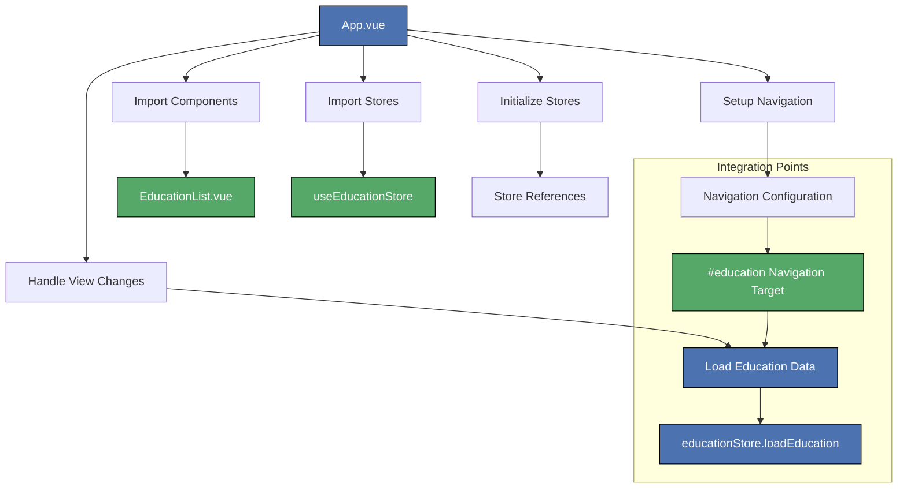
```mermaid
graph TD
    A[App.vue] --> B[Import Components]
    A --> C[Import Stores]
    A --> D[Initialize Stores]
    A --> E[Setup Navigation]
    A --> F[Handle View Changes]

    B --> B1[EducationList.vue]
    C --> C1[useEducationStore]
    D --> D1[Store References]
    E --> E1[Navigation Configuration]
    F --> F1[Load Education Data]

    subgraph "Integration Points"
        F1 --> G[educationStore.loadEducation]
        E1 --> H["#education Navigation Target"]
        H --> F1
    end

    classDef primary fill:#4c72b0,stroke:#000,color:white;
    classDef secondary fill:#55a868,stroke:#000,color:white;
    class A,F1,G primary;
    class B1,C1,H secondary;
```

**Extrait de code clé dans App.vue:**

```typescript
// Import de la fonctionnalité Education
import EducationList from '@ui/modules/cv/presentation/components/EducationList.vue'
import { useEducationStore } from '@ui/modules/cv/presentation/stores/education'

// Initialisation du store
const educationStore = useEducationStore()

// Chargement de données lors du changement de vue
watch(activeView, async (newView) => {
  if (newView === 'education') {
    console.log('Loading education data due to navigation...')
    await educationStore.loadEducation()
  }
})

// Gestion de la navigation
const handleNavigation = (path: string) => {
  // ...
  // Mise à jour des breadcrumbs pour la section Education
  else if (viewId === 'education') {
    breadcrumbItems.splice(1, 1, {
      id: 'education',
      label: 'Formation'
    });
  }
}
```

### 3.2 Navigation et Expérience Utilisateur

Le système de navigation est configuré dans `App.vue` avec des éléments spécifiques pour la fonctionnalité Education:

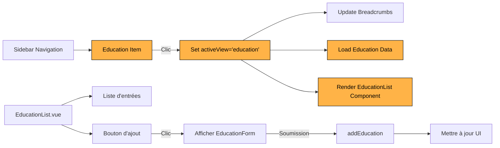
```mermaid
graph LR
    A[Sidebar Navigation] --> B[Education Item]
    B -- "Clic" --> C[Set activeView='education']
    C --> D[Update Breadcrumbs]
    C --> E[Load Education Data]
    C --> F[Render EducationList Component]

    G[EducationList.vue] --> H[Liste d'entrées]
    G --> I[Bouton d'ajout]
    I -- "Clic" --> J[Afficher EducationForm]
    J -- "Soumission" --> K[addEducation]
    K --> L[Mettre à jour UI]

    classDef highlight fill:#ffb347,stroke:#000,color:black;
    class B,C,E,F highlight;
```

## 4. Flux de Données Complet

### 4.1 Flux de Chargement des Données Education

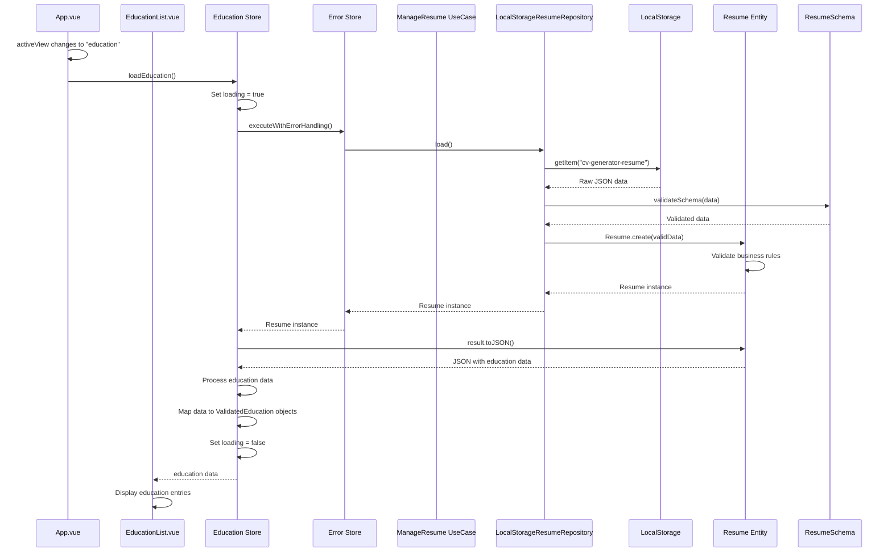
```mermaid
sequenceDiagram
    participant AppVue as App.vue
    participant UI as EducationList.vue
    participant Store as Education Store
    participant ErrorStore as Error Store
    participant UseCase as ManageResume UseCase
    participant Repository as LocalStorageResumeRepository
    participant Storage as LocalStorage
    participant Domain as Resume Entity
    participant Schema as ResumeSchema

    AppVue->>AppVue: activeView changes to "education"
    AppVue->>Store: loadEducation()
    Store->>Store: Set loading = true
    Store->>ErrorStore: executeWithErrorHandling()
    ErrorStore->>Repository: load()
    Repository->>Storage: getItem("cv-generator-resume")
    Storage-->>Repository: Raw JSON data
    Repository->>Schema: validateSchema(data)
    Schema-->>Repository: Validated data
    Repository->>Domain: Resume.create(validData)
    Domain->>Domain: Validate business rules
    Domain-->>Repository: Resume instance
    Repository-->>ErrorStore: Resume instance
    ErrorStore-->>Store: Resume instance
    Store->>Domain: result.toJSON()
    Domain-->>Store: JSON with education data
    Store->>Store: Process education data
    Store->>Store: Map data to ValidatedEducation objects
    Store->>Store: Set loading = false
    Store-->>UI: education data
    UI->>UI: Display education entries
```

### 4.2 Flux d'Ajout d'une Entrée Éducative

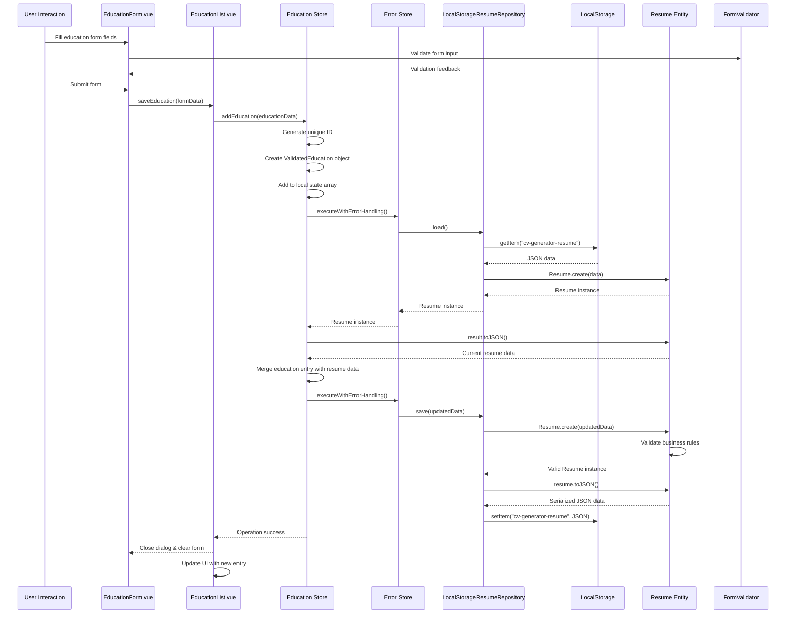
```mermaid
sequenceDiagram
    participant User as User Interaction
    participant UI as EducationForm.vue
    participant List as EducationList.vue
    participant Store as Education Store
    participant ErrorStore as Error Store
    participant Repository as LocalStorageResumeRepository
    participant Storage as LocalStorage
    participant Domain as Resume Entity
    participant Validator as FormValidator

    User->>UI: Fill education form fields
    UI->>Validator: Validate form input
    Validator-->>UI: Validation feedback
    User->>UI: Submit form
    UI->>List: saveEducation(formData)
    List->>Store: addEducation(educationData)
    Store->>Store: Generate unique ID
    Store->>Store: Create ValidatedEducation object
    Store->>Store: Add to local state array
    Store->>ErrorStore: executeWithErrorHandling()
    ErrorStore->>Repository: load()
    Repository->>Storage: getItem("cv-generator-resume")
    Storage-->>Repository: JSON data
    Repository->>Domain: Resume.create(data)
    Domain-->>Repository: Resume instance
    Repository-->>ErrorStore: Resume instance
    ErrorStore-->>Store: Resume instance
    Store->>Domain: result.toJSON()
    Domain-->>Store: Current resume data
    Store->>Store: Merge education entry with resume data
    Store->>ErrorStore: executeWithErrorHandling()
    ErrorStore->>Repository: save(updatedData)
    Repository->>Domain: Resume.create(updatedData)
    Domain->>Domain: Validate business rules
    Domain-->>Repository: Valid Resume instance
    Repository->>Domain: resume.toJSON()
    Domain-->>Repository: Serialized JSON data
    Repository->>Storage: setItem("cv-generator-resume", JSON)
    Store-->>List: Operation success
    List-->>UI: Close dialog & clear form
    List->>List: Update UI with new entry
```

### 4.3 Flux de Mise à Jour d'une Entrée Éducative

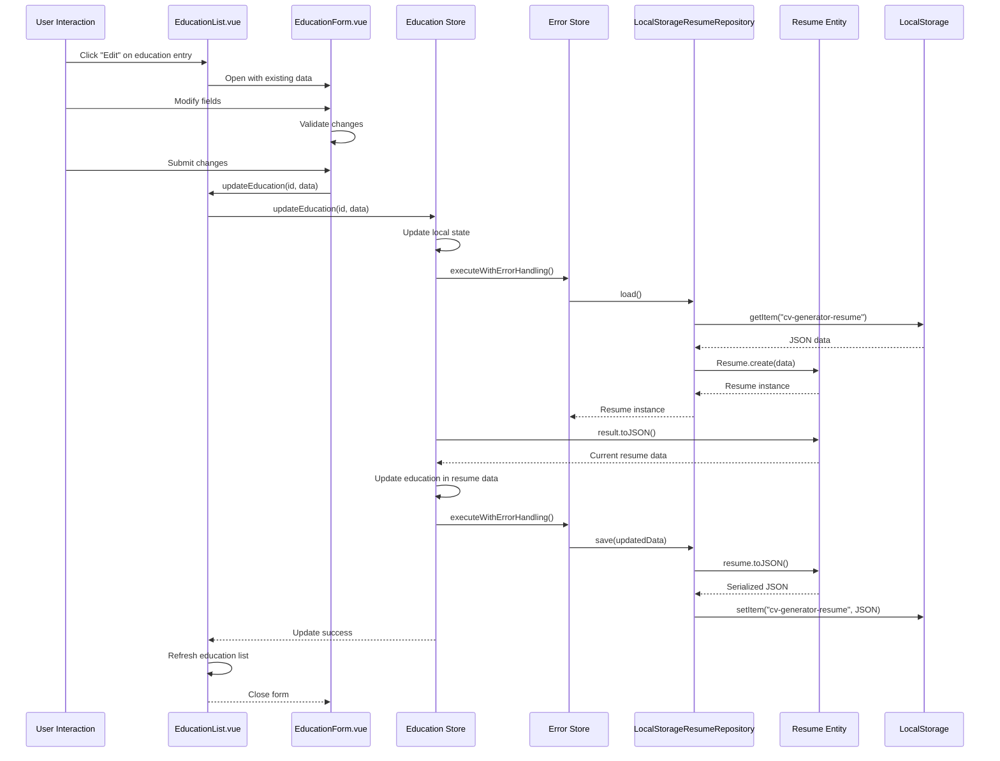
```mermaid
sequenceDiagram
    participant User as User Interaction
    participant List as EducationList.vue
    participant Form as EducationForm.vue
    participant Store as Education Store
    participant ErrorStore as Error Store
    participant Repository as LocalStorageResumeRepository
    participant Domain as Resume Entity
    participant Storage as LocalStorage

    User->>List: Click "Edit" on education entry
    List->>Form: Open with existing data
    User->>Form: Modify fields
    Form->>Form: Validate changes
    User->>Form: Submit changes
    Form->>List: updateEducation(id, data)
    List->>Store: updateEducation(id, data)

    Store->>Store: Update local state
    Store->>ErrorStore: executeWithErrorHandling()
    ErrorStore->>Repository: load()
    Repository->>Storage: getItem("cv-generator-resume")
    Storage-->>Repository: JSON data
    Repository->>Domain: Resume.create(data)
    Domain-->>Repository: Resume instance
    Repository-->>ErrorStore: Resume instance

    Store->>Domain: result.toJSON()
    Domain-->>Store: Current resume data
    Store->>Store: Update education in resume data
    Store->>ErrorStore: executeWithErrorHandling()
    ErrorStore->>Repository: save(updatedData)
    Repository->>Domain: resume.toJSON()
    Domain-->>Repository: Serialized JSON
    Repository->>Storage: setItem("cv-generator-resume", JSON)

    Store-->>List: Update success
    List->>List: Refresh education list
    List-->>Form: Close form
```

### 4.4 Flux de Suppression d'une Entrée Éducative

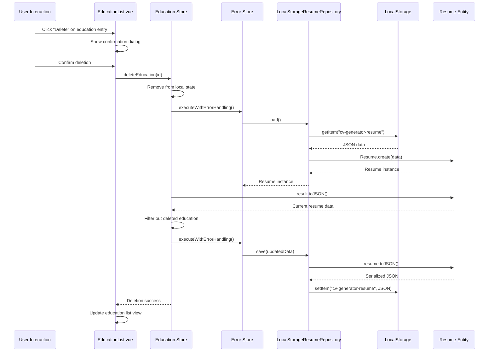
```mermaid
sequenceDiagram
    participant User as User Interaction
    participant List as EducationList.vue
    participant Store as Education Store
    participant ErrorStore as Error Store
    participant Repository as LocalStorageResumeRepository
    participant Storage as LocalStorage
    participant Domain as Resume Entity

    User->>List: Click "Delete" on education entry
    List->>List: Show confirmation dialog
    User->>List: Confirm deletion
    List->>Store: deleteEducation(id)

    Store->>Store: Remove from local state
    Store->>ErrorStore: executeWithErrorHandling()
    ErrorStore->>Repository: load()
    Repository->>Storage: getItem("cv-generator-resume")
    Storage-->>Repository: JSON data
    Repository->>Domain: Resume.create(data)
    Domain-->>Repository: Resume instance
    Repository-->>ErrorStore: Resume instance

    Store->>Domain: result.toJSON()
    Domain-->>Store: Current resume data
    Store->>Store: Filter out deleted education
    Store->>ErrorStore: executeWithErrorHandling()
    ErrorStore->>Repository: save(updatedData)
    Repository->>Domain: resume.toJSON()
    Domain-->>Repository: Serialized JSON
    Repository->>Storage: setItem("cv-generator-resume", JSON)

    Store-->>List: Deletion success
    List->>List: Update education list view
```

### 4.5 Flux de Réorganisation des Entrées Éducatives

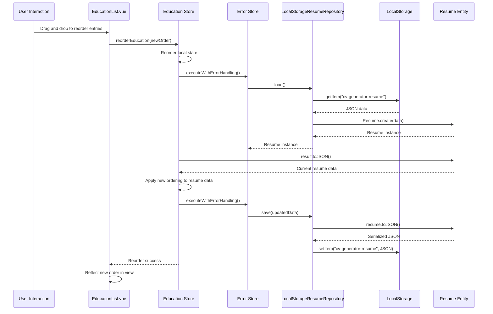
```mermaid
sequenceDiagram
    participant User as User Interaction
    participant List as EducationList.vue
    participant Store as Education Store
    participant ErrorStore as Error Store
    participant Repository as LocalStorageResumeRepository
    participant Storage as LocalStorage
    participant Domain as Resume Entity

    User->>List: Drag and drop to reorder entries
    List->>Store: reorderEducation(newOrder)

    Store->>Store: Reorder local state
    Store->>ErrorStore: executeWithErrorHandling()
    ErrorStore->>Repository: load()
    Repository->>Storage: getItem("cv-generator-resume")
    Storage-->>Repository: JSON data
    Repository->>Domain: Resume.create(data)
    Domain-->>Repository: Resume instance
    Repository-->>ErrorStore: Resume instance

    Store->>Domain: result.toJSON()
    Domain-->>Store: Current resume data
    Store->>Store: Apply new ordering to resume data
    Store->>ErrorStore: executeWithErrorHandling()
    ErrorStore->>Repository: save(updatedData)
    Repository->>Domain: resume.toJSON()
    Domain-->>Repository: Serialized JSON
    Repository->>Storage: setItem("cv-generator-resume", JSON)

    Store-->>List: Reorder success
    List->>List: Reflect new order in view
```

## 5. Couches Architecturales en Détail

### 5.1 Couche de Présentation

#### 5.1.1 Composants Vue.js

**App.vue**

- Rôle: Point d'entrée principal et coordination de l'application
- Responsabilités:
  - Intégre tous les composants de l'application, dont EducationList
  - Gère la navigation entre les différentes sections du CV
  - Initialise les stores et déclenche le chargement des données

**EducationList.vue**

- Rôle: Affiche la liste des formations et gère les interactions utilisateur
- Dépendances:
  - `useEducationStore`: Store pour gérer les données d'éducation
  - `EducationForm.vue`: Formulaire pour ajouter/modifier des formations
- Fonctionnalités:
  - Chargement des formations au montage du composant
  - Ajout d'une nouvelle formation
  - Modification d'une formation existante
  - Suppression d'une formation
  - Réorganisation des entrées par drag-and-drop
  - Affichage d'un état vide si aucune formation n'est présente

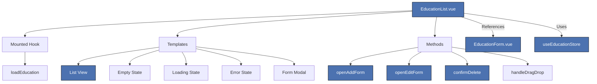
```mermaid
graph TD
    A[EducationList.vue] --> B[Mounted Hook]
    A --> C[Templates]
    A --> D[Methods]

    B --> B1[loadEducation]

    C --> C1[List View]
    C --> C2[Empty State]
    C --> C3[Loading State]
    C --> C4[Error State]
    C --> C5[Form Modal]

    D --> D1[openAddForm]
    D --> D2[openEditForm]
    D --> D3[confirmDelete]
    D --> D4[handleDragDrop]

    A -- References --> E[EducationForm.vue]
    A -- Uses --> F[useEducationStore]

    classDef primary fill:#4c72b0,stroke:#000,color:white;
    class A,C1,D1,D2,D3,E,F primary;
```

**EducationForm.vue**

- Rôle: Formulaire pour ajouter/modifier une formation
- Dépendances:
  - `useFieldValidation`: Composable pour la validation des champs
  - `useModelUpdate`: Composable pour la mise à jour du modèle
- Fonctionnalités:
  - Validation des champs en temps réel
  - Gestion des cours comme sous-éléments d'une formation
  - Datepickers pour les dates de début et fin
  - Gestion de l'état "en cours" (pas de date de fin)
  - Propagation des mises à jour vers le composant parent

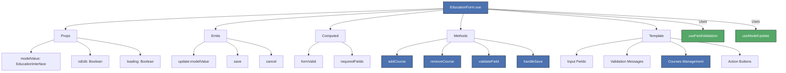
```mermaid
graph TD
    A[EducationForm.vue] --> B[Props]
    A --> C[Emits]
    A --> D[Computed]
    A --> E[Methods]
    A --> F[Template]

    B --> B1[modelValue: EducationInterface]
    B --> B2[isEdit: Boolean]
    B --> B3[loading: Boolean]

    C --> C1[update:modelValue]
    C --> C2[save]
    C --> C3[cancel]

    D --> D1[formValid]
    D --> D2[requiredFields]

    E --> E1[addCourse]
    E --> E2[removeCourse]
    E --> E3[validateField]
    E --> E4[handleSave]

    F --> F1[Input Fields]
    F --> F2[Validation Messages]
    F --> F3[Courses Management]
    F --> F4[Action Buttons]

    A -- Uses --> G[useFieldValidation]
    A -- Uses --> H[useModelUpdate]

    classDef main fill:#4c72b0,stroke:#000,color:white;
    classDef secondary fill:#55a868,stroke:#000,color:white;
    class A,E1,E2,E3,E4,F3 main;
    class G,H secondary;
```

#### 5.1.2 Stores Pinia

**education.ts**

- Rôle: Gestion de l'état et des actions pour les formations
- Dépendances:
  - `ManageResume`: Use case pour la gestion des données du CV
  - `LocalStorageResumeRepository`: Repository pour l'accès au stockage
  - `useErrorStore`: Store pour la gestion des erreurs
- État:
  - `educations`: Array d'objets `ValidatedEducation`
  - `loading`: Boolean indiquant l'état de chargement
  - `error`: Objet contenant les détails d'erreur
- Actions:
  - `loadEducation`: Charge les formations depuis le storage
  - `addEducation`: Ajoute une nouvelle formation
  - `updateEducation`: Met à jour une formation existante
  - `deleteEducation`: Supprime une formation
  - `reorderEducation`: Réorganise l'ordre des formations

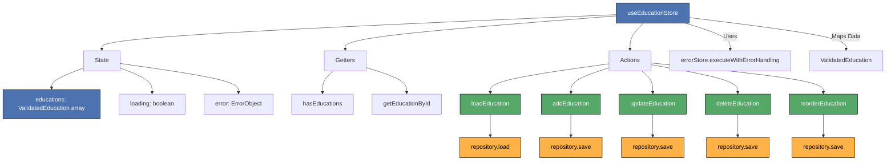
```mermaid
graph TD
    A[useEducationStore] --> B[State]
    A --> C[Getters]
    A --> D[Actions]

    B --> B1[educations: ValidatedEducation array]
    B --> B2[loading: boolean]
    B --> B3[error: ErrorObject]

    C --> C1[hasEducations]
    C --> C2[getEducationById]

    D --> D1[loadEducation]
    D --> D2[addEducation]
    D --> D3[updateEducation]
    D --> D4[deleteEducation]
    D --> D5[reorderEducation]

    D1 --> E1[repository.load]
    D2 --> E2[repository.save]
    D3 --> E3[repository.save]
    D4 --> E4[repository.save]
    D5 --> E5[repository.save]

    A -- Uses --> F[errorStore.executeWithErrorHandling]
    A -- Maps Data --> G[ValidatedEducation]

    classDef store fill:#4c72b0,stroke:#000,color:white;
    classDef actions fill:#55a868,stroke:#000,color:white;
    classDef repo fill:#ffb347,stroke:#000,color:black;
    class A,B1 store;
    class D1,D2,D3,D4,D5 actions;
    class E1,E2,E3,E4,E5 repo;
```

#### 5.1.3 Types Spécifiques et Adaptateurs

**ValidatedEducation Factory**

```typescript
// Factory function in education.ts
function createValidatedEducation(
  id: string,
  data: EducationInterface
): ValidatedEducation {
  const education: ValidatedEducation = {
    id,
    institution: data.institution || "",
    area: data.area || "",
    studyType: data.studyType || "",
    startDate: data.startDate || "",
    endDate: data.endDate,
    score: data.score,
    url: data.url,
    courses: Array.isArray(data.courses) ? [...data.courses] : [],
    toJSON: function () {
      return {
        id: this.id,
        institution: this.institution,
        area: this.area,
        studyType: this.studyType,
        startDate: this.startDate,
        endDate: this.endDate,
        score: this.score,
        url: this.url,
        courses: this.courses ? [...this.courses] : [],
      };
    },
  };
  return education;
}
```

### 5.2 Couche Application

**ManageResume.ts**

- Rôle: Cas d'utilisation principal pour gérer le CV
- Dépendances:
  - `ResumeRepository`: Interface pour l'accès au stockage
- Fonctionnalités:
  - `createResume`: Crée un nouveau CV
  - `updateResume`: Met à jour le CV existant
  - `loadResume`: Charge le CV depuis le repository
  - `mergeResumeData`: Fusionne les données partielles avec les données existantes

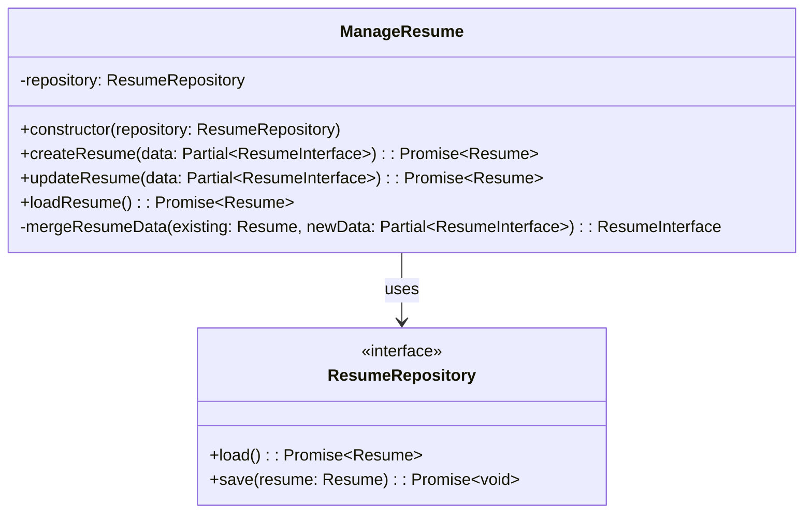
```mermaid
classDiagram
    class ManageResume {
        -repository: ResumeRepository
        +constructor(repository: ResumeRepository)
        +createResume(data: Partial~ResumeInterface~): Promise~Resume~
        +updateResume(data: Partial~ResumeInterface~): Promise~Resume~
        +loadResume(): Promise~Resume~
        -mergeResumeData(existing: Resume, newData: Partial~ResumeInterface~): ResumeInterface
    }

    class ResumeRepository {
        <<interface>>
        +load(): Promise~Resume~
        +save(resume: Resume): Promise~void~
    }

    ManageResume --> ResumeRepository : uses
```

### 5.3 Couche Domaine

#### 5.3.1 Entités

**Resume.ts**

- Rôle: Entité centrale représentant un CV
- Responsabilités:
  - Encapsulation des données du CV
  - Validation des données selon les règles métier
  - Conversion du CV en format JSON
- Méthodes clés:
  - `create`: Méthode factory pour créer une instance Resume valide
  - `get education`: Getter pour accéder aux données d'éducation
  - `toJSON`: Convertit l'entité en objet JSON compatible avec le format JSON Resume

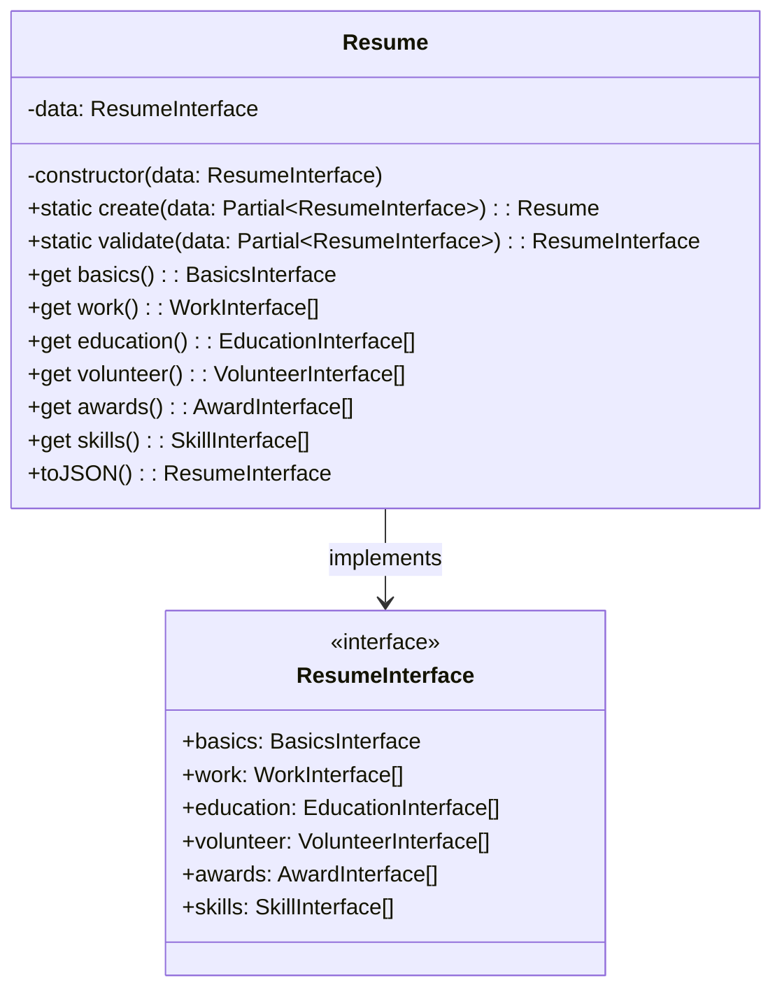
```mermaid
classDiagram
    class Resume {
        -data: ResumeInterface
        -constructor(data: ResumeInterface)
        +static create(data: Partial~ResumeInterface~): Resume
        +static validate(data: Partial~ResumeInterface~): ResumeInterface
        +get basics(): BasicsInterface
        +get work(): WorkInterface[]
        +get education(): EducationInterface[]
        +get volunteer(): VolunteerInterface[]
        +get awards(): AwardInterface[]
        +get skills(): SkillInterface[]
        +toJSON(): ResumeInterface
    }

    class ResumeInterface {
        <<interface>>
        +basics: BasicsInterface
        +work: WorkInterface[]
        +education: EducationInterface[]
        +volunteer: VolunteerInterface[]
        +awards: AwardInterface[]
        +skills: SkillInterface[]
    }

    Resume --> ResumeInterface : implements
```

#### 5.3.2 Interfaces

**ResumeInterface.ts** (dans le package shared)

```typescript
export interface EducationInterface {
  institution: string;
  url?: string;
  area: string;
  studyType: string;
  startDate: string;
  endDate?: string;
  score?: string;
  courses?: string[];
}

export interface ResumeInterface {
  basics: BasicsInterface;
  work?: WorkInterface[];
  volunteer?: VolunteerInterface[];
  education?: EducationInterface[];
  awards?: AwardInterface[];
  skills?: SkillInterface[];
  languages?: LanguageInterface[];
  interests?: InterestInterface[];
  references?: ReferenceInterface[];
  projects?: ProjectInterface[];
}
```

**EducationWithId** (dans le store education)

```typescript
export interface EducationWithId extends EducationInterface {
  id?: string;
}
```

**ValidatedEducation** (dans le store education)

```typescript
export interface ValidatedEducation {
  id: string;
  institution: string;
  area: string;
  studyType: string;
  startDate: string;
  endDate?: string;
  score?: string;
  url?: string;
  courses?: string[];
  toJSON: () => EducationWithId;
}
```

### 5.4 Couche Infrastructure

**LocalStorageResumeRepository.ts**

- Rôle: Implémentation du repository pour stocker le CV dans localStorage
- Dépendances:
  - `Resume`: Entité du domaine
  - `ResumeInterface`: Interface définissant la structure des données
  - `resumeSchema`: Schéma de validation Zod
- Fonctionnalités:
  - `load`: Charge les données depuis localStorage et crée une instance de Resume
  - `save`: Sauvegarde les données du CV dans localStorage
  - `validateSchema`: Validation des données avec Zod pour garantir l'intégrité
  - `handleStorageErrors`: Gestion des erreurs spécifiques au localStorage

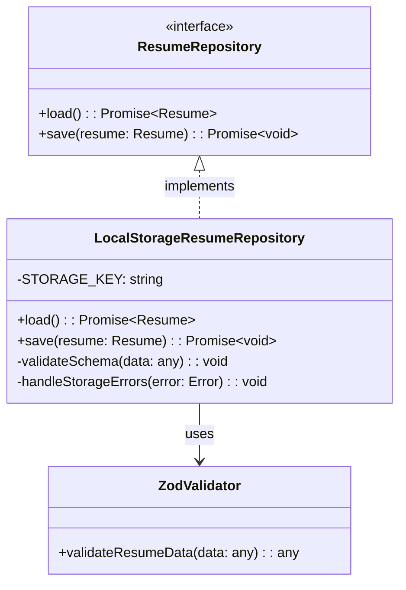
```mermaid
classDiagram
    class ResumeRepository {
        <<interface>>
        +load(): Promise~Resume~
        +save(resume: Resume): Promise~void~
    }

    class LocalStorageResumeRepository {
        -STORAGE_KEY: string
        +load(): Promise~Resume~
        +save(resume: Resume): Promise~void~
        -validateSchema(data: any): void
        -handleStorageErrors(error: Error): void
    }

    class ZodValidator {
        +validateResumeData(data: any): any
    }

    ResumeRepository <|.. LocalStorageResumeRepository : implements
    LocalStorageResumeRepository --> ZodValidator : uses
```

**Schema de Validation pour Education**

```typescript
const educationSchema = z.object({
  institution: z.string().min(1, { message: "Institution est requis" }),
  area: z.string().min(1, { message: "Domaine d'étude est requis" }),
  studyType: z.string().min(1, { message: "Type d'étude est requis" }),
  startDate: z.string().min(1, { message: "Date de début est requise" }),
  endDate: z.string().optional(),
  score: z.string().optional(),
  url: z.string().url({ message: "URL invalide" }).optional().or(z.literal("")),
  courses: z.array(z.string()).optional().default([]),
});

const educationWithIdSchema = educationSchema.extend({
  id: z.string().optional(),
});

export const resumeSchema = z.object({
  basics: basicsSchema,
  work: z.array(workSchema).optional().default([]),
  volunteer: z.array(volunteerSchema).optional().default([]),
  education: z.array(educationWithIdSchema).optional().default([]),
  awards: z.array(awardSchema).optional().default([]),
  skills: z.array(skillSchema).optional().default([]),
});
```

## 6. Gestion d'État et Flux de Données

### 6.1 Architecture Réactive avec Pinia

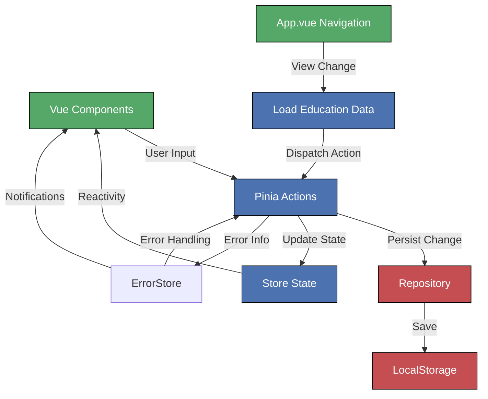
```mermaid
graph TD
    A[Vue Components] -->|User Input| B[Pinia Actions]
    B -->|Persist Change| C[Repository]
    C -->|Save| D[LocalStorage]
    B -->|Update State| E[Store State]
    E -->|Reactivity| A

    F[App.vue Navigation] -->|View Change| G[Load Education Data]
    G -->|Dispatch Action| B

    H[ErrorStore] -->|Error Handling| B
    B -->|Error Info| H
    H -->|Notifications| A

    classDef store fill:#4c72b0,stroke:#000,color:white;
    classDef ui fill:#55a868,stroke:#000,color:white;
    classDef infra fill:#c44e52,stroke:#000,color:white;
    class A,F ui;
    class B,E,G store;
    class C,D infra;
```

### 6.2 Pattern Optimistic Updates

La fonctionnalité Education utilise un pattern d'optimistic updates pour offrir une expérience utilisateur fluide:

1. L'utilisateur initie une action (ajout, modification, suppression)
2. Le store met immédiatement à jour l'état local
3. L'action est ensuite persistée dans le localStorage
4. En cas d'erreur, l'état local est restauré à l'état précédent

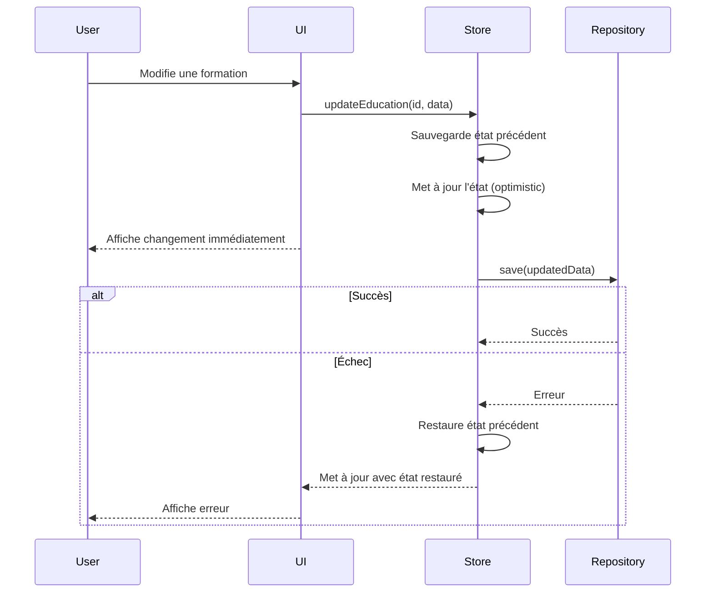
```mermaid
sequenceDiagram
    participant User
    participant UI
    participant Store
    participant Repository

    User->>UI: Modifie une formation
    UI->>Store: updateEducation(id, data)
    Store->>Store: Sauvegarde état précédent
    Store->>Store: Met à jour l'état (optimistic)
    UI-->>User: Affiche changement immédiatement
    Store->>Repository: save(updatedData)

    alt Succès
        Repository-->>Store: Succès
    else Échec
        Repository-->>Store: Erreur
        Store->>Store: Restaure état précédent
        Store-->>UI: Met à jour avec état restauré
        UI-->>User: Affiche erreur
    end
```

## 7. Gestion des Erreurs

La gestion des erreurs est centralisée via le `errorStore`, qui implémente les patterns suivants:

### 7.1 Pattern Decorator pour Exécution Sécurisée

```typescript
// Dans education.ts store
const result = await errorStore.executeWithErrorHandling(
  async () => {
    // Opération potentiellement risquée
    return await repository.load();
  },
  {
    context: "education/loadEducation",
    fallback: [] as ValidatedEducation[],
    errorMessage: "Impossible de charger les données d'éducation",
    action: {
      handler: "education/retryLoadEducation",
      label: "Réessayer",
      params: { operation: "load" },
    },
  }
);
```

### 7.2 Hiérarchie des Erreurs

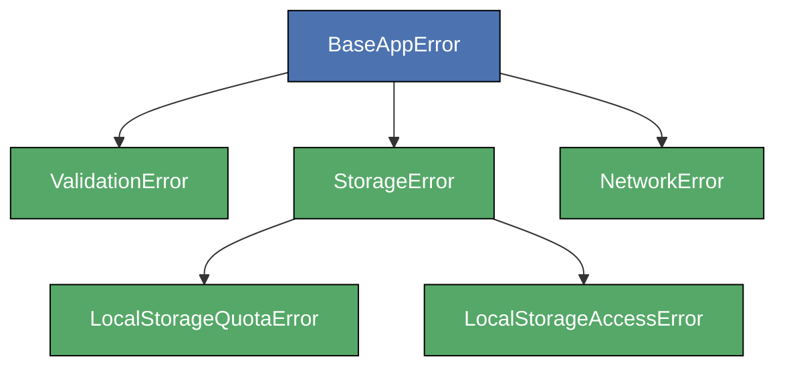
```mermaid
graph TD
    A[BaseAppError] --> B[ValidationError]
    A --> C[StorageError]
    A --> D[NetworkError]
    C --> C1[LocalStorageQuotaError]
    C --> C2[LocalStorageAccessError]

    classDef base fill:#4c72b0,stroke:#000,color:white;
    classDef specific fill:#55a868,stroke:#000,color:white;
    class A base;
    class B,C,D,C1,C2 specific;
```

### 7.3 Récupération et Résilience

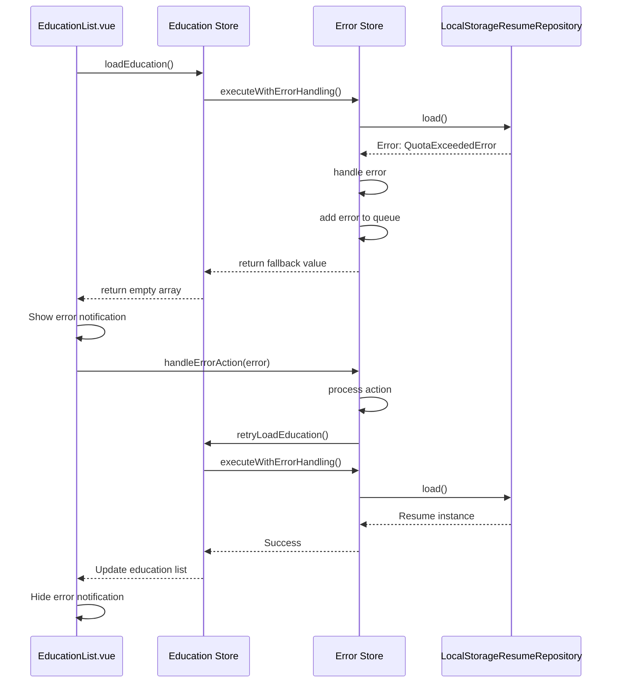
```mermaid
sequenceDiagram
    participant UI as EducationList.vue
    participant Store as Education Store
    participant ErrorStore as Error Store
    participant Repository as LocalStorageResumeRepository

    UI->>Store: loadEducation()
    Store->>ErrorStore: executeWithErrorHandling()
    ErrorStore->>Repository: load()
    Repository-->>ErrorStore: Error: QuotaExceededError
    ErrorStore->>ErrorStore: handle error
    ErrorStore->>ErrorStore: add error to queue
    ErrorStore-->>Store: return fallback value
    Store-->>UI: return empty array
    UI->>UI: Show error notification

    UI->>ErrorStore: handleErrorAction(error)
    ErrorStore->>ErrorStore: process action
    ErrorStore->>Store: retryLoadEducation()
    Store->>ErrorStore: executeWithErrorHandling()
    ErrorStore->>Repository: load()
    Repository-->>ErrorStore: Resume instance
    ErrorStore-->>Store: Success
    Store-->>UI: Update education list
    UI->>UI: Hide error notification
```

## 8. Types et Validation à Plusieurs Niveaux

### 8.1 Architecture de Validation

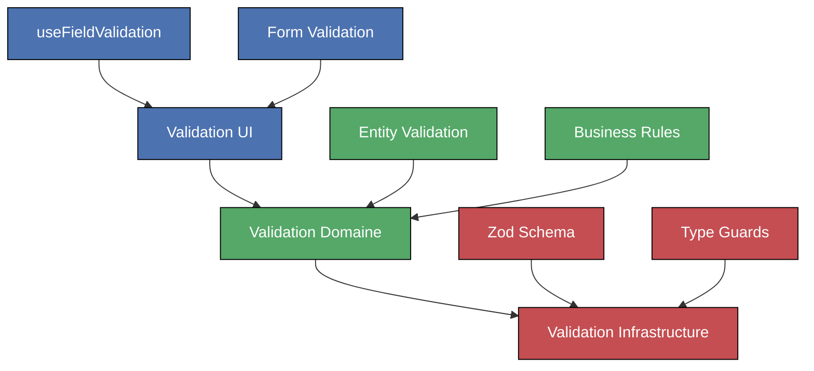
```mermaid
graph TD
    A[Validation UI] --> B[Validation Domaine]
    B --> C[Validation Infrastructure]

    A1[useFieldValidation] --> A
    A2[Form Validation] --> A

    B1[Entity Validation] --> B
    B2[Business Rules] --> B

    C1[Zod Schema] --> C
    C2[Type Guards] --> C

    classDef ui fill:#4c72b0,stroke:#000,color:white;
    classDef domain fill:#55a868,stroke:#000,color:white;
    classDef infra fill:#c44e52,stroke:#000,color:white;
    class A,A1,A2 ui;
    class B,B1,B2 domain;
    class C,C1,C2 infra;
```

### 8.2 Validation UI avec Vue Composables

```typescript
// useFieldValidation.ts
export function useFieldValidation() {
  const validateRequiredField = (value: any, fieldName: string): string => {
    if (!value || (typeof value === "string" && value.trim() === "")) {
      return `Le champ ${fieldName} est requis`;
    }
    return "";
  };

  const validateDateFormat = (value: string): string => {
    // Regex pour format YYYY-MM-DD
    const dateRegex = /^\d{4}-\d{2}-\d{2}$/;
    if (!dateRegex.test(value)) {
      return "Format de date invalide (YYYY-MM-DD)";
    }
    return "";
  };

  const validateUrl = (value: string): string => {
    if (!value) return "";
    try {
      new URL(value);
      return "";
    } catch (e) {
      return "URL invalide";
    }
  };

  return {
    validateRequiredField,
    validateDateFormat,
    validateUrl,
  };
}
```

### 8.3 Validation Domaine dans Entité Resume

```typescript
// Extrait de Resume.ts
static validate(data: Partial<ResumeInterface>): ResumeInterface {
  // Validation de base des données
  if (!data) {
    throw new ValidationError('Les données du CV ne peuvent pas être null');
  }

  // Validation des formations
  if (data.education) {
    data.education.forEach((edu, index) => {
      if (!edu.institution) {
        throw new ValidationError(`Formation ${index + 1}: Institution manquante`);
      }
      if (!edu.area) {
        throw new ValidationError(`Formation ${index + 1}: Domaine d'étude manquant`);
      }
      if (!edu.studyType) {
        throw new ValidationError(`Formation ${index + 1}: Type d'étude manquant`);
      }
      if (!edu.startDate) {
        throw new ValidationError(`Formation ${index + 1}: Date de début manquante`);
      }

      // Validation date format (YYYY-MM-DD)
      const dateRegex = /^\d{4}-\d{2}-\d{2}$/;
      if (!dateRegex.test(edu.startDate)) {
        throw new ValidationError(`Formation ${index + 1}: Format de date de début invalide`);
      }

      if (edu.endDate && !dateRegex.test(edu.endDate)) {
        throw new ValidationError(`Formation ${index + 1}: Format de date de fin invalide`);
      }

      // Validation logique des dates
      if (edu.endDate && edu.startDate > edu.endDate) {
        throw new ValidationError(`Formation ${index + 1}: La date de fin ne peut pas être antérieure à la date de début`);
      }
    });
  }

  // Construction d'une instance valide
  return {
    basics: data.basics || { name: '', label: '', email: '', phone: '', location: {} },
    work: data.work || [],
    education: data.education || [],
    volunteer: data.volunteer || [],
    awards: data.awards || [],
    skills: data.skills || []
  };
}
```

### 8.4 Validation Infrastructure avec Zod

````typescript
// Extrait de resumeSchema.ts
const educationSchema = z.object({
  institution: z.string().min(1, { message: "Institution est requis" }),
  area: z.string().min(1, { message: "Domaine d'étude est requis" }),
  studyType: z.string().min(1, { message: "Type d'étude est requis" }),
  startDate: z.string().regex(/^\d{4}-\d{2}-\d{2}$/, {
    message: "Format de date invalide (YYYY-MM-DD)"
  }),
  endDate: z.string().regex(/^\d{4}-\d{2}-\d{2}$/, {
    message: "Format de date invalide (YYYY-MM-DD)"
  }).optional(),
  score: z.string().optional(),
<think>I need to continue with my technical documentation for the Education feature. Let me pick up where I left off, which was in the middle of detailing the Zod validation schema in section 8.4. I'll continue from there and ensure I complete all the remaining sections of the documentation.

Key sections to complete:
1. Finish the validation infrastructure with Zod (Section 8.4)
2. Complete the Persistance details (Section 9)
3. Complete the Model diagram (Section 10)
4. Add testing strategy (new section)
5. Extension points (Section 11)
6. Technical dependencies (Section 12)
7. Potential optimizations (Section 13)
8. Conclusion (Section 14)
9. Appendix with file list (Section 15)

Let me continue with comprehensive and detailed information for each section.</think>```typescript
  url: z.string().url({ message: "URL invalide" }).optional().or(z.literal('')),
  courses: z.array(z.string()).optional().default([])
});

// Extension du schéma pour inclure l'ID
const educationWithIdSchema = educationSchema.extend({
  id: z.string().optional()
});

// Intégration dans le schéma global du CV
export const resumeSchema = z.object({
  basics: basicsSchema,
  work: z.array(workSchema).optional().default([]),
  volunteer: z.array(volunteerSchema).optional().default([]),
  education: z.array(educationWithIdSchema).optional().default([]),
  awards: z.array(awardSchema).optional().default([]),
  skills: z.array(skillSchema).optional().default([])
});

// Utilisation dans le repository
function validateSchema(data: unknown): ResumeInterface {
  try {
    const validatedData = resumeSchema.parse(data);
    return validatedData;
  } catch (error) {
    if (error instanceof z.ZodError) {
      // Transformation des erreurs Zod en erreurs applicatives
      const firstError = error.errors[0];
      throw new ValidationError(
        `Validation échouée: ${firstError.path.join('.')} - ${firstError.message}`
      );
    }
    throw new ValidationError('Données invalides');
  }
}
````

## 9. Persistance des Données

### 9.1 Structure Complète des Données dans localStorage

Les données du CV, y compris les formations, sont stockées dans localStorage sous forme de chaîne JSON avec la structure suivante:

```json
{
  "basics": {
    "name": "John Doe",
    "label": "Développeur Web",
    "email": "john@example.com",
    "phone": "+33123456789",
    "url": "https://johndoe.com",
    "summary": "Développeur passionné avec 5 ans d'expérience",
    "location": {
      "address": "1 rue de Paris",
      "postalCode": "75001",
      "city": "Paris",
      "countryCode": "FR",
      "region": "Île-de-France"
    },
    "profiles": [
      {
        "network": "LinkedIn",
        "username": "johndoe",
        "url": "https://linkedin.com/in/johndoe"
      }
    ]
  },
  "work": [...],
  "education": [
    {
      "id": "m7si4twm3cle22qui1p",
      "institution": "Université de Paris",
      "area": "Informatique",
      "studyType": "Master",
      "startDate": "2023-08-01",
      "endDate": "2023-12-30",
      "score": "18/20",
      "url": "https://univ-paris.fr",
      "courses": ["Algorithmique", "Structures de données", "Conception logicielle"]
    },
    {
      "id": "k9po3dem5avn18roi7q",
      "institution": "IUT de Lyon",
      "area": "Développement Web",
      "studyType": "Licence Professionnelle",
      "startDate": "2020-09-01",
      "endDate": "2022-06-30",
      "score": "16/20",
      "courses": ["JavaScript", "PHP", "Bases de données"]
    }
  ],
  "volunteer": [...],
  "awards": [...],
  "skills": [...]
}
```

### 9.2 Cycle de Vie des Données

```mermaid
stateDiagram-v2
    [*] --> Initial: App.vue mounted
    Initial --> Loading: activeView changes to "education"
    Loading --> DataLoaded: educationStore.loadEducation()

    DataLoaded --> EditingEntry: openEditForm()
    DataLoaded --> AddingEntry: openAddForm()
    DataLoaded --> DeletingEntry: confirmDelete()
    DataLoaded --> ReorderingEntries: handleDragDrop()

    EditingEntry --> Validating: saveEducation()
    AddingEntry --> Validating: saveEducation()

    Validating --> UpdatingStore: Valid input
    Validating --> ValidationError: Invalid input
    ValidationError --> EditingEntry: Fix errors

    UpdatingStore --> SavingToStorage: Update store state
    DeletingEntry --> ConfirmingDelete: Show confirmation
    ConfirmingDelete --> SavingToStorage: User confirms
    ConfirmingDelete --> DataLoaded: User cancels
    ReorderingEntries --> SavingToStorage: Apply new order

    SavingToStorage --> DataLoaded: Success
    SavingToStorage --> StorageError: Error
    StorageError --> ErrorRecovery: Show error notification
    ErrorRecovery --> SavingToStorage: Retry
    ErrorRecovery --> DataLoaded: Cancel
```

### 9.3 Implémentation du Repository avec localStorage

```typescript
export class LocalStorageResumeRepository implements ResumeRepository {
  private readonly STORAGE_KEY = "cv-generator-resume";

  async load(): Promise<Resume> {
    try {
      // Récupération des données depuis localStorage
      const storedData = localStorage.getItem(this.STORAGE_KEY);

      // Si aucune donnée n'existe, créer un nouveau CV vide
      if (!storedData) {
        return Resume.create({});
      }

      // Parsing et validation des données JSON
      const parsedData = JSON.parse(storedData);
      const validatedData = this.validateSchema(parsedData);

      // Création d'une instance Resume à partir des données validées
      return Resume.create(validatedData);
    } catch (error) {
      this.handleStorageErrors(error);
      // En cas d'erreur, retourner un CV vide
      return Resume.create({});
    }
  }

  async save(resume: Resume): Promise<void> {
    try {
      // Conversion de l'instance Resume en JSON
      const resumeData = resume.toJSON();

      // Validation des données avant stockage
      this.validateSchema(resumeData);

      // Sauvegarde dans localStorage
      localStorage.setItem(this.STORAGE_KEY, JSON.stringify(resumeData));
    } catch (error) {
      this.handleStorageErrors(error);
    }
  }

  private validateSchema(data: unknown): ResumeInterface {
    // Implémenter la validation du schéma avec Zod (détaillé précédemment)
    // ...
  }

  private handleStorageErrors(error: unknown): never {
    // Gestion spécifique des erreurs de localStorage
    if (error instanceof DOMException) {
      if (error.name === "QuotaExceededError") {
        throw new StorageQuotaError("Espace de stockage insuffisant");
      }
      if (error.name === "SecurityError") {
        throw new StorageAccessError("Accès au stockage refusé");
      }
    }

    if (error instanceof SyntaxError) {
      throw new StorageDataError("Données corrompues dans le stockage");
    }

    if (error instanceof Error) {
      throw new StorageError(`Erreur de stockage: ${error.message}`);
    }

    throw new StorageError("Erreur inconnue lors de l'accès au stockage");
  }
}
```

## 10. Modèle de Données Complet

```mermaid
classDiagram
    class ResumeInterface {
        +basics: BasicsInterface
        +work: WorkInterface[]
        +education: EducationInterface[]
        +volunteer: VolunteerInterface[]
        +awards: AwardInterface[]
        +skills: SkillInterface[]
        +languages: LanguageInterface[]
        +interests: InterestInterface[]
        +references: ReferenceInterface[]
        +projects: ProjectInterface[]
    }

    class EducationInterface {
        +institution: string
        +area: string
        +studyType: string
        +startDate: string
        +endDate?: string
        +score?: string
        +url?: string
        +courses?: string[]
    }

    class EducationWithId {
        +id?: string
        +institution: string
        +area: string
        +studyType: string
        +startDate: string
        +endDate?: string
        +score?: string
        +url?: string
        +courses?: string[]
    }

    class ValidatedEducation {
        +id: string
        +institution: string
        +area: string
        +studyType: string
        +startDate: string
        +endDate?: string
        +score?: string
        +url?: string
        +courses?: string[]
        +toJSON(): EducationWithId
    }

    class Resume {
        -data: ResumeInterface
        +static create(data: Partial~ResumeInterface~): Resume
        +static validate(data: Partial~ResumeInterface~): ResumeInterface
        +get basics(): BasicsInterface
        +get education(): EducationInterface[]
        +get volunteer(): VolunteerInterface[]
        +get awards(): AwardInterface[]
        +get skills(): SkillInterface[]
        +toJSON(): ResumeInterface
    }

    class ResumeRepository {
        <<interface>>
        +load(): Promise~Resume~
        +save(resume: Resume): Promise~void~
    }

    class LocalStorageResumeRepository {
        -STORAGE_KEY: string
        +load(): Promise~Resume~
        +save(resume: Resume): Promise~void~
        -validateSchema(data: unknown): ResumeInterface
        -handleStorageErrors(error: unknown): never
    }

    class ManageResume {
        -repository: ResumeRepository
        +createResume(data: Partial~ResumeInterface~): Promise~Resume~
        +updateResume(data: Partial~ResumeInterface~): Promise~Resume~
        +loadResume(): Promise~Resume~
    }

    class EducationStore {
        +educations: ValidatedEducation[] | null
        +loading: boolean
        +error: ErrorInfo | null
        +hasEducations: boolean
        +getEducationById(id: string): ValidatedEducation | undefined
        +loadEducation(): Promise~ValidatedEducation[]~
        +addEducation(education: EducationInterface): Promise~void~
        +updateEducation(id: string, education: EducationInterface): Promise~void~
        +deleteEducation(id: string): Promise~void~
        +reorderEducation(newOrder: string[]): Promise~void~
    }

    class ErrorStore {
        +errors: ErrorInfo[]
        +addError(error: ErrorInfo): void
        +dismissError(id: string): void
        +executeWithErrorHandling(fn, options): Promise~T~
    }

    class App {
        +activeView: string
        +handleNavigation(path: string): void
        +watch(activeView): void
    }

    ResumeInterface *-- EducationInterface
    EducationInterface <|-- EducationWithId
    EducationWithId <|-- ValidatedEducation
    Resume *-- ResumeInterface
    ResumeRepository <|.. LocalStorageResumeRepository
    ManageResume --> ResumeRepository
    EducationStore --> LocalStorageResumeRepository
    EducationStore --> ManageResume
    EducationStore --> ErrorStore
    App --> EducationStore
```

## 11. Stratégie de Test

La fonctionnalité Education est couverte par plusieurs niveaux de tests:

### 11.1 Tests Unitaires pour les Composants

```typescript
// Extrait de EducationList.spec.ts
import { mount } from "@vue/test-utils";
import { createTestingPinia } from "@pinia/testing";
import EducationList from "../EducationList.vue";
import { useEducationStore } from "../../stores/education";

describe("EducationList.vue", () => {
  let wrapper;
  let store;

  beforeEach(() => {
    wrapper = mount(EducationList, {
      global: {
        plugins: [
          createTestingPinia({
            createSpy: vi.fn,
            initialState: {
              education: {
                educations: [
                  {
                    id: "test-id-1",
                    institution: "Test University",
                    area: "Computer Science",
                    studyType: "Bachelor",
                    startDate: "2020-09-01",
                    endDate: "2023-06-30",
                    toJSON: () => ({
                      id: "test-id-1",
                      institution: "Test University",
                      area: "Computer Science",
                      studyType: "Bachelor",
                      startDate: "2020-09-01",
                      endDate: "2023-06-30",
                    }),
                  },
                ],
                loading: false,
              },
            },
          }),
        ],
      },
    });

    store = useEducationStore();
  });

  it("loads education entries on mount", () => {
    expect(store.loadEducation).toHaveBeenCalled();
  });

  it("renders education entries correctly", () => {
    expect(wrapper.find(".education-entry").exists()).toBe(true);
    expect(wrapper.find(".institution").text()).toContain("Test University");
    expect(wrapper.find(".study-type").text()).toContain("Bachelor");
  });

  it("opens add form when add button is clicked", async () => {
    await wrapper.find('[data-test="add-education-btn"]').trigger("click");
    expect(wrapper.find(".education-form").exists()).toBe(true);
    expect(wrapper.find(".form-title").text()).toContain("Ajouter");
  });

  it("opens edit form when edit button is clicked", async () => {
    await wrapper.find('[data-test="edit-education-btn"]').trigger("click");
    expect(wrapper.find(".education-form").exists()).toBe(true);
    expect(wrapper.find(".form-title").text()).toContain("Modifier");
  });

  it("shows delete confirmation when delete button is clicked", async () => {
    await wrapper.find('[data-test="delete-education-btn"]').trigger("click");
    expect(wrapper.find(".delete-confirmation").exists()).toBe(true);
  });
});
```

### 11.2 Tests Unitaires pour les Stores

```typescript
// Extrait de education.store.spec.ts
import { setActivePinia, createPinia } from "pinia";
import { useEducationStore } from "../education";
import { useErrorStore } from "@ui/core/stores/error";
import { Resume } from "@cv-generator/core";

// Mock du repository
vi.mock(
  "@cv-generator/infrastructure/src/repositories/LocalStorageResumeRepository",
  () => ({
    LocalStorageResumeRepository: vi.fn().mockImplementation(() => ({
      load: vi.fn().mockResolvedValue(
        Resume.create({
          education: [
            {
              id: "test-id-1",
              institution: "Test University",
              area: "Computer Science",
              studyType: "Bachelor",
              startDate: "2020-09-01",
              endDate: "2023-06-30",
            },
          ],
        })
      ),
      save: vi.fn().mockResolvedValue(undefined),
    })),
  })
);

describe("Education Store", () => {
  let educationStore;
  let errorStore;

  beforeEach(() => {
    setActivePinia(createPinia());
    educationStore = useEducationStore();
    errorStore = useErrorStore();

    // Spy sur executeWithErrorHandling
    vi.spyOn(errorStore, "executeWithErrorHandling").mockImplementation(
      async (fn) => {
        return await fn();
      }
    );
  });

  afterEach(() => {
    vi.resetAllMocks();
  });

  it("initializes with empty education array and loading state", () => {
    expect(educationStore.educations).toEqual(null);
    expect(educationStore.loading).toBe(false);
  });

  it("loads education entries from repository", async () => {
    await educationStore.loadEducation();

    expect(errorStore.executeWithErrorHandling).toHaveBeenCalled();
    expect(educationStore.educations.length).toBe(1);
    expect(educationStore.educations[0].institution).toBe("Test University");
  });

  it("adds a new education entry", async () => {
    await educationStore.loadEducation();

    const newEducation = {
      institution: "New University",
      area: "Data Science",
      studyType: "Master",
      startDate: "2023-09-01",
    };

    await educationStore.addEducation(newEducation);

    expect(educationStore.educations.length).toBe(2);
    expect(educationStore.educations[1].institution).toBe("New University");
  });

  it("updates an existing education entry", async () => {
    await educationStore.loadEducation();

    const updatedEducation = {
      institution: "Updated University",
      area: "Computer Science",
      studyType: "Bachelor",
      startDate: "2020-09-01",
      endDate: "2023-06-30",
    };

    await educationStore.updateEducation("test-id-1", updatedEducation);

    expect(educationStore.educations.length).toBe(1);
    expect(educationStore.educations[0].institution).toBe("Updated University");
  });

  it("deletes an education entry", async () => {
    await educationStore.loadEducation();

    await educationStore.deleteEducation("test-id-1");

    expect(educationStore.educations.length).toBe(0);
  });

  it("handles errors during loading", async () => {
    // Simuler une erreur
    errorStore.executeWithErrorHandling.mockImplementationOnce(async () => {
      throw new Error("Test error");
    });

    try {
      await educationStore.loadEducation();
    } catch (e) {
      expect(e.message).toBe("Test error");
    }
  });
});
```

### 11.3 Tests d'Intégration

```typescript
// Extrait de education-workflow.spec.ts
import { mount } from "@vue/test-utils";
import { createPinia, setActivePinia } from "pinia";
import { Resume } from "@cv-generator/core";
import App from "@ui/App/App.vue";

// Mock localStorage
const localStorageMock = (() => {
  let store = {};
  return {
    getItem: vi.fn((key) => store[key] || null),
    setItem: vi.fn((key, value) => {
      store[key] = value.toString();
    }),
    clear: vi.fn(() => {
      store = {};
    }),
  };
})();

Object.defineProperty(window, "localStorage", {
  value: localStorageMock,
});

describe("Education Feature Workflow", () => {
  let wrapper;

  beforeEach(() => {
    setActivePinia(createPinia());

    // Initialize localStorage with empty resume
    localStorageMock.setItem(
      "cv-generator-resume",
      JSON.stringify({
        basics: { name: "Test User" },
        education: [],
      })
    );

    wrapper = mount(App);
  });

  afterEach(() => {
    localStorageMock.clear();
    vi.resetAllMocks();
  });

  it("completes full education workflow - add, edit, delete", async () => {
    // 1. Navigate to Education section
    await wrapper.find('[data-nav="education"]').trigger("click");

    // 2. Should show empty state
    expect(wrapper.find(".empty-education-state").exists()).toBe(true);

    // 3. Open Add Form
    await wrapper.find('[data-test="add-education-btn"]').trigger("click");

    // 4. Fill and submit form
    const form = wrapper.find(".education-form");
    await form.find('[data-test="institution"]').setValue("Test University");
    await form.find('[data-test="area"]').setValue("Computer Science");
    await form.find('[data-test="studyType"]').setValue("Bachelor");
    await form.find('[data-test="startDate"]').setValue("2020-09-01");
    await form.find('[data-test="save-btn"]').trigger("click");

    // 5. Entry should be displayed
    expect(wrapper.find(".education-entry").exists()).toBe(true);
    expect(wrapper.find(".institution").text()).toContain("Test University");

    // 6. Edit entry
    await wrapper.find('[data-test="edit-education-btn"]').trigger("click");
    const editForm = wrapper.find(".education-form");
    await editForm
      .find('[data-test="institution"]')
      .setValue("Updated University");
    await editForm.find('[data-test="save-btn"]').trigger("click");

    // 7. Updated entry should be displayed
    expect(wrapper.find(".institution").text()).toContain("Updated University");

    // 8. Delete entry
    await wrapper.find('[data-test="delete-education-btn"]').trigger("click");
    await wrapper.find('[data-test="confirm-delete-btn"]').trigger("click");

    // 9. Should return to empty state
    expect(wrapper.find(".empty-education-state").exists()).toBe(true);
  });
});
```

## 12. Points d'Extension

L'architecture actuelle facilite plusieurs points d'extension:

### 12.1 Ajout de Nouveaux Champs

Pour ajouter de nouveaux champs à la section éducation (par exemple, "honours" ou "thèse"), il faudrait:

1. Mettre à jour l'interface `EducationInterface`:

```typescript
export interface EducationInterface {
  // Champs existants...
  honours?: string;
  thesis?: string;
}
```

2. Mettre à jour le schéma de validation dans `resumeSchema.ts`:

```typescript
const educationSchema = z.object({
  // Champs existants...
  honours: z.string().optional(),
  thesis: z.string().optional(),
});
```

3. Mettre à jour le composant `EducationForm.vue` pour inclure les nouveaux champs:

```html
<div class="form-group">
  <label for="honours">Mentions Honorifiques</label>
  <input
    id="honours"
    v-model="formData.honours"
    type="text"
    class="input"
    placeholder="Mentions honorifiques, distinctions..."
  />
</div>
```

4. Mettre à jour la factory `createValidatedEducation` dans le store:

```typescript
function createValidatedEducation(
  id: string,
  data: EducationInterface
): ValidatedEducation {
  return {
    // Champs existants...
    honours: data.honours,
    thesis: data.thesis,
    toJSON: function () {
      return {
        // Champs existants...
        honours: this.honours,
        thesis: this.thesis,
      };
    },
  };
}
```

### 12.2 Changement de Mécanisme de Stockage

Pour passer du stockage local à une API backend, il suffirait de:

1. Créer une nouvelle implémentation du `ResumeRepository`:

```typescript
export class ApiResumeRepository implements ResumeRepository {
  private readonly API_URL = "/api/resume";

  async load(): Promise<Resume> {
    try {
      const response = await fetch(this.API_URL);

      if (!response.ok) {
        throw new NetworkError(`Erreur réseau: ${response.status}`);
      }

      const data = await response.json();
      const validatedData = this.validateSchema(data);
      return Resume.create(validatedData);
    } catch (error) {
      this.handleApiErrors(error);
      return Resume.create({});
    }
  }

  async save(resume: Resume): Promise<void> {
    try {
      const response = await fetch(this.API_URL, {
        method: "PUT",
        headers: {
          "Content-Type": "application/json",
        },
        body: JSON.stringify(resume.toJSON()),
      });

      if (!response.ok) {
        throw new NetworkError(
          `Erreur lors de la sauvegarde: ${response.status}`
        );
      }
    } catch (error) {
      this.handleApiErrors(error);
    }
  }

  // Méthodes privées...
}
```

2. Modifier la configuration de l'injection de dépendances:

```typescript
// Avant
const repository = new LocalStorageResumeRepository();

// Après
const repository = new ApiResumeRepository();
```

### 12.3 Fonctionnalités Avancées

L'architecture permet d'ajouter facilement des fonctionnalités avancées:

1. **Historique et versionnage** des formations:

```typescript
// Dans le store education
const educationHistory: Record<string, EducationWithId[]> = {};

function saveToHistory(id: string, data: EducationWithId): void {
  if (!educationHistory[id]) {
    educationHistory[id] = [];
  }
  educationHistory[id].push({ ...data, timestamp: new Date().toISOString() });
}

// Dans updateEducation
saveToHistory(id, oldVersion);
```

2. **Système d'exportation** pour différents formats de CV:

```typescript
// Nouvel adaptateur d'exportation
export class EducationExporter {
  static toHTML(educations: ValidatedEducation[]): string {
    return `<div class="education-section">
      ${educations
        .map(
          (edu) => `
        <div class="education-entry">
          <h3>${edu.institution}</h3>
          <p>${edu.studyType} en ${edu.area}</p>
          <p>${edu.startDate} - ${edu.endDate || "Present"}</p>
        </div>
      `
        )
        .join("")}
    </div>`;
  }

  static toPDF(educations: ValidatedEducation[]): PDFDocument {
    // Logique de génération PDF
  }

  static toMarkdown(educations: ValidatedEducation[]): string {
    return educations
      .map(
        (edu) => `
## ${edu.institution}
**${edu.studyType}** en ${edu.area}  
${edu.startDate} - ${edu.endDate || "Present"}
    `
      )
      .join("\n\n");
  }
}
```

## 13. Dépendances Techniques

La fonctionnalité Education s'appuie sur les dépendances suivantes:

### 13.1 Framework et Bibliothèques

- **Vue.js 3.2+**: Framework UI avec Composition API
- **Pinia 2.0+**: Gestion d'état avec support TypeScript
- **Zod 3.20+**: Validation de schéma typée
- **TypeScript 4.9+**: Typage statique
- **uuid 9.0+**: Génération d'identifiants uniques
- **Vue Test Utils 2.0+**: Bibliothèque de test pour Vue.js
- **Vitest 0.29+**: Framework de test pour applications Vue

### 13.2 Architecture Technologique

```mermaid
graph TD
    A[Vue.js 3] --> B[Pinia]
    A --> C[Vue Router]
    A --> D[Vue Composables]
    B --> E[TypeScript]

    F[Zod] --> E
    G[UUID] --> E

    H[LocalStorage API] --> I[Repository Implementation]
    I --> J[ResumeRepository Interface]

    K[Vue Test Utils] --> L[Tests Unitaires]
    M[Vitest] --> L

    classDef framework fill:#4c72b0,stroke:#000,color:white;
    classDef core fill:#55a868,stroke:#000,color:white;
    classDef testing fill:#c44e52,stroke:#000,color:white;
    class A,B,C framework;
    class E,F,G,J core;
    class K,L,M testing;
```

## 14. Optimisations Potentielles

### 14.1 Optimisations de Performance

1. **Mise en Cache**:

```typescript
// Dans education.ts store
const cachedEducations = ref<Record<string, ValidatedEducation[]>>({});
const cacheExpiry = ref<Record<string, number>>({});

// Ajouter la mise en cache au loadEducation
async function loadEducation(): Promise<ValidatedEducation[]> {
  const now = Date.now();
  const CACHE_DURATION = 5 * 60 * 1000; // 5 minutes

  // Utiliser le cache si disponible et valide
  if (cachedEducations.value && cacheExpiry.value > now) {
    return cachedEducations.value;
  }

  // Sinon, charger depuis le repository
  const result = await repository.load();

  // Mettre à jour le cache
  cachedEducations.value = result;
  cacheExpiry.value = now + CACHE_DURATION;

  return result;
}
```

2. **Lazy Loading** des composants:

```typescript
// Dans router ou App.vue
const EducationList = defineAsyncComponent(
  () => import("@ui/modules/cv/presentation/components/EducationList.vue")
);
```

3. **Virtualisation** pour les listes longues:

```html
<RecycleScroller
  class="scroller"
  :items="educations"
  :item-size="100"
  key-field="id"
>
  <template #item="{ item }">
    <EducationItem :education="item" />
  </template>
</RecycleScroller>
```

### 14.2 Optimisations UX

1. **Autosave** pour les formulaires:

```typescript
// Dans EducationForm.vue
watch(
  formData,
  debounce(async () => {
    if (isFormValid.value) {
      emit("autosave", formData.value);
    }
  }, 2000)
);
```

2. **Mode Hors Ligne** avec IndexedDB:

```typescript
export class OfflineAwareRepository implements ResumeRepository {
  private readonly localRepo = new IndexedDBResumeRepository();
  private readonly remoteRepo = new ApiResumeRepository();
  private readonly syncManager = new SyncManager();

  async load(): Promise<Resume> {
    try {
      // Essayer d'abord depuis le serveur
      return await this.remoteRepo.load();
    } catch (error) {
      // Fallback sur les données locales en cas d'erreur réseau
      console.log("Utilisation des données en cache (mode hors ligne)");
      return await this.localRepo.load();
    }
  }

  async save(resume: Resume): Promise<void> {
    try {
      // Enregistrer localement
      await this.localRepo.save(resume);

      // Tenter de synchroniser avec le serveur
      await this.remoteRepo.save(resume);
    } catch (error) {
      // En cas d'erreur réseau, planifier une synchronisation ultérieure
      this.syncManager.scheduleSyncOnReconnect(resume);
      throw new OfflineError(
        "Enregistré localement. Synchronisation avec le serveur en attente de connexion.",
        { pendingSync: true }
      );
    }
  }
}
```

3. **Restauration de Formulaire** après perte de session:

```typescript
// Dans EducationForm.vue
onMounted(() => {
  const savedDraft = sessionStorage.getItem("education-form-draft");
  if (savedDraft) {
    try {
      const parsedDraft = JSON.parse(savedDraft);
      Object.assign(formData, parsedDraft);
      showNotification("Brouillon restauré");
    } catch (e) {
      console.error("Impossible de restaurer le brouillon", e);
    }
  }
});

// Sauvegarder le brouillon périodiquement
watch(
  formData,
  debounce(() => {
    sessionStorage.setItem(
      "education-form-draft",
      JSON.stringify(formData.value)
    );
  }, 1000)
);
```

## 15. Conclusion

L'implémentation de la fonctionnalité Education dans CV Generator suit une architecture propre et modulaire, basée sur les principes de Clean Architecture et Domain-Driven Design. Cette approche assure:

1. **Séparation des Responsabilités**: Chaque couche a un rôle bien défini, réduisant les couplages et améliorant la maintenabilité.

2. **Testabilité**: La structure en couches permet de tester chaque composant de manière isolée, facilitant les tests unitaires, d'intégration et end-to-end.

3. **Extensibilité**: L'architecture permet d'ajouter facilement de nouveaux champs, de changer le mécanisme de stockage ou d'implémenter des fonctionnalités avancées sans modifier le cœur du code.

4. **Réutilisabilité**: Les patterns implémentés (Repository, Factory, Stores...) servent de modèle pour développer d'autres fonctionnalités du CV avec cohérence.

5. **Résilience**: La gestion centralisée des erreurs et les mécanismes de récupération assurent une expérience utilisateur robuste.

Cette documentation technique complète peut servir de référence pour l'implémentation d'autres fonctionnalités similaires dans l'application, en garantissant la cohérence architecturale et la qualité du code.

---

## Annexe: Liste des Fichiers Principaux

### Présentation

- `packages/ui/src/App/App.vue` - Point d'entrée principal et intégration
- `packages/ui/src/modules/cv/presentation/components/EducationList.vue` - Liste des formations
- `packages/ui/src/modules/cv/presentation/components/EducationForm.vue` - Formulaire d'ajout/édition
- `packages/ui/src/modules/cv/presentation/stores/education.ts` - Store Pinia pour les formations
- `packages/ui/src/modules/cv/presentation/components/__tests__/EducationList.spec.ts` - Tests du composant
- `packages/ui/src/modules/cv/presentation/stores/__tests__/education.spec.ts` - Tests du store

### Application

- `packages/core/src/modules/cv/application/use-cases/ManageResume.ts` - Cas d'utilisation pour la gestion du CV
- `packages/core/src/modules/cv/application/use-cases/__tests__/ManageResume.test.ts` - Tests du cas d'utilisation

### Domaine

- `packages/core/src/modules/cv/domain/entities/Resume.ts` - Entité principale
- `packages/core/src/modules/cv/domain/entities/__tests__/Resume.test.ts` - Tests de l'entité
- `packages/shared/src/types/resume.interface.ts` - Interfaces pour le CV et les formations

### Infrastructure

- `packages/infrastructure/src/repositories/LocalStorageResumeRepository.ts` - Implémentation du repository
- `packages/infrastructure/src/repositories/__tests__/LocalStorageResumeRepository.test.ts` - Tests du repository
- `packages/shared/src/validators/resumeSchema.ts` - Schémas de validation Zod

### Utilitaires et Outils

- `packages/ui/src/core/stores/error.ts` - Store pour la gestion des erreurs
- `packages/ui/src/composables/useFieldValidation.ts` - Composable pour la validation des champs
- `packages/ui/src/utils/id-generator.ts` - Utilitaire pour la génération d'ID uniques

### Tests d'Intégration

- `packages/ui/src/__tests__/integration/education-workflow.spec.ts` - Tests du workflow complet
