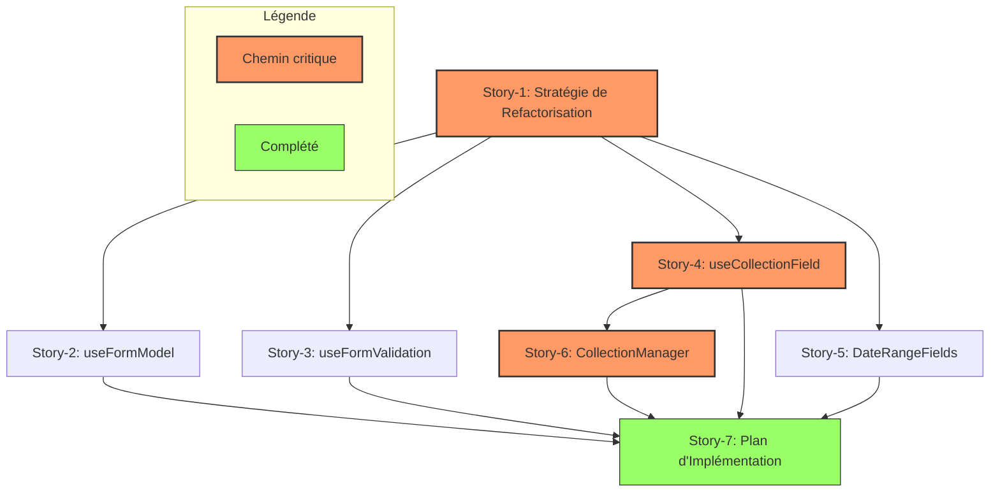
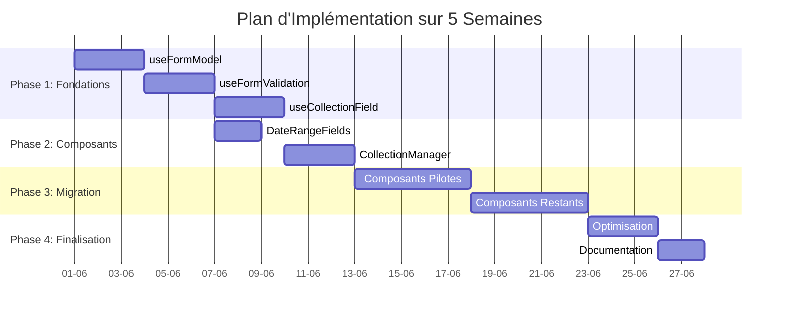
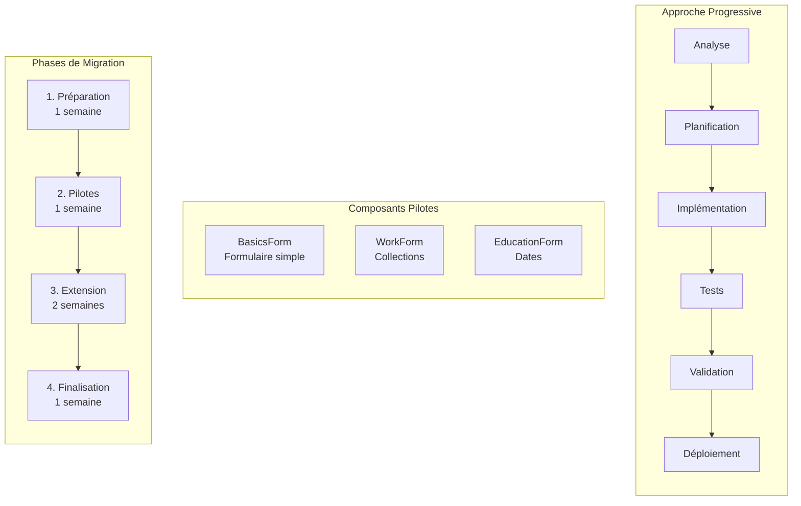
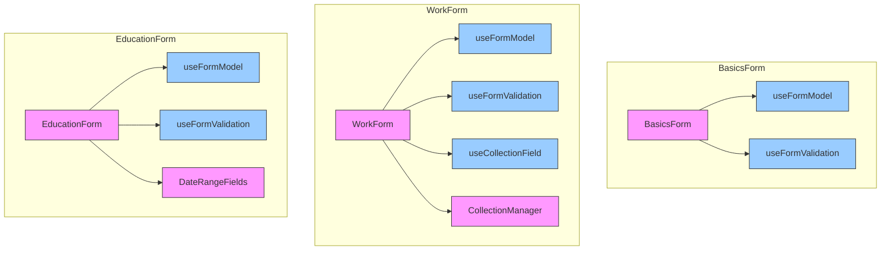
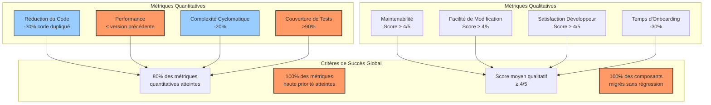
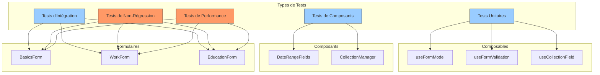
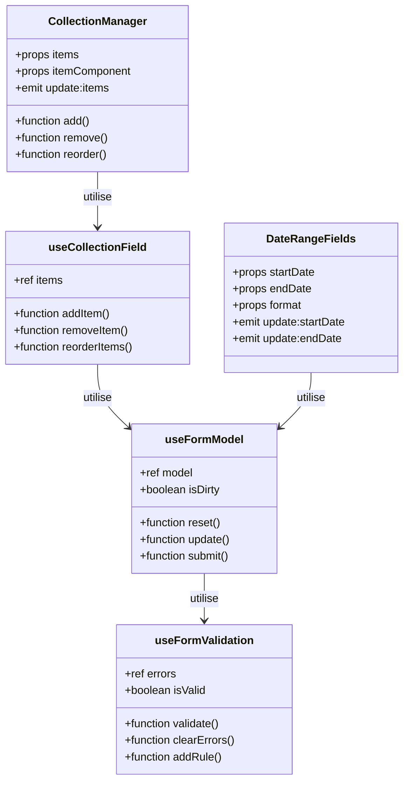
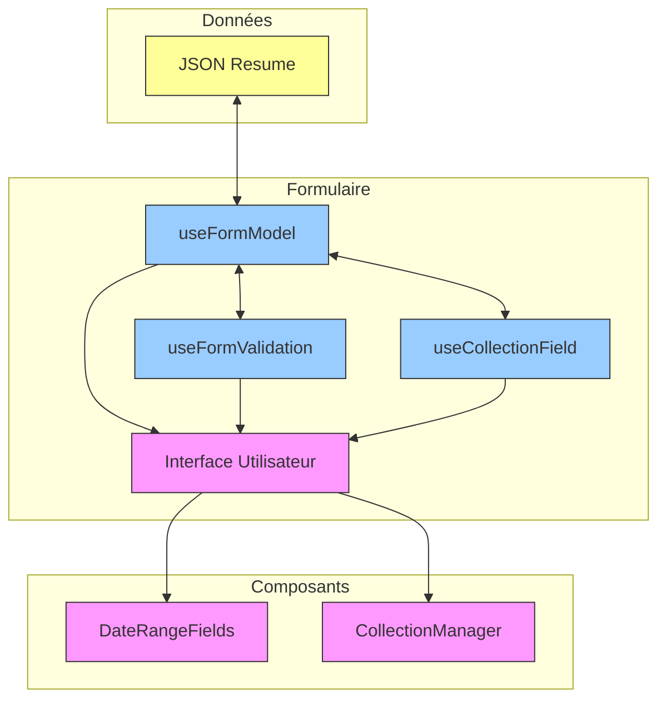
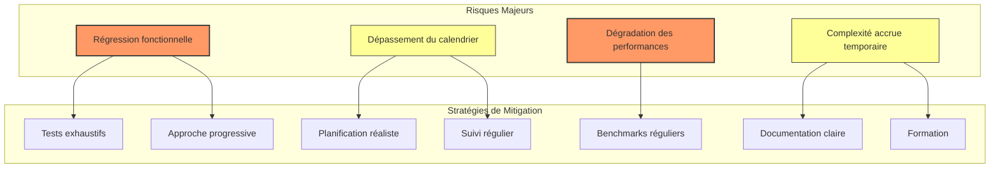

# Documentation du Plan d'Implémentation - Epic-2 Refactorisation des Composants CV

## Objectif

Ce document compile et synthétise l'ensemble des analyses, stratégies et plans élaborés pour l'Epic-2 "Refactorisation des Composants CV". Il sert de référence centrale pour guider l'implémentation et assurer une exécution cohérente et efficace de la refactorisation.

## 1. Vue d'Ensemble de l'Epic

### 1.1 Contexte et Objectifs

L'Epic-2 "Refactorisation des Composants CV" vise à améliorer la maintenabilité, réduire la duplication de code et standardiser les approches de développement dans le module CV. Cette initiative répond à plusieurs défis identifiés:

- **Duplication significative** de code entre les différents formulaires
- **Manque de cohérence** dans la gestion des formulaires et des validations
- **Difficultés de maintenance** dues à la dispersion de logiques similaires
- **Complexité croissante** rendant l'évolution du module difficile

Les objectifs principaux sont:

1. **Extraire les logiques communes** dans des composables réutilisables
2. **Créer des composants génériques** pour les patterns récurrents
3. **Standardiser les approches** de développement
4. **Améliorer la testabilité** et la maintenabilité
5. **Maintenir ou améliorer les performances**

### 1.2 Portée et Livrables

L'Epic couvre la refactorisation de l'ensemble des composants du module CV, avec un focus particulier sur:

- Les formulaires de saisie (BasicsForm, WorkForm, EducationForm, etc.)
- La gestion des collections d'éléments
- La validation des données
- La gestion des plages de dates

Les principaux livrables sont:

1. **Composables réutilisables**:

   - `useFormModel`: Gestion des modèles de formulaire
   - `useFormValidation`: Validation standardisée des formulaires
   - `useCollectionField`: Gestion des collections d'éléments

2. **Composants génériques**:

   - `DateRangeFields`: Gestion des plages de dates
   - `CollectionManager`: Interface pour gérer les collections

3. **Documentation**:
   - Guide d'utilisation des composables
   - Patterns de refactorisation
   - Tests complets

## 2. Synthèse des Analyses et Stratégies

### 2.1 Analyse des Dépendances

L'analyse des dépendances a permis d'identifier les relations entre les différentes stories et d'établir un chemin critique pour l'implémentation:



**Points clés**:

- Le chemin critique est: Story-1 → Story-4 → Story-6 → Story-7
- Durée totale estimée: 13 jours (21 story points)
- Opportunités de développement parallèle identifiées

**Recommandations**:

- Commencer par les composables fondamentaux (`useFormModel`, `useFormValidation`)
- Développer en parallèle les composables indépendants
- Synchroniser aux points clés identifiés

### 2.2 Plan d'Implémentation

Le plan d'implémentation définit l'ordre de développement et les phases d'exécution:



**Phase 1: Fondations (Semaine 1)**

1. Développer `useFormModel`
2. Développer `useFormValidation`
3. Développer `useCollectionField`

**Phase 2: Composants Réutilisables (Semaine 2)**

1. Développer `DateRangeFields`
2. Développer `CollectionManager`

**Phase 3: Migration Progressive (Semaines 3-4)**

1. Refactoriser les composants pilotes
2. Refactoriser les composants restants

**Phase 4: Finalisation (Semaine 5)**

1. Optimisation finale
2. Documentation complète
3. Mesure des bénéfices

### 2.3 Stratégie de Migration

La stratégie de migration définit l'approche pour refactoriser progressivement les composants existants:



#### Composants Pilotes

Trois composants pilotes ont été identifiés pour valider l'approche de refactorisation:



### 2.4 Métriques de Succès

Les métriques de succès pour évaluer l'efficacité de la refactorisation sont illustrées ci-dessous:



**Métriques quantitatives**:

- Réduction de 30% du code dupliqué
- Maintien ou amélioration des performances
- Réduction de 20% de la complexité cyclomatique
- Couverture de tests >90% pour les nouveaux composables/composants

**Métriques qualitatives**:

- Amélioration de la maintenabilité (évaluation développeurs)
- Facilité de modification (temps nécessaire pour implémenter des changements)
- Satisfaction des développeurs
- Réduction du temps d'onboarding

**Critères de succès global**:

- Au moins 80% des métriques quantitatives atteignent leurs objectifs
- Toutes les métriques de haute priorité sont atteintes
- Score moyen des métriques qualitatives ≥ 4/5
- 100% des composants migrés sans régression fonctionnelle

### 2.5 Plan de Tests

La stratégie de tests pour cette refactorisation est illustrée ci-dessous:



**Approche de test**:

- Tests unitaires pour les composables
- Tests de composants pour les composants UI
- Tests d'intégration pour les formulaires complets
- Tests de non-régression pour garantir la compatibilité
- Tests de performance pour vérifier les métriques

**Couverture cible**:

- > 90% pour les nouveaux composables et composants
- 100% des fonctionnalités existantes couvertes par des tests de non-régression

## 3. Diagrammes Explicatifs

### 3.1 Architecture des Composables

L'architecture des composables et leurs interactions sont illustrées ci-dessous:



### 3.2 Flux de Données

Le flux de données entre les composables et les composants est illustré ci-dessous:



### 3.3 Processus de Migration

```
┌───────────┐     ┌───────────┐     ┌───────────┐     ┌───────────┐
│ Analyse   │────►│Développement────►│ Validation │────►│Déploiement│
│ Composant │     │ Nouvelle   │     │ Tests     │     │ Migration │
└───────────┘     │ Version    │     └───────────┘     └───────────┘
                  └───────────┘
```

## 4. Risques et Stratégies de Mitigation

### 4.1 Matrice des Risques

| Risque                          | Impact | Probabilité | Niveau | Mitigation                                     |
| ------------------------------- | ------ | ----------- | ------ | ---------------------------------------------- |
| Régression fonctionnelle        | Élevé  | Moyenne     | Élevé  | Tests exhaustifs, approche progressive         |
| Dégradation des performances    | Élevé  | Faible      | Moyen  | Benchmarks systématiques, optimisation précoce |
| Dépassement du calendrier       | Moyen  | Moyenne     | Moyen  | Planification réaliste, suivi régulier         |
| Incompatibilité avec l'existant | Moyen  | Moyenne     | Moyen  | Tests d'intégration, conception adaptative     |
| Complexité temporaire accrue    | Moyen  | Élevée      | Moyen  | Documentation claire, formation                |

### 4.2 Stratégies de Mitigation Détaillées

#### Régression Fonctionnelle

- Tests de non-régression automatisés
- Validation fonctionnelle par QA
- Approche progressive par composant
- Feature flags pour activation/désactivation rapide

#### Dégradation des Performances

- Benchmarks avant/après pour chaque composant
- Optimisation précoce des composables critiques
- Monitoring en production
- Seuils de performance définis

#### Dépassement du Calendrier

- Découpage en tâches précises
- Suivi hebdomadaire de l'avancement
- Priorisation des fonctionnalités essentielles
- Marge de sécurité dans la planification

#### Incompatibilité avec l'Existant

- Tests d'intégration complets
- Conception adaptative des composables
- Documentation des limitations
- Période de coexistence planifiée

#### Complexité Temporaire Accrue

- Documentation claire et complète
- Sessions de formation pour l'équipe
- Assistance dédiée pendant la transition
- Revues de code régulières

## 5. Plan de Communication et Formation

### 5.1 Plan de Communication

| Audience                | Information                              | Fréquence        | Format                           |
| ----------------------- | ---------------------------------------- | ---------------- | -------------------------------- |
| Équipe de développement | Détails techniques, patterns, avancement | Hebdomadaire     | Réunion technique, documentation |
| Product Owners          | Avancement, impacts, risques             | Bi-hebdomadaire  | Rapport de statut, démos         |
| Utilisateurs finaux     | Changements visibles, améliorations      | À chaque release | Notes de version, guides         |

### 5.2 Plan de Formation

**Documentation**:

- Guide d'utilisation des nouveaux composables
- Patterns de refactorisation avec exemples
- FAQ et troubleshooting

**Sessions de formation**:

- Présentation initiale des concepts
- Ateliers pratiques de migration
- Sessions de questions/réponses

**Support continu**:

- Désignation d'experts référents
- Revues de code dédiées
- Assistance pour les cas complexes

## 6. Calendrier et Jalons

### 6.1 Calendrier Global

| Semaine | Phase        | Activités Principales                      | Jalons                                |
| ------- | ------------ | ------------------------------------------ | ------------------------------------- |
| 1       | Fondations   | Développement des composables de base      | Composables fondamentaux disponibles  |
| 2       | Composants   | Développement des composants réutilisables | Bibliothèque de composants disponible |
| 3-4     | Migration    | Refactorisation progressive des composants | 80% des composants migrés             |
| 5       | Finalisation | Optimisation, documentation, mesures       | 100% des composants migrés            |

### 6.2 Jalons Clés

1. **J1: Composables Fondamentaux** (Fin Semaine 1)

   - `useFormModel` (complété), `useFormValidation` (complété), `useCollectionField` (complété)
   - Tests unitaires complets pour les composables complétés
   - Documentation complète pour les composables complétés
   - Intégration réussie de `useCollectionField` dans le composant BasicsForm

2. **J2: Composants Réutilisables** (Fin Semaine 2)

   - `DateRangeFields`, `CollectionManager` développés
   - Tests de composants complets
   - Guide d'utilisation

3. **J3: Composants Pilotes** (Milieu Semaine 3)

   - `BasicsForm`, `WorkForm`, `EducationForm` refactorisés
   - Tests d'intégration
   - Validation des performances

4. **J4: Migration Complète** (Fin Semaine 4)

   - Tous les composants migrés
   - Tests de non-régression
   - Documentation mise à jour

5. **J5: Finalisation** (Fin Semaine 5)
   - Optimisations finales
   - Documentation complète
   - Rapport de métriques

## 7. Ressources et Responsabilités

### 7.1 Équipe

| Rôle                  | Responsabilités                        | Allocation |
| --------------------- | -------------------------------------- | ---------- |
| Lead Développeur      | Architecture, revue de code, standards | 50%        |
| Développeurs Frontend | Implémentation, tests unitaires        | 100%       |
| QA                    | Tests de non-régression, validation    | 50%        |
| DevOps                | Infrastructure de test, CI/CD          | 25%        |
| Product Owner         | Validation fonctionnelle, priorisation | 20%        |

### 7.2 Outils et Technologies

- **Framework**: Vue 3.4+ avec Composition API
- **Langage**: TypeScript 5.7+
- **Tests**: Vitest, Vue Test Utils
- **CI/CD**: GitHub Actions
- **Documentation**: Markdown, Storybook

## 8. Conclusion et Recommandations

### 8.1 Points Clés

1. **Approche progressive** par composant pour minimiser les risques
2. **TDD** pour garantir la qualité et la non-régression
3. **Métriques claires** pour évaluer le succès
4. **Communication transparente** sur l'avancement et les défis
5. **Documentation complète** pour faciliter l'adoption

### 8.2 Facteurs de Succès

1. **Implication de l'équipe** dans le processus de refactorisation
2. **Tests exhaustifs** pour garantir la non-régression
3. **Documentation claire** des patterns et des décisions
4. **Flexibilité** pour adapter la stratégie selon les retours
5. **Focus sur la valeur** plutôt que la perfection technique

### 8.3 Recommandations Finales

1. **Commencer par les fondations**: Prioriser les composables de base
2. **Valider tôt et souvent**: Tester chaque composable/composant dès sa création
3. **Communiquer régulièrement**: Partager les avancées et les défis
4. **Documenter en continu**: Ne pas attendre la fin pour documenter
5. **Mesurer les bénéfices**: Quantifier les améliorations pour justifier l'effort

Ce plan d'implémentation a été conçu pour équilibrer la nécessité de moderniser l'architecture tout en minimisant les risques et les perturbations. Il s'appuie sur une approche pragmatique et progressive, avec des points de validation réguliers pour garantir le succès de cette initiative de refactorisation.

## 5. Risques et Stratégies de Mitigation



Les principaux risques identifiés pour cette refactorisation sont:

| Risque                       | Impact | Probabilité | Mitigation                               |
| ---------------------------- | ------ | ----------- | ---------------------------------------- |
| Régression fonctionnelle     | Élevé  | Moyenne     | Tests exhaustifs et approche progressive |
| Dépassement du calendrier    | Moyen  | Moyenne     | Planification réaliste et suivi régulier |
| Résistance au changement     | Moyen  | Faible      | Communication claire sur les bénéfices   |
| Dégradation des performances | Élevé  | Faible      | Benchmarks réguliers et optimisation     |
| Complexité accrue temporaire | Moyen  | Élevée      | Documentation claire et formation        |
