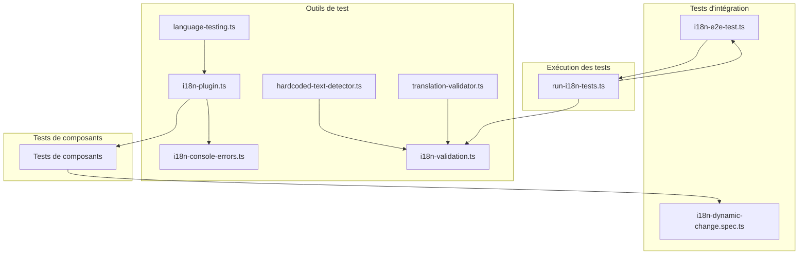
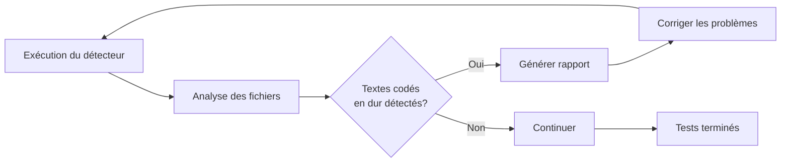
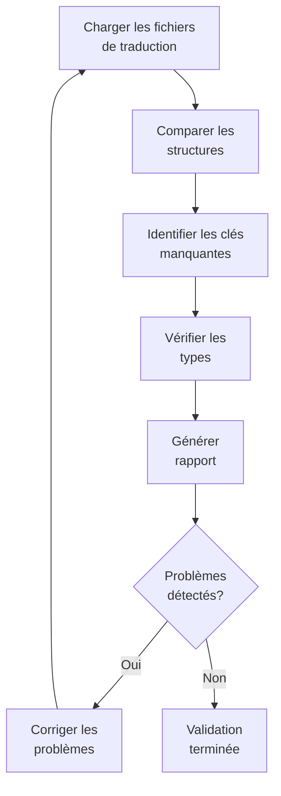
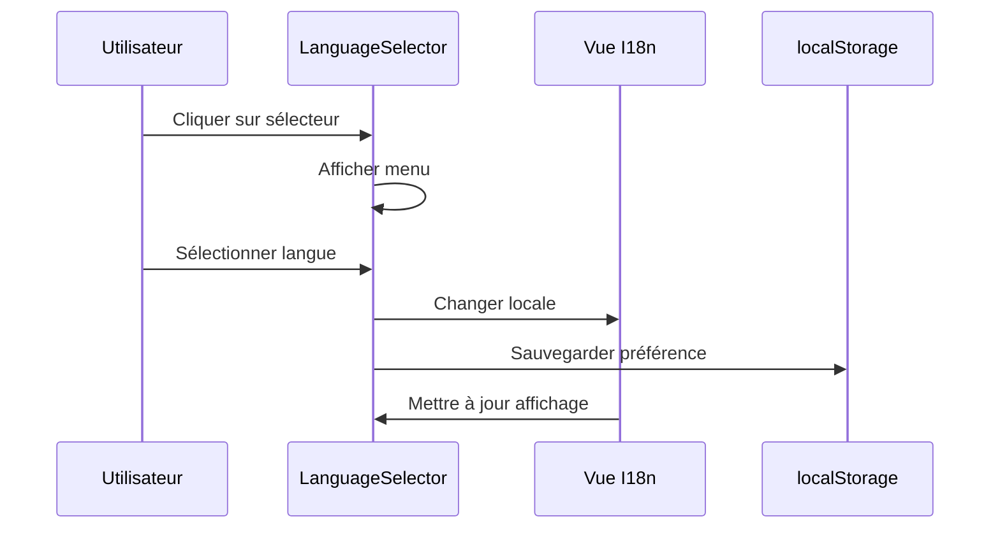
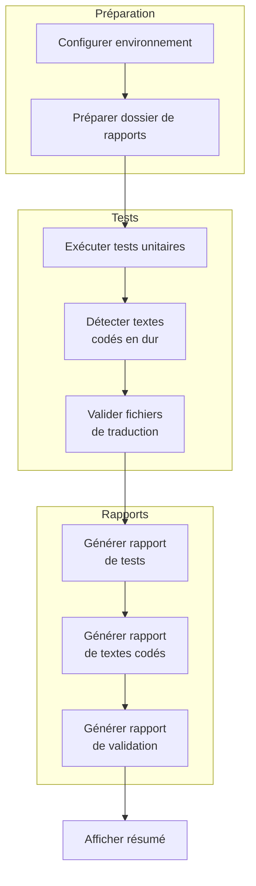
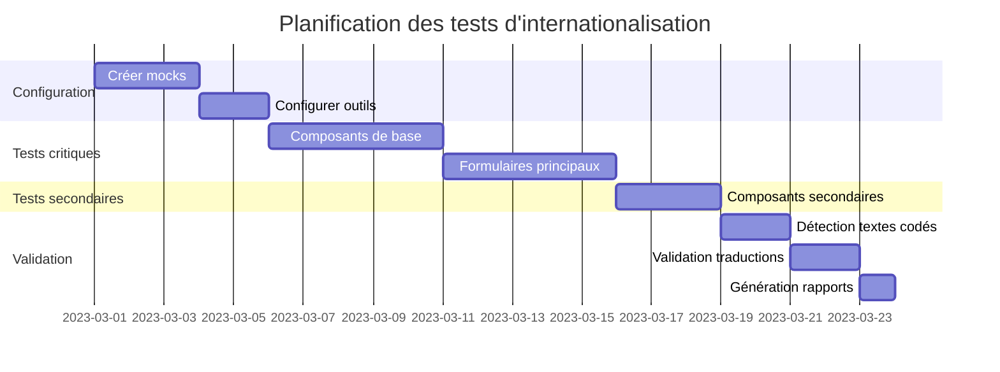
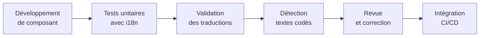

# Stratégie de test pour les composants internationalisés

## 1. Contexte et objectifs

Suite à l'internationalisation de tous les composants UI du projet (22 composants au total), nous devons adapter nos tests unitaires pour prendre en compte cette internationalisation. Ce document décrit l'approche à suivre pour :

1. Adapter les tests unitaires existants
2. Tester les composants avec différentes langues
3. Vérifier l'absence d'erreurs liées aux traductions manquantes
4. S'assurer que les textes de repli fonctionnent correctement
5. Détecter les textes codés en dur
6. Valider la cohérence des fichiers de traduction

## 2. Architecture des tests d'internationalisation

L'architecture des tests d'internationalisation dans notre application est organisée de la manière suivante :



### 2.1 Utilitaires de test disponibles

Notre application inclut plusieurs utilitaires dans le dossier `test-utils/` pour faciliter les tests d'internationalisation :

| Utilitaire                    | Description                                                                  |
| ----------------------------- | ---------------------------------------------------------------------------- |
| `hardcoded-text-detector.ts`  | Détecte les textes codés en dur dans les composants Vue                      |
| `translation-validator.ts`    | Valide la cohérence entre les fichiers de traduction                         |
| `run-i18n-tests.ts`           | Script pour exécuter tous les tests d'internationalisation                   |
| `i18n-validation.ts`          | Exécute la validation complète d'internationalisation et génère des rapports |
| `i18n-console-errors.ts`      | Détecte les erreurs de console liées à l'i18n                                |
| `i18n-e2e-test.ts`            | Tests end-to-end pour l'internationalisation                                 |
| `language-testing.ts`         | Utilitaires pour tester les langues                                          |
| `i18n-plugin.ts`              | Plugin pour Vue I18n dans les tests                                          |
| `i18n-dynamic-change.spec.ts` | Tests pour le changement dynamique de langue                                 |

## 3. Mocking de Vue I18n

### 3.1 Création d'un mock réutilisable

Nous avons identifié des mocks existants pour Vue I18n dans le projet, que nous pouvons adapter pour nos tests. Voici comment implémenter un mock global pour Vue I18n :

```typescript
// __mocks__/vue-i18n.ts
import { vi } from "vitest";
import { TRANSLATION_KEYS } from "@cv-generator/shared";

// Créer des traductions fictives pour les tests
const mockTranslations = {
  fr: {
    resume: {
      projects: {
        list: {
          title: "Projets",
          description: "Liste de vos projets",
          addButton: "Ajouter un projet",
          emptyStateTitle: "Aucun projet",
          emptyStateDescription: "Ajoutez des projets à votre CV",
          moveUp: "Déplacer vers le haut",
          moveDown: "Déplacer vers le bas",
        },
      },
      // Ajouter d'autres sections au besoin...
    },
    common: {
      actions: {
        add: "Ajouter",
        edit: "Modifier",
        delete: "Supprimer",
        cancel: "Annuler",
        save: "Enregistrer",
      },
    },
  },
  en: {
    resume: {
      projects: {
        list: {
          title: "Projects",
          description: "List of your projects",
          addButton: "Add a project",
          emptyStateTitle: "No projects",
          emptyStateDescription: "Add projects to your resume",
          moveUp: "Move up",
          moveDown: "Move down",
        },
      },
    },
    common: {
      actions: {
        add: "Add",
        edit: "Edit",
        delete: "Delete",
        cancel: "Cancel",
        save: "Save",
      },
    },
  },
};

// Fonction pour récupérer une traduction d'un objet imbriqué à partir d'une clé en dot notation
const getNestedTranslation = (
  obj: any,
  path: string,
  locale: string
): string => {
  const parts = path.split(".");
  let current = obj[locale];

  for (const part of parts) {
    if (current === undefined) return path;
    current = current[part];
  }

  return current || path;
};

// Mock pour useI18n
export const useI18n = vi.fn(() => {
  const locale = ref("fr");

  return {
    t: vi.fn((key: string, params?: Record<string, unknown>) => {
      // Si la clé contient TRANSLATION_KEYS, on extrait la clé réelle
      if (key.includes("TRANSLATION_KEYS")) {
        // On extrait la clé du chemin, par exemple "TRANSLATION_KEYS.RESUME.PROJECTS.LIST.TITLE" -> "resume.projects.list.title"
        const keyPath = key
          .split("TRANSLATION_KEYS.")[1]
          .toLowerCase()
          .replace(/_/g, ".")
          .replace(/\./g, ".")
          .replace(/^\./, "");
        return getNestedTranslation(mockTranslations, keyPath, locale.value);
      }

      // Sinon on cherche directement dans les traductions
      return getNestedTranslation(mockTranslations, key, locale.value);
    }),
    locale,
    availableLocales: ["fr", "en"],
    te: vi.fn((key: string) => {
      // Vérifier si la clé existe dans les traductions
      if (key.includes("TRANSLATION_KEYS")) {
        const keyPath = key
          .split("TRANSLATION_KEYS.")[1]
          .toLowerCase()
          .replace(/_/g, ".")
          .replace(/\./g, ".")
          .replace(/^\./, "");
        try {
          return (
            getNestedTranslation(mockTranslations, keyPath, locale.value) !==
            keyPath
          );
        } catch {
          return false;
        }
      }

      try {
        return (
          getNestedTranslation(mockTranslations, key, locale.value) !== key
        );
      } catch {
        return false;
      }
    }),
  };
});
```

### 3.2 Utilisation du mock dans les tests

Pour utiliser ce mock dans nos tests de composants, nous devons :

1. S'assurer que Vitest est configuré pour utiliser le mock automatiquement
2. Adapter nos tests pour prendre en compte l'internationalisation

```typescript
// WorkList.spec.ts
import { describe, it, expect, vi, beforeEach, afterAll } from "vitest";
import { mount } from "@vue/test-utils";
import WorkList from "../WorkList.vue";
import { useWorkStore } from "@ui/modules/cv/presentation/stores/work";

// Mock vue-i18n (sera automatiquement utilisé)
vi.mock("vue-i18n");

// Les autres mocks restent inchangés...

describe("WorkList", () => {
  it("renders the component with work items", async () => {
    const wrapper = mount(WorkList);

    // Au lieu de vérifier un texte codé en dur, on vérifie la présence d'éléments
    expect(wrapper.find("h2").exists()).toBe(true);

    // Ou vérifier que le texte est bien la traduction attendue
    // (en fonction de la langue par défaut du mock)
    expect(wrapper.find("h2").text()).toBe("Expériences Professionnelles");

    // Le reste du test reste identique
    const cards = wrapper.findAll(".mock-card");
    expect(cards.length).toBe(2);
    // ...
  });

  // Pour tester spécifiquement l'internationalisation
  it("uses translation keys correctly", async () => {
    const wrapper = mount(WorkList);

    // Vérifier que le titre est correctement traduit
    expect(wrapper.find("h2").text()).toBe("Expériences Professionnelles");

    // Vérifier le texte du bouton d'ajout
    const addButton = wrapper.find(".mock-button");
    expect(addButton.text()).toContain("Ajouter une expérience");
  });

  // Tests avec changement de langue
  it("changes text when language changes", async () => {
    const wrapper = mount(WorkList);

    // Vérifier le texte en français
    expect(wrapper.find("h2").text()).toBe("Expériences Professionnelles");

    // Changer la langue du mock
    vi.mocked(useI18n)().locale.value = "en";
    await nextTick();

    // Vérifier que le texte a changé
    expect(wrapper.find("h2").text()).toBe("Work Experience");
  });
});
```

## 4. Test de la fonction safeTranslate

Pour tester la fonction `safeTranslate` qui gère les clés de traduction manquantes, nous pouvons créer un test spécifique :

```typescript
// SafeTranslate.spec.ts
import { describe, it, expect, vi } from "vitest";
import { mount } from "@vue/test-utils";
import { defineComponent } from "vue";
import { useI18n } from "vue-i18n";

// Composant de test qui utilise safeTranslate
const TestComponent = defineComponent({
  template: "<div>{{ safeTranslated }}</div>",
  setup() {
    const { t } = useI18n();

    const safeTranslate = (key: string, fallback: string) => {
      try {
        const translation = t(key);
        return translation !== key ? translation : fallback;
      } catch (e) {
        return fallback;
      }
    };

    const safeTranslated = safeTranslate("nonexistent.key", "Fallback Text");

    return { safeTranslated };
  },
});

describe("safeTranslate function", () => {
  it("returns fallback text for missing translation keys", () => {
    const wrapper = mount(TestComponent);
    expect(wrapper.text()).toBe("Fallback Text");
  });

  it("returns translation for existing keys", () => {
    // Modifier le mock pour retourner une traduction pour cette clé
    vi.mocked(useI18n)().t.mockImplementation((key) => {
      if (key === "existing.key") return "Translated Text";
      return key;
    });

    const TestComponentWithKey = defineComponent({
      template: "<div>{{ safeTranslated }}</div>",
      setup() {
        const { t } = useI18n();

        const safeTranslate = (key: string, fallback: string) => {
          try {
            const translation = t(key);
            return translation !== key ? translation : fallback;
          } catch (e) {
            return fallback;
          }
        };

        const safeTranslated = safeTranslate("existing.key", "Fallback Text");

        return { safeTranslated };
      },
    });

    const wrapper = mount(TestComponentWithKey);
    expect(wrapper.text()).toBe("Translated Text");
  });
});
```

## 5. Détection de textes codés en dur

Pour assurer une internationalisation complète de l'application, nous utilisons `hardcoded-text-detector.ts` pour identifier les textes qui n'ont pas été internationalisés.

### 5.1 Utilisation du détecteur de textes codés en dur

```typescript
import {
  detectHardcodedText,
  generateHardcodedTextReport,
} from "../test-utils/hardcoded-text-detector";

// Analyser les composants pour trouver les textes codés en dur
const issues = detectHardcodedText("./src/components", {
  // Options personnalisées
  minTextLength: 4, // Ignorer les textes courts (souvent des identifiants, etc.)
  ignoreFolders: ["node_modules", "dist", "__tests__"],
});

// Générer un rapport Markdown
const report = generateHardcodedTextReport(issues);
console.log(report);
```

### 5.2 Processus de vérification des textes codés en dur



## 6. Validation des traductions

Nous utilisons `translation-validator.ts` pour vérifier la cohérence entre les différents fichiers de traduction.

### 6.1 Utilisation du validateur de traductions

```typescript
import {
  validateTranslations,
  generateTranslationReport,
} from "../test-utils/translation-validator";

// Valider les traductions
const result = validateTranslations("./src/i18n/locales", ["fr", "en"]);

// Générer un rapport
const report = generateTranslationReport(result);
console.log(report);

// Vérifier si les traductions sont valides
if (!result.isValid) {
  console.error("Problèmes de traduction détectés!");
  console.log(`Clés manquantes: ${result.missingKeys.length}`);
  console.log(`Incohérences de type: ${result.typeMismatches.length}`);
}
```

### 6.2 Processus de validation des traductions



## 7. Test des erreurs de console

Pour vérifier l'absence d'erreurs de console liées aux traductions manquantes, nous pouvons modifier notre fonction de test pour surveiller les erreurs de console :

```typescript
describe("Component with translations", () => {
  let consoleErrorSpy: any;

  beforeEach(() => {
    // Espionner console.error pour détecter les erreurs de traduction
    consoleErrorSpy = vi.spyOn(console, "error").mockImplementation(() => {});
  });

  afterEach(() => {
    // Restaurer console.error
    consoleErrorSpy.mockRestore();
  });

  it("renders without translation errors", async () => {
    const wrapper = mount(WorkList);

    // Vérifier qu'aucune erreur de console n'a été émise concernant les traductions
    const i18nErrors = consoleErrorSpy.mock.calls.filter(
      (call) =>
        call[0] &&
        typeof call[0] === "string" &&
        (call[0].includes("i18n") ||
          call[0].includes("translation") ||
          call[0].includes("t is not a function"))
    );

    expect(i18nErrors.length).toBe(0);
  });
});
```

## 8. Tests dynamiques de changement de langue

Nous testons également le changement dynamique de langue avec `i18n-dynamic-change.spec.ts`. Ces tests vérifient que :

1. L'utilisateur peut changer la langue de l'application
2. Les préférences de langue sont correctement sauvegardées dans localStorage
3. Le texte affiché change lorsque la langue change

### 8.1 Tests de changement de langue

```typescript
describe("Changement dynamique de langue", () => {
  beforeEach(() => {
    // Configurer les mocks
    Object.defineProperty(window, "localStorage", { value: localStorageMock });
    localStorageMock.getItem.mockReturnValue("fr");
  });

  it("change la langue lorsqu'on sélectionne une nouvelle langue", async () => {
    const wrapper = mount(LanguageSelector);

    // Vérifier l'état initial (français)
    expect(wrapper.find('[data-test="language-current"]').text()).toContain(
      "Français"
    );

    // Sélectionner l'anglais
    await wrapper.find('[data-test="language-button"]').trigger("click");
    await wrapper.find('[data-test*="language-item-en"]').trigger("click");

    // Vérifier que localStorage a été mis à jour
    expect(localStorageMock.setItem).toHaveBeenCalledWith(
      LOCALE_STORAGE_KEY,
      "en"
    );
  });

  it("persiste la préférence linguistique", async () => {
    // Tester la persistance...
  });
});
```

### 8.2 Processus de changement de langue



## 9. Exécution automatisée des tests d'internationalisation

Pour exécuter tous les tests d'internationalisation en une seule commande, nous utilisons le script `run-i18n-tests.ts` qui :

1. Exécute les tests unitaires liés à l'internationalisation
2. Vérifie la présence de textes codés en dur
3. Valide la cohérence des fichiers de traduction
4. Génère des rapports détaillés

### 9.1 Utilisation du script d'exécution des tests

```bash
# Exécuter tous les tests d'internationalisation
npm run test:i18n

# Ou directement
node ./src/test-utils/run-i18n-tests.ts
```

### 9.2 Processus d'exécution des tests d'internationalisation



## 10. Plan d'exécution

### 10.1 Étapes pour adapter les tests

1. Créer le mock réutilisable pour Vue I18n
2. Adapter les tests des composants les plus critiques d'abord
3. Créer des tests spécifiques pour la fonction safeTranslate
4. Vérifier l'absence d'erreurs de console
5. Tester avec différentes langues
6. Exécuter la détection de textes codés en dur
7. Valider les fichiers de traduction

### 10.2 Priorisation des tests

1. Haute priorité: Composants de base et formulaires principaux (WorkForm/List, EducationForm/List, SkillForm/List)
2. Priorité moyenne: Composants secondaires (ProjectForm/List, LanguageForm/List)
3. Basse priorité: Autres composants (Publication, Award, etc.)



## 11. Exemples concrets

### 11.1 Exemple d'adaptation pour WorkList.spec.ts

```typescript
import { describe, it, expect, vi, beforeEach, afterAll } from "vitest";
import { mount } from "@vue/test-utils";
import WorkList from "../WorkList.vue";
import { useWorkStore } from "@ui/modules/cv/presentation/stores/work";
import { TRANSLATION_KEYS } from "@cv-generator/shared";

// Mock vue-i18n
vi.mock("vue-i18n");

// Les autres mocks restent inchangés...

describe("WorkList", () => {
  it("renders the component with work items", async () => {
    const wrapper = mount(WorkList);

    // Vérifier que les éléments sont présents
    expect(wrapper.find("h2").exists()).toBe(true);
    expect(wrapper.findAll(".mock-card").length).toBe(2);

    // Vérifier le contenu des cartes
    const cards = wrapper.findAll(".mock-card");
    expect(cards[0].text()).toContain("Senior Engineer");
    expect(cards[0].text()).toContain("Test Company 2");

    // Vérifier les dates avec la fonction formatDate internationalisée
    expect(cards[0].text()).toContain("février 2022 - Présent");
  });

  it("shows add button with correct translation", () => {
    const wrapper = mount(WorkList);
    const addButton = wrapper.find(".mock-button");

    expect(addButton.exists()).toBe(true);
    expect(addButton.text()).toContain("Ajouter une expérience");
  });

  // Tests spécifiques pour l'internationalisation
  it("uses safeTranslate for missing keys", async () => {
    // Modifier le mock pour simuler une clé manquante
    vi.mocked(useI18n)().t.mockImplementation((key) => {
      if (key === "resume.work.list.chronologicalOrder") return key;
      return "Expériences Professionnelles";
    });

    const wrapper = mount(WorkList);

    // Trouver un élément qui utilise safeTranslate
    const sortButton = wrapper.find("button.flex.items-center.text-sm");
    if (sortButton.exists()) {
      // Cliquer pour activer le tri
      await sortButton.trigger("click");

      // Vérifier que le texte de fallback est utilisé
      expect(sortButton.text()).toContain("Tri chronologique");
    }
  });
});
```

### 11.2 Exemple d'adaptation pour WorkForm.spec.ts

```typescript
import { describe, it, expect, vi, beforeEach } from "vitest";
import { mount } from "@vue/test-utils";
import WorkForm from "../WorkForm.vue";
import { TRANSLATION_KEYS } from "@cv-generator/shared";

// Mock vue-i18n
vi.mock("vue-i18n");

// Les autres mocks restent inchangés...

describe("WorkForm", () => {
  it("renders form with correct translations", () => {
    const wrapper = mount(WorkForm, {
      props: {
        modelValue: {
          name: "",
          position: "",
          startDate: "",
          endDate: "",
          highlights: [],
        },
        isNew: true,
      },
    });

    // Vérifier les titres et textes internationalisés
    const html = wrapper.html();
    expect(html).toContain("Entreprise"); // Label traduit
    expect(html).toContain("Poste"); // Label traduit
    expect(html).toContain("Date de début"); // Label traduit
  });

  it("emits update events when fields change", async () => {
    const wrapper = mount(WorkForm, {
      props: {
        modelValue: {
          name: "",
          position: "",
          startDate: "",
          endDate: "",
          highlights: [],
        },
        isNew: true,
      },
    });

    // Simuler un changement dans un champ
    const input = wrapper.find('input[name="name"]');
    await input.setValue("Test Company");

    // Vérifier que l'événement est émis correctement
    expect(wrapper.emitted("update:modelValue")).toBeTruthy();
    expect(wrapper.emitted("update:modelValue")![0][0].name).toBe(
      "Test Company"
    );
  });
});
```

## 12. Guide d'utilisation des outils de test i18n

Pour faciliter les tests d'internationalisation, voici comment utiliser les différents outils disponibles dans le projet :

### 12.1 Exécution de tous les tests d'internationalisation

```bash
# Exécuter les tests liés à l'internationalisation
npm run test:i18n

# Exécuter uniquement la validation des traductions
npm run validate:i18n
```

### 12.2 Utilisation des outils individuels

```typescript
// Détection de textes codés en dur
import { detectHardcodedText } from "../test-utils/hardcoded-text-detector";
const issues = detectHardcodedText("./src/components");

// Validation des traductions
import { validateTranslations } from "../test-utils/translation-validator";
const result = validateTranslations("./src/i18n/locales", ["fr", "en"]);

// Test de changement de langue
// Voir i18n-dynamic-change.spec.ts pour un exemple complet
```

### 12.3 Ajout de nouveaux tests d'internationalisation

Lors de l'ajout de nouveaux tests pour les composants internationalisés, suivez ces étapes :

1. Importez et mockez vue-i18n
2. Utilisez des assertions basées sur des sélecteurs plutôt que du texte brut
3. Pour tester le texte, utilisez les traductions du mock
4. Testez le comportement avec différentes langues

## 13. Conclusions et recommandations

- L'adaptation des tests aux composants internationalisés doit être systématique et méthodique
- Le mock de Vue I18n doit être réutilisable et extensible pour s'adapter aux futurs besoins
- Les tests doivent vérifier non seulement que les traductions sont affichées, mais aussi que le fallback fonctionne correctement
- Les cas particuliers comme les clés non-définies doivent être traités explicitement
- Ces tests doivent faire partie de notre pipeline CI pour assurer la qualité continue
- Les outils de détection de textes codés en dur et de validation des traductions doivent être exécutés régulièrement



En suivant cette stratégie, nous pourrons nous assurer que l'internationalisation de nos composants UI est robuste et maintenable à long terme.
