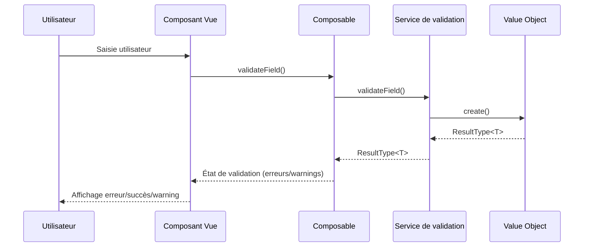
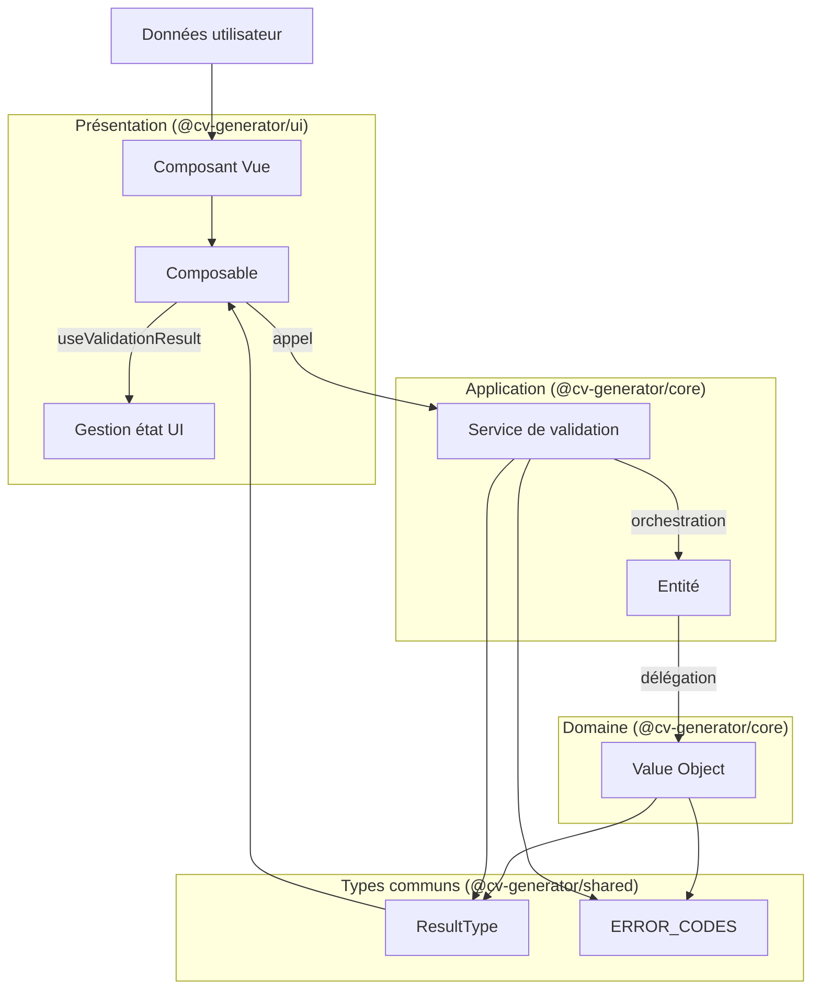
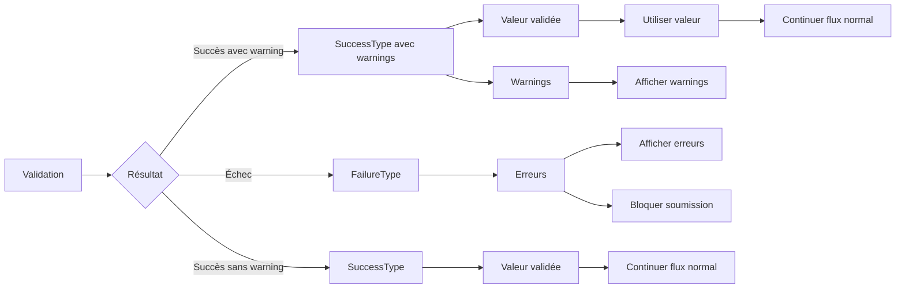
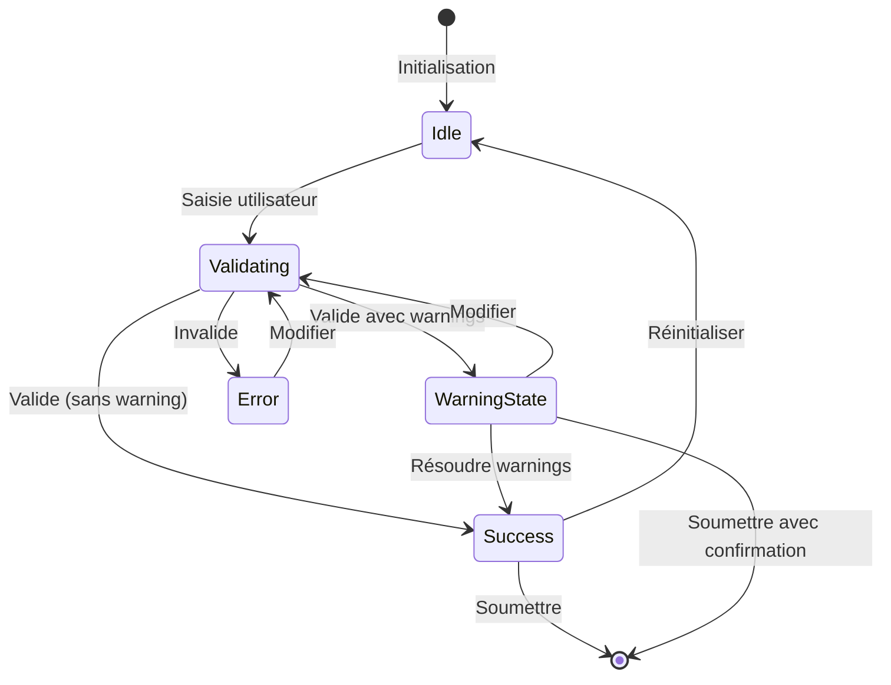
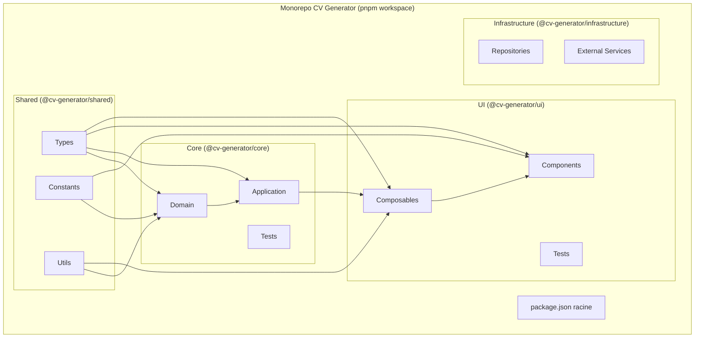
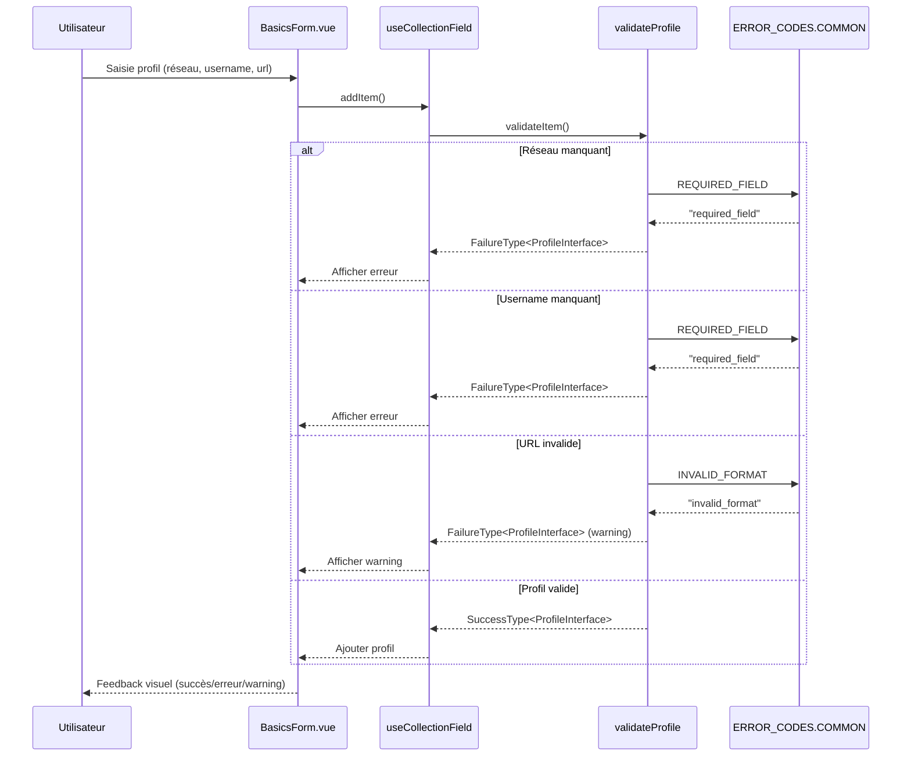

# Diagramme de flux du système de validation

Ce diagramme illustre le flux de données et les interactions entre les différentes couches du système de validation dans notre architecture monorepo gérée par pnpm.

## Flux de validation complet

## Architecture en couches

## Traitement des erreurs

## Cycle de vie d'une validation

## Structure des packages monorepo

## Flux de validation des profils dans BasicsForm

