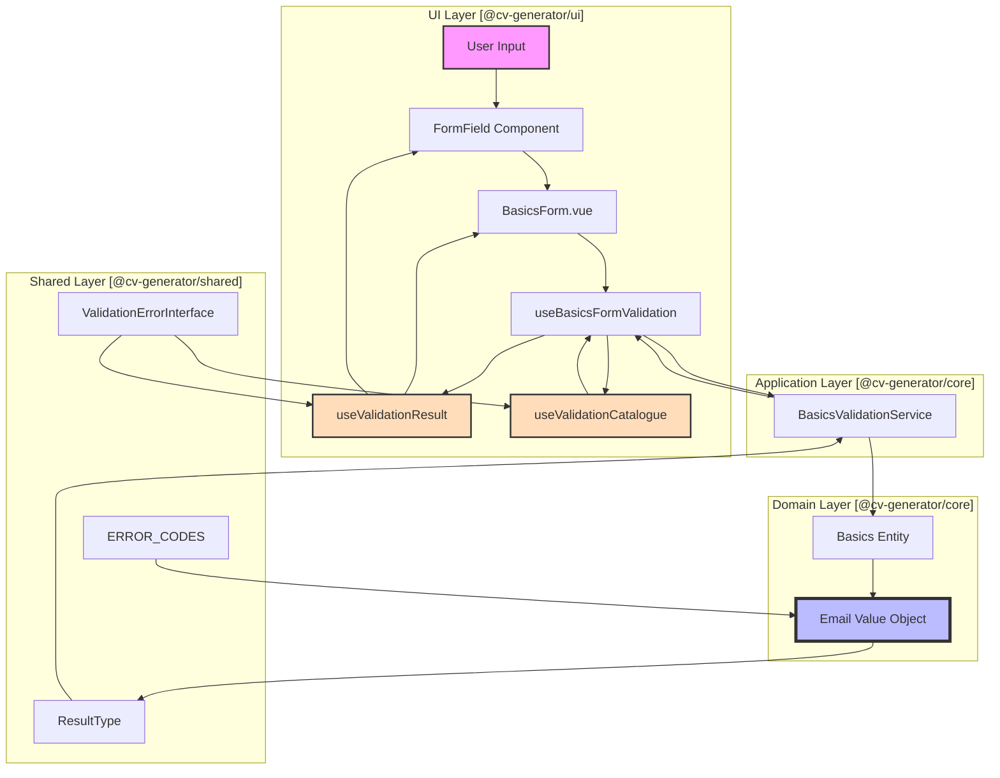
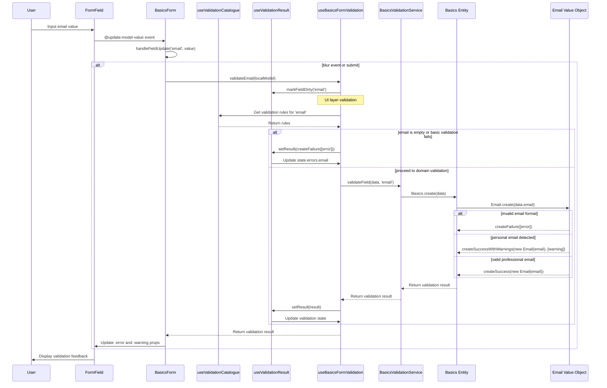
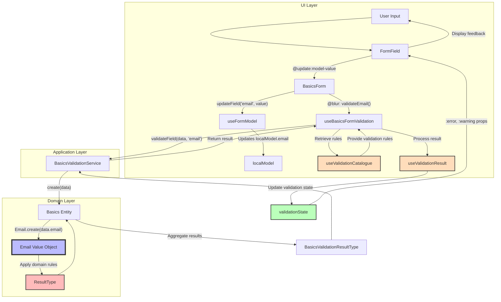
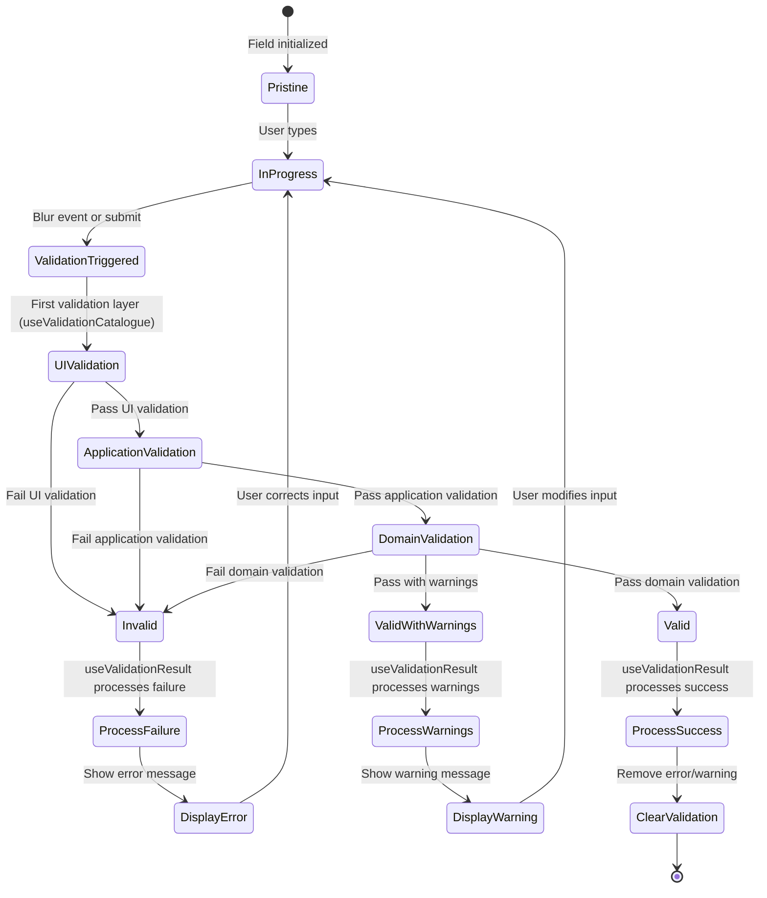

# Email Validation Flow Through Clean Architecture/DDD Layers

## Overview

This document provides a detailed technical explanation of how the email validation process flows through different layers of our Clean Architecture/DDD implementation in the CV Generator application. Using the `email` field from `BasicsForm.vue` as a concrete example, we'll trace the complete validation journey from user input to domain validation and back.

## Validation Layers and Components

Our application employs a multi-layered validation approach that follows Clean Architecture principles with specialized components at each layer:



Each layer has specific validation responsibilities and components:

1. **UI Layer (Presentation)**:

   - Provides immediate feedback through FormField components
   - Manages UI-specific validations with `useBasicsFormValidation`
   - Centralizes validation messages with `useValidationCatalogue`
   - Processes validation results with `useValidationResult`
   - Maintains validation state for the view

2. **Application Layer**:

   - Orchestrates validation requests via BasicsValidationService
   - Delegates to domain entities
   - Transforms domain results into application-specific formats

3. **Domain Layer**:

   - Contains core business rules and invariants
   - Implements strict validation logic through value objects (Email)
   - Returns rich validation results with context-specific errors and warnings

4. **Shared Layer**:
   - Provides standardized interfaces and types
   - Defines error codes and validation result structures
   - Enables type-safe communication between layers

## Specialized Validation Components

Two key composables enhance our validation architecture:

### 1. `useValidationCatalogue`

This composable serves as a centralized registry for validation messages:

```typescript
export function useValidationCatalogue(
  options: ValidationCatalogueOptionsInterface = {},
  initialErrors: ValidationErrorInterface[] = [],
  initialHelp: HelpMessageInterface[] = []
): ValidationCatalogueReturnInterface {
  // Implementation details...

  return {
    addErrorMessage,
    addErrorMessages,
    addHelpMessage,
    addHelpMessages,
    getErrorMessage,
    getHelpMessage,
    getErrorsForField,
    getHelpForField,
    autoShowHelp,
    setErrorCatalogue,
    setHelpCatalogue,
    resetCatalogue,
    validateField,
  };
}
```

Key features:

- Maintains a catalogue of validation messages and error codes
- Provides caching for optimization
- Supports field-specific validation rules
- Enables internationalization through locale support
- Offers lazy-loading of validation messages

### 2. `useValidationResult`

This composable specializes in handling validation results from the Result pattern:

```typescript
export function useValidationResult<T>(
  initialResult: FormValidationResultType<T> | null = null,
  options: ValidationResultOptionsInterface = {}
): UseValidationResultReturnInterface<T> {
  // Implementation details...

  return {
    result,
    setResult,
    resetResult,
    allErrors,
    allWarnings,
    isSuccess: isSuccessResult,
    isFailure: isFailureResult,
    getFieldState,
    fieldsWithErrors,
    fieldsWithWarnings,
    totalIssues,
    perfMetrics,
  };
}
```

Key features:

- Processes and manages validation result objects
- Tracks field "dirty" state (user interaction)
- Extracts errors and warnings from result objects
- Provides computed properties for validation state
- Maintains performance metrics for optimization

## Email Validation Flow - Detailed Sequence

The following sequence diagram illustrates the complete lifecycle of an email validation request, including all specialized components:



## Component Details

### 1. UI Layer Components

#### a. `FormField.vue` Component

The FormField component serves as the user interface element that:

- Captures user input
- Displays validation errors and warnings
- Provides visual feedback about validation state

```vue
<FormField
  name="email"
  label="Email"
  type="email"
  :model-value="toStringOrEmpty(localModel.email)"
  :error="validationState.errors.email"
  :warning="validationState.warnings.email"
  :icon="icons.email"
  placeholder="Ex: jean.dupont@example.com"
  help-text="Votre adresse email professionnelle."
  required
  @update:model-value="handleFieldUpdate('email', $event)"
  @blur="validateEmail(localModel)"
/>
```

#### b. `BasicsForm.vue` Component

The BasicsForm component:

- Orchestrates form state management
- Handles field updates and events
- Delegates validation to specialized composables

```typescript
// Update handlers
const handleFieldUpdate = (field: keyof BasicsInterface, value: string) => {
  updateField(field, value)
}

// From useFormModel composable
const {
  localModel,
  updateField,
  updateNestedField,
  perfMetrics
} = useFormModel<BasicsInterface>({...})
```

#### c. `useBasicsFormValidation` Composable

This composable provides the UI layer validation logic and coordinates with other validation composables:

```typescript
const validateEmail = (data: BasicsInterface): boolean => {
  markFieldAsDirty("email");

  // UI-layer check for required field
  if (!data.email || data.email.trim() === "") {
    state.errors.email = "L'email est requis";
    return false;
  }

  // Delegate to application layer validation
  const result = validationService.validateField(data, "email");
  // Type conversion
  state.lastResult =
    result as unknown as FormValidationResultType<BasicsInterface>;

  // Process validation results from deeper layers using ValidationResult
  validationResult.setResult(result);

  // Get field state from ValidationResult
  const emailFieldState = validationResult.getFieldState("email");

  // Update local state with validation catalog entries
  if (emailFieldState.hasError.value) {
    state.errors.email = emailFieldState.firstErrorMessage.value;
    return false;
  } else if (emailFieldState.hasWarning.value) {
    state.warnings.email =
      emailFieldState.errors.value.find((e) => e.severity === "warning")
        ?.message || "";
    return true;
  } else {
    delete state.errors.email;
    delete state.warnings.email;
    return true;
  }
};
```

#### d. `useValidationCatalogue` Composable

This composable centralizes validation messages and rules:

```typescript
// Example usage in a component
const { getErrorMessage, validateField, getErrorsForField } =
  useValidationCatalogue({
    rules: {
      email: [
        {
          validator: (value) => !!value && value.trim() !== "",
          message: "L'email est requis",
          severity: "error",
          code: ERROR_CODES.RESUME.BASICS.MISSING_EMAIL,
        },
        {
          validator: (value) =>
            !value || /^[^\s@]+@[^\s@]+\.[^\s@]+$/.test(value),
          message: "Format email invalide",
          severity: "error",
          code: ERROR_CODES.RESUME.BASICS.INVALID_EMAIL,
        },
        {
          validator: (value) => {
            if (!value) return true;
            const domain = value.split("@")[1]?.toLowerCase();
            return (
              !domain ||
              !["gmail.com", "hotmail.com", "outlook.com"].includes(domain)
            );
          },
          message: "Email personnel détecté",
          severity: "warning",
          code: ERROR_CODES.RESUME.BASICS.PERSONAL_EMAIL,
        },
      ],
    },
  });
```

#### e. `useValidationResult` Composable

This composable processes validation results:

```typescript
// Example usage in a component
const {
  result,
  setResult,
  getFieldState,
  isSuccess,
  isFailure,
  allErrors,
  allWarnings,
} = useValidationResult<BasicsInterface>();

// After validation
setResult(validationResult);

// Check if email has errors
const emailState = getFieldState("email");
if (emailState.hasError.value) {
  console.log("Email error:", emailState.firstErrorMessage.value);
}
```

### 2. Application Layer Services

#### `BasicsValidationService`

The BasicsValidationService bridges the UI and domain layers:

```typescript
export class BasicsValidationService extends BaseValidationService<BasicsInterface> {
  validate(basics: BasicsInterface): ResultType<BasicsInterface> {
    // Delegate validation to domain entity
    const result = Basics.create(basics);

    if (result.success) {
      return result;
    }

    return createFailure(result.error);
  }

  validateField(
    data: BasicsInterface,
    field: keyof BasicsInterface
  ): ResultType<BasicsInterface> {
    // Implementation omitted for brevity
    // Focuses validation on a specific field
  }
}
```

### 3. Domain Layer Components

#### a. `Basics` Entity

The Basics entity contains the core domain logic for a CV's basic information section:

```typescript
static create(data: Partial<BasicsInterface>): BasicsValidationResultType {
  const errors: ValidationErrorInterface[] = [];
  const warnings: ValidationErrorInterface[] = [];

  // Validate email with Email value object
  let emailObj: Email | null = null;
  if (data.email) {
    const emailResult = Email.create(data.email);
    if (!emailResult.success) {
      errors.push(...emailResult.error);
    } else {
      emailObj = emailResult.value;
      // Add warnings if any
      if (emailResult.warnings) {
        warnings.push(...emailResult.warnings);
      }
    }
  } else {
    errors.push({
      code: 'missing_email',
      message: 'L\'email est requis',
      field: 'email',
      severity: 'error',
      layer: ValidationLayerType.DOMAIN,
      suggestion: 'Veuillez fournir une adresse email valide'
    });
  }

  // Other validations...

  // Return validation result
  // Implementation omitted for brevity
}
```

#### b. `Email` Value Object

The Email value object encapsulates the business rules for valid email addresses:

```typescript
public static create(email: string): ResultType<Email> {
  // Validation: Format d'email valide (incluant l'email vide)
  if (!email || email.trim() === '' || !/^[^\s@]+@[^\s@]+\.[^\s@]+$/.test(email)) {
    return createFailure([{
      code: !email || email.trim() === '' ?
        ERROR_CODES.RESUME.BASICS.MISSING_EMAIL :
        ERROR_CODES.RESUME.BASICS.INVALID_EMAIL,
      message: "Format email invalide",
      field: "email",
      severity: "error",
      layer: ValidationLayerType.DOMAIN,
      suggestion: "Vérifiez que votre email contient un @ et un domaine valide"
    }]);
  }

  // Check for personal domains (business rule)
  const personalDomains = ['gmail.com', 'hotmail.com', 'outlook.com', 'yahoo.com', 'aol.com', 'icloud.com'];
  const domain = email.split('@')[1].toLowerCase();

  if (personalDomains.includes(domain)) {
    return createSuccessWithWarnings(new Email(email), [{
      code: ERROR_CODES.RESUME.BASICS.PERSONAL_EMAIL,
      message: "Email personnel détecté",
      field: "email",
      severity: "warning",
      layer: ValidationLayerType.DOMAIN,
      suggestion: "Pour un CV professionnel, privilégiez un email professionnel ou personnalisé"
    }]);
  }

  // Valid professional email
  return createSuccess(new Email(email));
}
```

### 4. Shared Types and Utilities

#### a. `ResultType` and Validation Error Types

The application uses a Result pattern to handle validation outcomes:

```typescript
// Success result type
export type SuccessType<T> = {
  success: true;
  value: T;
  warnings?: ValidationErrorInterface[];
};

// Failure result type
export type FailureType<E> = {
  success: false;
  error: E;
};

// Combined result type
export type ResultType<T, E = ValidationErrorInterface[]> =
  | SuccessType<T>
  | FailureType<E>;
```

#### b. `ValidationErrorInterface`

This interface standardizes error information across all layers:

```typescript
export interface ValidationErrorInterface {
  /** Code unique identifiant le type d'erreur */
  code: string;

  /** Message explicatif */
  message: string;

  /** Champ concerné par l'erreur */
  field: string;

  /** Niveau de sévérité */
  severity: ValidationSeverityType;

  /** Couche architecturale responsable de la validation */
  layer: ValidationLayerType;

  /** Suggestion optionnelle pour résoudre le problème */
  suggestion?: string;

  /** Informations supplémentaires */
  additionalInfo?: Record<string, unknown>;
}
```

## Complete Data Flow Analysis

### 1. Enhanced Email Validation Data Flow

The following flowchart shows the complete validation flow including all specialized components:



### 2. Validation Result States with Enhanced Components



## Specific Email Validation Rules Across Components

| Component               | Validation Layer | Rule Description                         | Error/Warning                         |
| ----------------------- | ---------------- | ---------------------------------------- | ------------------------------------- |
| useBasicsFormValidation | UI Layer         | Email is required                        | Error: "L'email est requis"           |
| useValidationCatalogue  | UI Layer         | Format validation rules                  | Various predefined rules              |
| Email Value Object      | Domain Layer     | Email format must be valid               | Error: "Format email invalide"        |
| Email Value Object      | Domain Layer     | Email should not be from personal domain | Warning: "Email personnel détecté"    |
| useValidationResult     | UI Layer         | Processing result objects                | Transforms results for UI consumption |

## Advantages of This Enhanced Validation Architecture

1. **Clear Separation of Concerns**:

   - UI layer handles presentation logic with specialized components
   - Domain layer enforces business rules
   - Application layer orchestrates the process
   - Shared types enable cross-layer communication

2. **Rich Validation Feedback**:

   - Centralized catalogue of validation messages
   - Standardized error structure across layers
   - Includes helpful suggestions
   - Differentiates between errors and warnings

3. **Progressive Validation**:

   - Quick feedback on simple rules (UI layer)
   - Deeper validation for business rules (Domain layer)
   - Optimized performance by validating in stages and caching

4. **Type Safety**:

   - Strong TypeScript types for validation results
   - Consistent error interface
   - Clear error code categorization

5. **Reusability and Maintainability**:
   - Domain validation logic is reusable across interfaces
   - Validation catalogue centralizes messages and rules
   - Validation result processing is standardized
   - Performance tracking enables optimization

## Conformance to Clean Architecture

This validation system strictly adheres to Clean Architecture principles:

1. **Dependency Rule**: Dependencies only point inward, with domain layer having no external dependencies
2. **Separation of Concerns**: Each layer and component has a specific responsibility
3. **Domain Isolation**: Core business rules are encapsulated in Value Objects with no external dependencies
4. **Framework Independence**: Domain rules don't depend on UI frameworks or specific technologies
5. **Testability**: Each component can be tested in isolation

## Conclusion

The email validation flow in our CV Generator application demonstrates a robust implementation of Clean Architecture and Domain-Driven Design principles. By separating validation concerns across different layers and using specialized components like `useValidationCatalogue` and `useValidationResult`, we achieve a system that provides both immediate user feedback and enforces strict business rules.

The Value Object pattern for the Email type encapsulates all validation logic and business rules related to email addresses, while the Result pattern provides a standardized way to handle validation outcomes. The specialized UI composables enhance this architecture by providing centralized validation messages and standardized result processing.

This approach not only ensures data integrity but also enhances user experience by providing clear, context-specific validation feedback while maintaining excellent performance through techniques like caching and specialized state management.
