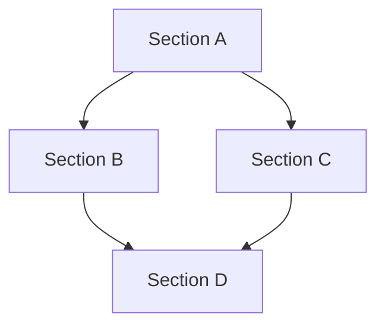

<think>Je dois vérifier si j'ai bien pris en compte toutes les règles, le fichier agile-readme.md et les fichiers du dossier xnotes. L'utilisateur m'a maintenant partagé le contenu du fichier docs/agile-readme.md et le dossier .cursor/rules qui contient 000-cursor-rules.mdc et 400-md-docs.mdc.

Pour le dossier xnotes, j'ai effectivement trouvé qu'il contient:
- 801-workflow-agile.mdc
- 901-prd-template.mdc
- 902-arch-template.mdc
- 903-story-template.mdc
- git-push-command.md
- project-idea-prompt.md
- template-arch.md
- template-prd.md
- template-story.md
- workflow-agile.md

J'ai également analysé la structure et le contenu de certains de ces fichiers. Maintenant, l'utilisateur me demande de continuer avec l'analyse et de lui fournir un rapport avec mes impressions et des pistes d'amélioration pour les templates.

Je vais donc:
1. Confirmer que j'ai bien pris en compte toutes les informations
2. Approfondir mon analyse des templates
3. Fournir un rapport détaillé avec des pistes d'amélioration concrètes</think>Oui, j'ai bien pris en compte:
- Les règles dans le dossier `.cursor/rules` (000-cursor-rules.mdc et 400-md-docs.mdc)
- Le fichier `docs/agile-readme.md` complet
- Les fichiers du dossier `xnotes` (les templates .mdc et .md)

Je vais maintenant approfondir mon analyse et vous présenter un rapport détaillé sur les améliorations possibles pour les templates.

# Rapport d'Analyse des Templates - Version Détaillée

## Contexte Global

Le projet "Cursor Auto Rules Agile Workflow" crée un écosystème intégré qui:
1. Automatise la génération de règles pour l'IA de Cursor
2. Implémente une méthodologie Agile adaptée au développement assisté par IA
3. Fournit des templates pour la documentation, la planification et l'implémentation

Cet écosystème repose sur 3 composants clés:
- **Règles Cursor** (.cursor/rules/*.mdc)
- **Documentation du Workflow** (docs/agile-readme.md)
- **Templates de Travail** (xnotes/*.md et *.mdc)

## Analyse des Templates Actuels

### 1. Structure et Organisation

Les templates sont organisés en deux catégories principales:
- **Templates de règles** (.mdc) pour l'intégration automatique avec Cursor
- **Templates Markdown** (.md) pour une utilisation manuelle ou via Notepads

Cette double approche est pertinente car elle offre flexibilité et adaptabilité selon les besoins de l'utilisateur.

### 2. Qualité du Contenu

#### Points Forts
- **Cohérence méthodologique**: Les templates suivent fidèlement la méthodologie Agile décrite
- **Structure hiérarchique claire**: Organisation en Epics > Stories > Tasks > Subtasks
- **Orientation processus**: Workflows détaillés avec étapes précises
- **Intégration avec l'IA**: Considérations spécifiques pour le travail avec des agents IA

#### Points à Améliorer
- **Variabilité de format**: Inconsistance dans la structuration des frontmatter
- **Niveau de détail inégal**: Certains templates sont très détaillés, d'autres plus sommaires
- **Exemples insuffisants**: Manque d'exemples concrets d'utilisation dans la plupart des templates
- **Adaptabilité limitée**: Peu de variations pour différents types de projets

## Pistes d'Amélioration Détaillées

### 1. Standardisation des Templates

#### Décision: Adopter un format unifié pour tous les templates
**Raisonnement**: La cohérence facilite l'apprentissage, l'utilisation et la maintenance.

**Proposition concrète**:
```yaml
---
title: "[Type de Document] - [Nom du Template]"
version: "X.Y.Z"
description: "Description concise suivant le format ACTION TRIGGER OUTCOME"
globs: "[Pattern glob si applicable]"
lastUpdated: "YYYY-MM-DD"
author: "Cursor Team"
tags: ["tag1", "tag2"]
---

# [Titre Principal]

## Vue d'ensemble
[Brève introduction - 2-3 phrases maximum]

> 💡 **Note importante**: [Information critique pour l'utilisation]

## Structure
[Diagramme Mermaid ou liste structurée]

## Sections Requises
[Liste détaillée avec explications]

## Exemples
<example>
[Exemple positif avec explication]
</example>

<example type="invalid">
[Exemple négatif avec explication]
</example>

## Bonnes Pratiques
- [Conseil 1]
- [Conseil 2]
```

### 2. Enrichissement des Templates Existants

#### Décision: Améliorer le template 901-prd-template.mdc en priorité
**Raisonnement**: Le PRD est la pierre angulaire du workflow Agile - sa qualité impacte tous les documents qui en découlent.

**Améliorations spécifiques**:
1. Ajout d'une liste de vérification (checklist) pour validation
2. Inclusion d'exemples pour chaque section du PRD
3. Ajout de conseils spécifiques pour différents types de projets (API, UI, CLI)
4. Section pour la validation par l'IA avec critères explicites

### 3. Nouveaux Templates à Créer

#### Décision: Développer un template de documentation technique
**Raisonnement**: Le workflow actuel couvre bien la planification et l'exécution mais moins la documentation technique finale.

**Structure proposée**:
- Résumé Technique (1 paragraphe)
- Architecture (diagramme + explication)
- Composants Principaux (liste détaillée)
- API/Interfaces (documentation détaillée)
- Guide d'Installation/Déploiement
- Guide de Maintenance
- Considérations de Performance et Sécurité
- FAQ Technique

### 4. Améliorations Visuelles et Ergonomiques

#### Décision: Intégrer des éléments visuels pour améliorer la lisibilité
**Raisonnement**: La complexité des templates nécessite une présentation qui facilite leur compréhension et utilisation.

**Exemples concrets**:
- Utilisation systématique d'emojis comme repères visuels (📑 pour documents, 🔍 pour vérifications, etc.)
- Sections dépliables (via `<details>`) pour les templates longs
- Tableaux colorés pour présenter des matrices de décision
- Bordures et encadrements pour les informations critiques

### 5. Optimisation pour l'IA

#### Décision: Restructurer les descriptions frontmatter pour améliorer la détection par l'IA
**Raisonnement**: La précision des descriptions améliore considérablement la capacité de l'IA à sélectionner et appliquer le bon template.

**Format optimisé**:
```yaml
description: "ALWAYS use when CREATING a [document-type] to ENSURE standardized documentation that FOLLOWS project guidelines"
```

Ce format ACTION-TRIGGER-OUTCOME est plus facilement traité par l'IA.

## Exemple Concret d'Amélioration: Template Story

### Version Actuelle (simplifiée):
```md
# User Story Template

## Story Details
- ID: [ID]
- Title: [Title]
- Status: [Draft/In Progress/Complete]

## Description
[Description]

## Acceptance Criteria
- [Criterion 1]
- [Criterion 2]

## Tasks
- [ ] [Task 1]
- [ ] [Task 2]
```

### Version Améliorée:
```md
---
title: "User Story Template"
version: "2.0.0"
description: "ALWAYS use when CREATING or UPDATING a story document to ENSURE proper tracking and implementation"
globs: "**/*.story.md"
lastUpdated: "2024-02-28"
tags: ["agile", "story", "planning"]
---

# 📋 User Story Template

## 🔎 Vue d'ensemble
> 💡 **Conseil**: Rédigez la story du point de vue de l'utilisateur final pour garantir une orientation valeur.

## 📊 Méta-informations
| Champ | Valeur | Description |
|:------|:------:|:------------|
| 🔢 ID | `STORY-XXX` | Identifiant unique de la story |
| 📌 Titre | | Titre concis et descriptif |
| 📊 Status | `Draft` | Draft → In Progress → Complete |
| 🏷️ Epic | `EPIC-X` | Epic parent de cette story |
| ⏱️ Estimation | | Points de story ou heures |

## 📝 Description
En tant que [rôle], je veux [action] afin de [bénéfice].

### 💬 Contexte additionnel
_Ajoutez ici tout contexte supplémentaire pertinent..._

## ✅ Critères d'acceptation
<details>
<summary>Guide de rédaction</summary>

- Utilisez le format "Etant donné... Quand... Alors..."
- Soyez spécifique et mesurable
- Couvrez les cas d'erreur également

</details>

- [ ] **CA1**: Etant donné [condition], quand [action], alors [résultat attendu]
- [ ] **CA2**: ...

## 📋 Tâches techniques
- [ ] **T1**: [Description technique précise]
  - [ ] **T1.1**: [Sous-tâche]
  - [ ] **T1.2**: [Sous-tâche]
- [ ] **T2**: ...

## 🧪 Exigences de test
- [ ] Tests unitaires (couverture ≥ 80%)
- [ ] Tests d'intégration
- [ ] Tests d'acceptation

## 📒 Notes d'implémentation
_À compléter pendant le développement..._

## 📜 Historique des changements
| Date | Auteur | Changement |
|:-----|:-------|:-----------|
| 2024-02-28 | AI | Création initiale |

<example>
**Bonne story**:

## 📝 Description
En tant qu'utilisateur authentifié, je veux pouvoir réinitialiser mon mot de passe afin de récupérer l'accès à mon compte si je l'oublie.

## ✅ Critères d'acceptation
- [ ] **CA1**: Etant donné un utilisateur authentifié, quand il clique sur "Mot de passe oublié", alors un email avec un lien de réinitialisation est envoyé à son adresse enregistrée.
</example>

<example type="invalid">
**Story incorrecte**:

## 📝 Description
Implémenter la fonctionnalité de réinitialisation de mot de passe.

## ✅ Critères d'acceptation
- [ ] La fonctionnalité fonctionne.
</example>
```

## Recommandations et Prochaines Étapes

### Priorités Immédiates

1. **Standardiser les formats**:
   - Créer un template de base pour tous les autres templates
   - Appliquer le format unifié à tous les templates existants

2. **Enrichir les templates clés**:
   - Commencer par le PRD, puis l'architecture et la story
   - Ajouter des exemples concrets pour chaque section

3. **Optimiser les descriptions frontmatter**:
   - Reformuler toutes les descriptions pour le format ACTION-TRIGGER-OUTCOME
   - Tester la détection automatique avec différentes formulations

### Améliorations à Moyen Terme

1. **Développer les variantes par type de projet**:
   - Templates PRD spécifiques pour API, Frontend, Backend, etc.
   - Différentes échelles de templates (light, standard, comprehensive)

2. **Créer un guide d'utilisation dédié**:
   - Documentation sur comment et quand utiliser chaque template
   - Exemples de workflows complets avec ces templates

3. **Améliorer l'intégration entre templates**:
   - Références croisées automatiques entre documents liés
   - Système de traçabilité des exigences

## Conclusion

Le système actuel de templates fournit une base solide pour le workflow Agile intégré avec Cursor, mais présente plusieurs opportunités d'amélioration en termes de standardisation, de richesse de contenu, et d'expérience utilisateur.

Les templates existants démontrent une bonne compréhension de la méthodologie Agile et des besoins spécifiques au développement assisté par IA. Les améliorations proposées visent à:
1. Améliorer la consistance entre les templates
2. Enrichir leur contenu avec des exemples et bonnes pratiques
3. Optimiser leur détection et utilisation par l'IA de Cursor
4. Étendre leur portée pour couvrir plus de cas d'usage

L'implémentation de ces améliorations rendrait le système plus robuste, plus flexible et plus facile à utiliser, tant pour les débutants que pour les utilisateurs expérimentés.

Souhaitez-vous que je me concentre sur l'implémentation d'une amélioration spécifique parmi celles mentionnées dans ce rapport?


<think>Pour standardiser les formats des templates, je dois:

1. Créer un template de base qui servira de référence pour tous les autres
2. Appliquer ensuite ce format unifié à tous les templates existants

Pour cela, je dois analyser les templates existants pour comprendre leurs structures, leurs points communs et leurs différences. Je dois également prendre en compte les meilleures pratiques en matière de documentation et de templates pour l'IA.

D'après mon analyse précédente, j'ai identifié:
- Des templates de règles (.mdc) dans le dossier .cursor/rules
- Des templates de documentation (.md et .mdc) dans le dossier xnotes

La première étape est de réfléchir à la structure optimale du template de base.</think># Standardisation des Templates - Analyse et Implémentation

## Analyse de la Situation Actuelle

Avant de créer un template de base standardisé, j'ai besoin d'analyser en profondeur la structure et le contenu des templates existants pour identifier les patterns communs et les divergences.

### Catégories de Templates Actuels

En analysant les fichiers existants, je peux identifier trois catégories principales de templates:

1. **Templates de Règles Cursor** (`.mdc` dans `.cursor/rules/`)
   - Format: Frontmatter YAML + Markdown structuré
   - Fonction: Définir des règles pour l'IA de Cursor
   - Exemples: `000-cursor-rules.mdc`, `400-md-docs.mdc`

2. **Templates de Documents de Projet** (`.md` et `.mdc` dans `xnotes/`)
   - Format: Markdown avec structure hiérarchique
   - Fonction: Documentation de projet (PRD, Architecture)
   - Exemples: `template-prd.md`, `template-arch.md`

3. **Templates de Workflow Agile** (`.md` et `.mdc` dans `xnotes/`)
   - Format: Markdown avec instructions de processus
   - Fonction: Guider le workflow et les processus
   - Exemples: `workflow-agile.md`, `801-workflow-agile.mdc`

### Points Communs et Différences

**Points Communs**:
- Utilisation de Markdown comme format de base
- Structure hiérarchique avec titres et sous-titres
- Description d'un processus ou d'une structure documentaire
- Présence de sections standard (objectifs, contexte, exigences)

**Différences Principales**:
- Présence/absence de frontmatter YAML
- Niveau de détail des instructions
- Utilisation de balises XML spéciales (comme `<example>`)
- Format des exemples et des bonnes pratiques
- Utilisation d'éléments visuels (emojis, diagrammes Mermaid)

## Décisions Clés pour le Template de Base

### Décision 1: Structure du Frontmatter YAML
**Raisonnement**: Le frontmatter YAML est essentiel pour la détection par l'IA, mais doit être standardisé pour améliorer la cohérence.

J'ai observé que les règles Cursor utilisent un frontmatter minimal, mais efficace:
```yaml
---
description: ACTION when TRIGGER to OUTCOME
globs: pattern
---
```

Cependant, pour une documentation plus complète, je recommande d'étendre ce format avec des métadonnées supplémentaires utiles:

```yaml
---
title: "Titre du document" 
version: "X.Y.Z"
description: "ACTION when TRIGGER to OUTCOME"
globs: "pattern" # Si applicable pour les règles Cursor
lastUpdated: "YYYY-MM-DD"
tags: ["tag1", "tag2"]
---
```

### Décision 2: Structure Principale du Document
**Raisonnement**: Une structure cohérente facilite la navigation et la compréhension.

Après analyse des templates existants, je propose la structure standard suivante:
1. **Titre Principal** - Titre descriptif court
2. **Vue d'Ensemble** - Introduction brève et contexte (1-2 paragraphes)
3. **Objectifs/Requirements** - Ce que le document doit accomplir
4. **Structure** - Organisation des informations (souvent avec diagramme)
5. **Sections Principales** - Contenu spécifique au type de document
6. **Exemples** - Illustrations concrètes (bonnes et mauvaises pratiques)
7. **Bonnes Pratiques** - Conseils d'application
8. **Références** - Liens vers documents connexes (si applicable)

### Décision 3: Utilisation des Éléments Visuels
**Raisonnement**: Les éléments visuels améliorent la lisibilité et la compréhension, mais doivent être utilisés de manière cohérente.

Je propose les conventions suivantes:
- **Emojis**: Utiliser des emojis spécifiques comme marqueurs visuels pour les sections (📝, 🔍, ✅, etc.)
- **Diagrammes Mermaid**: Pour les workflows et structures complexes
- **Tableaux**: Pour les informations structurées et comparatives
- **Encadrés**: Pour les notes importantes et avertissements (via blockquotes `>`)
- **Sections dépliables**: Pour les contenus détaillés ou optionnels (via `<details>`)

### Décision 4: Balises XML spéciales
**Raisonnement**: Les balises XML permettent d'identifier clairement certains éléments pour l'IA.

Je recommande de standardiser l'utilisation des balises suivantes:
- `<example>`: Pour les exemples positifs
- `<example type="invalid">`: Pour les contre-exemples
- `<version>`: Pour marquer la version du document/template
- `<critical>`: Pour les informations absolument essentielles
- `<danger>`: Pour les avertissements importants

## Template de Base Proposé

En tenant compte de ces décisions, voici le template de base proposé:

```markdown
---
title: "[Type] [Nom]"
version: "1.0.0"
description: "ALWAYS use when [ACTION] to [OUTCOME]"
globs: "[Pattern]" # Si applicable
lastUpdated: "2024-02-28"
tags: ["template", "documentation", "cursor"]
---

# 📄 [Titre Principal]

## 📋 Vue d'Ensemble
[Brève description de l'objectif et du contexte du document - 2-3 phrases.]

> 💡 **Note importante**: [Information critique pour l'utilisation]

## 🎯 Objectifs
- [Objectif 1]
- [Objectif 2]
- [Objectif 3]

## 🔄 Structure
[Diagramme ou description de la structure du document]



## 📝 Sections Principales

### [Section 1]
[Description et contenu de la section 1]

### [Section 2]
[Description et contenu de la section 2]

<details>
<summary>Détails supplémentaires</summary>

[Informations détaillées qui peuvent être masquées pour une meilleure lisibilité]

</details>

## 📊 Tableau de [Information]
| Colonne 1 | Colonne 2 | Colonne 3 |
| :-------- | :-------: | --------: |
| Valeur 1  | Valeur 2  |  Valeur 3 |
| Valeur 4  | Valeur 5  |  Valeur 6 |

## 💡 Exemples

<example>
**Bon exemple**:
```
[Code ou texte illustrant une bonne pratique]
```
[Explication de pourquoi c'est un bon exemple]
</example>

<example type="invalid">
**Exemple à éviter**:
```
[Code ou texte illustrant une pratique à éviter]
```
[Explication de pourquoi c'est un mauvais exemple]
</example>

## ✅ Bonnes Pratiques
- [Bonne pratique 1]
- [Bonne pratique 2]
- [Bonne pratique 3]

## 🔗 Références
- [Lien vers document connexe 1]
- [Lien vers document connexe 2]

<version>1.0.0</version>
```

## Plan d'Application du Format Unifié

Maintenant que j'ai créé un template de base, je vais planifier son application à tous les templates existants. Je propose la démarche suivante:

1. **Créer un template de base officiel** dans `xnotes/`
2. **Adapter ce template pour chaque type** de document spécifique:
   - Version pour les règles Cursor
   - Version pour les documents de projet
   - Version pour les guides de workflow
3. **Standardiser les templates existants** un par un:
   - Commencer par les plus utilisés (PRD, Architecture, Story)
   - Continuer avec les templates de workflow
   - Finir par les templates de règles

## Prochaines Étapes

1. Créer le fichier `xnotes/000-base-template.md` pour servir de référence
2. Adapter ce template pour créer une version spécifique à chaque catégorie de document
3. Commencer à standardiser les templates existants selon cette nouvelle structure

Souhaitez-vous que je procède à l'implémentation de ce template de base et que je commence à l'appliquer à certains des templates existants?